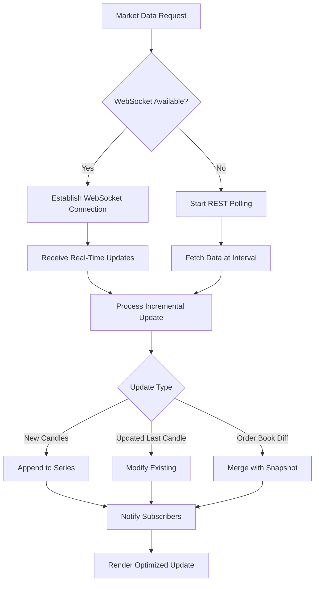

# Advanced Topics

<cite>
**Referenced Files in This Document**   
- [WidgetContext.tsx](file://src/context/WidgetContext.tsx)
- [dataProviders.ts](file://src/types/dataProviders.ts)
- [ccxtBrowserProvider.ts](file://src/store/providers/ccxtBrowserProvider.ts)
- [ccxtServerProvider.ts](file://src/store/providers/ccxtServerProvider.ts)
- [useDataProvider.ts](file://src/hooks/useDataProvider.ts)
- [dataProviderStore.ts](file://src/store/dataProviderStore.ts)
- [dataActions.ts](file://src/store/actions/dataActions.ts)
- [fetchingActions.ts](file://src/store/actions/fetchingActions.ts)
</cite>

## Table of Contents
1. [Creating Custom Widgets with WidgetContext API](#creating-custom-widgets-with-widgetcontext-api)
2. [Extending Data Providers Beyond CCXT](#extending-data-providers-beyond-ccxt)
3. [Performance Optimization for High-Frequency Market Data](#performance-optimization-for-high-frequency-market-data)
4. [Security Considerations for API Keys and Trading Operations](#security-considerations-for-api-keys-and-trading-operations)
5. [Debugging Complex State and Network Communications](#debugging-complex-state-and-network-communications)
6. [Testing Patterns for Complex User Interactions](#testing-patterns-for-complex-user-interactions)

## Creating Custom Widgets with WidgetContext API

The WidgetContext API provides a comprehensive system for managing widgets within the profitmaker application. It enables developers to create custom widgets by leveraging a well-defined component contract that ensures consistency across the UI. The core functionality is exposed through the `useWidget` hook, which grants access to widget management operations such as adding, removing, and updating widget properties.

Custom widgets must adhere to the established component contract by implementing specific interfaces and following the prescribed patterns for state management. The `WidgetType` union type defines all supported widget types, ensuring type safety when creating new components. Developers can extend this system by registering new widget types and implementing corresponding UI components that consume the WidgetContext.

The WidgetContext maintains a collection of active widgets and their associated metadata, including position, size, and grouping information. This centralized state management approach allows for seamless interaction between widgets and consistent behavior across different parts of the application. When creating custom widgets, developers should utilize the provided context methods to ensure proper integration with the overall widget ecosystem.

**Section sources**
- [WidgetContext.tsx](file://src/context/WidgetContext.tsx#L3-L447)

## Extending Data Providers Beyond CCXT

The data provider architecture in profitmaker supports extensibility beyond the existing CCXT implementations through a flexible provider interface system. The `DataProvider` union type defines various provider implementations, including `CCXTBrowserProvider`, `CCXTServerProvider`, and extensible types like `CustomServerWithAdapterProvider` and `CustomProvider`. This design enables developers to integrate alternative data sources by implementing the appropriate provider interface.

To add a new data provider, developers must implement the base `BaseDataProvider` interface and define configuration parameters specific to their implementation. The system supports multiple provider types with configurable priorities, allowing for sophisticated routing strategies based on exchange, market type, or performance characteristics. The provider registry automatically discovers and manages available providers, making them accessible throughout the application.

The extension points are designed to accommodate various integration scenarios, from simple REST-based services to complex WebSocket implementations. For server-side adapters, the `CustomServerWithAdapterProvider` interface provides a framework for translating between external APIs and the internal data model. Custom providers can implement specialized logic for authentication, rate limiting, and error handling while maintaining compatibility with the existing data consumption patterns.

**Section sources**
- [dataProviders.ts](file://src/types/dataProviders.ts#L186-L186)
- [ccxtBrowserProvider.ts](file://src/store/providers/ccxtBrowserProvider.ts#L517-L519)
- [ccxtServerProvider.ts](file://src/store/providers/ccxtServerProvider.ts#L571-L573)

## Performance Optimization for High-Frequency Market Data

Handling high-frequency market data updates requires careful optimization of both data retrieval and rendering pipelines. The profitmaker architecture implements several performance-critical features to ensure smooth operation under heavy load. The data fetching system supports both WebSocket and REST polling methods, with automatic fallback mechanisms to maintain data continuity during connection issues.

For high-frequency updates, the system prioritizes WebSocket connections through CCXT Pro, which provides real-time streaming capabilities for market data. When WebSocket connectivity is unavailable, the system automatically falls back to optimized REST polling with configurable intervals. The `DataFetchSettings` configuration allows fine-tuning of update frequencies for different data types, balancing freshness against resource utilization.

Memory management is optimized through intelligent caching strategies and data retention policies. Market data is stored in a hierarchical structure that enables efficient lookups and updates. The system implements automatic cleanup of expired subscriptions and connection resources to prevent memory leaks during prolonged usage. Additionally, the data processing pipeline minimizes unnecessary computations by batching updates and optimizing state mutations.

**Diagram sources **
- [fetchingActions.ts](file://src/store/actions/fetchingActions.ts#L0-L741)
- [dataActions.ts](file://src/store/actions/dataActions.ts#L0-L1559)

## Security Considerations for API Keys and Trading Operations

Security is paramount when dealing with user API keys and trading operations in the profitmaker application. The system implements multiple layers of protection to safeguard sensitive credentials and prevent unauthorized transactions. API keys are never stored in client-side code but are instead managed through secure server-side proxies that handle authentication and request signing.

The CCXT Server Provider implementation demonstrates this security pattern by routing all authenticated requests through an Express server. This architecture prevents browser-based exposure of API credentials while maintaining the flexibility of client-side trading operations. The server acts as a trusted intermediary, validating requests and enforcing rate limits before forwarding them to exchanges.

Trading operations follow a strict principle of least privilege, where API keys are granted only the minimum permissions necessary for their intended function. Read-only operations use separate authentication contexts from write operations, reducing the attack surface. All sensitive operations are logged and subject to audit trails, providing visibility into potential security incidents.

Additionally, the system implements sandbox mode support for testing environments, allowing users to experiment with trading strategies without risking real funds. Two-factor authentication integration and session management further enhance security by protecting user accounts from unauthorized access.

**Section sources**
- [ccxtServerProvider.ts](file://src/store/providers/ccxtServerProvider.ts#L0-L574)
- [ccxtBrowserProvider.ts](file://src/store/providers/ccxtBrowserProvider.ts#L0-L524)

## Debugging Complex State and Network Communications

Debugging complex state interactions and network communications in profitmaker requires understanding the layered architecture of the data flow system. The application provides comprehensive debugging tools through specialized widgets like `DataProviderDebugWidget` and logging utilities that expose internal state changes and network activity.

The state management system uses Zustand with Immer middleware, enabling immutable updates while providing familiar mutable syntax for developers. This combination facilitates debugging by producing predictable state transitions that can be easily traced through time. The store exposes detailed subscription information, connection statistics, and active data streams, allowing developers to monitor the health of the data pipeline.

Network communications are instrumented with extensive logging that captures request/response cycles, error conditions, and performance metrics. The request logger wraps exchange instances to provide visibility into HTTP traffic without modifying the underlying CCXT implementation. This non-invasive approach enables debugging production issues while maintaining the integrity of the trading system.

For WebSocket connections, the system provides real-time monitoring of subscription status, message rates, and connection quality. Developers can use these insights to diagnose latency issues, identify dropped messages, and optimize reconnection strategies. The event system for chart updates also provides visibility into data propagation from source to visualization.

**Section sources**
- [useDataProvider.ts](file://src/hooks/useDataProvider.ts#L283-L307)
- [dataProviderStore.ts](file://src/store/dataProviderStore.ts#L20-L118)

## Testing Patterns for Complex User Interactions

Testing complex user interactions in profitmaker involves simulating multi-step workflows that span multiple components and asynchronous data flows. The architecture supports comprehensive testing through well-defined hooks and utility functions that abstract away implementation details while exposing essential functionality for verification.

The `useDataProvider` hook and related data accessors provide a clean interface for testing data-dependent components without requiring full integration with external services. Mock providers can be registered during tests to simulate various scenarios, including successful responses, errors, and edge cases. This approach enables isolated unit testing of individual components while maintaining realistic data flow patterns.

For end-to-end testing of complex interactions, the system's event-driven architecture facilitates the creation of test scenarios that verify state changes across multiple components. The centralized store makes it possible to assert expected outcomes after user actions, while the subscription management system allows testing of dynamic data loading and unloading behaviors.

Performance testing focuses on measuring the impact of high-frequency updates on UI responsiveness and memory usage. Automated tests validate that the system maintains acceptable frame rates during intense market activity and properly cleans up resources when components are unmounted. These tests help ensure that the application remains stable under real-world trading conditions.

**Section sources**
- [useDataProvider.ts](file://src/hooks/useDataProvider.ts#L283-L307)
- [dataActions.ts](file://src/store/actions/dataActions.ts#L0-L1559)