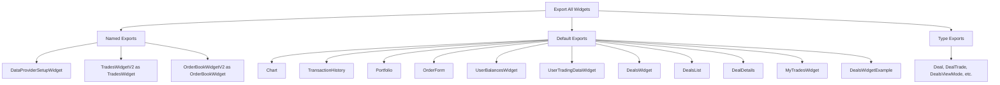
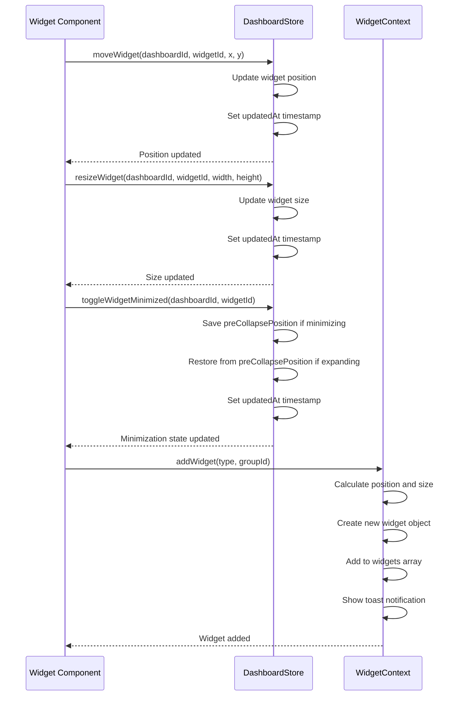

# Creating Custom Widgets

<cite>
**Referenced Files in This Document **   
- [WidgetContext.tsx](file://src/context/WidgetContext.tsx)
- [dashboard.ts](file://src/types/dashboard.ts)
- [WidgetSimple.tsx](file://src/components/WidgetSimple.tsx)
- [index.ts](file://src/components/widgets/index.ts)
</cite>

## Table of Contents
1. [Introduction](#introduction)
2. [Widget Context API](#widget-context-api)
3. [Dashboard Interface Contracts](#dashboard-interface-contracts)
4. [Widget Structure and Props](#widget-structure-and-props)
5. [Widget Registration System](#widget-registration-system)
6. [State Synchronization and Lifecycle](#state-synchronization-and-lifecycle)
7. [Responsive Design and Accessibility](#responsive-design-and-accessibility)

## Introduction
This document provides comprehensive guidance for creating custom widgets within the profitmaker application. It covers the essential APIs, interface contracts, and implementation patterns required to develop fully functional widgets that integrate seamlessly with the dashboard system. The content is designed to be accessible to developers of all experience levels, providing both foundational knowledge and advanced technical details.

## Widget Context API
The WidgetContext API provides access to the global dashboard state and widget lifecycle management functions. It enables widgets to interact with the dashboard's core functionality including widget positioning, grouping, and activation.

```mermaid
classDiagram
class WidgetContextType {
+widgets : Widget[]
+widgetGroups : WidgetGroup[]
+activeGroupId : string | null
+addWidget(type : WidgetType, groupId? : string) : void
+removeWidget(id : string) : void
+updateWidgetPosition(id : string, position : { x : number; y : number }) : void
+updateWidgetSize(id : string, size : { width : number; height : number }) : void
+activateWidget(id : string) : void
+createGroup(name : string, symbol : string, color : string) : string
+updateGroup(id : string, data : Partial<Omit<WidgetGroup, 'id'>>) : void
+deleteGroup(id : string) : void
+addWidgetToGroup(widgetId : string, groupId : string) : void
+removeWidgetFromGroup(widgetId : string) : void
+activateGroup(groupId : string) : void
+getGroupColor(groupId : string | null) : string
}
class WidgetProvider {
-widgets : Widget[]
-widgetGroups : WidgetGroup[]
-nextZIndex : number
-activeGroupId : string | null
+useWidget() : WidgetContextType
}
WidgetProvider --> WidgetContextType : "provides"
```

**Diagram sources **
- [WidgetContext.tsx](file://src/context/WidgetContext.tsx#L20-L180)

**Section sources**
- [WidgetContext.tsx](file://src/context/WidgetContext.tsx#L1-L447)

## Dashboard Interface Contracts
New widgets must implement the interface contracts defined in dashboard.ts. These contracts ensure consistency across all widgets and provide the necessary structure for integration with the dashboard system.

```mermaid
classDiagram
class Widget {
+id : string
+type : WidgetType
+title : string
+defaultTitle : string
+userTitle : string
+position : WidgetPosition
+config : WidgetConfig
+groupId : string
+showGroupSelector : boolean
+isVisible : boolean
+isMinimized : boolean
+preCollapsePosition : WidgetPosition
}
class WidgetPosition {
+x : number
+y : number
+width : number
+height : number
+zIndex : number
}
class Dashboard {
+id : string
+title : string
+description : string
+widgets : Widget[]
+layout : DashboardLayout
+createdAt : string
+updatedAt : string
+isDefault : boolean
}
class DashboardLayout {
+gridSize : { width : number; height : number }
+snapToGrid : boolean
+gridStep : number
}
Widget --> WidgetPosition : "has"
Dashboard --> Widget : "contains"
Dashboard --> DashboardLayout : "has"
```

**Diagram sources **
- [dashboard.ts](file://src/types/dashboard.ts#L1-L70)

**Section sources**
- [dashboard.ts](file://src/types/dashboard.ts#L1-L70)

## Widget Structure and Props
The WidgetSimple component demonstrates the standard structure and props handling pattern for widgets in the profitmaker application. It provides a consistent user interface and handles common widget behaviors.

```mermaid
classDiagram
class WidgetSimpleProps {
+id : string
+title : string
+defaultTitle : string
+userTitle : string
+children : ReactNode
+position : { x : number; y : number }
+size : { width : number; height : number }
+zIndex : number
+isActive : boolean
+groupId : string
+widgetType : string
+showGroupSelector : boolean
+headerActions : ReactNode
+onRemove : () => void
}
class WidgetSimple {
-widgetRef : RefObject<HTMLDivElement>
-titleInputRef : RefObject<HTMLInputElement>
-isMaximized : boolean
-isDragging : boolean
-isResizing : boolean
-resizeDirection : ResizeDirection
-dragOffset : { x : number; y : number }
-resizeStartData : { position : { x : number; y : number }; size : { width : number; height : number }; mousePos : { x : number; y : number } }
-preMaximizeState : { position : { x : number; y : number }; size : { width : number; height : number } }
-isEditingTitle : boolean
-editTitleValue : string
-currentPosition : { x : number; y : number }
-currentSize : { width : number; height : number }
+handleDragStart(e : MouseEvent) : void
+handleResizeStart(e : MouseEvent, direction : ResizeDirection) : void
+handleCollapseToggle() : void
+handleSettingsClick(e : MouseEvent) : void
+handleTitleDoubleClick(e : MouseEvent) : void
}
WidgetSimple --> WidgetSimpleProps : "implements"
```

**Diagram sources **
- [WidgetSimple.tsx](file://src/components/WidgetSimple.tsx#L9-L24)

**Section sources**
- [WidgetSimple.tsx](file://src/components/WidgetSimple.tsx#L1-L633)

## Widget Registration System
The index.ts file in the widgets directory implements the export system for registering new widgets. This centralized registration approach ensures consistent import patterns and easy discovery of available widgets.



**Diagram sources **
- [index.ts](file://src/components/widgets/index.ts#L1-L32)

**Section sources**
- [index.ts](file://src/components/widgets/index.ts#L1-L32)

## State Synchronization and Lifecycle
Proper state synchronization and lifecycle management are critical for maintaining widget integrity within the dashboard. This section addresses common issues related to state updates, resize behavior, and settings persistence.



**Diagram sources **
- [WidgetContext.tsx](file://src/context/WidgetContext.tsx#L214-L280)
- [WidgetSimple.tsx](file://src/components/WidgetSimple.tsx#L390-L427)
- [dashboardStore.ts](file://src/store/dashboardStore.ts#L275-L301)

**Section sources**
- [WidgetContext.tsx](file://src/context/WidgetContext.tsx#L214-L280)
- [WidgetSimple.tsx](file://src/components/WidgetSimple.tsx#L390-L427)
- [dashboardStore.ts](file://src/store/dashboardStore.ts#L275-L301)

## Responsive Design and Accessibility
Implementing responsive design and accessibility compliance ensures that widgets function well across different screen sizes and are usable by all users, including those with disabilities.

```mermaid
flowchart TD
A["Responsive Design"] --> B["Flexible Layouts"]
A --> C["Media Queries"]
A --> D["Viewport Units"]
A --> E["Flexible Sizing"]
B --> F["Use relative units (%, em, rem)"]
C --> G["Adapt layout at breakpoints"]
D --> H["Use vw, vh for viewport-relative sizing"]
E --> I["Implement min/max width/height constraints"]
J["Accessibility"] --> K["Semantic HTML"]
J --> L["Keyboard Navigation"]
J --> M["ARIA Attributes"]
J --> N["Contrast Ratios"]
J --> O["Focus Management"]
K --> P["Use proper heading hierarchy"]
K --> Q["Use appropriate HTML elements"]
L --> R["Ensure tab order makes sense"]
L --> S["Implement keyboard shortcuts"]
M --> T["Add aria-label where needed"]
M --> U["Use role attributes appropriately"]
N --> V["Maintain 4.5:1 text contrast"]
O --> W["Manage focus for modal dialogs"]
O --> X["Indicate active widget state"]
```



**Diagram sources **
- [WidgetSimple.tsx](file://src/components/WidgetSimple.tsx#L31-L64)
- [WidgetSimple.tsx](file://src/components/WidgetSimple.tsx#L390-L427)

**Section sources**
- [WidgetSimple.tsx](file://src/components/WidgetSimple.tsx#L1-L633)