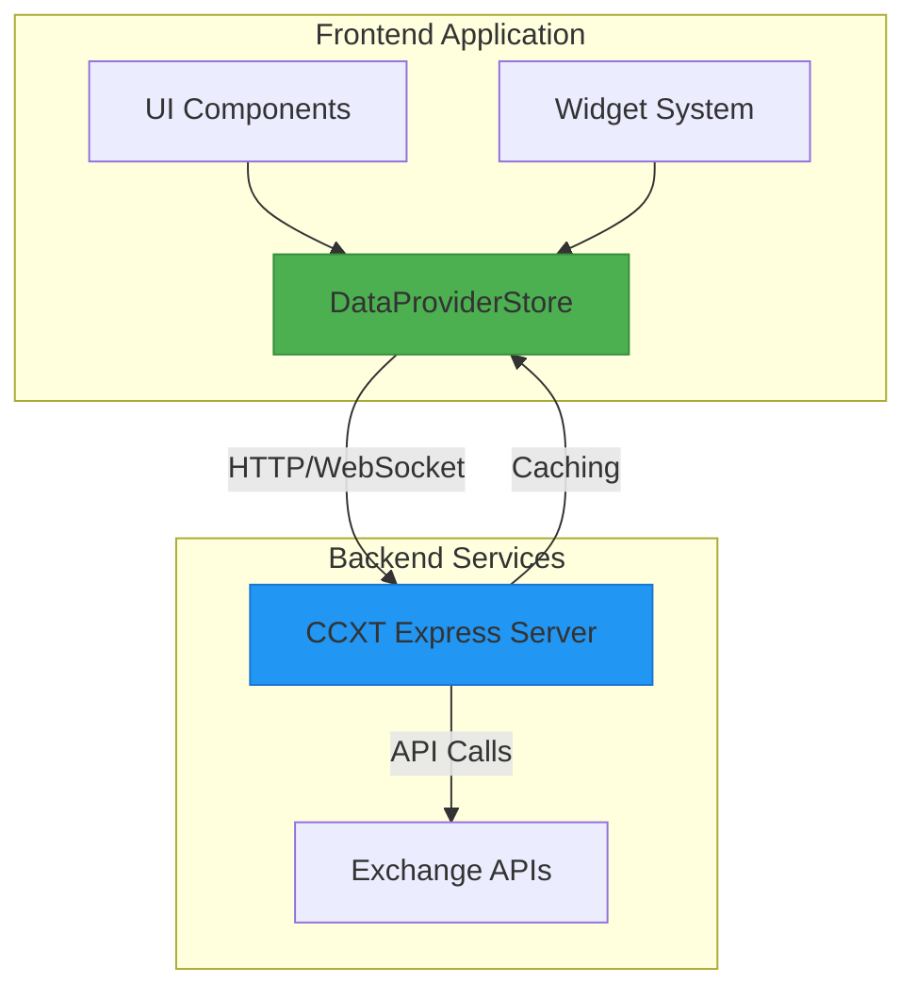
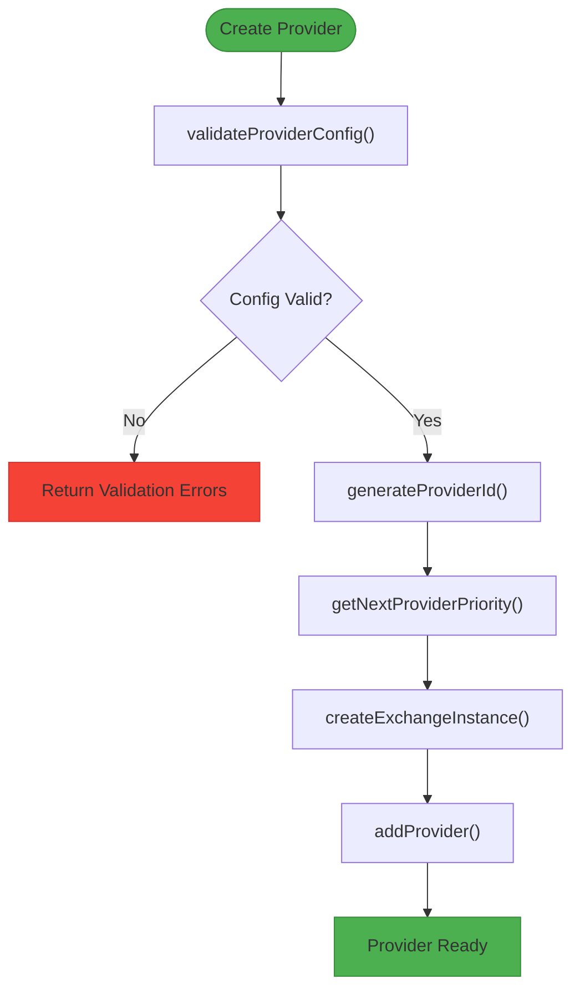

# Extending Data Providers

<cite>
**Referenced Files in This Document**   
- [ccxtServerProvider.ts](file://src/store/providers/ccxtServerProvider.ts)
- [providerUtils.ts](file://src/store/utils/providerUtils.ts)
- [dataProviderStore.ts](file://src/store/dataProviderStore.ts)
- [CCXT_SERVER_WIDGET_INTEGRATION.md](file://CCXT_SERVER_WIDGET_INTEGRATION.md)
- [TestCCXTServerProvider.tsx](file://src/components/TestCCXTServerProvider.tsx)
</cite>

## Table of Contents
1. [Introduction](#introduction)
2. [Core Architecture Overview](#core-architecture-overview)
3. [CCXT Server Provider Implementation](#ccxt-server-provider-implementation)
4. [Creating New Provider Types](#creating-new-provider-types)
5. [Provider Utilities and Helper Functions](#provider-utilities-and-helper-functions)
6. [Integration with Data Provider Store](#integration-with-data-provider-store)
7. [Error Handling and Connection Management](#error-handling-and-connection-management)
8. [Testing Provider Integrations](#testing-provider-integrations)
9. [Best Practices and Recommendations](#best-practices-and-recommendations)

## Introduction
This document provides comprehensive guidance on extending data providers in the profitmaker application, with a focus on the ccxtServerProvider implementation. It details how to create new provider types that integrate seamlessly with the existing data pipeline, explains the interfaces and utility functions available for provider creation, and demonstrates server-side integration patterns through concrete examples. The content is designed to be accessible to beginners while providing sufficient technical depth for experienced developers working with the widget ecosystem.

The ccxtServerProvider serves as a critical component for bypassing CORS restrictions in browser environments by routing CCXT operations through a dedicated Express server. This architecture enables secure handling of API credentials, improved performance through server-side caching, and enhanced scalability across multiple clients.

**Section sources**
- [CCXT_SERVER_WIDGET_INTEGRATION.md](file://CCXT_SERVER_WIDGET_INTEGRATION.md#L0-L208)

## Core Architecture Overview
The data provider system in profitmaker follows a modular architecture built on Zustand for state management, with clear separation between provider implementations, utility functions, and store actions. The core components include the dataProviderStore which manages all provider instances and their state, provider-specific implementations like ccxtServerProvider, and utility modules that facilitate common operations across different provider types.

The architecture supports multiple provider types including ccxt-browser, ccxt-server, and custom implementations, each adhering to a common interface while maintaining type-specific functionality. Providers are registered in the dataProviderStore where they can be discovered, prioritized, and selected based on exchange support and connection status. The system implements automatic provider selection based on exchange requirements and maintains WebSocket connections for real-time market data distribution.



**Diagram sources**
- [dataProviderStore.ts](file://src/store/dataProviderStore.ts#L20-L118)
- [ccxtServerProvider.ts](file://src/store/providers/ccxtServerProvider.ts#L20-L569)

## CCXT Server Provider Implementation
The CCXTServerProviderImpl class provides a complete implementation for interacting with the CCXT Express server, handling both REST API requests and WebSocket subscriptions. The implementation follows a proxy pattern where client-side calls are forwarded to server-side CCXT instances, with responses returned through HTTP or WebSocket channels.

Key features of the implementation include health checking capabilities, configurable timeouts, authentication via bearer tokens, and comprehensive error handling. The provider establishes WebSocket connections for real-time data streaming and manages subscription lifecycle automatically. For REST operations, it uses fetch with AbortController for timeout management and proper error propagation.

The provider exposes standard CCXT methods such as fetchTicker, fetchOrderBook, fetchTrades, fetchOHLCV, and fetchBalance through its proxy interface, making it compatible with existing code that expects native CCXT instances. WebSocket methods like watchTicker, watchOrderBook, and watchOHLCV are implemented using Socket.IO for reliable real-time communication.

```mermaid
classDiagram
class CCXTServerProviderImpl {
-provider : CCXTServerProvider
-baseUrl : string
-token? : string
-timeout : number
-socket? : Socket
-subscriptions : Map~string, any~
+makeRequest(endpoint : string, data : any) : Promise~T~
+makeProxyRequest(url : string, method : string, headers : Record~string, string~, body? : any) : Promise~any~
+connectWebSocket() : Promise~Socket~
+subscribeWebSocket(exchangeId : string, symbol : string, dataType : 'ticker' | 'trades' | 'orderbook' | 'ohlcv' | 'balance', config : CCXTInstanceConfig, onData : (data : any) => void, onError : (error : any) => void, timeframe? : string) : Promise~string~
+unsubscribeWebSocket(subscriptionKey : string) : Promise~void~
+disconnectWebSocket() : Promise~void~
+createInstanceConfig(userId : string, accountId : string, exchangeId : string, marketType : string, ccxtType : 'regular' | 'pro', credentials? : { apiKey? : string; secret? : string; password? : string; sandbox? : boolean }) : CCXTInstanceConfig
+getTradingInstance(userId : string, accountId : string, exchangeId : string, marketType : string, ccxtType : 'regular' | 'pro', credentials : { apiKey : string; secret : string; password? : string; sandbox? : boolean }) : Promise~any~
+getMetadataInstance(exchangeId : string, marketType : string, sandbox : boolean) : Promise~any~
+getWebSocketInstance(exchangeId : string, marketType : string, sandbox : boolean) : Promise~any~
+createExchangeProxy(config : CCXTInstanceConfig) : any
+checkHealth() : Promise~boolean~
}
class CCXTServerProvider {
id : string
type : 'ccxt-server'
name : string
status : 'connected' | 'disconnected'
exchanges : string[]
priority : number
config : CCXTServerConfig
}
class CCXTServerConfig {
serverUrl : string
token? : string
timeout? : number
}
CCXTServerProviderImpl --> CCXTServerProvider : "uses"
CCXTServerProviderImpl ..> Socket : "manages"
CCXTServerProviderImpl ..> Map : "stores subscriptions"
```

**Diagram sources**
- [ccxtServerProvider.ts](file://src/store/providers/ccxtServerProvider.ts#L20-L569)

**Section sources**
- [ccxtServerProvider.ts](file://src/store/providers/ccxtServerProvider.ts#L20-L569)

## Creating New Provider Types
To create new provider types that integrate with the existing data pipeline, developers must implement the DataProvider interface and register their provider through the dataProviderStore's createProvider function. The process involves defining a unique type identifier, implementing required configuration parameters, and ensuring compatibility with the provider selection algorithm.

New providers should follow the same pattern as ccxtServerProvider by exporting a factory function (e.g., createCCXTServerProvider) that instantiates the provider implementation. The provider configuration should be defined in the CCXTServerConfig interface or extended for type-specific parameters. Integration with the widget ecosystem requires adding appropriate form fields in the DataProviderSetupWidget and supporting editing capabilities in the DataProviderDebugWidget.

The provider creation process includes validation through validateProviderConfig, automatic ID generation using generateProviderId, and priority assignment via getNextProviderPriority. These utilities ensure consistent behavior across different provider types and maintain system integrity.

**Section sources**
- [CCXT_SERVER_WIDGET_INTEGRATION.md](file://CCXT_SERVER_WIDGET_INTEGRATION.md#L0-L208)
- [providerUtils.ts](file://src/store/utils/providerUtils.ts#L0-L234)

## Provider Utilities and Helper Functions
The providerUtils.ts module contains essential helper functions that facilitate provider creation and management across the application. These utilities provide standardized operations for creating exchange instances, validating configurations, selecting optimal providers, and managing provider-exchange mappings.

Key functions include createExchangeInstance for initializing CCXT instances with proper configuration based on provider type, getAccountForExchange for retrieving user credentials associated with specific exchanges, and convertAccountForProvider for transforming account data into the format expected by providers. The module also includes providerSupportsExchange and selectOptimalProvider for determining provider capabilities and selection based on exchange requirements.

Configuration validation is handled by validateProviderConfig, which checks required fields and validates URLs for server-based providers. Utility functions like generateProviderId and getNextProviderPriority ensure consistent naming and prioritization across the system. The getProviderDisplayInfo function formats provider information for display in UI components.



**Diagram sources**
- [providerUtils.ts](file://src/store/utils/providerUtils.ts#L0-L234)

**Section sources**
- [providerUtils.ts](file://src/store/utils/providerUtils.ts#L0-L234)

## Integration with Data Provider Store
New providers connect to the dataProviderStore through the addProvider action, which handles registration, validation, and initialization. The store maintains a collection of all registered providers and manages their state, including connection status, active subscriptions, and market data caches.

Providers are integrated into the data fetching pipeline through the startDataFetching and stopDataFetching actions, which coordinate WebSocket and REST-based data retrieval. The store's subscription system ensures deduplication of data requests and efficient resource utilization across multiple widgets.

The providerActions module exposes functions like getProviderForExchange and getProviderExchangeMappings that enable automatic provider selection based on exchange requirements. These functions consider provider status, exchange support, and priority when determining the optimal provider for a given exchange.

State persistence is handled through the persist middleware, which saves provider configurations and settings to localStorage while excluding transient data like active subscriptions and market data caches.

**Section sources**
- [dataProviderStore.ts](file://src/store/dataProviderStore.ts#L20-L118)
- [providerActions.ts](file://src/store/actions/providerActions.ts#L42-L226)

## Error Handling and Connection Management
The ccxtServerProvider implements comprehensive error handling for both HTTP requests and WebSocket connections. HTTP requests use AbortController for timeout management, with RequestTimeoutError thrown when operations exceed the configured timeout. Server response validation ensures proper handling of API errors, with detailed error messages propagated to the client.

WebSocket connections include automatic reconnection logic, authentication error handling, and subscription recovery mechanisms. The provider maintains a map of active subscriptions with their corresponding event handlers, enabling proper cleanup when unsubscribing or disconnecting. Connection health is monitored through periodic checks and automatic reconnection attempts.

For production deployments, additional security measures include JWT authentication, rate limiting, and proper CORS configuration. The system logs connection events, errors, and health check results to aid in monitoring and troubleshooting.

Common issues like connection timeouts, authentication failures, and CORS restrictions are addressed through configurable parameters and robust error recovery mechanisms. The provider gracefully handles network interruptions and server restarts by maintaining subscription state and attempting automatic reconnection.

**Section sources**
- [ccxtServerProvider.ts](file://src/store/providers/ccxtServerProvider.ts#L20-L569)
- [CCXT_SERVER_WIDGET_INTEGRATION.md](file://CCXT_SERVER_WIDGET_INTEGRATION.md#L0-L208)

## Testing Provider Integrations
The application provides dedicated testing components to verify provider functionality and integration. The TestCCXTServerProvider component allows users to test server connectivity, create test providers, and validate configuration parameters through a user-friendly interface.

Testing workflows include verifying server health through the /health endpoint, creating provider instances with test configurations, and confirming successful data retrieval from exchange APIs. The TestDebugWidgetCCXTServer component enables comprehensive testing of provider editing capabilities within the DataProviderDebugWidget.

Unit testing should cover provider creation, configuration validation, connection establishment, data retrieval, and error handling scenarios. Integration tests should verify proper interaction between the provider, dataProviderStore, and consuming widgets. The system's modular architecture facilitates isolated testing of individual components.

Production readiness requires thorough testing of security configurations, performance under load, and failure recovery scenarios. Monitoring tools should be implemented to track request rates, error frequencies, and connection stability.

**Section sources**
- [TestCCXTServerProvider.tsx](file://src/components/TestCCXTServerProvider.tsx#L8-L135)
- [CCXT_SERVER_WIDGET_INTEGRATION.md](file://CCXT_SERVER_WIDGET_INTEGRATION.md#L0-L208)

## Best Practices and Recommendations
When extending data providers in profitmaker, follow these best practices to ensure reliability, security, and maintainability:

1. **Security**: Always use HTTPS in production, implement proper authentication mechanisms, and store sensitive credentials securely on the server side rather than transmitting them to clients.

2. **Error Handling**: Implement comprehensive error handling with meaningful error messages and appropriate retry logic for transient failures.

3. **Performance**: Leverage server-side caching of CCXT instances and market data to reduce latency and minimize redundant API calls to exchanges.

4. **Compatibility**: Ensure new providers adhere to the established interfaces and patterns to maintain compatibility with existing widgets and services.

5. **Testing**: Thoroughly test providers under various network conditions and edge cases, including connection interruptions and server restarts.

6. **Monitoring**: Implement structured logging, metrics collection, and health checks to monitor provider performance and detect issues proactively.

7. **Documentation**: Provide clear documentation for configuration parameters, supported operations, and integration requirements.

Following these guidelines will ensure that new provider implementations integrate smoothly with the existing ecosystem and provide reliable service to all consuming components.

**Section sources**
- [CCXT_SERVER_WIDGET_INTEGRATION.md](file://CCXT_SERVER_WIDGET_INTEGRATION.md#L0-L208)
- [ccxtServerProvider.ts](file://src/store/providers/ccxtServerProvider.ts#L20-L569)