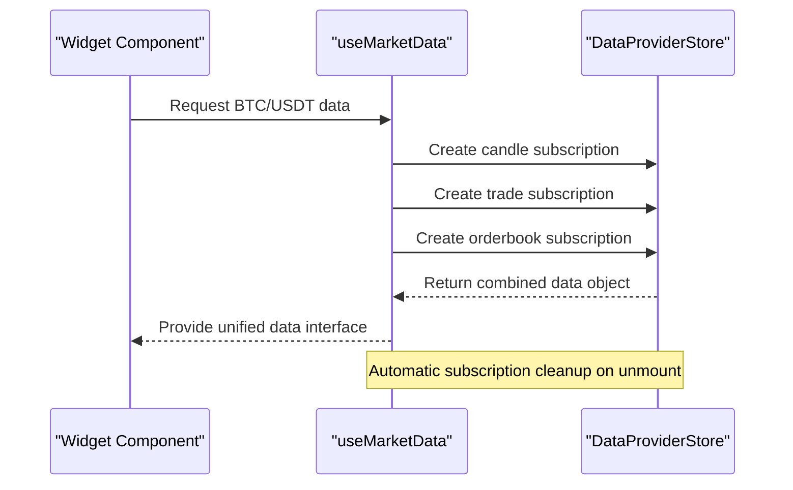
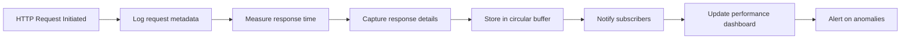

# Performance Optimization

<cite>
**Referenced Files in This Document **   
- [dashboardStore.ts](file://src/store/dashboardStore.ts)
- [useDataProvider.ts](file://src/hooks/useDataProvider.ts)
- [requestLogger.ts](file://src/utils/requestLogger.ts)
</cite>

## Table of Contents
1. [Introduction](#introduction)
2. [WebSocket and Market Data Optimization](#websocket-and-market-data-optimization)
3. [State Management Best Practices](#state-management-best-practices)
4. [Data Fetching and Caching Strategies](#data-fetching-and-caching-strategies)
5. [Performance Monitoring with Request Logger](#performance-monitoring-with-request-logger)
6. [Common Performance Issues](#common-performance-issues)
7. [WebSocket Message Handling](#websocket-message-handling)
8. [Conclusion](#conclusion)

## Introduction
This document provides comprehensive guidance on performance optimization techniques implemented in the profitmaker application. It covers critical aspects including WebSocket-based market data updates, efficient state management, data fetching strategies, and performance monitoring tools. The content is designed to be accessible to developers of all experience levels while providing deep technical insights into the application's architecture and optimization patterns.

## WebSocket and Market Data Optimization
The profitmaker application leverages WebSocket connections for real-time market data updates, ensuring low-latency communication between clients and exchanges. The system is designed to handle high-frequency data streams efficiently through optimized subscription management and batch processing mechanisms.

Market data updates are processed through a centralized provider system that manages multiple exchange connections simultaneously. Each provider maintains its own WebSocket connection and handles message routing to subscribed components. The architecture supports both browser-based and server-side CCXT providers, allowing flexible deployment options based on performance requirements and security considerations.

Data subscriptions are managed at the widget level, ensuring that only active components receive updates. When a widget subscribes to market data, it creates a unique subscription ID that includes the provider, exchange, symbol, dashboard, and widget identifiers. This approach enables precise control over data flow and prevents unnecessary updates to inactive components.

**Section sources**
- [useDataProvider.ts](file://src/hooks/useDataProvider.ts#L30-L97)
- [dataProviderStore.ts](file://src/store/dataProviderStore.ts#L20-L118)

## State Management Best Practices
The dashboardStore.ts implementation demonstrates effective state management patterns using Zustand with Immer and persistence middleware. This combination provides an immutable update pattern while maintaining excellent performance characteristics for complex state operations.

### State Slicing Pattern
The application employs proper state slicing by separating different concerns into dedicated stores:
- `dashboardStore` manages UI layout and widget configuration
- `dataProviderStore` handles market data and provider connections
- Individual widget stores manage component-specific state

This separation prevents unnecessary re-renders by ensuring that updates to one domain don't trigger re-renders in unrelated components. For example, changing a widget's position in the dashboard store doesn't affect the market data in the data provider store.

### Selector Patterns
The use of memoized selectors through React's useMemo hook ensures that components only re-render when their specific data dependencies change. In the useCandles hook, the subscriptionId is memoized based on relevant parameters:

```mermaid
flowchart TD
A["Component Render"] --> B["Calculate subscriptionId"]
B --> C["useMemo dependency check"]
C --> |"Dependencies unchanged" D["Return cached subscriptionId"]
C --> |"Dependencies changed" E["Generate new subscriptionId"]
E --> F["Trigger subscription update"]
D --> G["No re-subscription needed"]
```

**Diagram sources **
- [dashboardStore.ts](file://src/store/dashboardStore.ts#L117-L444)
- [useDataProvider.ts](file://src/hooks/useDataProvider.ts#L30-L97)

**Section sources**
- [dashboardStore.ts](file://src/store/dashboardStore.ts#L117-L444)

## Data Fetching and Caching Strategies
The useDataProvider.ts hook implements sophisticated data fetching strategies that balance real-time requirements with performance considerations. The system supports multiple data types including candles, trades, and order book data, each with appropriate refresh intervals.

### Subscription Management
The data provider system uses a hierarchical subscription model where each subscription is uniquely identified by a composite key containing:
- Provider ID
- Exchange identifier
- Symbol
- Data type
- Dashboard ID
- Widget ID

This approach enables fine-grained control over data delivery and prevents duplicate subscriptions for the same data source. When multiple widgets request the same market data, the system can share the underlying connection while maintaining separate update channels.

### Caching Mechanism
The application implements a multi-layer caching strategy:
1. **In-memory cache**: Recent market data is stored in the data provider store with timestamps
2. **Local storage persistence**: Critical configuration and subscription states are persisted
3. **Connection pooling**: Active WebSocket connections are maintained across sessions

The useMarketData hook demonstrates how multiple data types can be combined efficiently:



**Diagram sources **
- [useDataProvider.ts](file://src/hooks/useDataProvider.ts#L30-L97)

**Section sources**
- [useDataProvider.ts](file://src/hooks/useDataProvider.ts#L30-L97)

## Performance Monitoring with Request Logger
The requestLogger.ts module provides comprehensive monitoring capabilities for identifying performance bottlenecks in network communications. This tool captures detailed information about all HTTP and REST requests, enabling thorough analysis of system performance.

### Key Features
- **Request tracking**: Every HTTP request is logged with timestamp, method, URL, headers, and body
- **Response metrics**: Response time, status code, and error information are recorded
- **Exchange identification**: Requests are automatically categorized by exchange based on URL patterns
- **Statistical analysis**: Aggregate statistics are calculated for performance monitoring

### Usage Example
The request logger can be used to identify slow endpoints or problematic exchanges:



Developers can query the request logs to analyze performance patterns, such as identifying exchanges with consistently high response times or detecting API rate limit issues.

**Diagram sources **
- [requestLogger.ts](file://src/utils/requestLogger.ts#L167-L237)

**Section sources**
- [requestLogger.ts](file://src/utils/requestLogger.ts#L20-L159)

## Common Performance Issues
Despite the robust architecture, certain performance issues may arise in production environments. Understanding these common problems and their solutions is crucial for maintaining optimal application performance.

### Memory Leaks in Event Listeners
Memory leaks can occur when event listeners are not properly cleaned up, particularly with WebSocket connections. The application addresses this through:
- Automatic subscription cleanup in useEffect cleanup functions
- Unique subscription IDs that enable precise removal
- Periodic validation of active subscriptions

### Excessive Store Subscriptions
Over-subscription to global stores can lead to unnecessary re-renders. The solution implemented in profitmaker includes:
- Selective state exposure through memoized selectors
- Proper dependency management in hooks
- Unsubscription on component unmount

### UI Jank During Intensive Processing
High-frequency market data updates can cause UI jank if not properly managed. Mitigation strategies include:
- Batch processing of incoming messages
- Web Worker offloading for intensive calculations
- Frame rate monitoring and adaptive update throttling

**Section sources**
- [dashboardStore.ts](file://src/store/dashboardStore.ts#L117-L444)
- [useDataProvider.ts](file://src/hooks/useDataProvider.ts#L30-L97)
- [requestLogger.ts](file://src/utils/requestLogger.ts#L20-L159)

## WebSocket Message Handling
Efficient WebSocket message handling is critical for maintaining smooth performance with high-frequency market data. The profitmaker application implements several optimization techniques for processing incoming messages.

### Batch Processing
Incoming market data updates are batched to reduce the frequency of state updates. Instead of updating the store for each individual message, changes are accumulated and applied in discrete batches. This approach significantly reduces the number of re-renders and improves overall responsiveness.

### Message Prioritization
Different types of market data are assigned priority levels based on their impact on the user interface:
- Order book updates: Highest priority (immediate processing)
- Trade executions: High priority (near-immediate processing)  
- Candle updates: Medium priority (batched processing)
- Balance updates: Low priority (deferred processing)

### Connection Resilience
The WebSocket implementation includes built-in resilience features:
- Automatic reconnection with exponential backoff
- Message queueing during connection interruptions
- State synchronization after reconnection

These mechanisms ensure reliable data delivery even under unstable network conditions.

**Section sources**
- [useDataProvider.ts](file://src/hooks/useDataProvider.ts#L30-L97)
- [requestLogger.ts](file://src/utils/requestLogger.ts#L242-L290)

## Conclusion
The profitmaker application demonstrates sophisticated performance optimization techniques for handling high-frequency market data. By combining efficient state management, intelligent data fetching strategies, and comprehensive monitoring tools, the system achieves excellent responsiveness and reliability.

Key takeaways for developers include:
- Use state slicing to minimize unnecessary re-renders
- Implement memoized selectors for optimal performance
- Leverage batching and prioritization for WebSocket message handling
- Utilize monitoring tools like requestLogger to identify bottlenecks
- Follow proper cleanup patterns to prevent memory leaks

These practices ensure that the application can handle intensive trading scenarios while maintaining a smooth user experience.