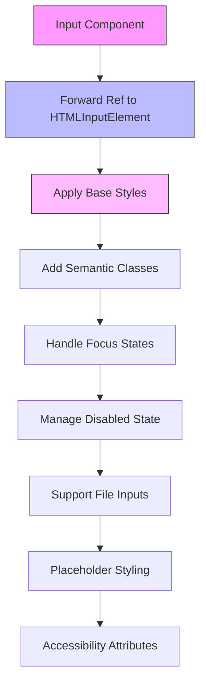
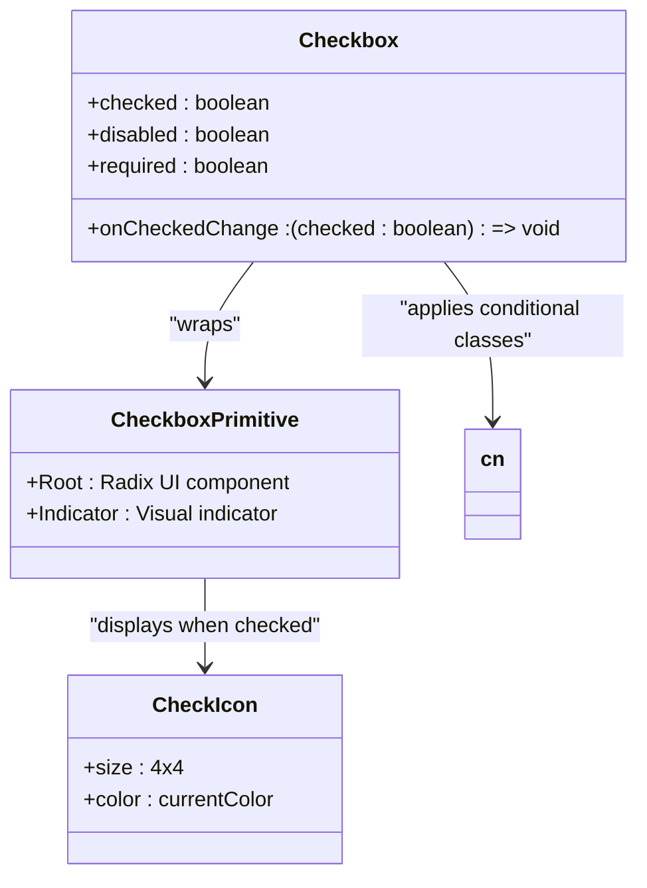
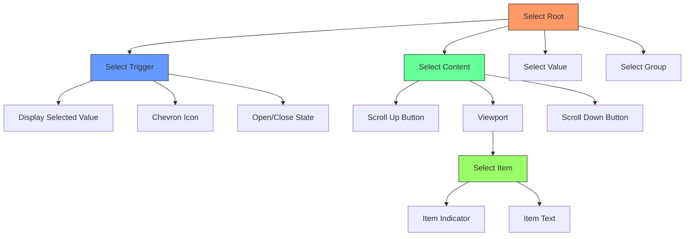
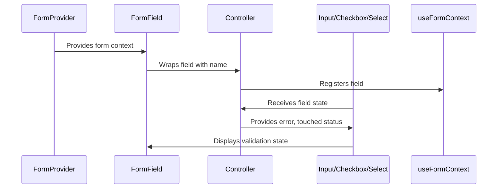

# Base UI Components

<cite>
**Referenced Files in This Document**   
- [button.tsx](file://src/components/ui/button.tsx)
- [input.tsx](file://src/components/ui/input.tsx)
- [checkbox.tsx](file://src/components/ui/checkbox.tsx)
- [select.tsx](file://src/components/ui/select.tsx)
- [form.tsx](file://src/components/ui/form.tsx)
- [tailwind.config.ts](file://tailwind.config.ts)
- [utils.ts](file://src/lib/utils.ts)
</cite>

## Table of Contents
1. [Introduction](#introduction)
2. [Design System Principles](#design-system-principles)
3. [Core Component Architecture](#core-component-architecture)
4. [Form Integration Pattern](#form-integration-pattern)
5. [Accessibility Implementation](#accessibility-implementation)
6. [Component Extension Guidelines](#component-extension-guidelines)

## Introduction
The base UI components library serves as the foundational building blocks for the profitmaker application's user interface. Built upon Radix UI primitives, these components provide a consistent, accessible, and customizable foundation across the entire trading terminal. The library combines the robust accessibility and behavior implementations of Radix UI with the flexible styling capabilities of Tailwind CSS, creating a powerful component system tailored to the application's specific needs.

This documentation provides comprehensive guidance on the design principles, implementation patterns, and usage conventions for the base UI components. It covers the core architectural decisions, styling approach, form integration strategy, and accessibility features that define the component library.

## Design System Principles

### Color Palette and Theme Variables
The component library implements a comprehensive color system through CSS variables that support both light and dark modes. The theme is defined in the Tailwind configuration, with colors mapped to semantic variables that ensure consistency across components.

```mermaid
graph TD
A[Theme Configuration] --> B[CSS Variables]
B --> C[Primary Colors]
B --> D[Secondary Colors]
B --> E[State Colors]
B --> F[Backgrounds]
B --> G[Text Colors]
C --> H[hsl(var(--primary))]
C --> I[hsl(var(--primary-foreground))]
D --> J[hsl(var(--secondary))]
D --> K[hsl(var(--secondary-foreground))]
E --> L[hsl(var(--destructive))]
E --> M[hsl(var(--muted))]
F --> N[hsl(var(--background))]
F --> O[hsl(var(--card))]
G --> P[hsl(var(--foreground))]
G --> Q[hsl(var(--popover-foreground))]
```

**Diagram sources**
- [tailwind.config.ts](file://tailwind.config.ts#L10-L80)

**Section sources**
- [tailwind.config.ts](file://tailwind.config.ts#L1-L142)

### Typography and Spacing System
The design system follows a structured approach to typography and spacing, ensuring visual harmony across all components. Font sizes, line heights, and spacing values are carefully calibrated to create a readable and aesthetically pleasing interface.

#### Typography Scale
| Element | Font Size | Line Height | Weight |
|--------|---------|-----------|-------|
| Heading 1 | 1.875rem (30px) | 2.25rem (36px) | 600 |
| Heading 2 | 1.5rem (24px) | 2rem (32px) | 600 |
| Body Large | 1.125rem (18px) | 1.75rem (28px) | 400 |
| Body Regular | 1rem (16px) | 1.5rem (24px) | 400 |
| Small Text | 0.875rem (14px) | 1.25rem (20px) | 400 |
| Caption | 0.75rem (12px) | 1rem (16px) | 400 |

#### Spacing Scale
The spacing system uses a consistent 4px base unit, creating a harmonious rhythm throughout the interface:
- xs: 4px
- sm: 8px
- md: 12px
- lg: 16px
- xl: 24px
- xxl: 32px

This systematic approach ensures consistent padding, margins, and element sizing across all components.

### Responsive Behavior
Components are designed with responsive behavior in mind, adapting gracefully to different screen sizes and device types. The library leverages Tailwind's responsive prefixes to implement mobile-first design principles, ensuring optimal user experience across devices.

Key responsive considerations include:
- Touch target sizing (minimum 44px for mobile)
- Adaptive layout changes at breakpoints
- Font size adjustments for readability
- Component density variations based on screen size
- Navigation pattern transformations (e.g., hamburger menus on small screens)

## Core Component Architecture

### Button Component Structure
The Button component exemplifies the library's architecture, combining Radix UI primitives with Tailwind CSS styling and custom variants.

```mermaid
classDiagram
class Button {
+asChild : boolean
+variant : 'default' | 'destructive' | 'outline' | 'secondary' | 'ghost' | 'link'
+size : 'default' | 'sm' | 'lg' | 'icon'
+className : string
}
class buttonVariants {
+variants : { variant : {}, size : {} }
+defaultVariants : { variant : 'default', size : 'default' }
}
Button --> buttonVariants : "uses"
Button --> Slot : "Radix UI primitive"
Button --> cn : "utility function"
```

**Diagram sources**
- [button.tsx](file://src/components/ui/button.tsx#L6-L56)

**Section sources**
- [button.tsx](file://src/components/ui/button.tsx#L1-L57)
- [utils.ts](file://src/lib/utils.ts#L3-L5)

### Input Component Implementation
The Input component demonstrates the library's approach to form elements, providing a clean, accessible interface with consistent styling.



**Diagram sources**
- [input.tsx](file://src/components/ui/input.tsx#L1-L23)

**Section sources**
- [input.tsx](file://src/components/ui/input.tsx#L1-L23)

### Checkbox Component Design
The Checkbox component illustrates the integration of visual indicators with accessibility requirements.



**Diagram sources**
- [checkbox.tsx](file://src/components/ui/checkbox.tsx#L1-L29)

**Section sources**
- [checkbox.tsx](file://src/components/ui/checkbox.tsx#L1-L29)

### Select Component Architecture
The Select component represents a complex composite component that manages multiple sub-components and states.



**Diagram sources**
- [select.tsx](file://src/components/ui/select.tsx#L1-L159)

**Section sources**
- [select.tsx](file://src/components/ui/select.tsx#L1-L159)

## Form Integration Pattern

### React Hook Form Abstraction
The form.tsx file provides a comprehensive abstraction layer between Radix UI components and React Hook Form, enabling seamless integration while maintaining accessibility.



**Diagram sources**
- [form.tsx](file://src/components/ui/form.tsx#L1-L176)

**Section sources**
- [form.tsx](file://src/components/ui/form.tsx#L1-L176)

### Form Component Hierarchy
The form system consists of several interconnected components that work together to provide a cohesive form experience.

| Component | Purpose | Key Props |
|---------|-------|--------|
| Form | Form provider wrapper | form methods from useForm() |
| FormField | Field controller wrapper | name, control, render function |
| FormItem | Field container | className, children |
| FormLabel | Accessible label | htmlFor, className |
| FormControl | Controlled input wrapper | id, aria-describedby, aria-invalid |
| FormDescription | Helper text | className, children |
| FormMessage | Error message display | className, children |

The `useFormField` hook provides access to the current field's state, including validation errors, touched status, and generated IDs for accessibility attributes.

### Usage Example
```tsx
<FormField
  control={form.control}
  name="email"
  render={({ field }) => (
    <FormItem>
      <FormLabel>Email</FormLabel>
      <FormControl>
        <Input placeholder="Enter your email" {...field} />
      </FormControl>
      <FormDescription>Your primary contact email.</FormDescription>
      <FormMessage />
    </FormItem>
  )}
/>
```

This pattern ensures proper accessibility by automatically connecting labels to inputs via generated IDs and properly conveying validation state to assistive technologies.

## Accessibility Implementation

### Keyboard Navigation
All interactive components support comprehensive keyboard navigation:

- **Buttons**: Accessible via Tab, activated with Enter/Space
- **Checkboxes**: Toggle with Space, navigate with Arrow keys
- **Select**: Open/close with Space/Arrow Down, navigate options with Arrow keys, select with Enter
- **Form fields**: Navigate with Tab/Shift+Tab, submit forms with Ctrl+Enter

Components maintain visible focus indicators that meet WCAG contrast requirements, ensuring users can track their position in the interface.

### ARIA Attributes and Roles
The component library implements appropriate ARIA roles and attributes to enhance accessibility:

- **Landmark roles**: banner, main, navigation, complementary
- **Widget roles**: button, checkbox, radio, menuitem, tab
- **Live regions**: for dynamic content updates
- **Describedby relationships**: connecting labels, descriptions, and error messages

For example, the FormControl component automatically sets `aria-describedby` to include both the description and error message IDs when present, ensuring screen readers announce all relevant information.

### Screen Reader Support
Components are designed with screen reader users in mind:

- **Semantic HTML**: Using appropriate elements (button, input, etc.) rather than divs with click handlers
- **Programmatic focus**: Managing focus during interactions like opening dialogs or selecting items
- **Status announcements**: Using live regions to announce important changes
- **Hidden content**: Properly hiding decorative elements with aria-hidden or visually hiding content with sr-only classes

The library also supports high contrast mode and respects user preferences for reduced motion and reduced transparency.

## Component Extension Guidelines

### Class Naming Convention
When extending existing components or creating new ones, follow the established class naming convention:

- Use `cn()` utility for conditional class composition
- Apply base styles first, then modifiers
- Use semantic class names that describe purpose rather than appearance
- Follow BEM-like patterns for complex components (block__element--modifier)

Example:
```tsx
className={cn(
  "base-styles",
  "conditional-modifiers",
  "size-variations",
  className // allow external overrides
)}
```

### Prop Types and Validation
New components should follow consistent prop typing patterns:

- Extend native HTML attributes when appropriate
- Use TypeScript interfaces for complex prop objects
- Provide sensible defaults for optional props
- Document all props with JSDoc comments
- Use discriminated unions for mutually exclusive props

### State Management Patterns
Follow established state management patterns:

- Use React hooks for local component state
- Leverage context for shared state within component trees
- Avoid prop drilling by creating intermediate providers
- Use Zustand stores for application-level state that affects multiple components

For form-related components, integrate with the existing form abstraction rather than implementing independent state management.

### Performance Considerations
Optimize components for performance:

- Use React.memo for components with expensive renders
- Implement virtualization for long lists (>100 items)
- Avoid inline object/function creation in render methods
- Use useCallback and useMemo to memoize callbacks and computed values
- Implement lazy loading for heavy components

The library already incorporates virtualization in components like SearchableSelect when dealing with large option sets, serving as a model for similar implementations.