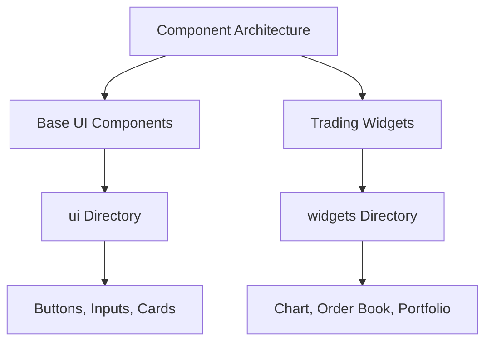
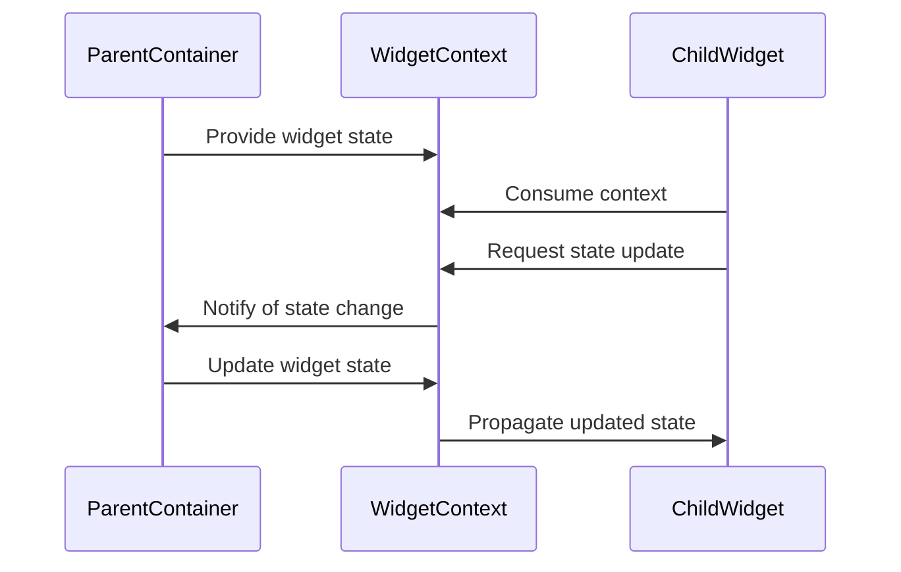

# Component Architecture

<cite>
**Referenced Files in This Document**   
- [WidgetSimple.tsx](file://src/components/WidgetSimple.tsx)
- [WidgetContext.tsx](file://src/context/WidgetContext.tsx)
- [button.tsx](file://src/components/ui/button.tsx)
- [Chart.tsx](file://src/components/widgets/Chart.tsx)
- [DealsWidget.tsx](file://src/components/widgets/DealsWidget.tsx)
- [OrderBookWidget.tsx](file://src/components/widgets/OrderBookWidget.tsx)
- [UserBalancesWidget.tsx](file://src/components/widgets/UserBalancesWidget.tsx)
- [TradesWidget.tsx](file://src/components/widgets/TradesWidget.tsx)
- [Portfolio.tsx](file://src/components/widgets/Portfolio.tsx)
- [OrderForm.tsx](file://src/components/widgets/OrderForm.tsx)
</cite>

## Table of Contents
1. [Component Architecture Overview](#component-architecture-overview)
2. [UI Components and Widget Separation](#ui-components-and-widget-separation)
3. [Atomic UI Composition Pattern](#atomic-ui-composition-pattern)
4. [Widget Wrapper Component](#widget-wrapper-component)
5. [Widget Context Communication](#widget-context-communication)
6. [Component Reuse Patterns](#component-reuse-patterns)
7. [Best Practices for Component Creation](#best-practices-for-component-creation)

## Component Architecture Overview

The profitmaker application implements a modular component architecture that separates base UI elements from domain-specific trading widgets. This separation enables consistent styling across the application while allowing specialized functionality for different trading data visualizations. The architecture follows a composition pattern where atomic UI components are combined to create complex trading interfaces, with a central Widget wrapper providing common functionality across all widget types.

**Section sources**
- [WidgetSimple.tsx](file://src/components/WidgetSimple.tsx#L1-L633)
- [WidgetContext.tsx](file://src/context/WidgetContext.tsx#L1-L42)

## UI Components and Widget Separation

The component architecture maintains a clear separation between base UI components and domain-specific trading widgets through dedicated directory structures. Base UI components reside in the `ui` directory and provide fundamental building blocks such as buttons, inputs, cards, and form elements. These components are designed to be generic and reusable across the entire application.

Domain-specific trading widgets are organized in the `widgets` directory and implement specialized functionality for trading data visualization and interaction. Each widget combines multiple base UI components to create cohesive interfaces for specific trading functions like charting, order books, trade execution, and portfolio management.

This separation ensures that styling and behavior consistency is maintained across the application while allowing widgets to encapsulate complex trading logic and data handling specific to their purpose.



**Diagram sources**
- [WidgetSimple.tsx](file://src/components/WidgetSimple.tsx#L1-L633)
- [button.tsx](file://src/components/ui/button.tsx#L1-L57)

## Atomic UI Composition Pattern

The application employs an atomic design pattern where atomic UI elements are composed into more complex trading interfaces. Base components from the `ui` directory serve as atoms, providing fundamental interactive elements with consistent styling and behavior. These include:

- **Interactive controls**: Buttons, checkboxes, radio groups, toggles
- **Form elements**: Inputs, textareas, select components
- **Layout containers**: Cards, sheets, dialogs, tabs
- **Navigation elements**: Menus, navigation menus, breadcrumbs

These atomic components are combined to create molecules and organisms that form complete trading interfaces. For example, the Chart widget composes button, input, and card components with specialized charting logic to create a comprehensive price visualization tool. Similarly, the Order Form widget combines form elements, labels, and action buttons to create a complete order placement interface.

This composition pattern enables consistent user experience across the application while promoting code reuse and maintainability.

**Section sources**
- [button.tsx](file://src/components/ui/button.tsx#L1-L57)
- [Chart.tsx](file://src/components/widgets/Chart.tsx#L1-L799)
- [OrderForm.tsx](file://src/components/widgets/OrderForm.tsx#L1-L536)

## Widget Wrapper Component

The Widget wrapper component (implemented in `WidgetSimple.tsx`) provides common functionality across all widget types in the application. This wrapper serves as a container that standardizes the appearance and behavior of diverse widgets while enabling consistent interaction patterns.

Key features provided by the Widget wrapper include:

- **Drag handles**: Enable users to reposition widgets within the trading terminal
- **Resize controls**: Allow users to adjust widget dimensions with corner and edge handles
- **Header actions**: Standardized buttons for maximize, minimize, settings, and close operations
- **Group selection**: Integration with group selectors to associate widgets with specific trading contexts
- **Snapping behavior**: Automatic alignment to other widgets and viewport edges during drag operations
- **Z-index management**: Proper layering when widgets overlap

The wrapper also handles state management for widget positioning, sizing, and visibility, ensuring a consistent user experience regardless of the specific widget content. It integrates with the dashboard store to persist layout changes and provides event handlers for user interactions like clicking, dragging, and resizing.

```mermaid
classDiagram
class WidgetWrapper {
+id : string
+title : string
+position : {x : number, y : number}
+size : {width : number, height : number}
+zIndex : number
+isActive : boolean
+groupId : string | null
+handleDragStart()
+handleResizeStart()
+handleMaximizeToggle()
+handleCollapseToggle()
+applySnapping()
}
WidgetWrapper --> "contains" Button : header actions
WidgetWrapper --> "contains" GroupColorSelector : group selection
WidgetWrapper --> "contains" InstrumentHeaderControl : instrument control
WidgetWrapper --> "contains" children : widget content
```

**Diagram sources**
- [WidgetSimple.tsx](file://src/components/WidgetSimple.tsx#L1-L633)

## Widget Context Communication

The WidgetContext enables communication between parent containers and child widgets through React's context API. This context provides a mechanism for widgets to access shared state and functionality without requiring prop drilling through multiple component layers.

The WidgetContext contains information about the current widget's state, including its ID, type, position, size, and active status. It also provides methods for interacting with the widget system, such as updating widget properties and managing subscriptions to data providers.

Child components can consume the WidgetContext to access this information and trigger updates to the widget state. For example, a settings component within a widget can use the context to update the widget's configuration, which then propagates to the parent container and persists in the application store.

This communication pattern decouples widget content from the container logic, allowing components to be reused across different widget types while maintaining access to the necessary context for proper functionality.



**Diagram sources**
- [WidgetContext.tsx](file://src/context/WidgetContext.tsx#L1-L42)
- [WidgetSimple.tsx](file://src/components/WidgetSimple.tsx#L1-L633)

## Component Reuse Patterns

The application demonstrates several effective component reuse patterns across different widget types. Common functionality is abstracted into reusable components that maintain consistent behavior while adapting to specific use cases.

For example, the header actions pattern is reused across multiple widgets:
- **Chart widget**: Includes timeframe selection and refresh controls
- **Order Book widget**: Displays depth controls and cumulative volume toggle
- **User Balances widget**: Features refresh functionality and display options
- **Trades widget**: Provides filtering and sorting controls

Similarly, data subscription management follows a consistent pattern:
- All data-driven widgets handle WebSocket subscription/unsubscription
- Loading states and error handling are implemented uniformly
- Data processing and formatting follow similar patterns
- Settings wrappers provide consistent configuration interfaces

The Widget wrapper itself enables reuse by standardizing common interactions like dragging, resizing, and collapsing across all widget types. This allows developers to focus on the unique functionality of each widget while leveraging established patterns for common behaviors.

**Section sources**
- [Chart.tsx](file://src/components/widgets/Chart.tsx#L1-L799)
- [OrderBookWidget.tsx](file://src/components/widgets/OrderBookWidget.tsx#L1-L569)
- [UserBalancesWidget.tsx](file://src/components/widgets/UserBalancesWidget.tsx#L1-L799)
- [TradesWidget.tsx](file://src/components/widgets/TradesWidget.tsx#L1-L583)

## Best Practices for Component Creation

When creating new components for the profitmaker application, developers should follow established conventions for props, styling, and responsiveness:

### Props Convention
- Use descriptive prop names following camelCase convention
- Provide default values for optional props
- Type all props using TypeScript interfaces or types
- Group related props into objects when appropriate
- Avoid excessive prop drilling by leveraging context when needed

### Styling Approach
- Utilize Tailwind CSS classes for styling
- Follow the existing color palette and spacing system
- Use the `cn` utility function for conditional class composition
- Maintain consistent typography across components
- Ensure proper contrast ratios for accessibility

### Responsiveness Guidelines
- Design components to be flexible within their containers
- Use relative units and responsive breakpoints appropriately
- Implement virtualization for lists with large datasets
- Optimize rendering performance with React.memo and useMemo
- Test components at various screen sizes and resolutions

### Additional Best Practices
- Keep components focused on a single responsibility
- Use descriptive file names that match component names
- Include JSDoc comments for complex logic or non-obvious behavior
- Follow the existing directory structure and import patterns
- Ensure keyboard accessibility for all interactive elements
- Implement proper loading and error states for data-dependent components

Following these conventions ensures new components integrate seamlessly with the existing architecture and maintain the application's high standards for usability and maintainability.

**Section sources**
- [WidgetSimple.tsx](file://src/components/WidgetSimple.tsx#L1-L633)
- [button.tsx](file://src/components/ui/button.tsx#L1-L57)
- [Chart.tsx](file://src/components/widgets/Chart.tsx#L1-L799)
- [Portfolio.tsx](file://src/components/widgets/Portfolio.tsx#L1-L176)