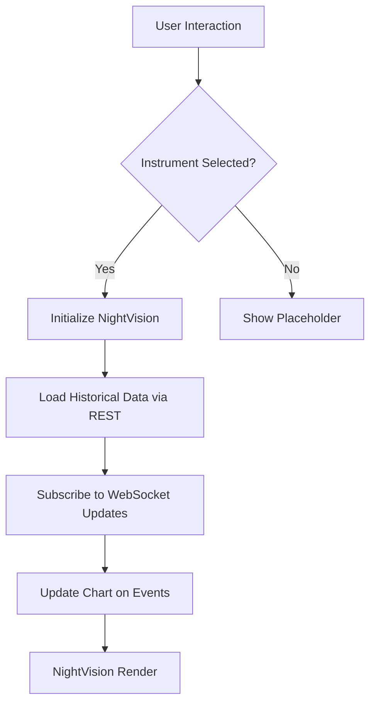
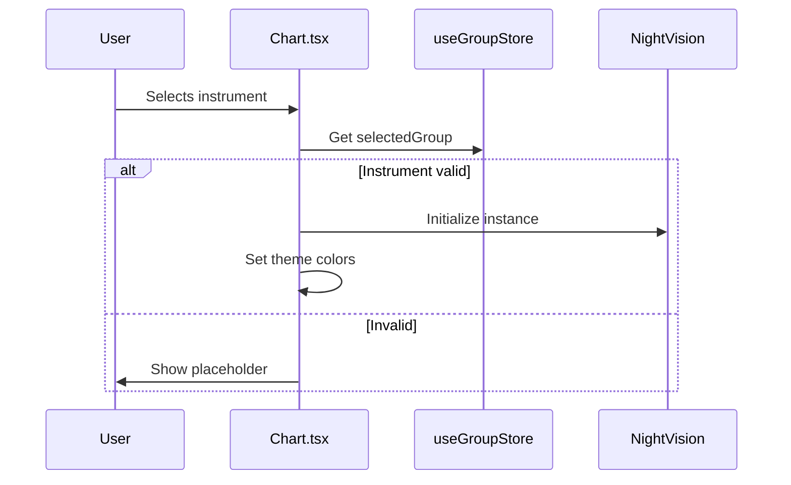
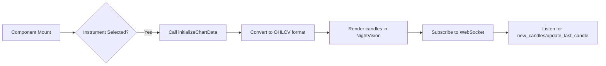
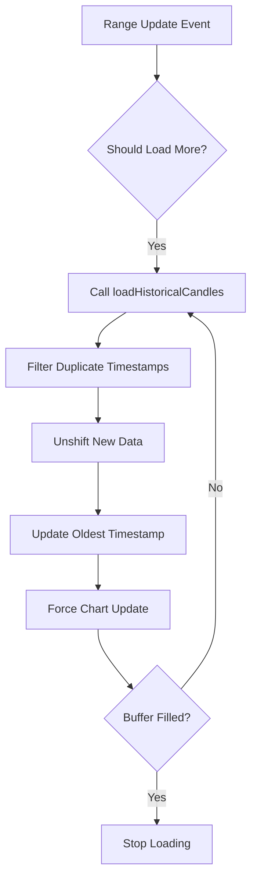
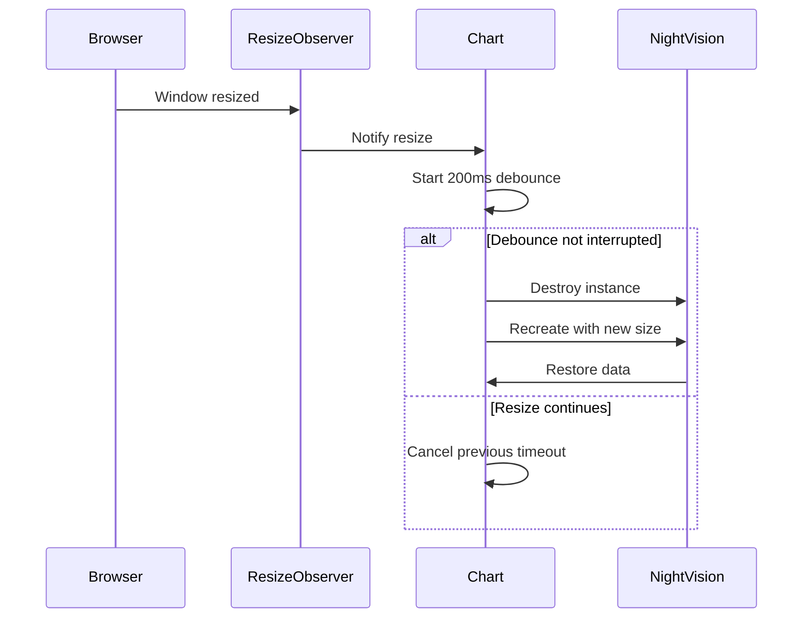
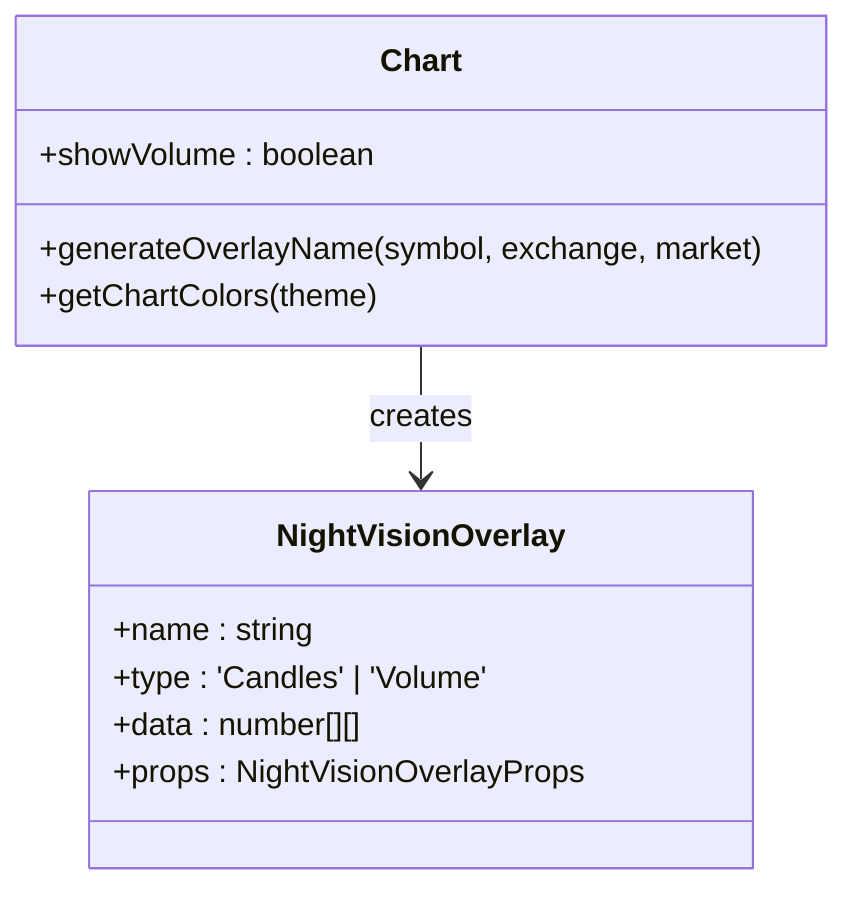

# Chart Widget

<cite>
**Referenced Files in This Document**
- [Chart.tsx](file://src/components/widgets/Chart.tsx)
- [dataProviderStore.ts](file://src/store/dataProviderStore.ts)
- [chartWidgetStore.ts](file://src/store/chartWidgetStore.ts)
- [groupStore.ts](file://src/store/groupStore.ts)
- [TimeframeSelect.tsx](file://src/components/ui/TimeframeSelect.tsx)
- [nightvision.d.ts](file://src/types/nightvision.d.ts)
</cite>

## Table of Contents
1. [Introduction](#introduction)
2. [Core Components and Data Flow](#core-components-and-data-flow)
3. [Initialization and Instrument Selection](#initialization-and-instrument-selection)
4. [Dual Data Loading Strategy](#dual-data-loading-strategy)
5. [Infinite Scroll Implementation](#infinite-scroll-implementation)
6. [Responsive Resize Behavior](#responsive-resize-behavior)
7. [Configuration Management](#configuration-management)
8. [Overlay Generation and Volume Toggle](#overlay-generation-and-volume-toggle)
9. [Error Handling and Initialization](#error-handling-and-initialization)
10. [Performance Considerations](#performance-considerations)

## Introduction
The Chart widget provides interactive financial charting capabilities using the NightVision library. It integrates with `useDataProviderStore` to fetch and display real-time candlestick data from multiple exchanges via CCXT. The widget supports dynamic instrument selection through group-based configuration, theme-aware rendering, and responsive layout behavior. This document details its architecture, data flow, and key implementation strategies.

**Section sources**
- [Chart.tsx](file://src/components/widgets/Chart.tsx#L46-L855)

## Core Components and Data Flow
The Chart widget orchestrates several core components:
- **NightVision**: Renders candlestick charts with customizable themes and overlays.
- **useDataProviderStore**: Manages data fetching, WebSocket subscriptions, and event distribution.
- **useGroupStore**: Provides the selected trading instrument (exchange, symbol, market).
- **useChartWidgetsStore**: Persists widget-specific settings like timeframe.
- **TimeframeSelect**: UI component for changing chart intervals.

Data flows from external exchanges through CCXT into the store, then to the chart instance via event listeners or direct updates.



**Diagram sources**
- [Chart.tsx](file://src/components/widgets/Chart.tsx#L46-L855)
- [dataProviderStore.ts](file://src/store/dataProviderStore.ts#L20-L118)

## Initialization and Instrument Selection
The chart initializes only when a valid instrument is selected via `useGroupStore`. The selected group must define exchange, symbol, market, and account. If no group is selected, it falls back to the transparent group with default values (Binance BTC/USDT spot).

Upon initialization, the NightVision instance is created with dimensions derived from the container size. Theme integration ensures proper color schemes for dark/light modes.



**Diagram sources**
- [Chart.tsx](file://src/components/widgets/Chart.tsx#L46-L855)
- [groupStore.ts](file://src/store/groupStore.ts#L29-L196)

## Dual Data Loading Strategy
The widget employs a dual strategy for data loading:
- **REST API**: Fetches initial historical data via `initializeChartData`.
- **WebSocket**: Subscribes to live updates after successful REST load.

This ensures fast initial rendering while maintaining real-time accuracy. The method used depends on `dataFetchSettings.method` in the store.



**Diagram sources**
- [Chart.tsx](file://src/components/widgets/Chart.tsx#L46-L855)
- [dataProviderStore.ts](file://src/store/dataProviderStore.ts#L20-L118)

## Infinite Scroll Implementation
The infinite scroll feature dynamically loads historical data as users pan left. It listens to NightVision's `app:$range-update` event to detect when more data is needed.

Key logic:
- Tracks the oldest timestamp in `oldestTimestampRef`.
- When viewport range approaches this timestamp within a 20% buffer, triggers `loadHistoricalCandles`.
- Appends new data to both WebSocket (`hub.mainOv.data`) and REST (`panes[0].overlays[0].data`) structures.
- Prevents duplicates using timestamp checks.
- Limits recursive loading to 5 iterations to avoid infinite loops.



**Diagram sources**
- [Chart.tsx](file://src/components/widgets/Chart.tsx#L46-L855)
- [dataProviderStore.ts](file://src/store/dataProviderStore.ts#L20-L118)

## Responsive Resize Behavior
The chart responds to container size changes using `ResizeObserver`. On resize:
- Debounces recreation with a 200ms delay to prevent excessive updates.
- Preserves current chart data during recreation.
- Reinitializes NightVision with updated dimensions.

This approach avoids performance issues from frequent re-renders while ensuring visual fidelity across device sizes.



**Diagram sources**
- [Chart.tsx](file://src/components/widgets/Chart.tsx#L46-L855)

## Configuration Management
Timeframe settings are persisted using `chartWidgetStore`, which stores per-widget state. The `updateWidget` function saves the selected timeframe, making it persistent across sessions.

The `TimeframeSelect` component reads available timeframes from `getTimeframesForExchange` in `dataProviderStore`, ensuring exchange-specific options (e.g., Binance vs Bybit).

```mermaid
flowchart LR
A[User selects timeframe] --> B[TimeframeSelect.onChange]
B --> C[updateWidget(widgetId, {timeframe})]
C --> D[Persist in localStorage]
D --> E[Restore on next load]
```

**Diagram sources**
- [chartWidgetStore.ts](file://src/store/chartWidgetStore.ts#L24-L50)
- [TimeframeSelect.tsx](file://src/components/ui/TimeframeSelect.tsx#L29-L83)

## Overlay Generation and Volume Toggle
Overlays are generated using `generateOverlayName`, which formats the label as `{symbol} ({ExchangeName}:{MarketType})`. For example: "BTC/USDT (Binance:Spot)".

Volume display is controlled by the `showVolume` state. When enabled, a second pane with volume bars is added to the `panes` array, using theme-appropriate colors.

Both candle and volume colors are derived from `getChartColors`, which returns different palettes based on the current theme.



**Diagram sources**
- [Chart.tsx](file://src/components/widgets/Chart.tsx#L56-L60)
- [Chart.tsx](file://src/components/widgets/Chart.tsx#L11-L35)

## Error Handling and Initialization
Errors are managed through React state (`setError`). Common failure points include:
- Failed NightVision initialization
- REST data loading errors
- WebSocket subscription failures

Loading states are tracked via `setIsLoading`, showing spinners during data fetch. If no instrument is selected, a placeholder message prompts the user to make a selection.

The component cleans up all subscriptions and destroys the NightVision instance on unmount.

**Section sources**
- [Chart.tsx](file://src/components/widgets/Chart.tsx#L46-L855)

## Performance Considerations
Key performance optimizations include:
- **Data Deduplication**: Before appending historical data, existing timestamps are filtered out using `Set`.
- **Memory Management**: Old chart instances are destroyed before recreating on resize.
- **Event Listener Cleanup**: Previous event listeners are unsubscribed when settings change.
- **Debounced Resizing**: Prevents excessive NightVision recreation.
- **Efficient Updates**: Uses `update()` without parameters for last-candle updates, avoiding full redraws.

These measures ensure smooth operation even with high-frequency data updates and large datasets.

**Section sources**
- [Chart.tsx](file://src/components/widgets/Chart.tsx#L46-L855)