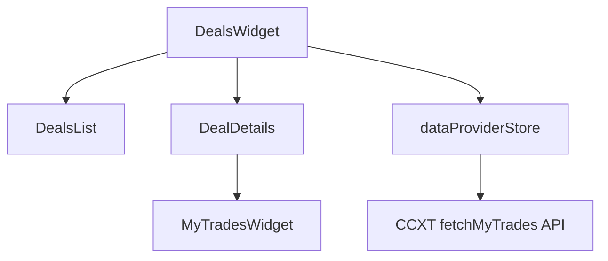
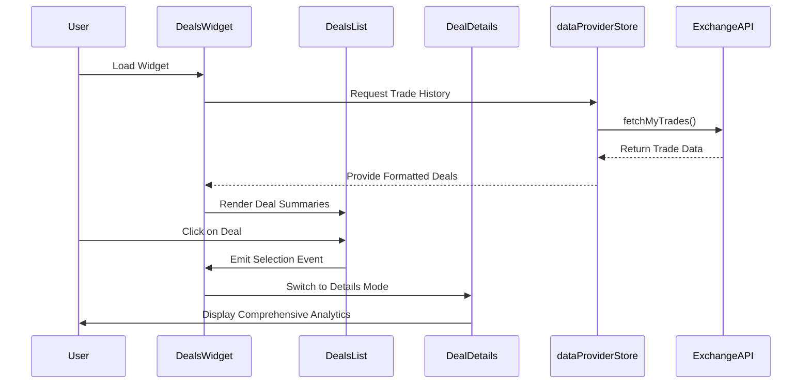
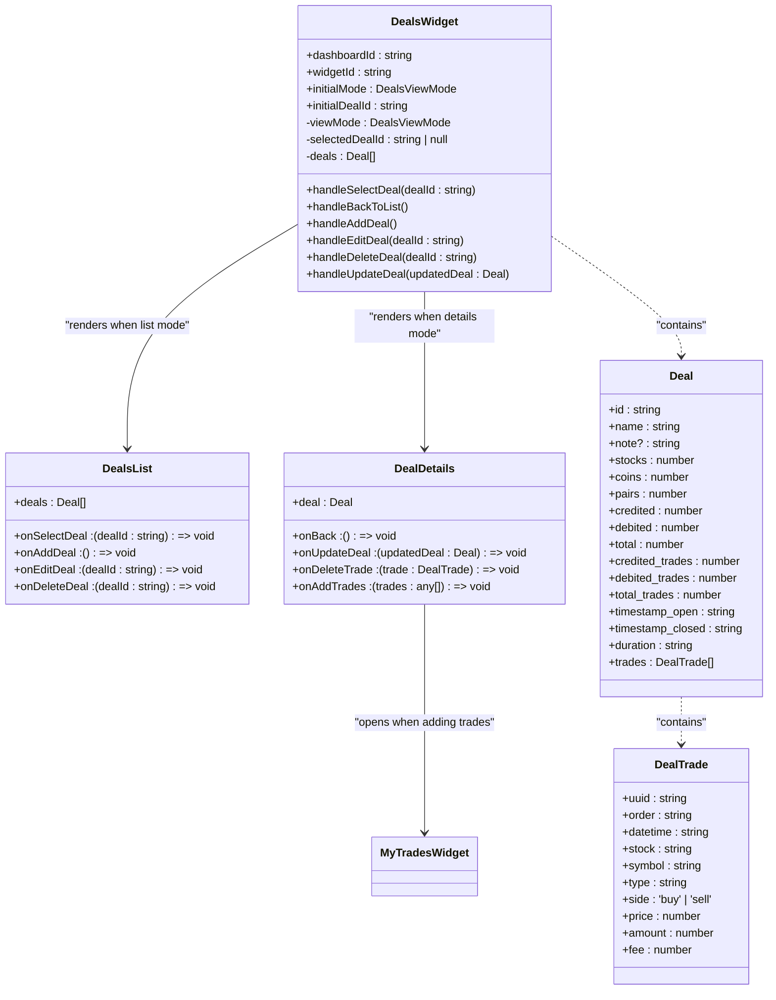
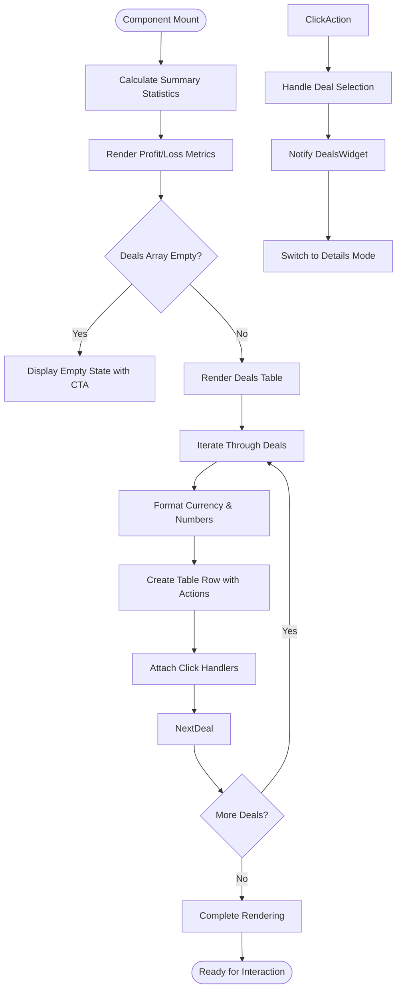
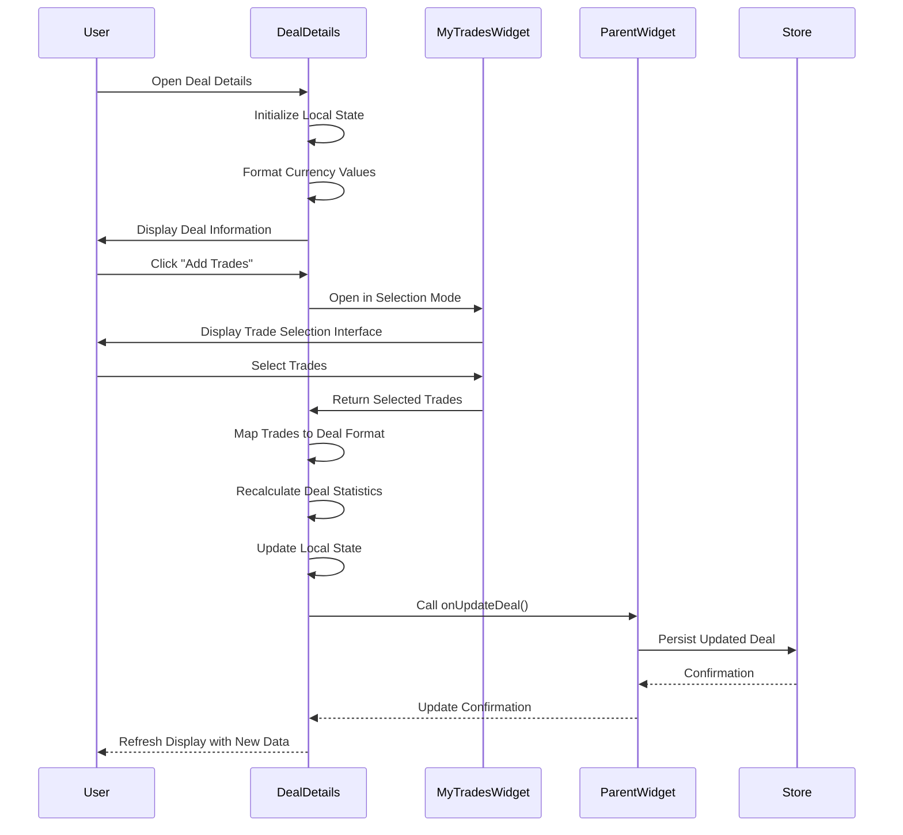
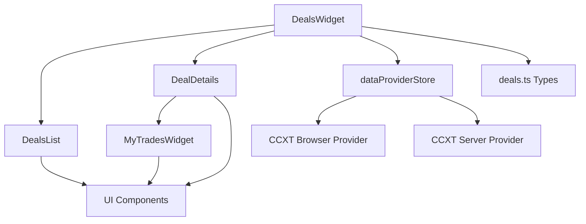

# Deals Widget

<cite>
**Referenced Files in This Document **  
- [DealsWidget.tsx](file://src/components/widgets/DealsWidget.tsx)
- [DealDetails.tsx](file://src/components/widgets/DealDetails.tsx)
- [DealsList.tsx](file://src/components/widgets/DealsList.tsx)
- [dataProviderStore.ts](file://src/store/dataProviderStore.ts)
- [deals.ts](file://src/types/deals.ts)
</cite>

## Table of Contents
1. [Introduction](#introduction)
2. [Project Structure](#project-structure)
3. [Core Components](#core-components)
4. [Architecture Overview](#architecture-overview)
5. [Detailed Component Analysis](#detailed-component-analysis)
6. [Dependency Analysis](#dependency-analysis)
7. [Performance Considerations](#performance-considerations)
8. [Troubleshooting Guide](#troubleshooting-guide)
9. [Conclusion](#conclusion)

## Introduction
The Deals Widget is a comprehensive trading analytics component designed to track and display completed transactions with detailed execution insights. It enables users to organize trades into logical groups called "deals," analyze performance metrics, and derive actionable insights for strategy improvement. The widget supports integration with exchange data via CCXT's `fetchMyTrades` API through the `dataProviderStore`, provides sortable tabular views of transaction history, and offers advanced filtering and pagination capabilities.

This documentation details the implementation of the Deals Widget system, including its core components, data flow architecture, user interface features such as the DealDetails panel for in-depth analysis, and practical applications in performance reporting, tax preparation, and strategy backtesting.

## Project Structure
The Deals Widget ecosystem consists of three primary components organized within the widgets directory: `DealsWidget.tsx` serves as the main container, `DealsList.tsx` renders the tabular view of all deals, and `DealDetails.tsx` provides an expanded view for individual deal inspection. These components are supported by type definitions in `src/types/deals.ts` and integrate with the global state management system via `dataProviderStore.ts`. The architecture follows a modular pattern where the parent widget manages state and routing between list and detail views, while child components handle specialized rendering and interaction logic.

**Diagram sources**
- [DealsWidget.tsx](file://src/components/widgets/DealsWidget.tsx)
- [dataProviderStore.ts](file://src/store/dataProviderStore.ts)

**Section sources**
- [DealsWidget.tsx](file://src/components/widgets/DealsWidget.tsx)
- [DealsList.tsx](file://src/components/widgets/DealsList.tsx)
- [DealDetails.tsx](file://src/components/widgets/DealDetails.tsx)

## Core Components
The core functionality of the Deals Widget is distributed across three React components that work together to provide a seamless user experience. The `DealsWidget` acts as the orchestrator, maintaining state for the current view mode (list or details) and selected deal. It coordinates navigation between the `DealsList` and `DealDetails` components based on user interactions. The `DealsList` component presents a sortable table of all recorded deals with summary statistics including profit/loss calculations, win rate percentages, and trade counts. The `DealDetails` component enables granular inspection of individual deals, allowing users to edit metadata, add or remove constituent trades, and view comprehensive performance analytics.

These components leverage TypeScript interfaces defined in `deals.ts` to ensure type safety throughout the application. The `Deal` interface defines the structure of a trading deal including financial metrics and associated trades, while `DealTrade` specifies the schema for individual transaction records. The widget also utilizes Zustand for state management, integrating with the global `dataProviderStore` to access historical trade data from connected exchanges.

**Section sources**
- [DealsWidget.tsx](file://src/components/widgets/DealsWidget.tsx#L12-L315)
- [DealDetails.tsx](file://src/components/widgets/DealDetails.tsx#L17-L285)
- [DealsList.tsx](file://src/components/widgets/DealsList.tsx#L14-L237)
- [deals.ts](file://src/types/deals.ts#L0-L71)

## Architecture Overview
The Deals Widget follows a hierarchical component architecture where the top-level `DealsWidget` manages application state and routes between different views. When initialized, it defaults to 'list' mode, rendering the `DealsList` component which displays all available deals in a sortable table format. Each row in the table represents a single deal with key metrics such as total profit, number of trades, and duration. Users can click on any deal to transition to 'details' mode, at which point the `DealDetails` component takes over, providing an in-depth view of the selected deal's composition and performance characteristics.

Data flows from the `dataProviderStore` into the widget system through prop drilling, with the main widget responsible for fetching and managing the complete set of deals. The store itself maintains connections to external exchanges via CCXT providers, periodically synchronizing trade history using the `fetchMyTrades` API. This separation of concerns allows the UI components to remain focused on presentation logic while the data layer handles connectivity, caching, and synchronization responsibilities.

**Diagram sources**
- [DealsWidget.tsx](file://src/components/widgets/DealsWidget.tsx)
- [dataProviderStore.ts](file://src/store/dataProviderStore.ts)

## Detailed Component Analysis

### DealsWidget Analysis
The `DealsWidget` component serves as the central controller for the entire deals management system. It maintains three key pieces of state: the current view mode (`list` or `details`), the currently selected deal ID, and the complete collection of deals. Upon initialization, it populates the deals array with mock data for demonstration purposes, though in production this would be replaced with actual trade history retrieved from connected exchanges. The component provides callback handlers for various user actions including selecting a deal, adding a new deal, editing an existing deal, deleting a deal, and updating deal information.

When the view mode transitions to 'details', the widget passes the selected deal object along with update and navigation callbacks to the `DealDetails` component. Conversely, when in 'list' mode, it supplies the complete deals array and action handlers to the `DealsList` component. This design pattern ensures that state management remains centralized while allowing child components to focus on their specific rendering responsibilities.

#### For Object-Oriented Components:

**Diagram sources**
- [DealsWidget.tsx](file://src/components/widgets/DealsWidget.tsx#L12-L315)
- [deals.ts](file://src/types/deals.ts#L0-L71)

**Section sources**
- [DealsWidget.tsx](file://src/components/widgets/DealsWidget.tsx#L12-L315)

### DealsList Analysis
The `DealsList` component renders a comprehensive table displaying all recorded trading deals with sortable columns for key attributes including date, instrument, side, price, amount, and fees. Each row in the table is interactive, allowing users to click to view details, show notes, edit, or delete individual deals. The component calculates summary statistics such as total profit, total loss, and win rate across all deals, presenting these metrics in a prominent summary section above the table. 

The table implementation leverages the UI library's Table component with custom styling applied to visually distinguish buy and sell trades through background color variations. Sorting functionality is implemented at the column header level, enabling users to reorder deals based on any metric. The component also includes an empty state display with a call-to-action button for creating the first deal when no deals exist in the system.

#### For Complex Logic Components:

**Diagram sources**
- [DealsList.tsx](file://src/components/widgets/DealsList.tsx#L14-L237)

**Section sources**
- [DealsList.tsx](file://src/components/widgets/DealsList.tsx#L14-L237)

### DealDetails Analysis
The `DealDetails` component provides an in-depth analysis interface for individual trading deals, featuring a dedicated panel that displays comprehensive information about transaction hierarchies and execution quality metrics such as slippage. The component allows users to edit deal metadata including name and notes, and provides tools for modifying the constituent trades within a deal. A key feature is the automatic recalculation of deal statistics whenever trades are added or removed, ensuring that profit/loss figures, trade counts, and other metrics remain accurate.

Users can add trades to a deal by opening the `MyTradesWidget` in selection mode, which allows them to choose from their complete trade history. When trades are removed, the component triggers both local state updates and notifications to parent components to maintain consistency across the application. The interface includes visual indicators for buy and sell trades, formatted currency displays, and a clean layout optimized for detailed analysis.

#### For API/Service Components:

**Diagram sources**
- [DealDetails.tsx](file://src/components/widgets/DealDetails.tsx#L17-L285)

**Section sources**
- [DealDetails.tsx](file://src/components/widgets/DealDetails.tsx#L17-L285)

## Dependency Analysis
The Deals Widget system depends on several key modules within the application architecture. Its primary dependency is the `dataProviderStore`, which provides access to historical trade data from connected exchanges through CCXT's `fetchMyTrades` API. This store manages authentication, request throttling, and data caching to ensure reliable access to trading history. The widget components also depend on shared UI components from the `ui` directory for consistent styling and interaction patterns, including buttons, tables, inputs, and dialogs.

Type definitions are imported from `src/types/deals.ts`, establishing a contract between the UI components and the underlying data model. The component hierarchy creates implicit dependencies between `DealsWidget`, `DealsList`, and `DealDetails`, with the parent component responsible for state management and the children focused on presentation. There are no circular dependencies in the system, and the modular design allows for independent testing and development of each component.

**Diagram sources**
- [DealsWidget.tsx](file://src/components/widgets/DealsWidget.tsx)
- [dataProviderStore.ts](file://src/store/dataProviderStore.ts)
- [deals.ts](file://src/types/deals.ts)

**Section sources**
- [DealsWidget.tsx](file://src/components/widgets/DealsWidget.tsx)
- [dataProviderStore.ts](file://src/store/dataProviderStore.ts)

## Performance Considerations
The current implementation of the Deals Widget uses mock data loaded during component initialization, which provides immediate feedback but does not reflect the performance characteristics of handling large trade histories. For production use with extensive trading records, pagination and lazy loading mechanisms would need to be implemented to prevent performance degradation. The table rendering should be optimized using virtualization techniques to limit the number of DOM elements created when displaying thousands of trades.

Filtering capabilities by date range, instrument, and trade direction are essential for managing large datasets and should be implemented with efficient indexing and query optimization. The integration with `dataProviderStore` already includes configurable REST polling intervals, allowing users to balance data freshness with API rate limit constraints. For very large trade histories, consider implementing server-side processing for statistical calculations rather than performing these operations client-side.

## Troubleshooting Guide
Common issues with the Deals Widget typically relate to data synchronization between the `dataProviderStore` and the UI components. If deals do not appear in the list view, verify that the `dataProviderStore` has successfully connected to the exchange API and retrieved trade history. Check browser developer tools for network errors or authentication issues with the CCXT provider. When adding trades to a deal, ensure that the `MyTradesWidget` is properly configured in selection mode and that the `onTradesSelected` callback is correctly wired to the parent component.

If deal statistics are not updating correctly after adding or removing trades, verify that the `recalculateDealStats` function is being called and that the resulting updated deal object is being passed through the `onUpdateDeal` callback chain back to the `DealsWidget` state manager. For display issues with currency formatting or date presentation, check that the `formatCurrency` and similar utility functions are receiving valid numeric input and that locale settings are properly configured.

**Section sources**
- [DealDetails.tsx](file://src/components/widgets/DealDetails.tsx#L85-L120)
- [DealsWidget.tsx](file://src/components/widgets/DealsWidget.tsx#L284-L317)

## Conclusion
The Deals Widget provides a robust framework for tracking and analyzing completed trading transactions with detailed execution analytics. By organizing trades into logical deals and providing comprehensive performance metrics, it enables traders to gain valuable insights into their strategy effectiveness. The integration with `dataProviderStore` and CCXT's `fetchMyTrades` API ensures access to accurate historical data from multiple exchanges, while the modular component architecture supports extensibility and maintainability.

Key features such as sortable tabular presentation, in-depth deal analysis through the DealDetails panel, and flexible filtering capabilities make this widget suitable for various use cases including performance reporting, tax preparation, and strategy backtesting. With additional enhancements for handling large trade histories through pagination and lazy loading, the system can scale to meet the needs of active traders with extensive transaction records.