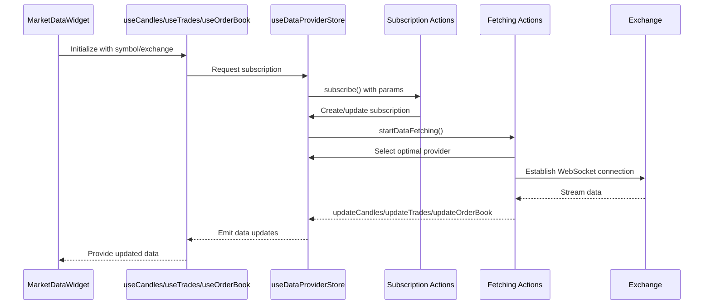
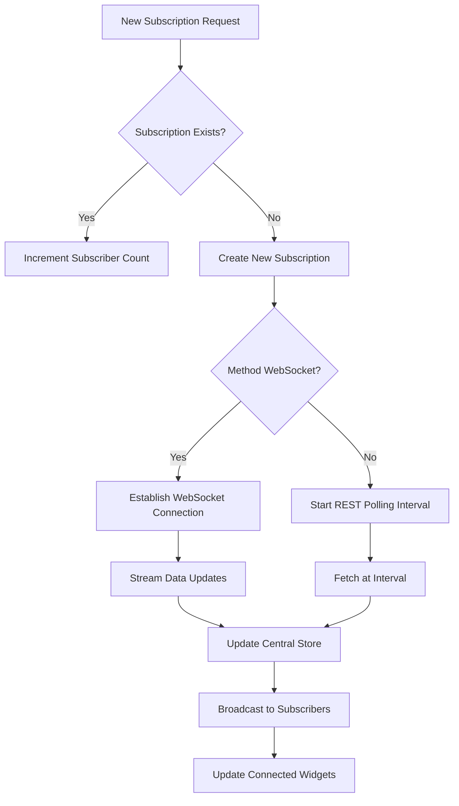

# Market Data Widget

<cite>
**Referenced Files in This Document**   
- [MarketDataWidget.tsx](file://src/components/widgets/MarketDataWidget.tsx)
- [dataProviderStore.ts](file://src/store/dataProviderStore.ts)
- [useDataProvider.ts](file://src/hooks/useDataProvider.ts)
- [subscriptionActions.ts](file://src/store/actions/subscriptionActions.ts)
- [fetchingActions.ts](file://src/store/actions/fetchingActions.ts)
- [dataActions.ts](file://src/store/actions/dataActions.ts)
- [providerUtils.ts](file://src/store/utils/providerUtils.ts)
- [formatters.ts](file://src/utils/formatters.ts)
</cite>

## Table of Contents
1. [Introduction](#introduction)
2. [Core Functionality and Components](#core-functionality-and-components)
3. [Data Acquisition Pattern](#data-acquisition-pattern)
4. [Grid-Based Layout and UI Design](#grid-based-layout-and-ui-design)
5. [Filtering and Search Capabilities](#filtering-and-search-capabilities)
6. [Performance Optimization Techniques](#performance-optimization-techniques)
7. [Refresh Mechanisms and Error Recovery](#refresh-mechanisms-and-error-recovery)
8. [Trading Use Cases and Applications](#trading-use-cases-and-applications)
9. [Conclusion](#conclusion)

## Introduction

The Market Data Widget is a comprehensive financial information display component that provides real-time market overview data across multiple trading instruments. It delivers critical trading metrics including price movements, volume statistics, order book depth, and recent trade activity from various cryptocurrency exchanges. The widget serves as a central monitoring tool for traders who need to quickly assess market conditions, identify potential trading opportunities, and track the performance of multiple assets simultaneously.

Designed with both novice and professional traders in mind, the widget combines rich data visualization with efficient information architecture. It leverages WebSocket connections for real-time updates while maintaining responsiveness through optimized state management and rendering techniques. The component integrates seamlessly with the application's data provider system, allowing users to connect to different exchange APIs and data sources based on their preferences and requirements.

**Section sources**
- [MarketDataWidget.tsx](file://src/components/widgets/MarketDataWidget.tsx#L31-L343)

## Core Functionality and Components

The Market Data Widget comprises several interconnected components that work together to deliver a cohesive user experience. At its core, the widget displays three primary types of market data: candlestick price information, order book depth, and recent trades. Each data type is presented in a dedicated card component with appropriate visual indicators and formatting.

The widget's header section displays connection status indicators, the current trading pair, exchange name, and active data provider. Color-coded WiFi icons indicate whether the widget is connected (green), connecting (yellow spinning), or disconnected (gray). Below this, input fields allow users to modify the trading symbol and exchange being monitored, providing flexibility in tracking different markets.

For price information, the widget shows the current closing price alongside percentage changes, with positive movements displayed in green and negative movements in red. Additional details include opening price, high and low values for the period, and trading volume. The order book section presents bid and ask prices with corresponding volumes, while the trades section displays recent transactions with buy/sell indicators and timestamps.

**Section sources**
- [MarketDataWidget.tsx](file://src/components/widgets/MarketDataWidget.tsx#L31-L343)

## Data Acquisition Pattern

The Market Data Widget employs a sophisticated data acquisition pattern centered around the `useDataProviderStore` hook, which manages subscriptions to ticker streams from various exchanges. This pattern follows a layered architecture where React hooks interface with a centralized Zustand store that orchestrates data fetching operations.

When the widget mounts, it initializes three separate data subscriptions using specialized hooks: `useCandles`, `useTrades`, and `useOrderBook`. Each hook generates a unique subscription ID based on parameters like symbol, exchange, data type, dashboard ID, and widget ID. These IDs ensure that multiple instances of the widget can coexist without conflicting subscriptions.

**Diagram sources**
- [useDataProvider.ts](file://src/hooks/useDataProvider.ts#L30-L225)
- [dataProviderStore.ts](file://src/store/dataProviderStore.ts#L20-L118)
- [subscriptionActions.ts](file://src/store/actions/subscriptionActions.ts#L10-L105)
- [fetchingActions.ts](file://src/store/actions/fetchingActions.ts#L9-L741)

**Section sources**
- [useDataProvider.ts](file://src/hooks/useDataProvider.ts#L30-L225)
- [dataProviderStore.ts](file://src/store/dataProviderStore.ts#L20-L118)

## Grid-Based Layout and UI Design

The Market Data Widget implements a responsive grid-based layout that efficiently organizes multiple data points into a coherent visual hierarchy. Using Tailwind CSS utility classes, the widget structures its content into a vertical stack of cards separated by consistent spacing, ensuring readability and visual clarity.

Each data section is contained within a Card component that provides visual separation and subtle shadows to create depth. The layout adapts to different screen sizes through responsive breakpoints, maintaining usability across desktop and mobile devices. Within each card, a combination of flexbox and grid layouts arranges elements such as labels, values, and icons in an organized manner.

Price movements are color-coded according to standard financial conventions: green for positive changes and red for negative changes. Icons from the Lucide React library provide visual cues for different data types—bar charts for price data, books for order books, and arrows for trade activity. The connection status indicator uses animated spinners during loading states to provide immediate feedback about data stream health.

The widget also incorporates micro-interactions such as hover effects on interactive elements and smooth transitions when data updates occur. These subtle animations enhance the user experience without distracting from the primary market data. Badge components display the trading pair and exchange information with distinct styling that makes them easily identifiable at a glance.

**Section sources**
- [MarketDataWidget.tsx](file://src/components/widgets/MarketDataWidget.tsx#L31-L343)

## Filtering and Search Capabilities

While the Market Data Widget itself focuses primarily on displaying market data rather than filtering functionality, it integrates with the broader application's search and selection ecosystem. The widget accepts configurable parameters for the trading symbol and exchange, which can be modified through input fields within the component.

These inputs enable users to quickly switch between different markets by typing in new symbols or exchange names. Although the current implementation doesn't include advanced filtering capabilities within the widget itself, it works in conjunction with other components like InstrumentSearch and SearchableSelect that provide comprehensive market discovery features.

The widget's design supports dynamic updates when these parameters change, automatically establishing new data subscriptions for the specified symbol and exchange combination. This reactivity allows traders to rapidly scan through different markets by simply updating the input fields, making it an effective tool for opportunity discovery.

Future enhancements could incorporate additional filtering options such as timeframe selection, market type (spot vs. futures), or data density controls, further expanding the widget's utility for market analysis.

**Section sources**
- [MarketDataWidget.tsx](file://src/components/widgets/MarketDataWidget.tsx#L31-L343)

## Performance Optimization Techniques

The Market Data Widget employs several performance optimization techniques to handle hundreds of concurrent WebSocket connections and update the UI efficiently. At the architectural level, the system implements subscription deduplication, where multiple widgets requesting the same market data share a single underlying subscription rather than creating separate connections.

The data provider store maintains a centralized cache of market data, preventing redundant network requests and enabling efficient data sharing across components. When multiple widgets subscribe to identical data streams (same exchange, symbol, and data type), the system increments a subscriber count instead of creating duplicate subscriptions, significantly reducing network overhead.

WebSocket connections are managed through CCXT Pro, which provides reliable streaming capabilities across numerous exchanges. For exchanges that don't support native WebSockets, the system falls back to REST polling with configurable intervals defined in the data fetch settings. These intervals vary by data type, with order books updated every 500ms, candles every 5 seconds, and tickers every 10 minutes.

**Diagram sources**
- [fetchingActions.ts](file://src/store/actions/fetchingActions.ts#L9-L741)
- [dataActions.ts](file://src/store/actions/dataActions.ts#L64-L66)
- [subscriptionActions.ts](file://src/store/actions/subscriptionActions.ts#L10-L105)

**Section sources**
- [fetchingActions.ts](file://src/store/actions/fetchingActions.ts#L9-L741)
- [dataActions.ts](file://src/store/actions/dataActions.ts#L64-L66)

## Refresh Mechanisms and Error Recovery

The Market Data Widget implements robust refresh mechanisms and error recovery strategies to maintain data integrity when data feeds disconnect or encounter issues. The system monitors connection status across all active subscriptions and provides visual feedback through color-coded indicators in the widget header.

When a WebSocket connection fails, the system automatically falls back to REST polling as a contingency measure, ensuring that users continue receiving updates even if real-time streaming is unavailable. This fallback mechanism is transparent to the end user, maintaining data continuity without requiring manual intervention.

The subscription management system tracks the last update timestamp for each data stream, allowing the widget to display how recently data was refreshed. If no updates are received within expected timeframes, the system may attempt to restart the connection or switch to alternative data providers.

Error handling is implemented at multiple levels:
- Individual data hooks catch and expose errors to the UI
- The data provider store logs connection issues and recovery attempts
- Subscription actions manage retry logic and provider failover
- WebSocket utilities handle reconnection sequences

The system also persists configuration settings to localStorage, allowing users to resume their preferred market views after application restarts. This persistence includes active subscriptions, provider selections, and fetch method preferences, minimizing setup time after disconnections.

**Section sources**
- [fetchingActions.ts](file://src/store/actions/fetchingActions.ts#L9-L741)
- [subscriptionActions.ts](file://src/store/actions/subscriptionActions.ts#L10-L105)
- [dataProviderStore.ts](file://src/store/dataProviderStore.ts#L20-L118)

## Trading Use Cases and Applications

Traders leverage the Market Data Widget for various analytical purposes, particularly in identifying breakout opportunities and monitoring correlated assets. The widget's real-time price change indicators make it easy to spot instruments experiencing significant volatility, which often precedes breakout patterns.

For momentum trading strategies, users configure multiple instances of the widget to monitor different asset classes or sectors simultaneously. By arranging these widgets in a dashboard layout, traders can quickly scan for assets showing strong directional movement, indicated by prominent green or red percentage changes.

The widget is particularly valuable for relative strength analysis, where traders compare the performance of related assets such as BTC/USDT versus ETH/USDT. Color-coded price changes allow for instant visual comparison of asset performance, helping traders identify outperforming or underperforming instruments.

Pairs traders use the widget to monitor correlated assets like gold miners versus gold prices, or technology stocks versus NASDAQ index movements. When the normal correlation breaks down—indicated by divergent price movements across the widgets—it may signal a trading opportunity to capitalize on the temporary mispricing.

Scalpers and day traders utilize the order book and recent trades sections to gauge short-term supply and demand dynamics. Large bid or ask orders visible in the order book can indicate potential support or resistance levels, while clusters of recent trades at specific price points reveal areas of market interest.

**Section sources**
- [MarketDataWidget.tsx](file://src/components/widgets/MarketDataWidget.tsx#L31-L343)

## Conclusion

The Market Data Widget represents a sophisticated solution for real-time market monitoring, combining efficient data acquisition patterns with intuitive UI design. By leveraging the `useDataProviderStore` architecture, it achieves optimal performance even when managing numerous concurrent data streams from various exchanges.

Its modular design allows for flexible deployment across different trading workflows, while the centralized data management system ensures consistency and reduces network overhead. The widget's ability to gracefully handle connection failures and automatically recover from errors enhances reliability in production environments.

Future development opportunities include enhanced filtering capabilities, customizable alert thresholds, and integration with technical analysis tools. However, the current implementation already provides substantial value to traders seeking comprehensive market visibility with minimal latency.

As part of a larger trading terminal ecosystem, the Market Data Widget serves as a foundational component that enables informed decision-making through timely, accurate, and well-presented market data.