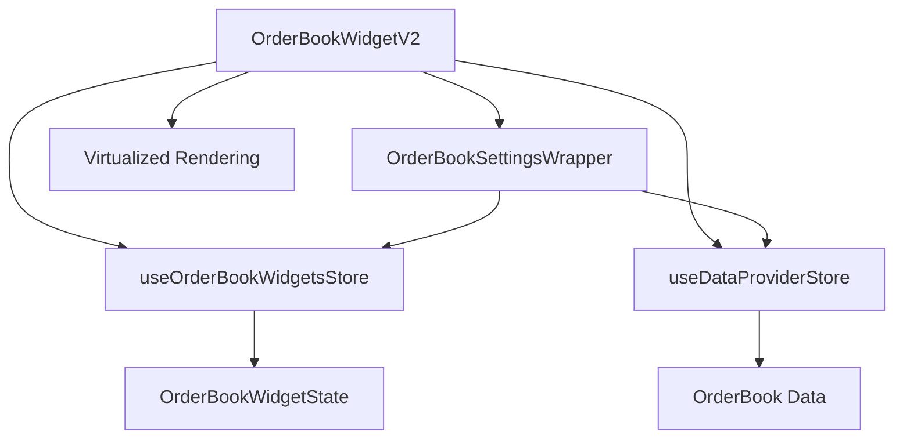
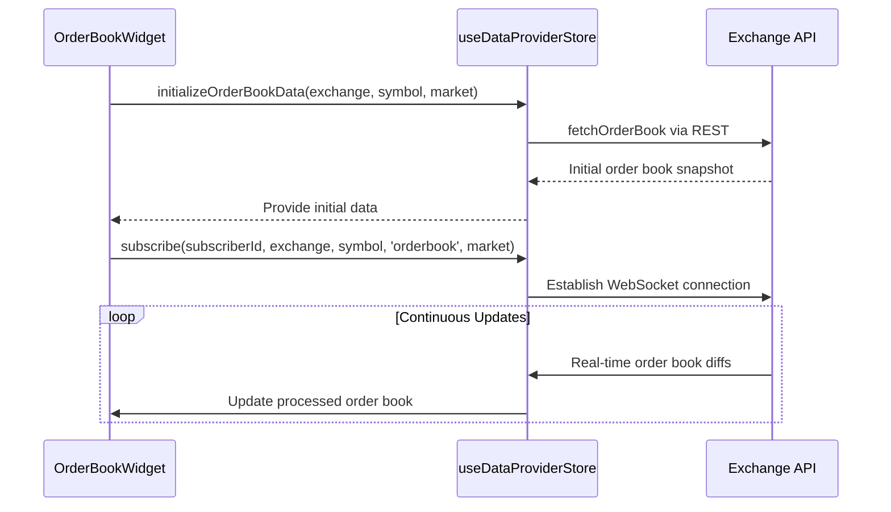
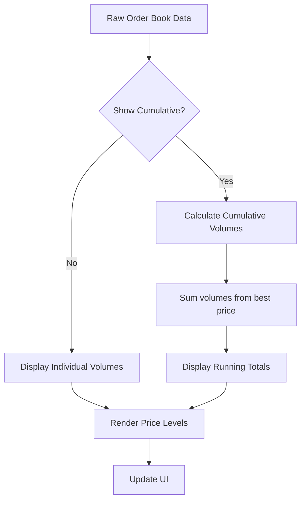
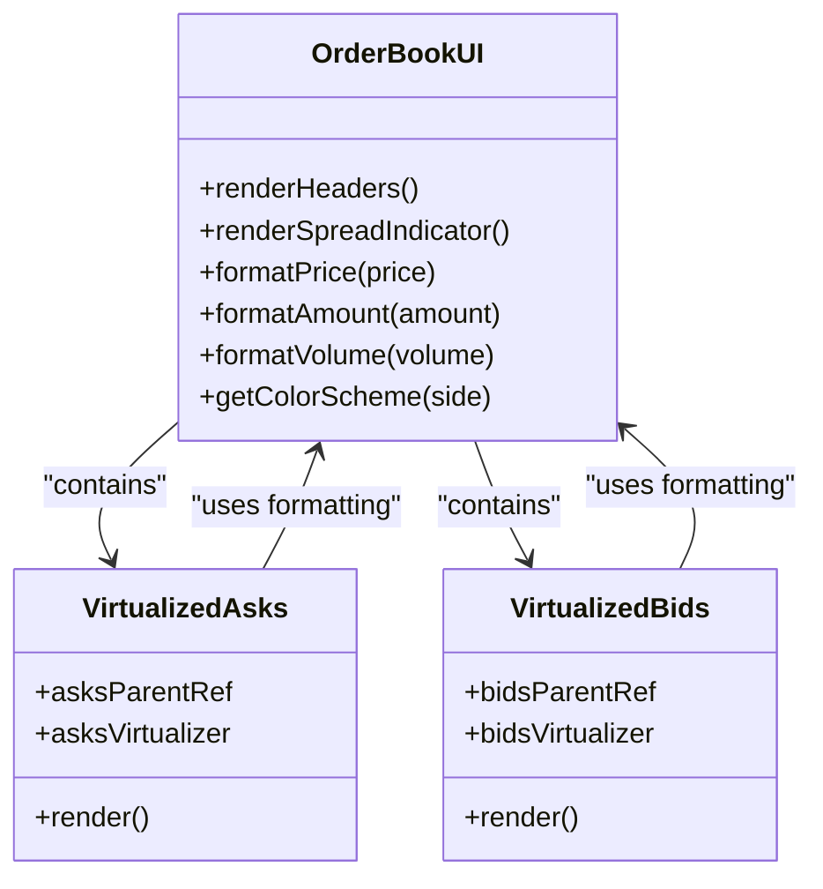
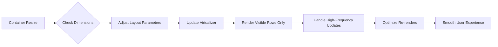
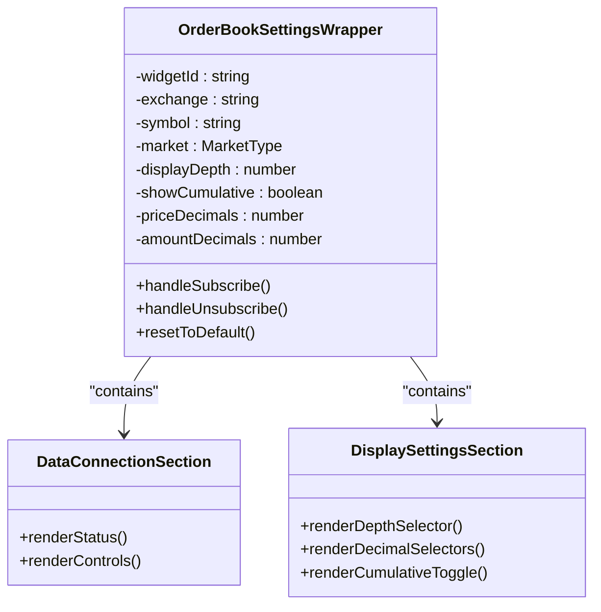

# OrderBook Widget

<cite>
**Referenced Files in This Document**   
- [OrderBookWidget.tsx](file://src/components/widgets/OrderBookWidget.tsx)
- [OrderBookSettingsWrapper.tsx](file://src/components/widgets/OrderBookSettingsWrapper.tsx)
- [orderBookWidgetStore.ts](file://src/store/orderBookWidgetStore.ts)
- [dataProviderStore.ts](file://src/store/dataProviderStore.ts)
- [dataProviders.ts](file://src/types/dataProviders.ts)
</cite>

## Table of Contents
1. [Introduction](#introduction)
2. [Core Components and Architecture](#core-components-and-architecture)
3. [Data Integration with useDataProviderStore](#data-integration-with-usedataproviderstore)
4. [Depth Configuration and Market Depth Analysis](#depth-configuration-and-market-depth-analysis)
5. [Visual Representation and UI Design](#visual-representation-and-ui-design)
6. [Responsive Layout and Performance Optimization](#responsive-layout-and-performance-optimization)
7. [OrderBookSettingsWrapper Implementation](#orderbooksettingswrapper-implementation)
8. [Usage Examples and Trading Applications](#usage-examples-and-trading-applications)

## Introduction
The OrderBook Widget is a specialized component designed to display real-time order book depth with comprehensive bid/ask visualization and spread calculation. This widget provides traders with critical market liquidity information by showing price levels across multiple exchange markets. The component integrates seamlessly with the data provider system to subscribe to order book data streams from selected exchanges, offering configurable depth settings from 5 to 50 levels. With cumulative volume calculations for market depth analysis and gradient coloring for bid and ask sides, the widget delivers an intuitive interface for monitoring market conditions. The responsive design adapts to various screen sizes while employing performance optimization techniques to handle high-frequency update rendering efficiently.

## Core Components and Architecture
The OrderBook Widget architecture consists of two primary components: the main display component (OrderBookWidgetV2) and its configuration wrapper (OrderBookSettingsWrapper). These components work together with dedicated state management stores to provide a complete solution for order book visualization. The widget follows a modular design pattern with clear separation between data handling, state management, and UI presentation layers.

**Diagram sources**
- [OrderBookWidget.tsx](file://src/components/widgets/OrderBookWidget.tsx)
- [OrderBookSettingsWrapper.tsx](file://src/components/widgets/OrderBookSettingsWrapper.tsx)

**Section sources**
- [OrderBookWidget.tsx](file://src/components/widgets/OrderBookWidget.tsx#L15-L568)
- [OrderBookSettingsWrapper.tsx](file://src/components/widgets/OrderBookSettingsWrapper.tsx#L18-L333)

## Data Integration with useDataProviderStore
The OrderBook Widget integrates with the useDataProviderStore to subscribe to real-time order book data streams from selected exchanges. This integration enables automatic data fetching through both WebSocket connections for real-time updates and REST API calls for initial data initialization. The widget subscribes to order book data using the exchange, symbol, and market parameters from the selected trading group, ensuring consistency across related widgets.

When initializing, the widget first retrieves initial order book data via REST API using the initializeOrderBookData function, then establishes a WebSocket subscription for continuous real-time updates. The system automatically handles connection status, reconnection attempts, and error recovery. Subscription deduplication ensures that multiple widgets requesting the same data share a single connection, optimizing resource usage.

**Diagram sources**
- [OrderBookWidget.tsx](file://src/components/widgets/OrderBookWidget.tsx#L15-L560)
- [dataProviderStore.ts](file://src/store/dataProviderStore.ts#L20-L118)

**Section sources**
- [OrderBookWidget.tsx](file://src/components/widgets/OrderBookWidget.tsx#L15-L560)
- [dataProviderStore.ts](file://src/store/dataProviderStore.ts#L20-L118)

## Depth Configuration and Market Depth Analysis
The OrderBook Widget provides flexible depth configuration options ranging from 5 to 50 levels, allowing users to customize the amount of market depth information displayed according to their trading strategy and screen space constraints. The depth setting controls how many price levels are shown on both the bid and ask sides of the order book, with higher depths providing more comprehensive market liquidity information but potentially impacting performance on lower-end devices.

For market depth analysis, the widget implements cumulative volume calculations that can be toggled on or off through the showCumulative setting. When enabled, each price level displays the running total of order volumes from the best price to that level, helping traders identify significant support and resistance zones. The cumulative volume is calculated separately for bids and asks, starting from the best available price and summing outward.

The widget processes raw order book data by first validating the format, then slicing to the configured display depth, and finally applying the cumulative calculation if enabled. This processing occurs within a useMemo hook to prevent unnecessary recalculations during renders.

**Diagram sources**
- [OrderBookWidget.tsx](file://src/components/widgets/OrderBookWidget.tsx#L15-L560)
- [orderBookWidgetStore.ts](file://src/store/orderBookWidgetStore.ts#L2-L13)

**Section sources**
- [OrderBookWidget.tsx](file://src/components/widgets/OrderBookWidget.tsx#L15-L560)
- [orderBookWidgetStore.ts](file://src/store/orderBookWidgetStore.ts#L2-L13)

## Visual Representation and UI Design
The OrderBook Widget employs a clear visual representation of price levels with gradient coloring to distinguish between bid and ask sides. Bids (buy orders) are displayed in green tones with a left border in green, while asks (sell orders) appear in red tones with a red left border. This color scheme follows standard financial market conventions, making it intuitive for traders to interpret the data quickly.

The layout features a three-column grid displaying price, volume, and either total value or cumulative volume depending on the configuration. Price values are formatted according to the configured decimal places, while volume values are formatted with appropriate decimal precision. Large volume values are automatically abbreviated using K (thousands) and M (millions) suffixes for better readability.

A prominent spread indicator sits between the bid and ask sections, displaying both the absolute spread value and percentage spread. This spread calculation is derived from the difference between the best ask price and best bid price, providing immediate insight into market tightness. The header row uses muted text colors to distinguish labels from data values, maintaining a clean and professional appearance.

**Diagram sources**
- [OrderBookWidget.tsx](file://src/components/widgets/OrderBookWidget.tsx#L15-L560)

**Section sources**
- [OrderBookWidget.tsx](file://src/components/widgets/OrderBookWidget.tsx#L15-L560)

## Responsive Layout and Performance Optimization
The OrderBook Widget implements a responsive layout that adapts to different screen sizes and container dimensions. The component uses a flexbox-based layout that automatically adjusts the height and width proportions based on the available space. On smaller screens, the compact design with reduced padding and font sizes ensures maximum data visibility without sacrificing usability.

For performance optimization, the widget employs virtualized rendering using the @tanstack/react-virtual library to handle high-frequency update rendering efficiently. This technique only renders visible rows in the order book, significantly reducing the DOM nodes and improving scroll performance even with large datasets. The virtualizer uses fixed row heights (24px) for optimal performance, eliminating the need for dynamic measurement.

Additional performance optimizations include memoizing expensive operations with React.useMemo, preventing unnecessary re-renders through proper dependency arrays in useEffect hooks, and implementing efficient data processing algorithms. The widget also includes comprehensive logging for debugging purposes, which can be easily monitored in the browser console.

**Diagram sources**
- [OrderBookWidget.tsx](file://src/components/widgets/OrderBookWidget.tsx#L15-L560)

**Section sources**
- [OrderBookWidget.tsx](file://src/components/widgets/OrderBookWidget.tsx#L15-L560)

## OrderBookSettingsWrapper Implementation
The OrderBookSettingsWrapper component provides a comprehensive interface for configuring exchange, symbol, and depth parameters for the OrderBook Widget. This settings wrapper allows users to control data connection settings, adjust display preferences, and reset to default configurations. The component integrates directly with the orderBookWidgetStore to persist user preferences across sessions.

Key configuration options include depth selection (5, 10, 20, or 50 levels), price decimal precision (0, 1, 2, 4, or 8 decimals), volume decimal precision (0, 2, 4, 6, or 8 decimals), and cumulative volume toggle. The settings are stored per widget instance, enabling different configurations for multiple order book widgets on the same dashboard.

The wrapper also displays real-time connection status information, including the current data method (WebSocket or REST), update intervals, subscriber count, and last update time. For WebSocket connections, it shows the specific CCXT method being used, such as watchOrderBookForSymbols (diff updates), watchOrderBook (full snapshots), or fetchOrderBook (REST requests).

**Diagram sources**
- [OrderBookSettingsWrapper.tsx](file://src/components/widgets/OrderBookSettingsWrapper.tsx#L18-L333)

**Section sources**
- [OrderBookSettingsWrapper.tsx](file://src/components/widgets/OrderBookSettingsWrapper.tsx#L18-L333)

## Usage Examples and Trading Applications
The OrderBook Widget enables users to monitor liquidity and identify support/resistance levels through several practical applications. Traders can use the cumulative volume feature to spot significant order clusters that may act as support (on the bid side) or resistance (on the ask side). Large walls of orders at specific price levels become immediately apparent when cumulative volume is enabled.

For market analysis, traders can compare the depth on both sides of the order book to gauge buying versus selling pressure. A deeper bid side suggests stronger demand, while a deeper ask side indicates greater supply. The spread percentage provides insight into market efficiency, with tighter spreads typically found in more liquid markets.

The widget supports multiple use cases:
- **Scalping**: Traders can monitor micro-price movements and execute trades based on order flow
- **Market Making**: Users can identify optimal entry and exit points based on liquidity distribution
- **Breakout Trading**: Significant order walls can signal potential breakout points when penetrated
- **Liquidity Analysis**: Assessing market depth helps determine position sizing and slippage expectations

By configuring different depth levels, traders can balance detail with performance, viewing shallow depth for quick overviews or deep depth for detailed market structure analysis.

**Section sources**
- [OrderBookWidget.tsx](file://src/components/widgets/OrderBookWidget.tsx#L15-L560)
- [OrderBookSettingsWrapper.tsx](file://src/components/widgets/OrderBookSettingsWrapper.tsx#L18-L333)
- [orderBookWidgetStore.ts](file://src/store/orderBookWidgetStore.ts#L2-L13)