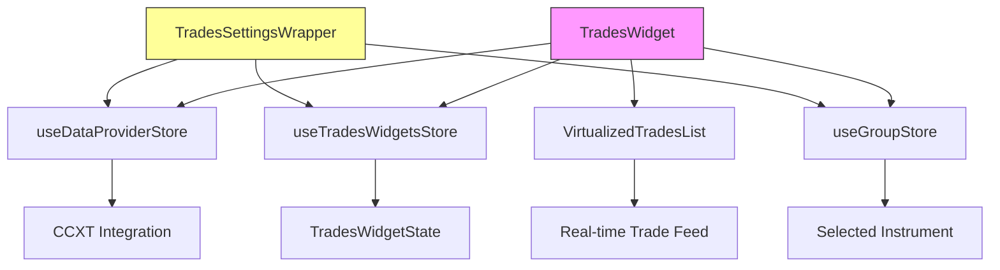
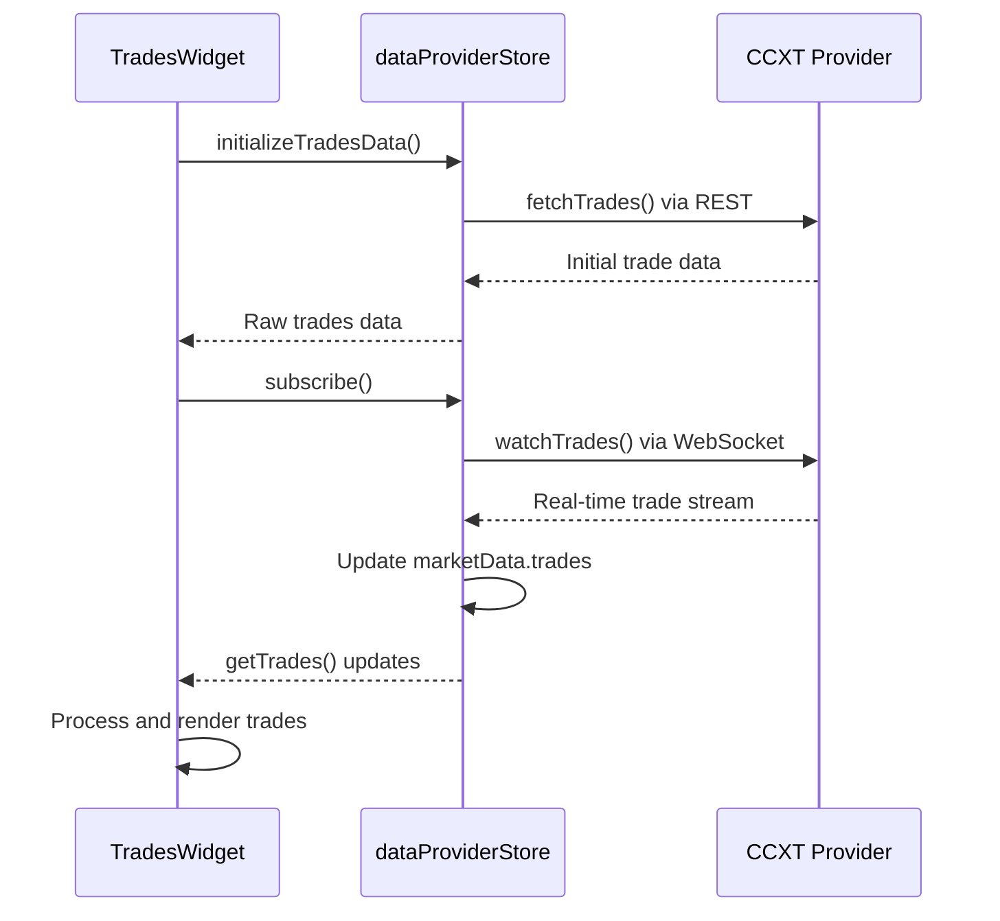
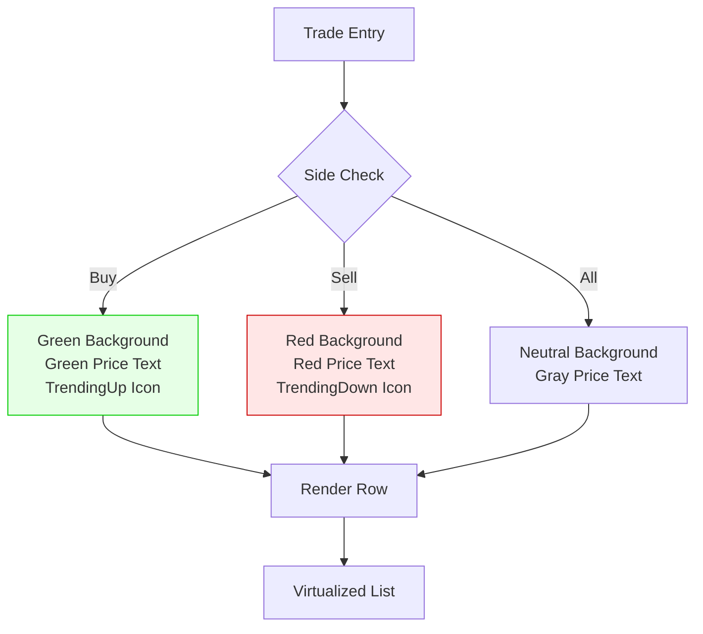

# Trades Widget

<cite>
**Referenced Files in This Document**   
- [TradesWidget.tsx](file://src/components/widgets/TradesWidget.tsx)
- [TradesSettingsWrapper.tsx](file://src/components/widgets/TradesSettingsWrapper.tsx)
- [tradesWidgetStore.ts](file://src/store/tradesWidgetStore.ts)
- [dataProviderStore.ts](file://src/store/dataProviderStore.ts)
</cite>

## Table of Contents
1. [Introduction](#introduction)
2. [Architecture Overview](#architecture-overview)
3. [Subscription Mechanism](#subscription-mechanism)
4. [Filtering Capabilities](#filtering-capabilities)
5. [Sorting and Auto-Scrolling](#sorting-and-auto-scrolling)
6. [UI Design and Trade Row Highlighting](#ui-design-and-trade-row-highlighting)
7. [Performance Optimizations](#performance-optimizations)
8. [TradesSettingsWrapper Implementation](#tradessettingswrapper-implementation)
9. [Trading Use Cases](#trading-use-cases)
10. [Conclusion](#conclusion)

## Introduction

The Trades Widget is a real-time trading data visualization component that displays executed trades with comprehensive filtering, sorting, and configuration capabilities. It serves as a critical tool for traders to monitor market activity, detect momentum shifts, and identify institutional order flow. The widget integrates with the CCXT library through a provider-based architecture, enabling connectivity to multiple exchanges and markets.

Built using React with Zustand for state management, the widget follows a modular design pattern with clear separation between data handling, UI rendering, and user configuration. It supports both WebSocket and REST data fetching methods, automatically subscribing to real-time trade streams while providing fallback mechanisms for reliability.

This documentation details the implementation of the Trades Widget, covering its subscription mechanism, filtering and sorting functionality, UI design choices, performance optimizations, and practical trading applications.

## Architecture Overview

**Diagram sources**
- [TradesWidget.tsx](file://src/components/widgets/TradesWidget.tsx#L16-L434)
- [TradesSettingsWrapper.tsx](file://src/components/widgets/TradesSettingsWrapper.tsx#L23-L462)

**Section sources**
- [TradesWidget.tsx](file://src/components/widgets/TradesWidget.tsx#L1-L582)
- [TradesSettingsWrapper.tsx](file://src/components/widgets/TradesSettingsWrapper.tsx#L1-L464)

## Subscription Mechanism

The Trades Widget utilizes the `useDataProviderStore` hook to establish and manage subscriptions to real-time trade data streams. The subscription process begins when an instrument is selected through the group store, which provides the exchange, symbol, and market information required for data retrieval.

When the widget mounts or when provider availability changes, it automatically initiates a subscription using the `subscribe` method from `useDataProviderStore`. The subscription includes configuration parameters such as whether to use aggregated trades and the display limit for trades. Each subscription is identified by a composite key consisting of the dashboard ID, widget ID, exchange, symbol, data type ("trades"), and market.

The widget maintains subscription state through the `isSubscribed` flag in its local store and tracks active subscriptions via the `getActiveSubscriptionsList` method. When settings change (such as switching instruments or modifying aggregation preferences), the widget intelligently manages the subscription lifecycle by first unsubscribing from the previous configuration before establishing a new subscription with updated parameters.

WebSocket connections are preferred for real-time updates, with REST polling serving as a fallback mechanism when WebSocket connectivity is unavailable. The cleanup function ensures proper unsubscription when the component unmounts, preventing memory leaks and unnecessary WebSocket connections.

**Diagram sources**
- [TradesWidget.tsx](file://src/components/widgets/TradesWidget.tsx#L16-L434)
- [dataProviderStore.ts](file://src/store/dataProviderStore.ts#L20-L118)

**Section sources**
- [TradesWidget.tsx](file://src/components/widgets/TradesWidget.tsx#L16-L434)
- [dataProviderStore.ts](file://src/store/dataProviderStore.ts#L20-L118)

## Filtering Capabilities

The Trades Widget provides comprehensive filtering options that allow users to focus on specific trade characteristics. Filters are applied client-side to the raw trade data retrieved from the data provider store, enabling flexible analysis without additional server requests.

Three primary filtering dimensions are supported:

1. **Trade side filtering**: Users can filter trades by side (buy, sell, or all) to analyze directional market pressure.
2. **Price range filtering**: Minimum and maximum price thresholds allow users to focus on trades within specific price levels, useful for identifying activity around support and resistance zones.
3. **Volume threshold filtering**: Minimum and maximum amount filters help identify significant trades, potentially indicating institutional activity or large market orders.

The filtering logic is implemented within a `useMemo` hook that processes the raw trades data whenever the filter criteria or underlying data changes. This approach ensures efficient re-computation only when necessary, optimizing performance during high-frequency data updates.

Filters are currently managed as component state but are designed for potential future integration with the widget's persistent store, allowing users to save their preferred filtering configurations across sessions.

**Section sources**
- [TradesWidget.tsx](file://src/components/widgets/TradesWidget.tsx#L16-L434)

## Sorting and Auto-Scrolling

The Trades Widget supports sorting functionality by three key metrics: time (timestamp), price, and volume (amount). Sorting is controlled through dedicated state variables (`sortBy` and `sortOrder`) that determine the primary sort criterion and direction (ascending or descending).

The sorting implementation uses JavaScript's array `sort` method with a comparison function that handles the different data types appropriately. Timestamp sorting compares millisecond values, price sorting compares numerical values, and amount sorting handles volume comparisons. The sort order is inverted for descending sorts by negating the comparison result.

Auto-scrolling to the latest trades is managed through a dedicated display option in the settings interface. When enabled, the virtualized list automatically scrolls to show the most recent trades as they arrive. This feature enhances situational awareness for active traders monitoring real-time market activity.

The widget also implements a configurable limit on the number of displayed trades, which is applied after filtering and sorting operations. This limit prevents performance degradation when processing high-volume trade streams and ensures the interface remains responsive.

**Section sources**
- [TradesWidget.tsx](file://src/components/widgets/TradesWidget.tsx#L16-L434)
- [TradesSettingsWrapper.tsx](file://src/components/widgets/TradesSettingsWrapper.tsx#L23-L462)

## UI Design and Trade Row Highlighting

The user interface of the Trades Widget employs a compact, information-dense design optimized for rapid trade analysis. Trade rows are displayed in a virtualized list to maintain performance with large datasets, with each row showing timestamp, price, size (volume), and total value.

Visual highlighting is a key aspect of the UI design, with distinct styling applied based on the aggressor side of each trade:
- Buy trades are highlighted with a green background (hsla(134, 61%, 41%, 0.1))
- Sell trades are highlighted with a red background (hsla(0, 84%, 60%, 0.1))

This color-coding allows traders to quickly assess market sentiment and identify clusters of buying or selling pressure. Price values for buy trades appear in green text, while sell trade prices appear in red, reinforcing the directional information.

The widget includes optional table headers with clock, hash, dollar sign, and trending icons to provide visual cues about the data columns. Footer statistics display key metrics including total volume, buy/sell counts, and average price for the filtered dataset, offering immediate quantitative insights into market activity.

**Diagram sources**
- [TradesWidget.tsx](file://src/components/widgets/TradesWidget.tsx#L437-L574)

**Section sources**
- [TradesWidget.tsx](file://src/components/widgets/TradesWidget.tsx#L437-L574)

## Performance Optimizations

The Trades Widget incorporates several performance optimizations to handle high-volume trade streams efficiently:

1. **Virtualization**: The `VirtualizedTradesList` component uses `@tanstack/react-virtual` to render only visible trade rows, significantly reducing DOM complexity and improving scroll performance. With an overscan of 5 items and estimated row height of 20px, the virtualizer maintains smooth scrolling even with thousands of trades.

2. **Memoization**: Critical data processing operations are wrapped in `useMemo` hooks to prevent unnecessary re-computations. The filtered and sorted trades array is only recalculated when dependencies change, avoiding expensive operations during every render cycle.

3. **Efficient State Management**: The widget leverages Zustand's granular reactivity, ensuring that only components dependent on specific state changes re-render. The separation of widget-specific state in `tradesWidgetStore` prevents unnecessary updates across unrelated components.

4. **Batched Updates**: Trade data from WebSockets is processed and stored in the centralized data provider store, which then notifies subscribers of updates. This batching mechanism prevents individual trade events from triggering separate re-renders.

5. **Cleanup and Unsubscription**: Comprehensive cleanup functions ensure WebSocket subscriptions are properly terminated when components unmount or settings change, preventing memory leaks and excessive network connections.

These optimizations enable the widget to maintain responsiveness even during periods of intense market activity with hundreds of trades per second.

**Section sources**
- [TradesWidget.tsx](file://src/components/widgets/TradesWidget.tsx#L437-L574)
- [tradesWidgetStore.ts](file://src/store/tradesWidgetStore.ts#L3-L18)

## TradesSettingsWrapper Implementation

The `TradesSettingsWrapper` component provides a comprehensive configuration interface for the Trades Widget, allowing users to customize various aspects of its behavior and appearance.

Key configuration options include:
- **Aggregate Trades toggle**: Controls whether to display individual trades or aggregated trade data
- **Trades Limit selector**: Configurable dropdown for setting the maximum number of displayed trades (100, 200, 500, or 1000)
- **Display toggles**: Options to show/hide table headers and footer statistics
- **Connection controls**: Connect/disconnect button for managing the real-time data subscription
- **Filtering options**: Side, price range, and volume threshold filters
- **Sorting controls**: Selection of sort criteria (time, price, volume) and direction
- **Auto-scroll toggle**: Enables/disables automatic scrolling to the latest trades

The settings wrapper integrates with multiple stores:
- `useTradesWidgetsStore` for persistent widget state
- `useDataProviderStore` for subscription management
- `useGroupStore` for current instrument context

Configuration changes are immediately reflected in the widget's behavior through state updates that trigger re-renders and, when necessary, subscription resubscription with updated parameters. The wrapper also displays real-time subscription status information, including connection method (WebSocket or REST), subscriber count, and last update timestamp.

**Section sources**
- [TradesSettingsWrapper.tsx](file://src/components/widgets/TradesSettingsWrapper.tsx#L23-L462)
- [tradesWidgetStore.ts](file://src/store/tradesWidgetStore.ts#L3-L18)

## Trading Use Cases

The Trades Widget serves several important use cases for active traders:

1. **Market Momentum Detection**: By filtering for buy or sell trades and observing the clustering of trades at specific price levels, traders can identify emerging trends and momentum shifts. A sudden increase in buy trades at higher prices indicates bullish momentum, while consecutive sell trades at lower prices suggest bearish pressure.

2. **Institutional Order Identification**: Large volume trades often indicate institutional activity. Traders can set minimum volume thresholds to filter out retail-sized trades and focus on potentially significant orders. Clusters of large trades in the same direction may reveal accumulation or distribution patterns.

3. **Support and Resistance Analysis**: Price range filtering allows traders to examine trade activity around key technical levels. High trade volume at specific price points confirms the significance of support and resistance zones, while breakouts accompanied by increased trade volume validate trend continuation.

4. **Order Flow Analysis**: The real-time nature of the trade feed enables traders to track order flow dynamics. Rapid succession of buy trades suggests aggressive buying pressure, while alternating buy-sell patterns may indicate market making or two-sided liquidity provision.

5. **Volatility Assessment**: The frequency and size of trades provide insights into market volatility. Periods of high trade frequency with moderate sizes indicate normal market conditions, while infrequent but very large trades may signal low liquidity or algorithmic execution of large orders.

Professional traders use these insights to time entries and exits, adjust position sizing, and confirm signals from other technical indicators.

**Section sources**
- [TradesWidget.tsx](file://src/components/widgets/TradesWidget.tsx#L16-L434)
- [TradesSettingsWrapper.tsx](file://src/components/widgets/TradesSettingsWrapper.tsx#L23-L462)

## Conclusion

The Trades Widget represents a sophisticated real-time trading data visualization tool that combines robust data handling with intuitive user interface design. Its integration with the CCXT library through the data provider store enables connectivity to multiple exchanges while maintaining a clean separation between data acquisition and presentation layers.

The widget's architecture prioritizes performance and responsiveness, employing virtualization, memoization, and efficient state management to handle high-frequency trade data streams. The comprehensive filtering and sorting capabilities empower traders to extract meaningful insights from raw market data, while the visual highlighting of trade aggressor side enhances rapid pattern recognition.

Through the `TradesSettingsWrapper`, users have extensive control over the widget's behavior, allowing customization of display limits, aggregation settings, and real-time connection parameters. These features make the Trades Widget an essential component for traders seeking to monitor market activity, detect institutional order flow, and make informed trading decisions based on real-time execution data.

Future enhancements could include saving filter presets, advanced analytics on trade imbalances, and integration with alerting systems for specific trade patterns.