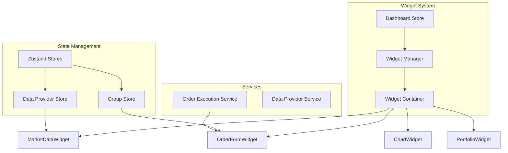
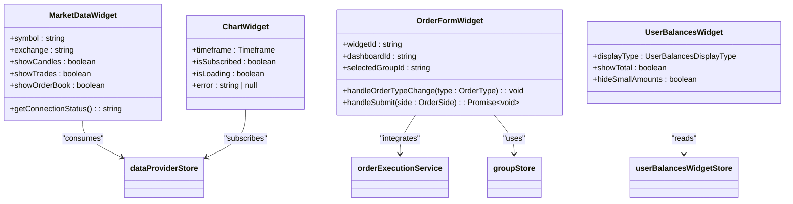
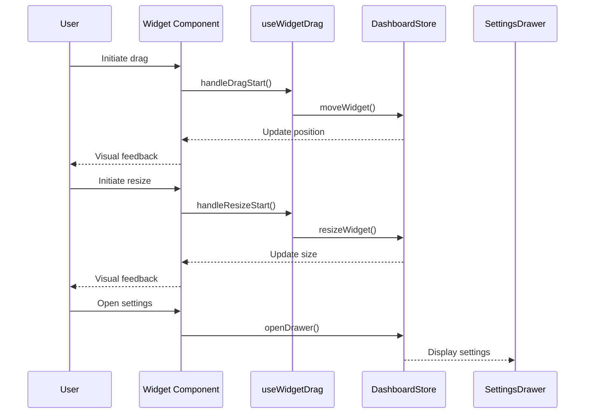
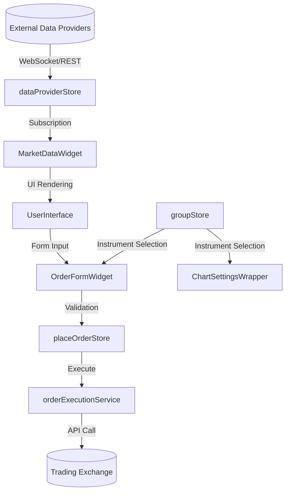
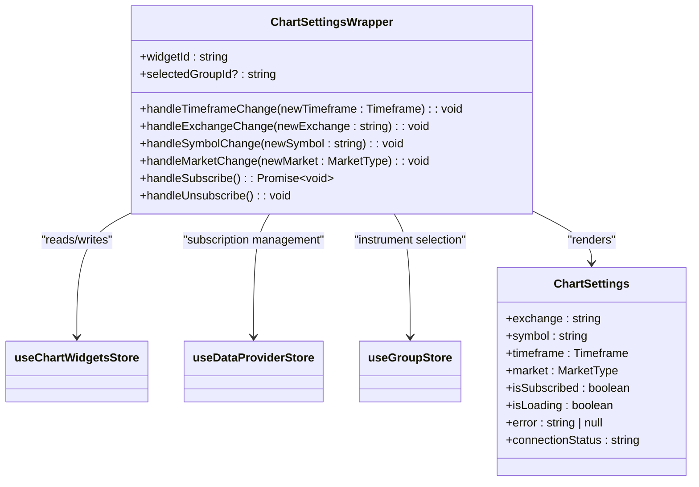
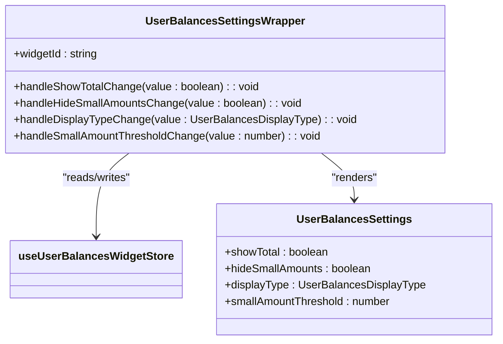
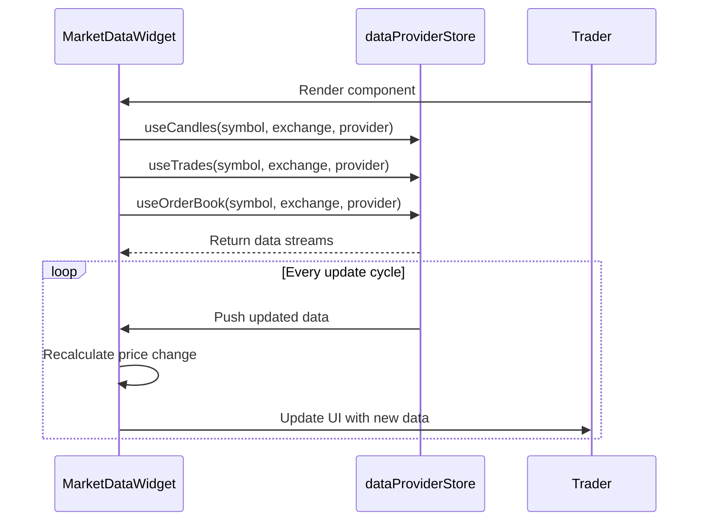
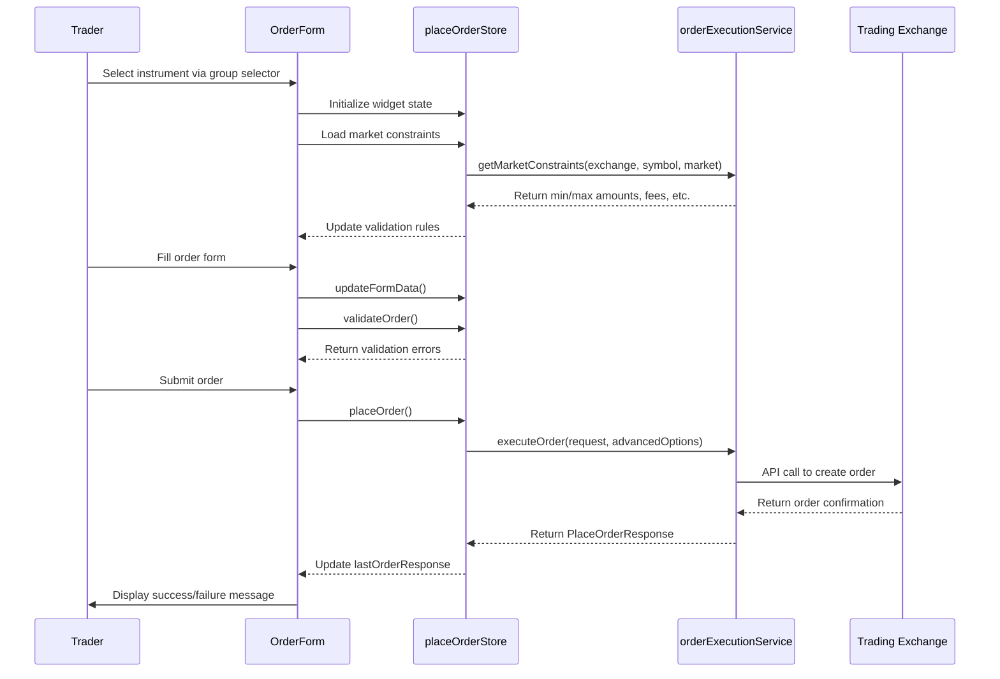
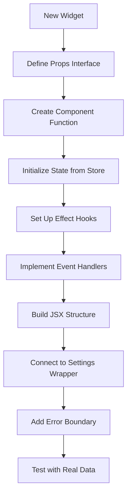

# Trading Widgets System

<cite>
**Referenced Files in This Document**
- [MarketDataWidget.tsx](file://src/components/widgets/MarketDataWidget.tsx)
- [OrderForm.tsx](file://src/components/widgets/OrderForm.tsx)
- [ChartSettingsWrapper.tsx](file://src/components/widgets/ChartSettingsWrapper.tsx)
- [UserBalancesSettingsWrapper.tsx](file://src/components/widgets/UserBalancesSettingsWrapper.tsx)
- [dataProviderStore.ts](file://src/store/dataProviderStore.ts)
- [orderExecutionService.ts](file://src/services/orderExecutionService.ts)
- [groupStore.ts](file://src/store/groupStore.ts)
- [placeOrderStore.ts](file://src/store/placeOrderStore.ts)
- [chartWidgetStore.ts](file://src/store/chartWidgetStore.ts)
- [dashboardStore.ts](file://src/store/dashboardStore.ts)
</cite>

## Table of Contents
1. [Introduction](#introduction)
2. [Widget Architecture Overview](#widget-architecture-overview)
3. [Core Widget Components](#core-widget-components)
4. [Common Widget Wrapper Pattern](#common-widget-wrapper-pattern)
5. [Data Flow and State Management](#data-flow-and-state-management)
6. [Configuration and Settings Wrappers](#configuration-and-settings-wrappers)
7. [Concrete Widget Examples](#concrete-widget-examples)
8. [Best Practices for Widget Implementation](#best-practices-for-widget-implementation)
9. [Conclusion](#conclusion)

## Introduction

The Trading Widgets System forms the core interactive elements of the profitmaker terminal, providing users with essential trading functionality through a modular and extensible architecture. Each widget encapsulates specific trading capabilities such as charting, order book visualization, trade execution, and portfolio monitoring, while maintaining a consistent user experience across the platform.

This documentation details the architecture, implementation patterns, and best practices for developing and extending the widget system. The design emphasizes reusability, performance optimization, and seamless integration with the underlying state management system based on Zustand stores.

**Section sources**
- [README.md](file://src/components/widgets/README.md#L211-L219)

## Widget Architecture Overview

The widget system follows a component-based architecture where each widget is an independent React component that can be dynamically added, removed, and configured within the trading terminal. Widgets are managed by the dashboard store, which handles their lifecycle, positioning, and persistence.

**Diagram sources**
- [dashboardStore.ts](file://src/store/dashboardStore.ts#L117-L444)
- [dataProviderStore.ts](file://src/store/dataProviderStore.ts#L20-L118)
- [groupStore.ts](file://src/store/groupStore.ts#L29-L196)

## Core Widget Components

The trading widgets system includes several core components that provide essential trading functionality:

### Market Data Widget
The MarketDataWidget provides real-time market information including price data, order book depth, and recent trades. It consumes data from the dataProviderStore and displays it in a structured format with connection status indicators.

### Order Form Widget
The OrderForm widget enables users to execute trades with support for market, limit, and stop-loss orders. It integrates with the orderExecutionService to place orders and validates inputs against market constraints.

### Chart Widget
The Chart widget displays price charts with configurable timeframes and technical indicators. It subscribes to candle data through the data provider system and updates in real-time.

### Portfolio Monitoring Widgets
These include UserBalancesWidget and UserTradingDataWidget, which display user account balances and trading activity respectively.

**Diagram sources**
- [MarketDataWidget.tsx](file://src/components/widgets/MarketDataWidget.tsx#L31-L343)
- [OrderForm.tsx](file://src/components/widgets/OrderForm.tsx#L16-L532)
- [chartWidgetStore.ts](file://src/store/chartWidgetStore.ts#L24-L50)

**Section sources**
- [MarketDataWidget.tsx](file://src/components/widgets/MarketDataWidget.tsx#L31-L343)
- [OrderForm.tsx](file://src/components/widgets/OrderForm.tsx#L16-L532)

## Common Widget Wrapper Pattern

The widget system implements a consistent wrapper pattern that provides standardized functionality across all widgets. This pattern ensures uniform behavior for drag-and-drop capability, resizing, header controls, and settings integration.

### Key Features of the Wrapper Pattern

- **Drag-and-Drop Capability**: All widgets can be moved freely within the dashboard using the useWidgetDrag hook.
- **Resizing Handles**: Widgets can be resized with minimum width and height constraints.
- **Header Controls**: Standardized header with title, minimize, close, and settings buttons.
- **Settings Integration**: Configuration options accessible through a settings drawer.

**Diagram sources**
- [useWidgetDrag.tsx](file://src/hooks/useWidgetDrag.tsx#L36-L261)
- [dashboardStore.ts](file://src/store/dashboardStore.ts#L117-L444)
- [settingsDrawerStore.ts](file://src/store/settingsDrawerStore.ts#L12-L32)

**Section sources**
- [useWidgetDrag.tsx](file://src/hooks/useWidgetDrag.tsx#L36-L261)

## Data Flow and State Management

The widget system relies on a centralized state management approach using Zustand stores to manage application state and facilitate data flow between components.

### Data Flow Architecture

Data flows from external providers through the dataProviderStore to individual widgets. The system uses a subscription model where widgets register their interest in specific data types (candles, trades, orderbook) and receive updates when new data arrives.

**Diagram sources**
- [dataProviderStore.ts](file://src/store/dataProviderStore.ts#L20-L118)
- [placeOrderStore.ts](file://src/store/placeOrderStore.ts#L110-L411)
- [orderExecutionService.ts](file://src/services/orderExecutionService.ts#L36-L352)

**Section sources**
- [dataProviderStore.ts](file://src/store/dataProviderStore.ts#L20-L118)
- [placeOrderStore.ts](file://src/store/placeOrderStore.ts#L110-L411)

## Configuration and Settings Wrappers

Widgets use specialized settings wrapper components to manage their configuration. These wrappers follow a consistent pattern and integrate with the appropriate Zustand stores.

### Settings Wrapper Pattern

Each settings wrapper:
- Reads current configuration from the corresponding widget store
- Provides UI controls for modifying settings
- Updates the store when settings change
- Handles subscription management when instrument parameters change

#### Chart Settings Wrapper

**Diagram sources**
- [ChartSettingsWrapper.tsx](file://src/components/widgets/ChartSettingsWrapper.tsx#L12-L261)
- [chartWidgetStore.ts](file://src/store/chartWidgetStore.ts#L24-L50)

#### User Balances Settings Wrapper

**Diagram sources**
- [UserBalancesSettingsWrapper.tsx](file://src/components/widgets/UserBalancesSettingsWrapper.tsx#L8-L42)
- [userBalancesWidgetStore.ts](file://src/store/userBalancesWidgetStore.ts#L36-L86)

**Section sources**
- [ChartSettingsWrapper.tsx](file://src/components/widgets/ChartSettingsWrapper.tsx#L12-L261)
- [UserBalancesSettingsWrapper.tsx](file://src/components/widgets/UserBalancesSettingsWrapper.tsx#L8-L42)

## Concrete Widget Examples

### MarketDataWidget Implementation

The MarketDataWidget demonstrates how widgets consume real-time data from the dataProviderStore. It uses custom hooks to subscribe to multiple data types simultaneously.

Key features:
- Simultaneous subscription to candles, trades, and orderbook data
- Connection status indicator based on subscription states
- Real-time price updates with change percentage calculation
- Responsive layout with collapsible sections

**Section sources**
- [MarketDataWidget.tsx](file://src/components/widgets/MarketDataWidget.tsx#L31-L343)

### OrderForm Integration

The OrderForm widget integrates with the orderExecutionService to enable trade execution. It follows a structured workflow from form input to order placement.

Key integration points:
- Uses groupStore to determine selected trading instrument
- Loads market constraints for validation
- Integrates with orderExecutionService for actual order placement
- Handles advanced order options (stop loss, take profit)
- Displays order response with error handling

**Section sources**
- [OrderForm.tsx](file://src/components/widgets/OrderForm.tsx#L16-L532)
- [orderExecutionService.ts](file://src/services/orderExecutionService.ts#L36-L352)

## Best Practices for Widget Implementation

When implementing new widgets following existing patterns, consider these best practices:

### Performance Optimization

- **Memoization**: Use useMemo and useCallback to prevent unnecessary re-renders
- **Selective Subscriptions**: Only subscribe to data that is currently visible or needed
- **Debounced Updates**: For expensive calculations, use debouncing to limit update frequency
- **Virtualization**: For lists with many items, implement virtual scrolling

### Error Handling

- **Graceful Degradation**: Display meaningful messages when data is unavailable
- **Retry Mechanisms**: Implement exponential backoff for failed subscriptions
- **User Feedback**: Provide clear visual indicators for loading, success, and error states
- **Logging**: Include comprehensive logging for debugging production issues

### Responsiveness

- **Adaptive Layouts**: Design layouts that work across different screen sizes
- **Conditional Rendering**: Show/hide sections based on available space
- **Touch Support**: Ensure usability on touch devices
- **Accessibility**: Follow WCAG guidelines for keyboard navigation and screen readers

### Code Structure

Additional considerations:
- Follow the same naming conventions as existing widgets
- Use the common widget wrapper pattern for consistency
- Integrate with the appropriate Zustand store for state management
- Implement proper cleanup in useEffect hooks to prevent memory leaks
- Use TypeScript interfaces for type safety
- Document props and component behavior in JSDoc comments

**Section sources**
- [MarketDataWidget.tsx](file://src/components/widgets/MarketDataWidget.tsx#L31-L343)
- [OrderForm.tsx](file://src/components/widgets/OrderForm.tsx#L16-L532)
- [ChartSettingsWrapper.tsx](file://src/components/widgets/ChartSettingsWrapper.tsx#L12-L261)

## Conclusion

The Trading Widgets System provides a robust foundation for building interactive trading interfaces in the profitmaker terminal. By following the established patterns for widget architecture, data flow, and configuration management, developers can create new functionality that integrates seamlessly with the existing system.

Key takeaways:
- The common widget wrapper pattern ensures consistency across all components
- Zustand stores provide efficient state management and data flow
- Settings wrappers enable flexible configuration while maintaining clean separation of concerns
- The integration between widgets and services like orderExecutionService enables powerful trading capabilities

By adhering to the best practices outlined in this documentation, developers can extend the system with new widgets that maintain high performance, reliability, and user experience standards.