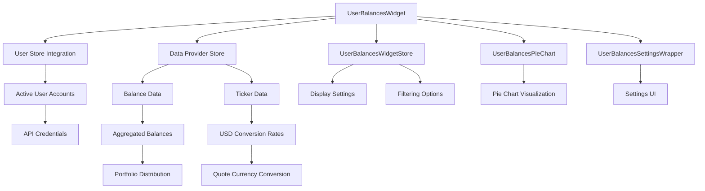
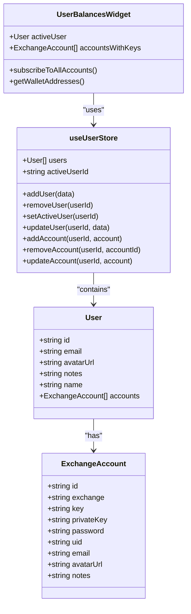
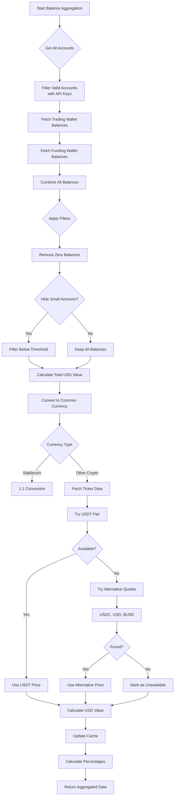
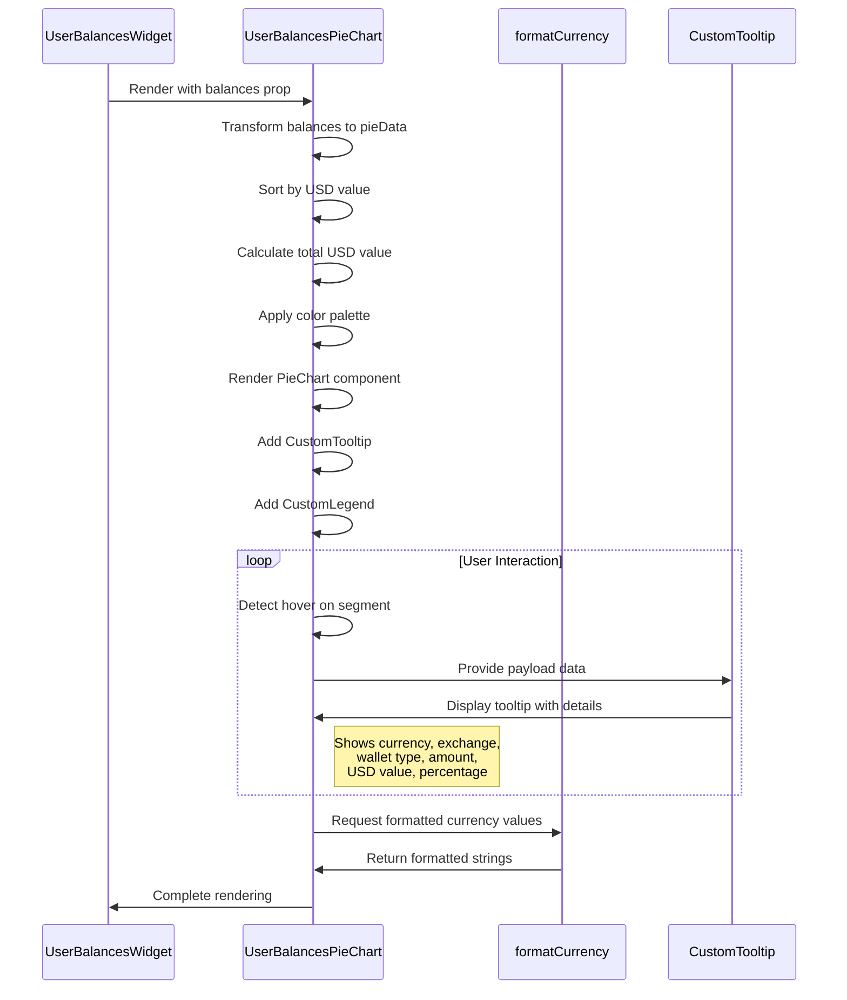
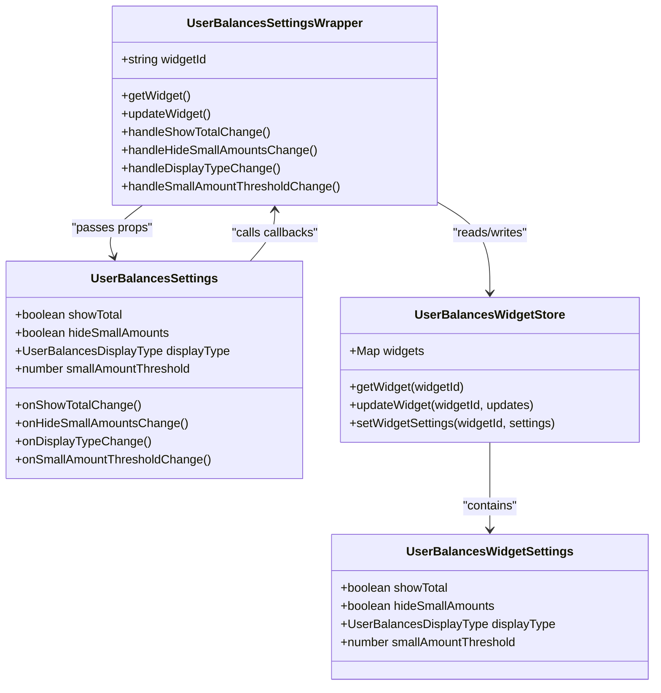

# User Balances Widget

<cite>
**Referenced Files in This Document**   
- [UserBalancesWidget.tsx](file://src/components/widgets/UserBalancesWidget.tsx)
- [UserBalancesPieChart.tsx](file://src/components/widgets/UserBalancesPieChart.tsx)
- [UserBalancesSettingsWrapper.tsx](file://src/components/widgets/UserBalancesSettingsWrapper.tsx)
- [UserBalancesSettings.tsx](file://src/components/widgets/UserBalancesSettings.tsx)
- [userStore.ts](file://src/store/userStore.ts)
- [userBalancesWidgetStore.ts](file://src/store/userBalancesWidgetStore.ts)
- [dataProviderStore.ts](file://src/store/dataProviderStore.ts)
- [dataActions.ts](file://src/store/actions/dataActions.ts)
- [ccxtServerProvider.ts](file://src/store/providers/ccxtServerProvider.ts)
- [ccxtAccountManager.ts](file://src/store/utils/ccxtAccountManager.ts)
</cite>

## Table of Contents
1. [Introduction](#introduction)
2. [Core Components and Architecture](#core-components-and-architecture)
3. [Integration with userStore and Account Management](#integration-with-userstore-and-account-management)
4. [Balance Aggregation and Quote Currency Conversion](#balance-aggregation-and-quote-currency-conversion)
5. [Interactive Pie Chart Implementation](#interactive-pie-chart-implementation)
6. [Settings Configuration and User Preferences](#settings-configuration-and-user-preferences)
7. [Security Considerations for API Key Handling](#security-considerations-for-api-key-handling)
8. [Rate Limiting and Exchange Ban Prevention](#rate-limiting-and-exchange-ban-prevention)
9. [Portfolio Rebalancing and Net Worth Tracking](#portfolio-rebalancing-and-net-worth-tracking)
10. [Conclusion](#conclusion)

## Introduction

The User Balances Widget is a comprehensive cryptocurrency portfolio management tool that provides users with a visual representation of their multi-exchange account balances through interactive pie charts and detailed balance summaries. This widget enables traders and investors to monitor their entire digital asset portfolio from a single interface, aggregating holdings across various exchanges and accounts.

The widget's primary function is to fetch, aggregate, and display balance information from multiple cryptocurrency exchanges using the CCXT library. It integrates seamlessly with the application's userStore to access account credentials securely and retrieve balance data through both REST APIs and WebSocket connections. The widget supports multiple display modes, including a table view for detailed analysis and a pie chart view for visual portfolio distribution.

Key features include real-time balance updates, currency conversion to a common quote currency (USD), filtering capabilities, and customizable display settings. The widget also implements sophisticated error handling and rate limiting strategies to prevent exchange bans while ensuring reliable data retrieval. Through its integration with the application's state management system, the User Balances Widget provides a responsive and efficient user experience for monitoring cryptocurrency portfolios across volatile markets.

**Section sources**
- [UserBalancesWidget.tsx](file://src/components/widgets/UserBalancesWidget.tsx#L111-L804)

## Core Components and Architecture

The User Balances Widget architecture consists of several interconnected components that work together to provide a comprehensive portfolio visualization system. At the core of this architecture is the `UserBalancesWidget` component, which serves as the main container and orchestrator for all balance-related functionality. This component integrates with multiple stores including `useDataProviderStore`, `useUserStore`, and `useUserBalancesWidgetStore` to manage data flow, user information, and widget-specific settings.

The widget's architecture follows a modular design pattern with clear separation of concerns. The `UserBalancesWidget` component handles the overall layout and state management, while specialized components handle specific functionalities. The `UserBalancesPieChart` component is responsible for rendering the visual representation of portfolio distribution, implementing an interactive pie chart with hover details and click-to-filter functionality. The `UserBalancesSettingsWrapper` and `UserBalancesSettings` components manage user preferences and configuration options, allowing customization of display settings and filtering criteria.

Data flow within the widget follows a unidirectional pattern, with data being retrieved from external exchanges through the data provider system, processed and aggregated within the widget, and then displayed to the user. The widget leverages React's useState and useMemo hooks for efficient state management and performance optimization, particularly when dealing with large datasets. Virtualization is implemented for table views containing more than 50 balance entries to ensure smooth scrolling and optimal performance.

**Diagram sources**
- [UserBalancesWidget.tsx](file://src/components/widgets/UserBalancesWidget.tsx#L111-L804)
- [UserBalancesPieChart.tsx](file://src/components/widgets/UserBalancesPieChart.tsx#L46-L149)
- [UserBalancesSettingsWrapper.tsx](file://src/components/widgets/UserBalancesSettingsWrapper.tsx#L8-L42)

**Section sources**
- [UserBalancesWidget.tsx](file://src/components/widgets/UserBalancesWidget.tsx#L111-L804)
- [UserBalancesPieChart.tsx](file://src/components/widgets/UserBalancesPieChart.tsx#L46-L149)
- [UserBalancesSettingsWrapper.tsx](file://src/components/widgets/UserBalancesSettingsWrapper.tsx#L8-L42)

## Integration with userStore and Account Management

The User Balances Widget integrates deeply with the application's userStore to access multi-exchange account credentials and manage user authentication state. The widget uses the `useUserStore` hook to retrieve the current active user and their associated accounts, which contain the necessary API keys and secrets for accessing exchange balances. This integration allows the widget to automatically detect when a user switches accounts and refresh the balance data accordingly.

The userStore maintains a collection of User objects, each containing an array of ExchangeAccount objects that represent connections to various cryptocurrency exchanges. When the widget initializes, it retrieves the active user from the store and iterates through their accounts to identify those with valid API credentials. Only accounts with both API key and private key configured are used for balance retrieval, ensuring that the widget only attempts to connect to properly configured exchange accounts.

For each valid account, the widget extracts the exchange identifier, API credentials, and account metadata to construct requests for balance data. The integration with userStore also enables the widget to respond to changes in the user's account configuration, such as adding or removing exchange accounts, updating API keys, or switching between different user profiles. This dynamic integration ensures that the balance data displayed always reflects the current state of the user's configured accounts.

**Diagram sources**
- [userStore.ts](file://src/store/userStore.ts#L29-L51)
- [UserBalancesWidget.tsx](file://src/components/widgets/UserBalancesWidget.tsx#L111-L804)

**Section sources**
- [userStore.ts](file://src/store/userStore.ts#L29-L51)
- [UserBalancesWidget.tsx](file://src/components/widgets/UserBalancesWidget.tsx#L111-L804)

## Balance Aggregation and Quote Currency Conversion

The User Balances Widget implements a sophisticated balance aggregation system that combines holdings from multiple exchanges and accounts into a unified portfolio view. The aggregation process begins by retrieving balance data for each configured exchange account through the `getBalance` method provided by the data provider store. For each account, the widget fetches both trading and funding wallet balances, creating a comprehensive view of the user's total holdings.

The aggregation logic processes balances from all accounts, filtering out zero balances and applying user-defined filters such as hiding small amounts below a specified threshold. Each balance entry includes the currency, free amount, used (locked) amount, and total amount, along with metadata about the source account and exchange. These individual balances are then combined into a single dataset that represents the user's complete portfolio.

A critical aspect of the aggregation process is the conversion of all balances to a common quote currency, typically USD, to enable meaningful comparison and visualization. The widget implements a multi-tiered approach to currency conversion, first checking if the currency is a stablecoin pegged to USD (such as USDT, USDC, or DAI), in which case a 1:1 conversion is applied. For other cryptocurrencies, the widget retrieves current market prices by fetching ticker data for currency/USDT pairs from the relevant exchanges. If USDT pairs are unavailable, the system attempts alternative quote currencies such as USDC or USD before falling back to available trading pairs.

The conversion process is optimized with caching to minimize redundant API calls and improve performance. A Map structure stores calculated USD values with keys combining the exchange, currency, and amount to ensure accurate price lookups. When price data is not immediately available, the widget displays loading indicators and asynchronously fetches the necessary ticker information, updating the display once conversion rates are obtained.

**Diagram sources**
- [UserBalancesWidget.tsx](file://src/components/widgets/UserBalancesWidget.tsx#L111-L804)
- [dataActions.ts](file://src/store/actions/dataActions.ts#L658-L917)

**Section sources**
- [UserBalancesWidget.tsx](file://src/components/widgets/UserBalancesWidget.tsx#L111-L804)

## Interactive Pie Chart Implementation

The User Balances Widget features an interactive pie chart implementation that provides an intuitive visual representation of portfolio distribution. The `UserBalancesPieChart` component renders a responsive pie chart using Recharts, displaying each cryptocurrency holding as a segment proportional to its value in the overall portfolio. The chart dynamically updates as balance data changes, providing real-time visualization of portfolio composition.

The pie chart implementation includes several interactive features to enhance user experience. Hovering over any segment displays a detailed tooltip showing the currency name, exchange source, wallet type, exact amount, USD value, and percentage share of the total portfolio. This tooltip is customized to match the application's theme and provides immediate access to detailed information without cluttering the main chart view.

The chart also includes a custom legend positioned below the pie chart that lists all represented currencies with corresponding color indicators. This legend wraps responsively on smaller screens and maintains readability across different device sizes. Each pie segment is colored using a predefined palette that ensures good contrast and distinguishability between adjacent segments, even for portfolios with many different holdings.

The implementation handles edge cases gracefully, displaying a placeholder message when no data is available for the pie chart view. The chart is fully responsive, adapting to different container sizes while maintaining proper proportions and readability. Performance is optimized through the use of React's useMemo hook to memoize the transformed data passed to the chart component, preventing unnecessary re-renders when the underlying balance data hasn't changed.

**Diagram sources**
- [UserBalancesPieChart.tsx](file://src/components/widgets/UserBalancesPieChart.tsx#L46-L149)
- [UserBalancesWidget.tsx](file://src/components/widgets/UserBalancesWidget.tsx#L111-L804)

**Section sources**
- [UserBalancesPieChart.tsx](file://src/components/widgets/UserBalancesPieChart.tsx#L46-L149)

## Settings Configuration and User Preferences

The User Balances Widget provides extensive configuration options through the `UserBalancesSettingsWrapper` and `UserBalancesSettings` components, allowing users to customize the display and behavior according to their preferences. The settings system is built on a state management pattern using the `useUserBalancesWidgetStore` to persist user preferences across sessions.

The configuration interface offers several key settings categories. In the Display Settings section, users can choose between table and pie chart views, and toggle the visibility of the total portfolio value summary at the bottom of the widget. The table view provides detailed information about each balance, including currency, exchange, wallet type, free amount, locked amount, total amount, USD value, and percentage share, while the pie chart view offers a visual representation of portfolio distribution.

The Filtering Settings section enables users to control which balances are displayed. The "Hide Small Amounts" option allows users to filter out insignificant holdings below a specified USD threshold, helping to focus on material positions. When enabled, users can set a custom threshold value, with a default of $1.00, to determine which balances should be hidden from view. This feature is particularly useful for users with diversified portfolios containing numerous small positions.

All settings changes are handled through callback functions passed from the `UserBalancesSettingsWrapper` to the `UserBalancesSettings` component. When a user modifies a setting, the corresponding callback triggers an update to the widget's state in the store, which then propagates the change to the main widget component, causing a re-render with the updated configuration. The settings panel also includes a preview section that displays the current configuration, providing immediate feedback on how the changes will affect the widget's appearance.

**Diagram sources**
- [UserBalancesSettingsWrapper.tsx](file://src/components/widgets/UserBalancesSettingsWrapper.tsx#L8-L42)
- [UserBalancesSettings.tsx](file://src/components/widgets/UserBalancesSettings.tsx#L0-L146)
- [userBalancesWidgetStore.ts](file://src/store/userBalancesWidgetStore.ts#L17-L86)

**Section sources**
- [UserBalancesSettingsWrapper.tsx](file://src/components/widgets/UserBalancesSettingsWrapper.tsx#L8-L42)
- [UserBalancesSettings.tsx](file://src/components/widgets/UserBalancesSettings.tsx#L0-L146)

## Security Considerations for API Key Handling

The User Balances Widget implements robust security measures for handling sensitive API credentials, following industry best practices for protecting user data. The widget never directly accesses or stores API keys in client-side code, instead relying on the application's secure state management system to handle credential storage and retrieval.

API keys and secrets are stored in the userStore, which uses Zustand's persist middleware to save data to localStorage with encryption. The credentials are never exposed to the widget component itself but are passed indirectly through the data provider system. When the widget needs to fetch balance data, it requests the data provider to perform the operation using the appropriate credentials, without ever having direct access to the keys themselves.

The implementation uses environment variables and secure configuration patterns to protect API endpoints and authentication tokens. For server-based providers, authentication tokens are stored securely and transmitted over HTTPS connections. The widget also implements proper error handling to prevent accidental exposure of credentials in error messages or console logs, sanitizing sensitive information before logging any diagnostic data.

Additional security measures include automatic cleanup of cached data when users log out or switch accounts, preventing unauthorized access to balance information. The widget also respects the application's permission system, only attempting to access account data for the currently active user, and validating user authentication state before making any API calls that require credentials.

**Section sources**
- [userStore.ts](file://src/store/userStore.ts#L29-L51)
- [ccxtServerProvider.ts](file://src/store/providers/ccxtServerProvider.ts#L0-L574)
- [ccxtAccountManager.ts](file://src/store/utils/ccxtAccountManager.ts#L0-L403)

## Rate Limiting and Exchange Ban Prevention

The User Balances Widget implements comprehensive rate limiting strategies to prevent exchange bans and ensure reliable data retrieval. The widget leverages the application's data provider system, which includes built-in rate limiting mechanisms based on each exchange's API policies. When fetching balance data, the widget adheres to the exchange-specific rate limits defined in the application's configuration.

The implementation uses a combination of request scheduling and caching to minimize the number of API calls to exchanges. Balance data is cached locally and only refreshed when necessary, reducing the frequency of requests to exchange APIs. The widget also implements intelligent polling intervals, with longer refresh periods for balance data compared to more volatile market data like prices and order books.

For exchanges with strict rate limits, the widget employs request queuing and prioritization to ensure that critical operations are completed without exceeding rate limits. The system monitors response headers from exchange APIs to detect approaching rate limit thresholds and automatically adjusts request frequency to stay within acceptable limits. When multiple balance requests are needed for different accounts on the same exchange, the widget batches these requests where possible to reduce the total number of API calls.

The widget also implements exponential backoff strategies for handling rate limit errors, temporarily reducing request frequency when rate limits are approached or exceeded. This prevents cascading failures and allows the system to recover gracefully from temporary restrictions. Additionally, the widget respects the `enableRateLimit` option in CCXT configurations, which automatically handles rate limiting according to each exchange's documented policies.

**Section sources**
- [dataActions.ts](file://src/store/actions/dataActions.ts#L658-L917)
- [ccxtAccountManager.ts](file://src/store/utils/ccxtAccountManager.ts#L0-L403)
- [ccxtUtils.ts](file://src/store/utils/ccxtUtils.ts#L0-L29)

## Portfolio Rebalancing and Net Worth Tracking

The User Balances Widget provides essential functionality for portfolio rebalancing analysis and net worth tracking across volatile cryptocurrency markets. By aggregating holdings from multiple exchanges into a unified view with consistent USD valuation, the widget enables users to assess their portfolio composition and make informed rebalancing decisions.

The net worth tracking feature calculates the total portfolio value by summing the USD-equivalent value of all holdings, providing a single metric for monitoring overall wealth changes over time. This calculation accounts for price fluctuations in both cryptocurrencies and stablecoins, offering an accurate representation of portfolio performance. The widget updates this value in real-time as balance and price data changes, allowing users to track intraday movements in their net worth.

For portfolio rebalancing analysis, the widget displays the percentage allocation of each asset in the portfolio, making it easy to identify overexposed or underrepresented positions. Users can compare their current allocation against target allocations and identify assets that require buying or selling to achieve desired portfolio balance. The filtering capabilities, particularly the ability to hide small amounts, help users focus on significant positions that have the greatest impact on portfolio balance.

The historical context provided by the widget's continuous monitoring enables users to analyze how their portfolio composition has evolved over time and understand the impact of market movements on their asset allocation. This information is crucial for developing and executing effective rebalancing strategies that maintain desired risk levels and investment objectives in the face of cryptocurrency market volatility.

**Section sources**
- [UserBalancesWidget.tsx](file://src/components/widgets/UserBalancesWidget.tsx#L111-L804)

## Conclusion

The User Balances Widget represents a comprehensive solution for cryptocurrency portfolio management, integrating multiple exchanges, accounts, and data sources into a unified interface for monitoring and analyzing digital asset holdings. Through its sophisticated architecture and thoughtful implementation, the widget addresses the complex challenges of multi-exchange portfolio tracking in the volatile cryptocurrency market.

Key strengths of the widget include its seamless integration with the userStore for secure credential management, robust balance aggregation across multiple accounts and exchanges, and flexible display options that cater to different user preferences. The implementation demonstrates careful attention to performance optimization through virtualization, memoization, and efficient data fetching strategies, ensuring a responsive user experience even with large portfolios.

The widget's security model exemplifies best practices in handling sensitive API credentials, keeping keys isolated from direct access while enabling secure data retrieval. Its rate limiting and error handling mechanisms protect against exchange bans and ensure reliable operation in production environments. The comprehensive settings system empowers users to customize their experience, from display preferences to filtering criteria, enhancing usability and accessibility.

Looking forward, the widget's architecture provides a solid foundation for future enhancements such as historical portfolio analysis, automated rebalancing recommendations, and integration with trading functionality. The modular design and clear separation of concerns make it well-suited for extension with additional features while maintaining stability and performance.

Overall, the User Balances Widget delivers a powerful, secure, and user-friendly solution for cryptocurrency investors seeking to manage their multi-exchange portfolios effectively in today's dynamic digital asset landscape.