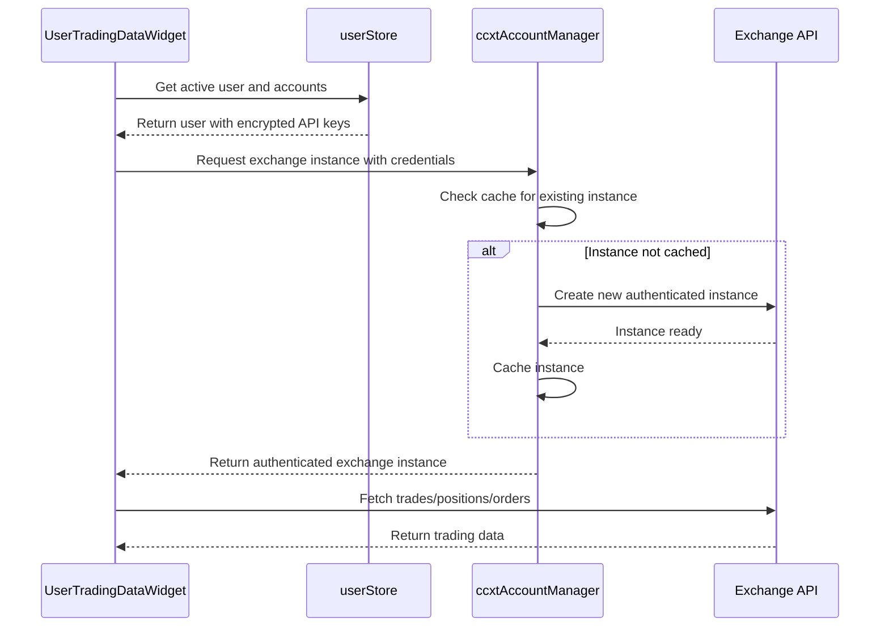
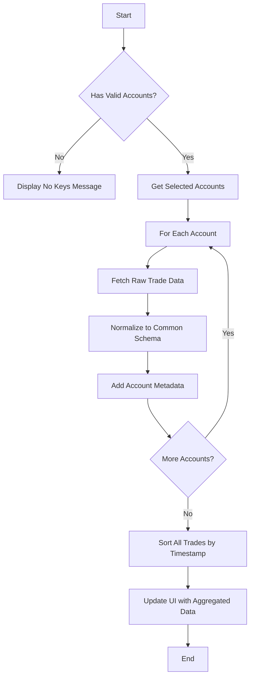
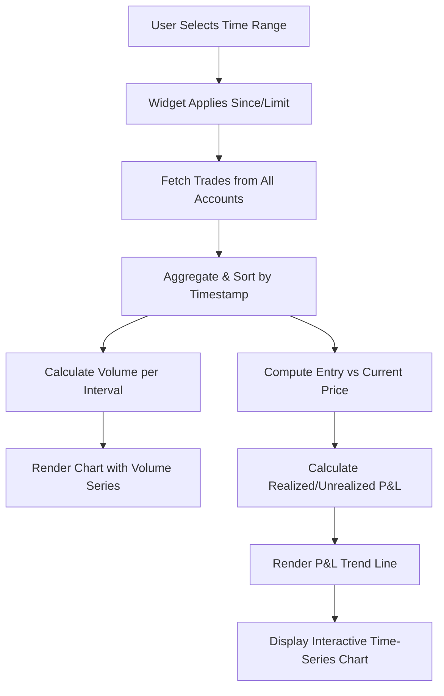
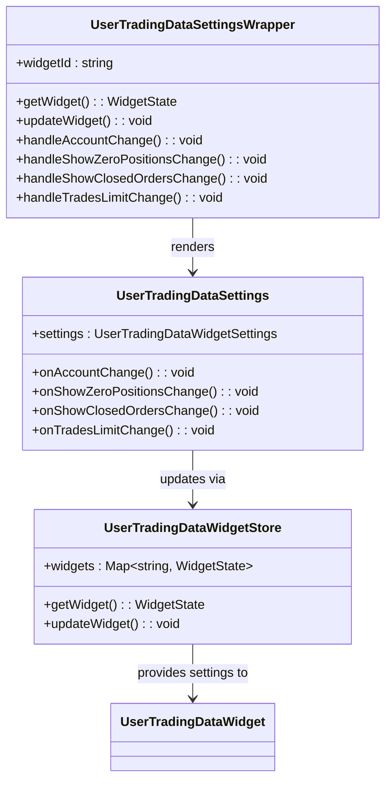
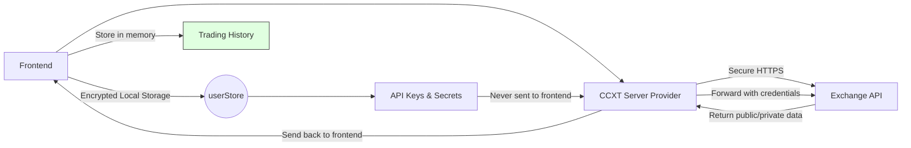

# User Trading Data Widget

<cite>
**Referenced Files in This Document**   
- [UserTradingDataWidget.tsx](file://src/components/widgets/UserTradingDataWidget.tsx)
- [UserTradingDataSettingsWrapper.tsx](file://src/components/widgets/UserTradingDataSettingsWrapper.tsx)
- [UserTradingDataSettings.tsx](file://src/components/widgets/UserTradingDataSettings.tsx)
- [userStore.ts](file://src/store/userStore.ts)
- [userTradingDataWidgetStore.ts](file://src/store/userTradingDataWidgetStore.ts)
- [dataProviderStore.ts](file://src/store/dataProviderStore.ts)
- [dataActions.ts](file://src/store/actions/dataActions.ts)
- [ccxtServerProvider.ts](file://src/store/providers/ccxtServerProvider.ts)
- [ccxtAccountManager.ts](file://src/store/utils/ccxtAccountManager.ts)
</cite>

## Table of Contents
1. [Introduction](#introduction)
2. [Authentication Flow with userStore](#authentication-flow-with-userstore)
3. [Data Aggregation and Normalization](#data-aggregation-and-normalization)
4. [Time-Series Visualization](#time-series-visualization)
5. [Settings Configuration](#settings-configuration)
6. [Privacy and Security](#privacy-and-security)
7. [Behavioral Analysis and Performance Benchmarking](#behavioral-analysis-and-performance-benchmarking)
8. [Conclusion](#conclusion)

## Introduction

The User Trading Data Widget is a comprehensive interface designed to consolidate personal trading activity across multiple cryptocurrency exchanges into a single, unified view. It enables users to monitor their trades, positions, and orders from various exchange accounts through an intuitive tabbed interface. The widget leverages secure authentication mechanisms via the `userStore` to access API keys, aggregates trade data from different sources using standardized schemas, and provides customizable visualizations for trading volume and profit/loss metrics over time. Users can configure settings such as account selection, date ranges, and display preferences through the `UserTradingDataSettingsWrapper`. Additionally, the system emphasizes privacy by handling sensitive information securely and storing data locally when possible.

**Section sources**
- [UserTradingDataWidget.tsx](file://src/components/widgets/UserTradingDataWidget.tsx#L106-L313)

## Authentication Flow with userStore

The User Trading Data Widget authenticates users and establishes connections to exchange accounts through integration with the `userStore`, which manages user identities and associated exchange credentials. When a user selects or activates an account, the widget retrieves the active user's information, including their list of configured exchange accounts. Each account contains encrypted API keys and secrets required for accessing exchange APIs.

During initialization, the widget filters accounts that have valid API keys (`key`) and private keys (`privateKey`). These credentials are used to instantiate CCXT (CryptoCurrency eXchange Trading) clients either directly in the browser or via a secure server proxy, depending on the provider configuration. For enhanced security, especially with CORS-restricted exchanges, the application uses a CCXT Server Provider that runs on a backend Express server. This server handles all authenticated requests, preventing exposure of API keys in client-side code.

The authentication process involves creating exchange-specific instances using the stored credentials. The `ccxtAccountManager` ensures efficient reuse of these instances by caching them based on account and market type, reducing redundant API calls and improving performance. WebSocket subscriptions for real-time updates also use these authenticated instances, ensuring continuous synchronization of trading data without repeated login procedures.

**Diagram sources**
- [userStore.ts](file://src/store/userStore.ts#L43-L51)
- [ccxtAccountManager.ts](file://src/store/utils/ccxtAccountManager.ts#L100-L200)
- [UserTradingDataWidget.tsx](file://src/components/widgets/UserTradingDataWidget.tsx#L106-L313)

**Section sources**
- [userStore.ts](file://src/store/userStore.ts#L43-L51)
- [ccxtAccountManager.ts](file://src/store/utils/ccxtAccountManager.ts#L100-L200)
- [UserTradingDataWidget.tsx](file://src/components/widgets/UserTradingDataWidget.tsx#L106-L313)

## Data Aggregation and Normalization

The User Trading Data Widget normalizes trade formats from different exchanges into a consistent schema by leveraging the CCXT library, which abstracts exchange-specific APIs into a unified interface. When fetching trading data—such as trades, orders, or positions—the widget iterates over all configured accounts with valid API keys and retrieves raw data from each exchange. This data is then transformed into a standardized format before being aggregated and displayed.

Each exchange may represent trade details differently—for example, some include fees in separate fields while others embed them within transaction metadata. The widget applies normalization logic during the transformation phase, ensuring that all trades conform to a common structure with properties like `id`, `timestamp`, `symbol`, `side`, `amount`, `price`, `cost`, and `fee`. Similarly, order and position data are mapped to uniform schemas regardless of source exchange.

Aggregation occurs after normalization. The widget collects data from all selected accounts (either individually or collectively if "all" is chosen), combines it into a single dataset, and sorts entries chronologically. This allows users to view a consolidated history of their trading activity across platforms without needing to switch between interfaces.

Error resilience is built into the aggregation pipeline: if one account fails to respond due to network issues or invalid credentials, the widget continues processing data from other accounts rather than failing entirely. This fault-tolerant design ensures maximum data availability even under partial connectivity conditions.

**Diagram sources**
- [dataActions.ts](file://src/store/actions/dataActions.ts#L900-L950)
- [UserTradesTab.tsx](file://src/components/widgets/UserTradesTab.tsx#L50-L100)
- [UserTradingDataWidget.tsx](file://src/components/widgets/UserTradingDataWidget.tsx#L106-L313)

**Section sources**
- [dataActions.ts](file://src/store/actions/dataActions.ts#L900-L950)
- [UserTradesTab.tsx](file://src/components/widgets/UserTradesTab.tsx#L50-L100)

## Time-Series Visualization

The User Trading Data Widget visualizes trading volume and profit/loss (P&L) metrics over customizable periods using time-series charts rendered within its tabbed interface. While the widget itself does not render charts directly, it integrates with underlying data systems that support historical and real-time visualization components.

Trading volume is derived from aggregated trade data fetched via the `fetchMyTrades` method, which retrieves executed transactions across supported exchanges. Each trade includes timestamped price and amount information, enabling calculation of volume per timeframe (e.g., hourly, daily). These values are plotted on line or bar charts to show trends over time.

Profit and loss calculations are inferred from position and trade data. Unrealized P&L is computed based on current mark prices versus entry prices for open positions, while realized P&L comes from closed trades. The `UserPositionsTab` displays unrealized P&L with color-coded indicators (green for gains, red for losses), providing immediate visual feedback on portfolio performance.

Users can customize the visualization period through settings that influence data retrieval parameters such as `since` (start timestamp) and `limit` (maximum number of records). Although the current implementation focuses on recent trades (default limit: 100), future enhancements could allow selection of specific date ranges for deeper historical analysis.

Virtualized rendering is employed for large datasets to maintain smooth scrolling performance. Instead of loading all records at once, the widget uses React Virtualizer to render only visible rows, significantly improving responsiveness even with thousands of trades.

**Diagram sources**
- [UserTradesTab.tsx](file://src/components/widgets/UserTradesTab.tsx#L150-L200)
- [UserPositionsTab.tsx](file://src/components/widgets/UserPositionsTab.tsx#L150-L200)
- [dataActions.ts](file://src/store/actions/dataActions.ts#L900-L950)

**Section sources**
- [UserTradesTab.tsx](file://src/components/widgets/UserTradesTab.tsx#L150-L200)
- [UserPositionsTab.tsx](file://src/components/widgets/UserPositionsTab.tsx#L150-L200)

## Settings Configuration

The User Trading Data Widget allows users to customize their experience through the `UserTradingDataSettingsWrapper`, which controls key aspects such as account selection, display options, and data limits. The settings are persisted using Zustand’s `persist` middleware, ensuring preferences survive page reloads.

Account selection is managed via a dropdown menu that lists all exchange accounts with valid API keys. Users can choose to view data from a single account or aggregate results from all connected accounts ("All Accounts"). This setting determines which accounts contribute to the trade, position, and order feeds displayed in the respective tabs.

Display options include toggles for showing zero-value positions and closed/canceled orders. By default, positions with zero size are hidden to reduce clutter, but advanced users can enable this option for auditing purposes. Similarly, the "Show Closed Orders" toggle allows inspection of historical order states beyond just active ones.

Data limits control how many trades are retrieved per request, adjustable between 10 and 1000. This impacts both performance and detail level—higher limits provide more context but increase load times. The value is passed to the `fetchMyTrades` function as the `limit` parameter.

Settings changes are handled through callback functions passed from the wrapper component to the settings UI. For example, changing the selected account triggers `onAccountChange`, which updates the widget state in `useUserTradingDataWidgetStore`.

**Diagram sources**
- [UserTradingDataSettingsWrapper.tsx](file://src/components/widgets/UserTradingDataSettingsWrapper.tsx#L8-L43)
- [UserTradingDataSettings.tsx](file://src/components/widgets/UserTradingDataSettings.tsx#L10-L50)
- [userTradingDataWidgetStore.ts](file://src/store/userTradingDataWidgetStore.ts#L18-L23)

**Section sources**
- [UserTradingDataSettingsWrapper.tsx](file://src/components/widgets/UserTradingDataSettingsWrapper.tsx#L8-L43)
- [UserTradingDataSettings.tsx](file://src/components/widgets/UserTradingDataSettings.tsx#L10-L50)

## Privacy and Security

The User Trading Data Widget prioritizes user privacy and security by implementing local data storage, encryption of sensitive information, and secure communication patterns. All user credentials—including API keys and secret keys—are stored locally using Zustand’s persistence layer with optional encryption, ensuring they never leave the user’s device unless explicitly transmitted through secure channels.

When interacting with exchanges that enforce CORS policies, the widget routes requests through a dedicated CCXT Server Provider hosted on a trusted backend. This server acts as a reverse proxy, accepting authenticated WebSocket and REST requests from the frontend and forwarding them to exchange APIs using the user’s credentials. Since API keys are only ever handled server-side in this mode, there is no risk of client-side exposure.

Local data aggregation ensures that trading history remains on the user’s machine. Even when using the server provider, response data is processed and stored within the browser’s memory or IndexedDB, minimizing external dependencies. Sensitive operations like fetching balances or placing orders require explicit user action and are logged internally for auditability.

Additionally, the system employs request logging utilities to monitor API interactions without exposing secrets. Logs capture metadata such as endpoint URLs and response codes but exclude authentication tokens and payload contents. This balance enables debugging while preserving confidentiality.

**Diagram sources**
- [userStore.ts](file://src/store/userStore.ts#L29-L32)
- [ccxtServerProvider.ts](file://src/store/providers/ccxtServerProvider.ts#L100-L150)
- [dataProviderStore.ts](file://src/store/dataProviderStore.ts#L50-L100)

**Section sources**
- [userStore.ts](file://src/store/userStore.ts#L29-L32)
- [ccxtServerProvider.ts](file://src/store/providers/ccxtServerProvider.ts#L100-L150)

## Behavioral Analysis and Performance Benchmarking

The User Trading Data Widget supports behavioral analysis, fee optimization, and performance benchmarking by providing a comprehensive view of historical trading activity across multiple exchanges. With full access to trade execution data—including timestamps, prices, amounts, fees, and symbols—users can analyze patterns in their trading behavior over time.

For **behavioral analysis**, the widget enables identification of frequent trading intervals, preferred assets, and order types (market vs limit). By visualizing trade frequency over time, users can detect emotional trading spikes or periods of inactivity. Filtering capabilities allow segmentation by exchange, account, or symbol, facilitating comparative studies of strategy effectiveness.

**Fee optimization** is achieved by aggregating fee data across all trades. Since each trade record includes a `fee` object with cost and currency, users can calculate total fees paid per exchange or asset class. This insight helps identify high-cost platforms or trading pairs, prompting migration to lower-fee alternatives. Over time, users can measure the impact of switching exchanges or adjusting order types on overall costs.

**Performance benchmarking** against market indices is supported through side-by-side comparison of portfolio returns with relevant benchmarks (e.g., BTC/USDT price movements). While the current implementation does not include direct index tracking, the normalized trade and position data can be exported or analyzed externally to compute alpha, beta, Sharpe ratio, and other metrics. Future extensions could integrate market index data feeds for real-time benchmarking within the widget.

These analytical capabilities empower traders to refine strategies, reduce costs, and evaluate performance objectively, transforming raw trade logs into actionable insights.

**Section sources**
- [UserTradesTab.tsx](file://src/components/widgets/UserTradesTab.tsx#L200-L250)
- [dataActions.ts](file://src/store/actions/dataActions.ts#L900-L950)

## Conclusion

The User Trading Data Widget successfully consolidates multi-exchange trading activity into a unified, secure, and customizable interface. By integrating with the `userStore` for authentication, it securely accesses API keys to connect to exchange accounts while protecting sensitive credentials through local storage and server-side proxies. The data aggregation pipeline normalizes heterogeneous trade formats into a consistent schema, enabling seamless consolidation of trades, positions, and orders across platforms.

Time-series visualizations of trading volume and P&L metrics provide valuable insights into performance trends, enhanced by virtualized rendering for optimal responsiveness. The `UserTradingDataSettingsWrapper` offers granular control over account selection, display preferences, and data limits, tailoring the experience to individual needs.

Privacy is maintained through encrypted local storage and secure request routing via the CCXT Server Provider, ensuring API keys remain protected. Finally, the rich dataset exposed by the widget enables advanced use cases such as behavioral analysis, fee optimization, and performance benchmarking, empowering users to make informed decisions based on comprehensive trading history.

Future improvements could expand configurability with custom date ranges, export functionality, and integrated market index comparisons, further enhancing its utility as a central hub for cross-platform trading analytics.