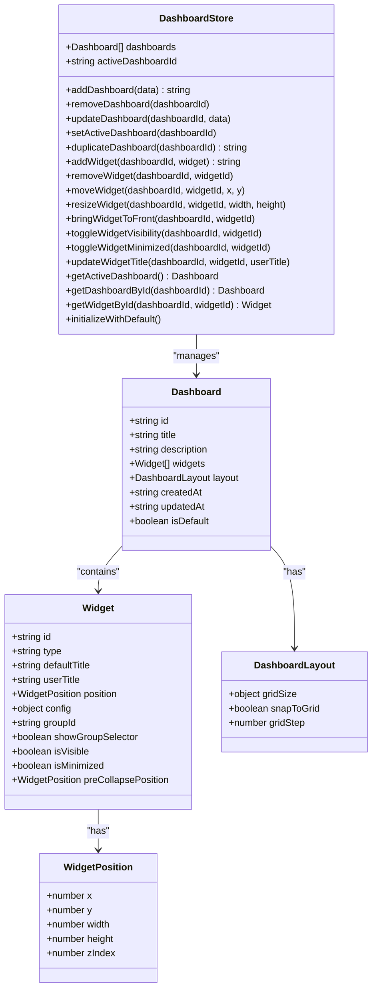
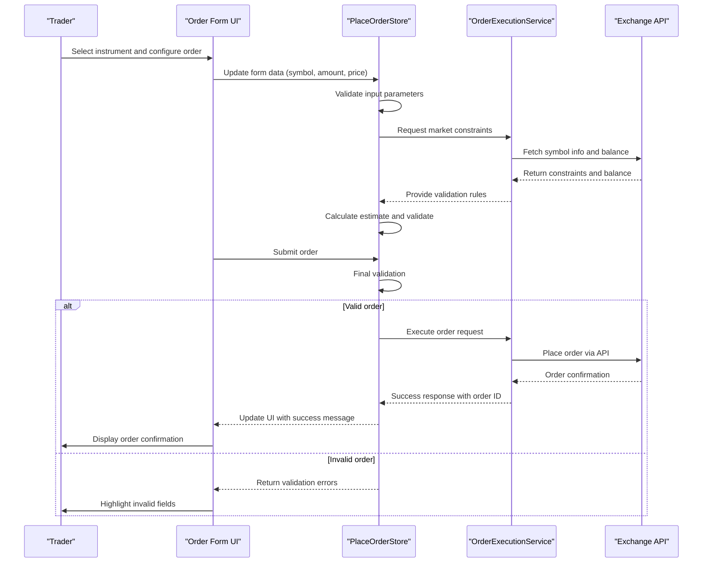
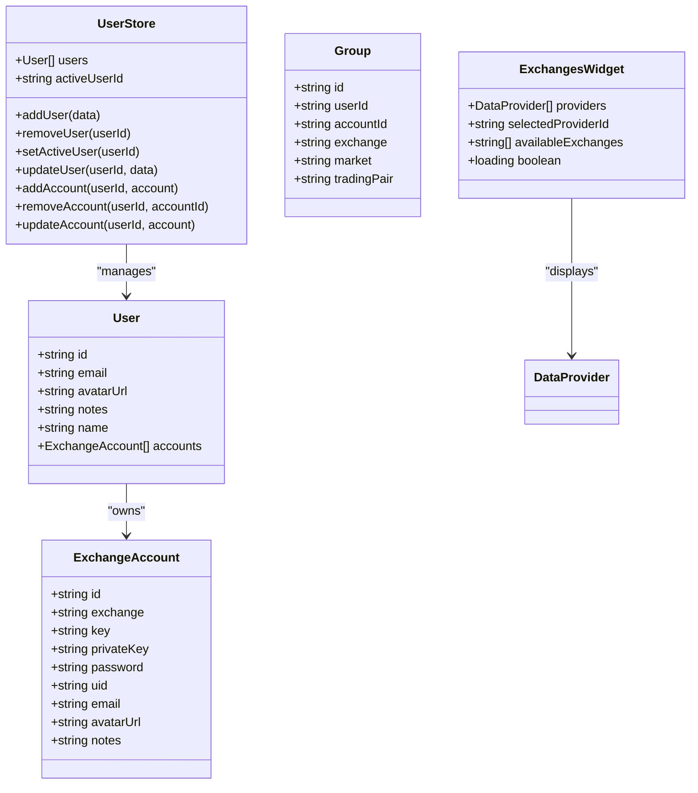
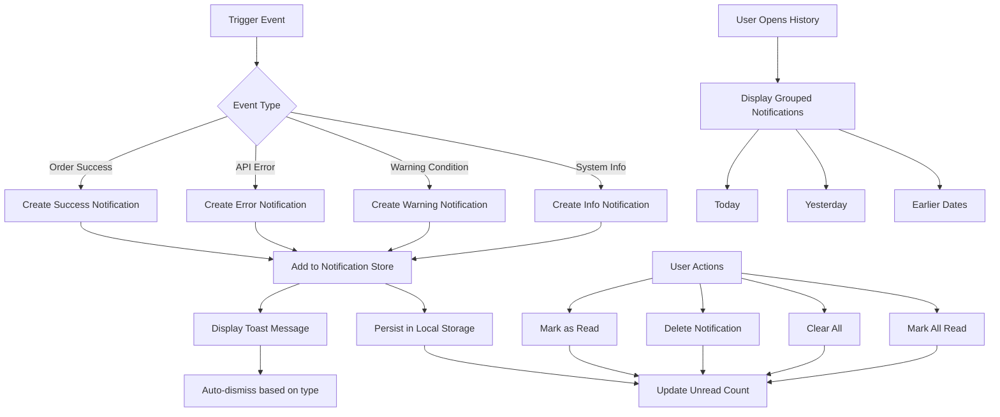
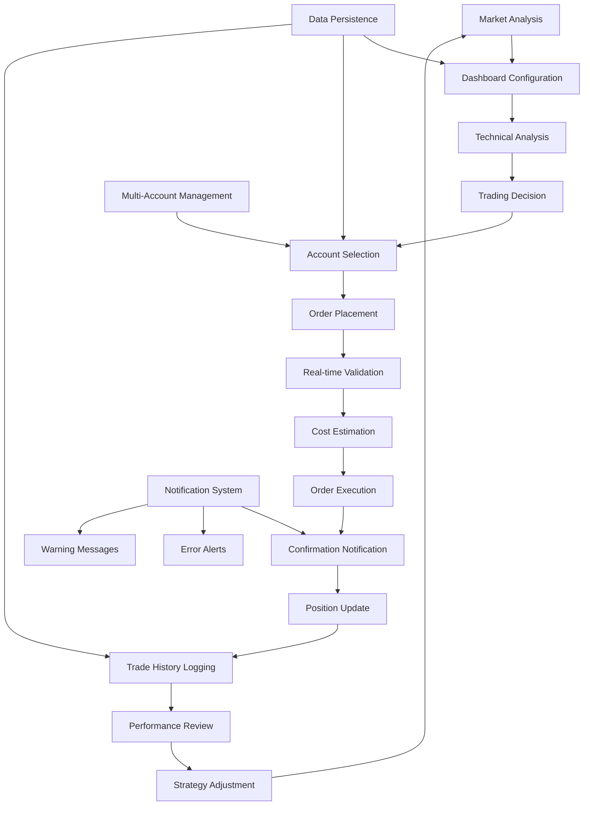

# Core Features

<cite>
**Referenced Files in This Document**   
- [dashboardStore.ts](file://src/store/dashboardStore.ts)
- [placeOrderStore.ts](file://src/store/placeOrderStore.ts)
- [notificationStore.ts](file://src/store/notificationStore.ts)
- [userStore.ts](file://src/store/userStore.ts)
- [OrderForm.tsx](file://src/components/widgets/OrderForm.tsx)
- [UserBalancesWidget.tsx](file://src/components/widgets/UserBalancesWidget.tsx)
- [TradesWidget.tsx](file://src/components/widgets/TradesWidget.tsx)
- [NotificationHistory.tsx](file://src/components/NotificationHistory.tsx)
- [ExchangesWidget.tsx](file://src/components/ExchangesWidget.tsx)
</cite>

## Table of Contents
1. [Dashboard Management System](#dashboard-management-system)
2. [Trading Functionality](#trading-functionality)
3. [Multi-Account Management](#multi-account-management)
4. [Notification System](#notification-system)
5. [Integrated Trading Workflow](#integrated-trading-workflow)

## Dashboard Management System

The profitmaker trading terminal provides a comprehensive dashboard management system that enables users to create, customize, and persist widget layouts across sessions. The system is built around the `useDashboardStore` which manages multiple dashboards, each containing various widgets positioned in a flexible grid layout.

Users can create new dashboards with custom titles and descriptions, or duplicate existing ones as templates for different trading strategies. Each dashboard supports an unlimited number of widgets that can be freely positioned and resized according to user preferences. The system automatically handles z-index management to ensure proper layering when widgets overlap, bringing selected widgets to the front when interacted with.

Widgets can be minimized to a compact form that displays only essential information, allowing users to declutter their workspace while maintaining access to critical data. When minimized, widgets are automatically arranged in a collapsible zone at the bottom of the screen. Users can also toggle widget visibility to hide less frequently used components without removing them from the layout entirely.

All dashboard configurations are persisted in localStorage with validation through Zod schemas, ensuring data integrity across sessions. The system initializes with a default dashboard if none exists, providing immediate functionality upon first use. Dashboard state includes creation and update timestamps, enabling version tracking and synchronization capabilities.

**Diagram sources**
- [dashboardStore.ts](file://src/store/dashboardStore.ts#L91-L115)
- [dashboardStore.ts](file://src/store/dashboardStore.ts#L117-L444)

**Section sources**
- [dashboardStore.ts](file://src/store/dashboardStore.ts#L91-L444)

## Trading Functionality

The trading functionality in the profitmaker terminal centers around order placement, position monitoring, and trade history viewing through specialized widgets and state management systems. The Order Form widget serves as the primary interface for executing trades, supporting market, limit, and stop-loss order types with real-time validation and cost estimation.

When placing orders, the system performs comprehensive validation against exchange-specific constraints including minimum/maximum quantities, price steps, and available balances. Before execution, it calculates estimated costs and commission fees, providing users with transparent pricing information. The order form includes advanced options such as stop-loss and take-profit configurations, allowing for sophisticated risk management strategies.

Position monitoring is facilitated through dedicated widgets that display current open positions, unrealized profits/losses, and position sizing. These components connect to real-time data streams from connected exchanges, updating position values as market conditions change. Users can view both individual position details and aggregated portfolio exposure across multiple accounts and exchanges.

Trade history viewing is implemented through the TradesWidget component, which retrieves and displays executed orders with filtering and sorting capabilities. The widget shows essential details including order ID, symbol, side, type, price, amount, status, and timestamp. Historical trades can be exported or analyzed within the terminal interface, supporting performance review and tax reporting requirements.

**Diagram sources**
- [placeOrderStore.ts](file://src/store/placeOrderStore.ts#L35-L63)
- [placeOrderStore.ts](file://src/store/placeOrderStore.ts#L110-L411)
- [OrderForm.tsx](file://src/components/widgets/OrderForm.tsx#L10-L532)

**Section sources**
- [placeOrderStore.ts](file://src/store/placeOrderStore.ts#L35-L411)
- [OrderForm.tsx](file://src/components/widgets/OrderForm.tsx#L10-L532)

## Multi-Account Management

The profitmaker terminal supports multi-account management through a hierarchical system that allows users to connect and switch between multiple exchange accounts seamlessly. The core of this functionality is the `useUserStore` which maintains user profiles containing collections of exchange accounts with their respective API credentials.

Users can add multiple accounts from different exchanges such as Binance, Bybit, OKX, and others, storing encrypted API keys and secrets securely. Each account is identified by a unique ID and associated with specific exchange parameters including sandbox/live mode settings. The system supports both trading and funding wallets for exchanges that differentiate between these account types.

Account switching is implemented through the group selection mechanism, where users can quickly change their active trading context by selecting different account-exchange-market combinations. This enables traders to manage positions and execute orders across multiple brokers from a single unified interface. The currently selected group determines which account's balance and positions are displayed in relevant widgets.

Security is prioritized through client-side storage of credentials and optional token-based authentication for server-side operations. Users can view all connected accounts in the ExchangesWidget, which provides detailed information about each provider including connection status, priority, and scope of accessible exchanges. Account management operations include adding, removing, and updating account details with proper validation to prevent configuration errors.

**Diagram sources**
- [userStore.ts](file://src/store/userStore.ts#L29-L51)
- [userStore.ts](file://src/store/userStore.ts#L53-L142)
- [ExchangesWidget.tsx](file://src/components/ExchangesWidget.tsx#L6-L190)

**Section sources**
- [userStore.ts](file://src/store/userStore.ts#L29-L142)
- [ExchangesWidget.tsx](file://src/components/ExchangesWidget.tsx#L6-L190)

## Notification System

The notification system in the profitmaker terminal provides both real-time alerts and historical logging to keep users informed about critical events in their trading activities. Implemented through the `useNotificationStore`, this system supports four notification types—success, error, warning, and info—each with distinct visual styling and persistence options.

Real-time alerts appear as toast notifications in the interface corner, automatically dismissing after a timeout unless marked as persistent. Success notifications confirm order executions and connection establishments, while error notifications highlight failed operations such as rejected orders or authentication issues. Warning notifications indicate potential risks like margin calls or low balances, and info notifications provide general system updates.

All notifications are logged in a persistent history that users can access through the Notification History drawer. The history interface groups notifications by date (Today, Yesterday, or specific dates) and supports marking individual or all notifications as read, deleting notifications, and clearing the entire history. Unread notifications are indicated by a badge counter on the notification bell icon.

The system limits stored notifications to 100 entries to prevent excessive memory usage, implementing a FIFO (first-in, first-out) removal policy when the limit is exceeded. Notifications include timestamps and can contain both a title and optional detailed message content. Developers can trigger notifications programmatically using helper methods like `showSuccess()`, `showError()`, `showWarning()`, and `showInfo()` with options for persistence.

**Diagram sources**
- [notificationStore.ts](file://src/store/notificationStore.ts#L17-L36)
- [notificationStore.ts](file://src/store/notificationStore.ts#L43-L205)
- [NotificationHistory.tsx](file://src/components/NotificationHistory.tsx#L137-L276)

**Section sources**
- [notificationStore.ts](file://src/store/notificationStore.ts#L17-L205)
- [NotificationHistory.tsx](file://src/components/NotificationHistory.tsx#L137-L276)

## Integrated Trading Workflow

The profitmaker trading terminal integrates its core features into a seamless workflow that guides users from market analysis to execution and portfolio review. This integrated approach begins with the dashboard system, where traders can arrange analytical widgets like charts, order books, and market depth indicators to conduct technical analysis.

Once a trading opportunity is identified, users select the appropriate exchange account through the group selector, which synchronizes the Order Form widget with the chosen account's balance and market specifications. The system automatically fetches exchange constraints such as minimum order sizes and price precision, ensuring compliance with exchange rules before submission.

During order placement, real-time validation prevents common errors like insufficient funds or invalid price formats, while cost estimates provide transparency about execution expenses. Upon successful submission, the system triggers a success notification and updates position monitoring widgets to reflect the new trade, creating an immediate feedback loop.

Post-execution, users can review their trading activity through the trade history widget, analyze performance metrics, and adjust their strategy accordingly. The notification history provides an audit trail of all system events, while portfolio summary widgets aggregate positions across multiple accounts for comprehensive performance evaluation.

This end-to-end workflow is supported by persistent state management, ensuring that customized dashboards, account configurations, and trading preferences are maintained across sessions. The integration of real-time data, secure account management, and comprehensive analytics creates a professional-grade trading environment suitable for both novice and experienced traders.

**Diagram sources**
- [dashboardStore.ts](file://src/store/dashboardStore.ts#L91-L444)
- [placeOrderStore.ts](file://src/store/placeOrderStore.ts#L35-L411)
- [userStore.ts](file://src/store/userStore.ts#L29-L142)
- [notificationStore.ts](file://src/store/notificationStore.ts#L17-L205)

**Section sources**
- [dashboardStore.ts](file://src/store/dashboardStore.ts#L91-L444)
- [placeOrderStore.ts](file://src/store/placeOrderStore.ts#L35-L411)
- [userStore.ts](file://src/store/userStore.ts#L29-L142)
- [notificationStore.ts](file://src/store/notificationStore.ts#L17-L205)