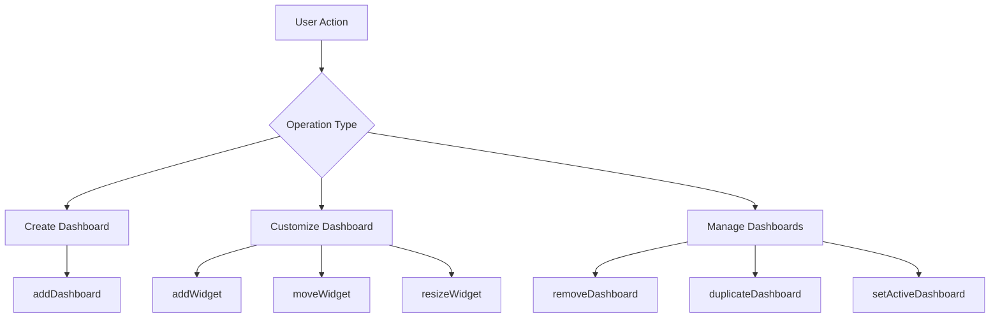
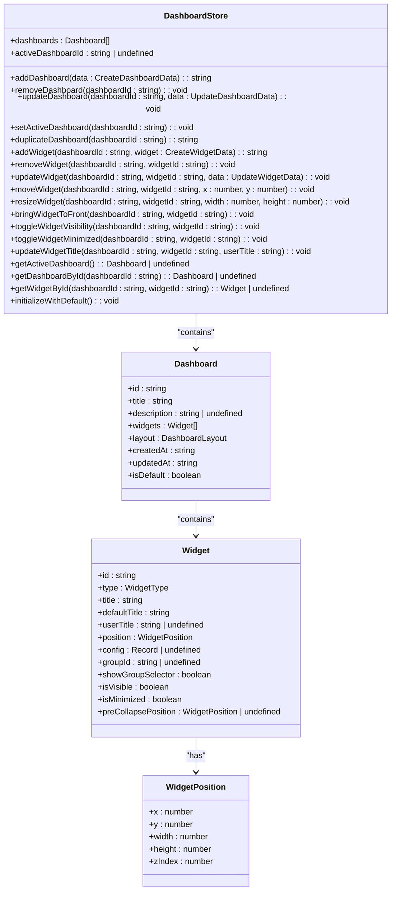
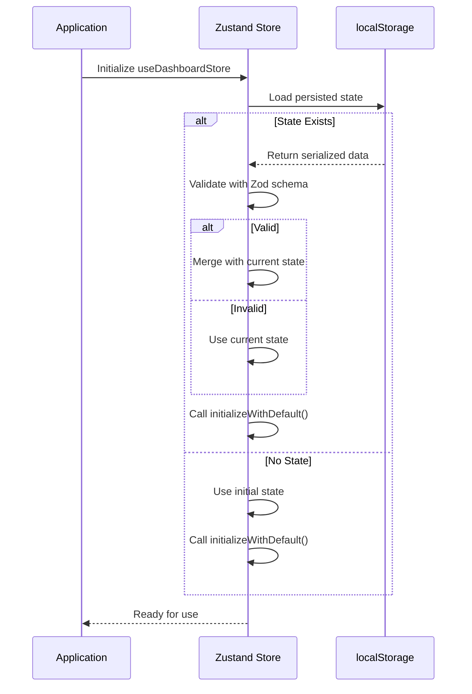
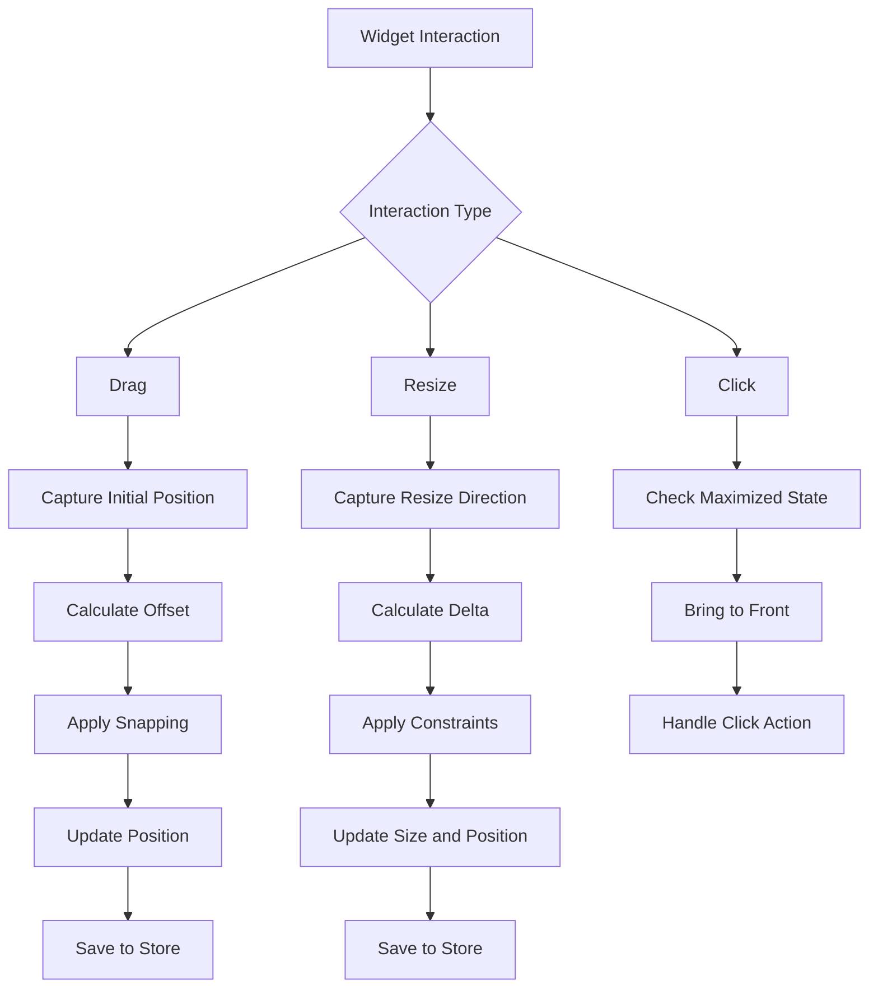

# Dashboard Management

<cite>
**Referenced Files in This Document **  
- [dashboardStore.ts](file://src/store/dashboardStore.ts)
- [WidgetSimple.tsx](file://src/components/WidgetSimple.tsx)
- [useWidgetDrag.tsx](file://src/hooks/useWidgetDrag.tsx)
- [WidgetContext.tsx](file://src/context/WidgetContext.tsx)
- [dashboard.ts](file://src/types/dashboard.ts)
</cite>

## Table of Contents
1. [Introduction](#introduction)
2. [Dashboard Creation and Customization](#dashboard-creation-and-customization)
3. [Zustand Store Architecture](#zustand-store-architecture)
4. [Widget Context Provider](#widget-context-provider)
5. [Dashboard Serialization and Rehydration](#dashboard-serialization-and-rehydration)
6. [Responsive Layout Handling](#responsive-layout-handling)
7. [Widget Operations](#widget-operations)
8. [Integration with Theme and User Preferences](#integration-with-theme-and-user-preferences)
9. [Common Issues and Troubleshooting](#common-issues-and-troubleshooting)
10. [Performance Optimization](#performance-optimization)

## Introduction
The ProfitMaker trading terminal features a dynamic dashboard management system that enables users to create, customize, and persist widget-based dashboards through an intuitive drag-and-drop interface. This document details the underlying architecture, implementation patterns, and user interaction flows that power this functionality.

**Section sources**
- [dashboardStore.ts](file://src/store/dashboardStore.ts#L0-L444)
- [WidgetSimple.tsx](file://src/components/WidgetSimple.tsx#L0-L632)

## Dashboard Creation and Customization
Users can create new dashboards using the `addDashboard` method, which generates a unique identifier and initializes the dashboard with creation metadata. The system supports multiple dashboards that can be activated, duplicated, or removed through dedicated store actions.

Dashboards are customized by adding widgets of various types including charts, portfolio views, order forms, and transaction histories. Each widget is positioned absolutely within the viewport and can be manipulated through drag-and-drop interactions. The default dashboard includes a predefined layout with four core widgets: Balance, Place Order, Chart, and Transaction History.

**Diagram sources**
- [dashboardStore.ts](file://src/store/dashboardStore.ts#L117-L444)

**Section sources**
- [dashboardStore.ts](file://src/store/dashboardStore.ts#L117-L162)
- [WidgetSimple.tsx](file://src/components/WidgetSimple.tsx#L274-L286)

## Zustand Store Architecture
The dashboard state is managed using Zustand with Immer middleware for immutable updates and persistence via localStorage. The `useDashboardStore` hook provides a comprehensive API for dashboard and widget operations.

The store maintains a collection of dashboards and tracks the active dashboard ID. Each dashboard contains an array of widgets with their configuration, position, size, and visibility state. The store implements several key patterns:

- **Immutability**: State updates are handled through Immer's produce function
- **Persistence**: State is automatically saved to and restored from localStorage
- **Validation**: Zod schema validates persisted state on rehydration
- **Initialization**: Default dashboard is created if none exists

**Diagram sources**
- [dashboardStore.ts](file://src/store/dashboardStore.ts#L117-L444)
- [dashboard.ts](file://src/types/dashboard.ts#L0-L69)

**Section sources**
- [dashboardStore.ts](file://src/store/dashboardStore.ts#L117-L444)
- [dashboard.ts](file://src/types/dashboard.ts#L0-L69)

## Widget Context Provider
The `WidgetContext` provider enables cross-component communication for widget operations, managing widget groups, colors, and activation states. It uses React's Context API to expose a comprehensive set of functions for widget manipulation.

The context maintains state for:
- Active widget groups and their colors
- Widget positioning and sizing
- Z-index management for layering
- Group-based organization of widgets

When a widget is added, it receives default dimensions based on its type and is positioned with an offset to ensure visibility. The context also handles toast notifications for user feedback during widget operations.

**Section sources**
- [WidgetContext.tsx](file://src/context/WidgetContext.tsx#L0-L447)

## Dashboard Serialization and Rehydration
Dashboard state persistence is implemented using Zustand's persist middleware, which automatically serializes the store state to localStorage and rehydrates it on application startup.

The serialization process includes:
- **Partialization**: Only essential state (dashboards and activeDashboardId) is persisted
- **Validation**: Zod schema validates the persisted state structure
- **Error Recovery**: Invalid persisted state is discarded and replaced with current state
- **Initialization**: Default dashboard is created if no dashboards exist after rehydration

The `onRehydrateStorage` callback ensures the `initializeWithDefault` method is called after state rehydration, guaranteeing at least one dashboard is available.

**Diagram sources**
- [dashboardStore.ts](file://src/store/dashboardStore.ts#L406-L444)

**Section sources**
- [dashboardStore.ts](file://src/store/dashboardStore.ts#L406-L444)

## Responsive Layout Handling
The dashboard system implements responsive layout handling to adapt to different screen sizes and viewport changes. Widgets are positioned absolutely within the viewport and include bounds checking to prevent overflow.

Key responsive features include:
- **Viewport Constraints**: Widgets cannot be dragged outside visible area
- **Header Offset**: Positioning accounts for header height (80px)
- **Dynamic Positioning**: New widgets are centered with incremental offsets
- **Collapsed Widget Placement**: Minimized widgets are positioned at bottom center

The system uses window.innerWidth and window.innerHeight to calculate positions relative to the current viewport dimensions, ensuring widgets remain accessible across different device sizes.

**Section sources**
- [WidgetSimple.tsx](file://src/components/WidgetSimple.tsx#L237-L272)
- [dashboardStore.ts](file://src/store/dashboardStore.ts#L333-L361)

## Widget Operations
The dashboard supports comprehensive widget operations through both direct store methods and UI interactions:

### Adding Widgets
Widgets are added using the `addWidget` method, which:
- Generates a unique ID
- Assigns proper z-index (higher than existing widgets)
- Preserves configuration data
- Updates dashboard timestamp

### Moving Widgets
Widget movement is handled through drag interactions:
- Drag start captures initial position and mouse offset
- During drag, position is updated with snapping logic
- Snap targets include viewport edges and other widget boundaries
- Alt key temporarily disables snapping
- Final position is saved to store on drag end

### Resizing Widgets
Widgets can be resized from eight directions (corners and edges):
- Resize handles trigger appropriate resize direction
- Minimum dimensions enforced (200x150)
- Snapping applies to resize operations
- Aspect ratio maintained during corner resizing
- Final size and position saved to store

### Visibility and Layering
- **Visibility**: Toggled via `toggleWidgetVisibility`
- **Layering**: `bringWidgetToFront` sets z-index above all others
- **Maximization**: Temporarily expands widget to full screen
- **Minimization**: Collapses widget to header bar at bottom

**Diagram sources**
- [WidgetSimple.tsx](file://src/components/WidgetSimple.tsx#L237-L286)
- [useWidgetDrag.tsx](file://src/hooks/useWidgetDrag.tsx#L0-L262)

**Section sources**
- [WidgetSimple.tsx](file://src/components/WidgetSimple.tsx#L237-L286)
- [useWidgetDrag.tsx](file://src/hooks/useWidgetDrag.tsx#L0-L262)

## Integration with Theme and User Preferences
The dashboard system integrates with theme management through CSS variables and class names that respect the terminal's dark mode styling. Widget headers use transparent backgrounds for the default group, while colored groups apply semi-transparent accent colors.

User preferences are preserved through:
- **Widget Titles**: Custom titles stored in userTitle field
- **Widget Positions**: Persisted in dashboard layout
- **Group Associations**: Widgets maintain group assignments
- **Collapsed States**: Minimized widgets retain pre-collapse positions

The system respects user choices by not automatically assigning trading pairs when groups change, preserving explicit user selections made through the search interface.

**Section sources**
- [WidgetSimple.tsx](file://src/components/WidgetSimple.tsx#L500-L550)
- [WidgetContext.tsx](file://src/context/WidgetContext.tsx#L23-L40)

## Common Issues and Troubleshooting
### Layout Corruption
Potential causes and solutions:
- **Invalid Persisted State**: Caused by schema changes; resolved by validation and fallback
- **Missing Dashboard**: Handled by `initializeWithDefault` on rehydration
- **Widget Overlap**: Mitigated by z-index management and bring-to-front functionality

### Performance Bottlenecks
With many widgets, performance issues may arise from:
- **Excessive Re-renders**: Solved by proper memoization and state scoping
- **Event Listener Accumulation**: Addressed by cleanup in useEffect return
- **Complex Snapping Calculations**: Optimized by limiting snap distance (8px threshold)

### Cross-Browser Compatibility
The system maintains compatibility through:
- **Standard DOM Events**: Using mouse events instead of pointer events
- **CSS Positioning**: Absolute positioning with pixel values
- **Feature Detection**: Graceful degradation for older browsers
- **Vendor Prefixes**: Applied through Tailwind CSS

**Section sources**
- [dashboardStore.ts](file://src/store/dashboardStore.ts#L406-L444)
- [WidgetSimple.tsx](file://src/components/WidgetSimple.tsx#L237-L272)

## Performance Optimization
To optimize rendering with large numbers of concurrent widgets:

### Virtualization
Consider implementing virtual scrolling for widget containers when exceeding 20+ widgets, rendering only visible components.

### Memoization
Use React.memo for widget components and useMemo for expensive calculations like snapping points.

### Event Delegation
Implement centralized event handling to reduce the number of active listeners.

### Batch Updates
Group multiple widget operations into single store updates when possible.

### Resource Management
- Unsubscribe from data streams when widgets are hidden
- Release memory-intensive resources when minimized
- Implement lazy loading for complex widgets

### Rendering Strategies
- Use CSS transforms for smooth dragging animations
- Debounce rapid position updates during drag
- Implement shouldComponentUpdate logic for heavy widgets
- Consider Web Workers for intensive calculations

**Section sources**
- [WidgetSimple.tsx](file://src/components/WidgetSimple.tsx#L237-L286)
- [dashboardStore.ts](file://src/store/dashboardStore.ts#L209-L239)