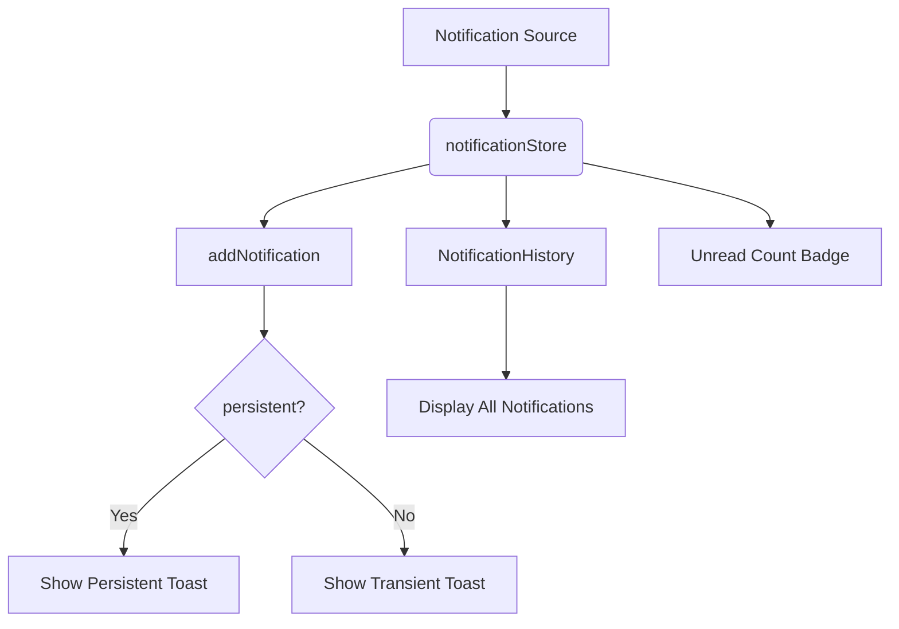
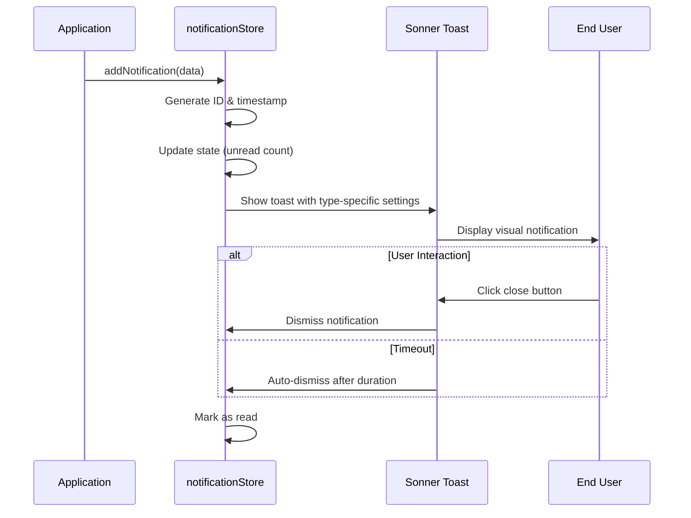
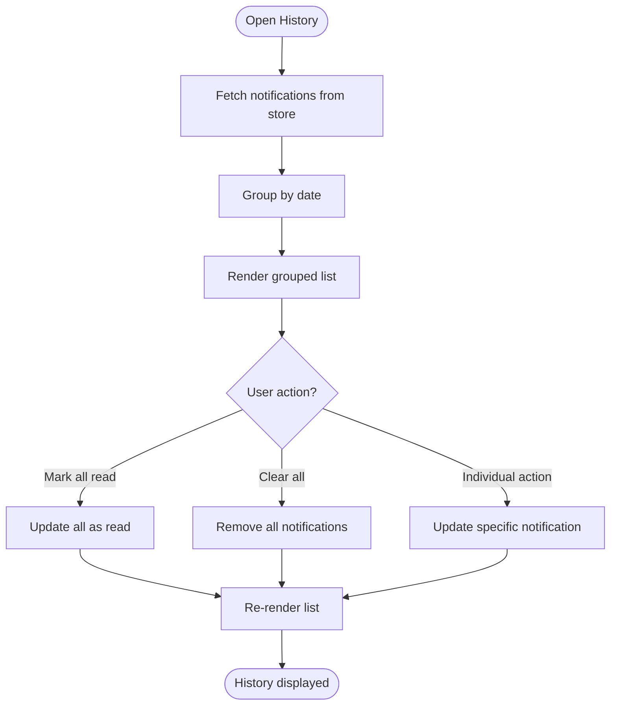
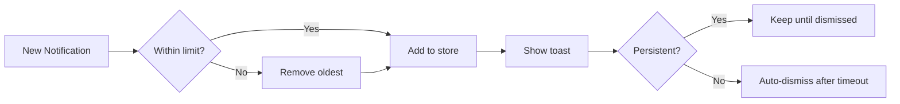

# Notification System

<cite>
**Referenced Files in This Document**   
- [notificationStore.ts](file://src/store/notificationStore.ts)
- [NotificationHistory.tsx](file://src/components/NotificationHistory.tsx)
- [sonner.tsx](file://src/components/ui/sonner.tsx)
- [toaster.tsx](file://src/components/ui/toaster.tsx)
- [use-toast.ts](file://src/hooks/use-toast.ts)
</cite>

## Table of Contents
1. [Introduction](#introduction)
2. [Core Architecture](#core-architecture)
3. [Data Model](#data-model)
4. [Real-time Toast Notifications](#real-time-toast-notifications)
5. [Notification History Management](#notification-history-management)
6. [Event Types and Sources](#event-types-and-sources)
7. [Developer Integration Guide](#developer-integration-guide)
8. [Accessibility Features](#accessibility-features)
9. [Performance Considerations](#performance-considerations)

## Introduction
The notification system in the ProfitMaker trading terminal provides real-time feedback to users through transient toast notifications and maintains a persistent history of all events. The system handles various event types including trade executions, order status changes, price alerts, and system warnings. Built on Sonner and Radix UI components, it offers customizable transient feedback with comprehensive historical tracking accessible via the NotificationHistory component.

## Core Architecture
The notification system follows a centralized store pattern using Zustand for state management, with persistence enabled through localStorage. The architecture separates concerns between transient UI feedback (toasts) and persistent data storage (notification store).



**Diagram sources**
- [notificationStore.ts](file://src/store/notificationStore.ts#L43-L205)
- [NotificationHistory.tsx](file://src/components/NotificationHistory.tsx#L137-L276)

**Section sources**
- [notificationStore.ts](file://src/store/notificationStore.ts#L0-L205)
- [NotificationHistory.tsx](file://src/components/NotificationHistory.tsx#L0-L278)

## Data Model
The notification system uses a structured data model to represent all notification events with consistent metadata for filtering, sorting, and display purposes.

### Notification Interface
```typescript
interface Notification {
  id: string;
  type: 'success' | 'error' | 'warning' | 'info';
  title: string;
  message?: string;
  timestamp: number;
  read: boolean;
  persistent?: boolean;
}
```

### Store State
The notification store maintains three key state variables:
- `notifications`: Array of all stored notifications (max 100)
- `unreadCount`: Counter for unread notifications
- `isHistoryOpen`: Boolean flag for history drawer visibility

**Section sources**
- [notificationStore.ts](file://src/store/notificationStore.ts#L7-L36)

## Real-time Toast Notifications
Transient user feedback is delivered through Sonner-based toast notifications that appear in the top-right corner of the viewport with configurable behavior.

### Toast Customization
The system implements different presentation characteristics based on notification type:

| Type | Duration (ms) | Position | Theme |
|------|-------------|----------|-------|
| success | 4000 | Top-Right | Default |
| error | 6000 | Top-Right | Destructive |
| warning | 5000 | Top-Right | Warning |
| info | 4000 | Top-Right | Informational |

Persistent notifications (when `persistent=true`) remain visible until manually dismissed, with infinite duration.

### Stacking Behavior
Multiple simultaneous notifications are stacked vertically, with newest notifications appearing at the top. The system limits concurrent toasts to prevent UI clutter.

### Dismissal Controls
Users can dismiss individual notifications by:
- Clicking the close button (X icon)
- Swiping gestures on touch devices
- Automatic timeout based on notification type
- Programmatic dismissal via API



**Diagram sources**
- [notificationStore.ts](file://src/store/notificationStore.ts#L68-L103)
- [sonner.tsx](file://src/components/ui/sonner.tsx#L5-L26)
- [toaster.tsx](file://src/components/ui/toaster.tsx#L10-L32)

**Section sources**
- [notificationStore.ts](file://src/store/notificationStore.ts#L43-L205)

## Notification History Management
The NotificationHistory component provides access to all past notifications with organizational features and management controls.

### Grouping Strategy
Notifications are grouped chronologically into three categories:
- **Today**: Notifications from the current day
- **Yesterday**: Notifications from the previous day
- **Date**: Notifications older than yesterday, grouped by month and day

### UI Components
The history interface includes:
- Sticky headers for date groups
- Visual separation between notifications
- Read/unread indicators (blue border for unread)
- Type-specific color coding and icons
- Timestamp display in localized format

### Management Actions
Users can perform bulk operations:
- **Mark all read**: Updates read status for all notifications
- **Clear all**: Removes all notifications from history
- Individual notifications can be marked as read or deleted



**Diagram sources**
- [NotificationHistory.tsx](file://src/components/NotificationHistory.tsx#L137-L276)
- [notificationStore.ts](file://src/store/notificationStore.ts#L102-L146)

**Section sources**
- [NotificationHistory.tsx](file://src/components/NotificationHistory.tsx#L0-L278)

## Event Types and Sources
The system supports four primary notification types, each with distinct visual treatment and use cases.

### Notification Types
| Type | Use Cases | Visual Indicators |
|------|---------|------------------|
| success | Trade execution confirmation, Order placement success, Configuration saved | Green check icon, Success badge |
| error | Connection failures, Authentication errors, API rate limit exceeded | Red X icon, Error badge |
| warning | Rate limit approaching, Margin call risk, Price deviation alerts | Orange triangle icon, Warning badge |
| info | New market data available, System updates, Maintenance notices | Blue info icon, Info badge |

### Helper Methods
The store provides convenience methods for common notification patterns:
- `showSuccess(title, message, persistent)`
- `showError(title, message, persistent)` 
- `showWarning(title, message, persistent)`
- `showInfo(title, message, persistent)`

These methods abstract the underlying `addNotification` call with predefined type values.

**Section sources**
- [notificationStore.ts](file://src/store/notificationStore.ts#L148-L205)

## Developer Integration Guide
Integrating new notification sources into the system follows a standardized pattern using the provided helper methods.

### Basic Integration
```typescript
import { useNotificationStore } from '@/store/notificationStore';

const { showSuccess, showError, showWarning, showInfo } = useNotificationStore();

// Example usage in trading logic
if (orderFilled) {
  showSuccess(
    'Order executed',
    `Bought ${quantity} BTC at $${price}`,
    false
  );
}
```

### Advanced Usage
For custom notification properties beyond the helper methods:
```typescript
import { useNotificationStore } from '@/store/notificationStore';

const { addNotification } = useNotificationStore();

addNotification({
  type: 'info',
  title: 'Price alert triggered',
  message: 'BTC/USDT reached $50,000 target',
  persistent: true
});
```

### Best Practices
- Use appropriate notification types for the event severity
- Provide clear, concise titles and descriptive messages
- Set `persistent=true` only for critical system alerts requiring attention
- Avoid spamming notifications during high-frequency events
- Include relevant contextual information in the message

**Section sources**
- [notificationStore.ts](file://src/store/notificationStore.ts#L43-L205)
- [NotificationTestWidget.tsx](file://src/components/NotificationTestWidget.tsx#L0-L63)

## Accessibility Features
The notification system incorporates several accessibility features to ensure usability for all users.

### Screen Reader Support
- Toasts use ARIA live regions for announcement
- Semantic HTML elements for proper screen reader interpretation
- Descriptive labels for interactive elements
- Sufficient color contrast ratios

### Keyboard Navigation
- Full keyboard operability for history management
- Tab navigation between interactive elements
- Enter/Space keys trigger actions
- Escape key closes the history drawer

### Reduced Motion Preferences
- Respects user's `prefers-reduced-motion` setting
- Subtle animations when enabled
- Immediate appearance/disappearance when disabled

### Focus Management
- Proper focus trapping within the history drawer
- Focus restoration after dismissal
- Visible focus indicators

**Section sources**
- [toaster.tsx](file://src/components/ui/toaster.tsx#L10-L32)
- [toast.tsx](file://src/components/ui/toast.tsx#L7-L127)
- [NotificationHistory.tsx](file://src/components/NotificationHistory.tsx#L137-L276)

## Performance Considerations
The notification system implements several optimizations to handle high-volume notification streams efficiently.

### Throttling Strategy
- Maximum of 100 notifications stored in history
- Older notifications are automatically purged
- In-memory operations using immer for efficient state updates

### Batch Processing
While individual notifications are processed immediately, bulk operations are optimized:
- `markAllAsRead`: Single state update for all notifications
- `clearAll`: Complete array replacement rather than individual removals

### Memory Management
- Notification IDs generated with timestamp prefix for chronological sorting
- Unread counter maintained separately to avoid recalculation
- Persistence limited to essential state (notifications and unread count)

### High-Volume Scenarios
For systems generating frequent notifications:
- Consider aggregating similar events
- Use persistent flags judiciously to avoid toast accumulation
- Implement client-side filtering for non-critical events
- Monitor performance impact of console logging in production



**Diagram sources**
- [notificationStore.ts](file://src/store/notificationStore.ts#L43-L66)
- [notificationStore.ts](file://src/store/notificationStore.ts#L102-L146)

**Section sources**
- [notificationStore.ts](file://src/store/notificationStore.ts#L43-L205)