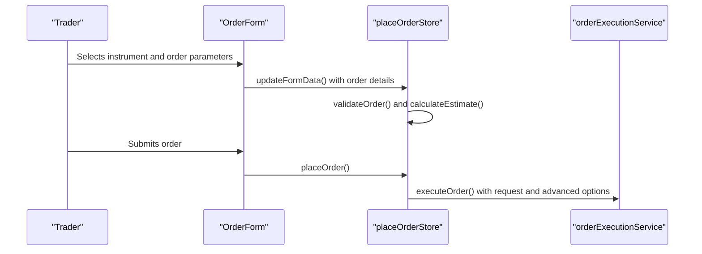
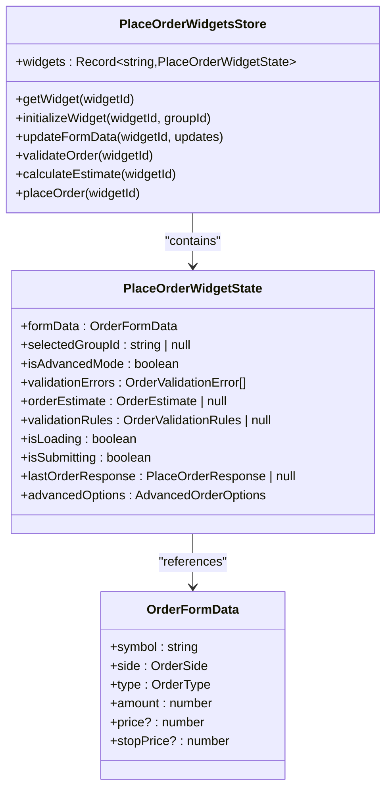
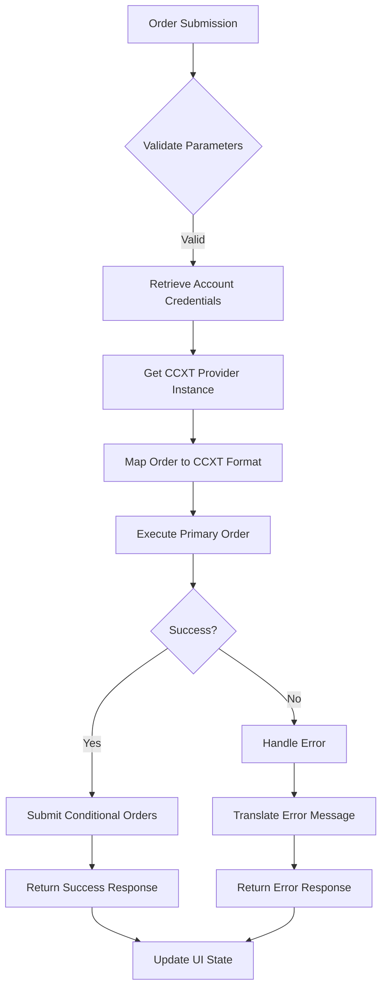
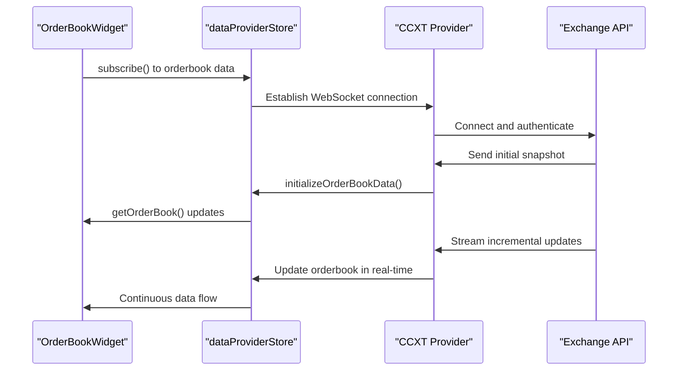
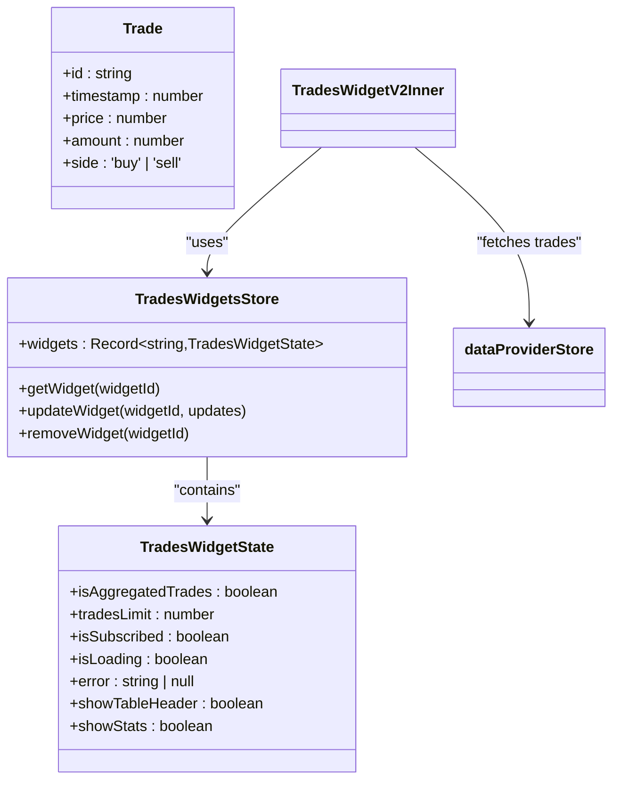

# Trading Functionality

<cite>
**Referenced Files in This Document**   
- [OrderForm.tsx](file://src/components/widgets/OrderForm.tsx)
- [orderExecutionService.ts](file://src/services/orderExecutionService.ts)
- [placeOrderStore.ts](file://src/store/placeOrderStore.ts)
- [OrderBookWidget.tsx](file://src/components/widgets/OrderBookWidget.tsx)
- [orderBookWidgetStore.ts](file://src/store/orderBookWidgetStore.ts)
- [TradesWidget.tsx](file://src/components/widgets/TradesWidget.tsx)
- [tradesWidgetStore.ts](file://src/store/tradesWidgetStore.ts)
- [orders.ts](file://src/types/orders.ts)
</cite>

## Table of Contents
1. [Introduction](#introduction)
2. [Order Placement Workflow](#order-placement-workflow)
3. [State Management and Data Flow](#state-management-and-data-flow)
4. [Order Execution Process](#order-execution-process)
5. [Real-Time Market Integration](#real-time-market-integration)
6. [Trade Visualization and Tracking](#trade-visualization-and-tracking)
7. [Configuration Options](#configuration-options)
8. [Error Handling and Failure Modes](#error-handling-and-failure-modes)
9. [Performance Considerations](#performance-considerations)
10. [Conclusion](#conclusion)

## Introduction
The profitmaker platform provides a comprehensive trading interface that enables users to execute various order types across multiple exchanges through a unified workflow. This document details the implementation of the trading functionality, focusing on the OrderForm component, order execution service, real-time market data integration, and trade visualization components. The system is designed to support market, limit, stop-loss, and take-profit orders with advanced configuration options for professional trading scenarios.

**Section sources**
- [OrderForm.tsx](file://src/components/widgets/OrderForm.tsx#L1-L535)
- [orderExecutionService.ts](file://src/services/orderExecutionService.ts#L1-L352)

## Order Placement Workflow
The order placement workflow begins with the OrderForm component, which serves as the primary user interface for trade submission. The form supports multiple order types including market, limit, and stop-loss orders, with advanced options for take-profit and stop-loss configurations.

When a user interacts with the OrderForm, the component manages state through the placeOrderStore, which maintains form data, validation rules, and UI states for each widget instance. The form automatically updates when instrument selection changes via the group selector, ensuring consistency across trading parameters.

For market orders, the system uses current market prices without requiring price input. Limit orders require explicit price specification and are validated against exchange constraints such as minimum price increments (tick size) and quantity steps. Stop-loss orders trigger at specified price levels and are validated to ensure they are set appropriately relative to current market conditions.

Advanced options allow users to configure stop-loss and take-profit levels simultaneously with their primary order, enabling automated risk management strategies. These settings are stored separately from the main order form data but are submitted together during execution.

**Diagram sources **
- [OrderForm.tsx](file://src/components/widgets/OrderForm.tsx#L16-L532)
- [placeOrderStore.ts](file://src/store/placeOrderStore.ts#L110-L411)

**Section sources**
- [OrderForm.tsx](file://src/components/widgets/OrderForm.tsx#L16-L532)
- [orders.ts](file://src/types/orders.ts#L7-L20)

## State Management and Data Flow
The trading functionality relies on a sophisticated state management system built with Zustand stores that maintain both UI state and business logic. The placeOrderStore manages all aspects of order submission, including form data, validation rules, and execution status.

Each OrderForm widget instance is identified by a unique widgetId, allowing multiple order forms to operate independently within the same dashboard. The store maintains a record of widget states, enabling persistence of form data, validation results, and submission responses across sessions.

Data flows from the group selection system to the order form, where the selectedGroup context provides essential trading parameters including exchange, account, market type, and trading pair. This ensures that all order submissions are associated with valid trading instruments and accounts.

Validation occurs automatically whenever form data changes, with the store triggering both validation checks and cost estimation calculations. The validation process enforces exchange-specific constraints such as minimum order sizes, price precision requirements, and balance availability, providing immediate feedback to users.

**Diagram sources **
- [placeOrderStore.ts](file://src/store/placeOrderStore.ts#L35-L63)
- [orders.ts](file://src/types/orders.ts#L7-L20)

**Section sources**
- [placeOrderStore.ts](file://src/store/placeOrderStore.ts#L110-L411)
- [orders.ts](file://src/types/orders.ts#L7-L104)

## Order Execution Process
The order execution process is orchestrated through the orderExecutionService, which acts as an intermediary between the UI layer and the CCXT provider infrastructure. When a user submits an order, the placeOrder action in the store validates the request and delegates execution to the service.

The execution service first retrieves user account credentials from the userStore, ensuring that API keys and secrets are securely accessed only when needed. It then obtains the appropriate CCXT provider for the target exchange from the dataProviderStore, establishing a connection using the user's credentials.

Orders are mapped from the platform's internal format to CCXT-compatible parameters, with different order types translated to their corresponding CCXT equivalents. Market orders use 'market' type, limit orders use 'limit', and stop-loss orders use 'stop' with appropriate stopPrice parameters.

During execution, the service handles both primary orders and any associated conditional orders (stop-loss, take-profit). If a stop-loss or take-profit is configured in the advanced options, these are submitted as separate orders immediately after the primary order succeeds. This allows for comprehensive position management strategies while maintaining atomicity of the primary trade.

Error handling is implemented at multiple levels, with network timeouts, insufficient balance errors, and invalid parameter issues caught and translated into user-friendly messages. The service normalizes error responses from different exchanges to provide consistent feedback regardless of the underlying exchange API.

**Diagram sources **
- [orderExecutionService.ts](file://src/services/orderExecutionService.ts#L1-L352)
- [placeOrderStore.ts](file://src/store/placeOrderStore.ts#L110-L411)

**Section sources**
- [orderExecutionService.ts](file://src/services/orderExecutionService.ts#L1-L352)
- [placeOrderStore.ts](file://src/store/placeOrderStore.ts#L110-L411)

## Real-Time Market Integration
The OrderBookWidget provides real-time market depth visualization that informs trading decisions by displaying bid and ask levels across multiple price points. The widget integrates with the platform's data provider system to receive live order book updates through WebSocket connections.

Market data flows from exchange APIs through the dataProviderStore, which manages subscriptions and normalizes data formats from different providers. The OrderBookWidget subscribes to order book updates for the currently selected instrument, automatically adjusting its subscription when the user changes exchanges, symbols, or market types.

The widget implements virtualized rendering to efficiently display large numbers of order book entries without performance degradation. Bid and ask levels are rendered in separate sections with color coding (green for bids, red for asks), and cumulative volume calculations can be toggled to show running totals at each price level.

Spread information is calculated and displayed prominently between the bid and ask sections, showing both absolute and percentage differences. This real-time spread data helps traders assess market liquidity and make informed decisions about order placement, particularly for limit orders where execution price is critical.

**Diagram sources **
- [OrderBookWidget.tsx](file://src/components/widgets/OrderBookWidget.tsx#L15-L560)
- [orderBookWidgetStore.ts](file://src/store/orderBookWidgetStore.ts#L44-L82)

**Section sources**
- [OrderBookWidget.tsx](file://src/components/widgets/OrderBookWidget.tsx#L15-L560)
- [orderBookWidgetStore.ts](file://src/store/orderBookWidgetStore.ts#L2-L29)

## Trade Visualization and Tracking
The TradesWidget displays recent market activity with high-performance virtualized rendering that handles large volumes of trade data efficiently. It shows individual trades with side indicators (buy/sell), price, size, and total value, allowing traders to analyze market sentiment and identify patterns.

Position tracking is implemented through the user's account balance monitoring, with the platform periodically fetching open positions and updating them in real-time. Active orders are displayed in dedicated tabs within the trading interface, showing order status, filled quantities, and remaining amounts.

Trade history visualization provides comprehensive reporting of past transactions, including order type, execution price, fees, and timestamps. The TradesWidget supports filtering by trade side, price range, and volume, enabling detailed analysis of historical trading activity.

The widget maintains its own state store (tradesWidgetStore) that manages display preferences such as aggregation settings, row limits, and visibility of statistics. This separation of concerns ensures that UI preferences do not interfere with the underlying trade data, which is managed centrally in the dataProviderStore.

**Diagram sources **
- [TradesWidget.tsx](file://src/components/widgets/TradesWidget.tsx#L16-L434)
- [tradesWidgetStore.ts](file://src/store/tradesWidgetStore.ts#L3-L18)

**Section sources**
- [TradesWidget.tsx](file://src/components/widgets/TradesWidget.tsx#L16-L434)
- [tradesWidgetStore.ts](file://src/store/tradesWidgetStore.ts#L3-L56)

## Configuration Options
The trading system supports extensive configuration options for order routing, slippage tolerance, and order lifetime settings. Order routing is determined by the active provider configuration, with the system automatically selecting the optimal CCXT provider based on exchange support and priority settings.

Slippage tolerance is implicitly managed through order type selection and price constraints. Market orders are subject to prevailing market conditions, while limit orders guarantee execution price at the cost of potential non-execution. The system displays estimated costs and commissions before order submission, allowing traders to assess potential slippage impact.

Order lifetime settings are controlled through TimeInForce parameters, with GTC (Good Till Cancelled) as the default option. Additional options include IOC (Immediate Or Cancel) and FOK (Fill Or Kill), though these are not currently exposed in the UI but are supported in the underlying order model.

Advanced order options include reduceOnly and postOnly flags for futures trading, clientOrderId for order identification, and support for iceberg orders through the advanced options interface. These settings are preserved in the placeOrderStore and submitted with each order request to the execution service.

**Section sources**
- [orders.ts](file://src/types/orders.ts#L7-L104)
- [placeOrderStore.ts](file://src/store/placeOrderStore.ts#L110-L411)

## Error Handling and Failure Modes
The system implements comprehensive error handling for common failure modes encountered in trading applications. Insufficient balance errors are detected during pre-execution validation by comparing estimated order costs against available balances, preventing failed submissions due to funding issues.

Network timeouts and connectivity issues are handled through retry mechanisms and fallback strategies. When WebSocket connections fail, the system can fall back to REST polling for critical data, ensuring continuity of operations during transient network problems.

Invalid order parameters such as prices below minimum tick size or quantities below exchange minimums are validated client-side before submission, providing immediate feedback to users. Exchange-specific error messages are normalized and translated into user-friendly explanations, avoiding cryptic API responses.

The order submission process includes safeguards against duplicate submissions through the isSubmitting flag in the placeOrderStore, which disables the submit button during active requests. Error responses are stored in the widget state and displayed in the UI until dismissed by the user, ensuring visibility of critical information.

**Section sources**
- [orderExecutionService.ts](file://src/services/orderExecutionService.ts#L1-L352)
- [placeOrderStore.ts](file://src/store/placeOrderStore.ts#L110-L411)

## Performance Considerations
The trading interface is optimized for low-latency scenarios through several performance-critical design decisions. Virtualized rendering in both the OrderBookWidget and TradesWidget minimizes DOM complexity, allowing smooth scrolling even with thousands of data points.

WebSocket connections provide real-time market data with minimal latency, bypassing the polling delays inherent in REST APIs. The dataProviderStore manages connection multiplexing, allowing multiple widgets to share a single WebSocket connection to the same exchange endpoint.

UI responsiveness is maintained through asynchronous operations and non-blocking execution. Long-running tasks such as order validation and cost estimation are processed off the main thread where possible, preventing interface freezes during intensive calculations.

Memory efficiency is achieved through data normalization and selective retention of historical information. The system implements cleanup routines that remove expired subscriptions and unused widget states, preventing memory leaks during extended trading sessions.

**Section sources**
- [OrderBookWidget.tsx](file://src/components/widgets/OrderBookWidget.tsx#L15-L560)
- [TradesWidget.tsx](file://src/components/widgets/TradesWidget.tsx#L16-L434)

## Conclusion
The profitmaker platform's trading functionality provides a robust, high-performance interface for executing trades across multiple exchanges. By integrating the OrderForm component with the orderExecutionService and real-time market data providers, the system enables efficient trade submission with comprehensive risk management features.

The architecture separates concerns effectively through specialized Zustand stores for different aspects of trading, ensuring maintainability and scalability. Real-time data integration through WebSockets combined with virtualized rendering delivers excellent performance even under heavy market data loads.

Future enhancements could include additional order types such as trailing stops, improved slippage controls, and more sophisticated position management tools. The current foundation supports these extensions through its modular design and well-defined interfaces between components.