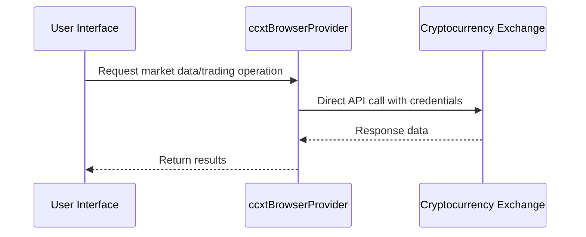
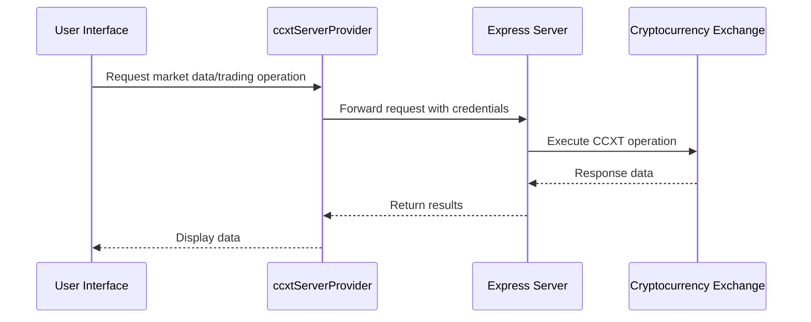

# User Account Management

<cite>
**Referenced Files in This Document**   
- [UserDrawer.tsx](file://src/components/UserDrawer.tsx)
- [userStore.ts](file://src/store/userStore.ts)
- [ccxtBrowserProvider.ts](file://src/store/providers/ccxtBrowserProvider.ts)
- [ccxtServerProvider.ts](file://src/store/providers/ccxtServerProvider.ts)
- [ccxtProviderUtils.ts](file://src/store/utils/ccxtProviderUtils.ts)
- [KEYS.md](file://KEYS.md)
- [CCXT_EXPRESS_PROVIDER.md](file://CCXT_EXPRESS_PROVIDER.md)
- [CCXT_SERVER_WIDGET_INTEGRATION.md](file://CCXT_SERVER_WIDGET_INTEGRATION.md)
</cite>

## Table of Contents
1. [Introduction](#introduction)
2. [User and Exchange Account Structure](#user-and-exchange-account-structure)
3. [UserStore: Authentication State Management](#userstore-authentication-state-management)
4. [API Key Storage and Credential Isolation](#api-key-storage-and-credential-isolation)
5. [Security Model: ccxtBrowserProvider vs ccxtServerProvider](#security-model-ccxtbrowserprovider-vs-ccxtserverprovider)
6. [User Workflow via UserDrawer Interface](#user-workflow-via-userdrawer-interface)
7. [Implementation Details](#implementation-details)
8. [Common Issues and Troubleshooting](#common-issues-and-troubleshooting)
9. [Best Practices for Secure Credential Management](#best-practices-for-secure-credential-management)

## Introduction
The profitmaker application enables users to securely manage API credentials for over 100 cryptocurrency exchanges through a robust account management system. This document details the architecture and implementation of user account management, focusing on secure storage, authentication state handling, and connectivity via CCXT providers. The system supports both browser-based (client-side) and server-side proxy models for exchange interaction, providing flexibility in security and performance trade-offs. Users can manage multiple accounts across various exchanges, with isolation of credentials and permissions enforced through the userStore and provider implementations.

## User and Exchange Account Structure
The application organizes user data hierarchically, with each user capable of managing multiple exchange accounts. The core data structures are defined using Zod schemas for type safety and validation.

### User Schema
A User entity contains personal information and a collection of ExchangeAccount objects:
- **id**: Unique identifier (UUID)
- **email**: Required, unique email address
- **avatarUrl**: Optional URL for profile image
- **notes**: Optional descriptive notes
- **name**: Optional display name
- **accounts**: Array of ExchangeAccount objects

### ExchangeAccount Schema
Each ExchangeAccount represents credentials for a specific exchange:
- **id**: Unique identifier (UUID)
- **exchange**: Exchange identifier (e.g., 'binance', 'bybit')
- **key**: Optional API key
- **privateKey**: Optional secret key
- **password**: Optional passphrase/password
- **uid**: Optional user ID
- **email**: Required email associated with the exchange account
- **avatarUrl**: Optional avatar URL
- **notes**: Optional notes

This structure allows users to maintain multiple exchange connections while keeping credentials isolated and organized within their personal account context.

**Section sources**
- [userStore.ts](file://src/store/userStore.ts#L6-L26)

## UserStore: Authentication State Management
The userStore is a Zustand-powered state management system responsible for maintaining user authentication states, active sessions, and exchange connectivity information. It provides a centralized location for all user-related data with persistence capabilities.

### Core Functionality
The store implements several key operations for user and account management:
- **addUser**: Creates a new user with unique email validation
- **removeUser**: Deletes a user and cleans up related state
- **setActiveUser**: Sets the currently active user context
- **updateUser**: Modifies user properties with email uniqueness enforcement
- **addAccount**: Adds an exchange account to a specified user
- **removeAccount**: Removes an exchange account from a user
- **updateAccount**: Updates existing exchange account credentials

### State Persistence
User data is persisted using Zustand's persist middleware, ensuring that account configurations survive application restarts. The state is validated against Zod schemas upon rehydration to maintain data integrity. The active user state determines which accounts are accessible for trading operations and market data retrieval.

### Multi-Account Authentication
The userStore enables seamless switching between multiple user profiles, each potentially connected to different sets of exchanges. When a user is activated, their associated exchange accounts become available for use throughout the application. This design supports credential isolation between different user identities while allowing quick context switching.

**Section sources**
- [userStore.ts](file://src/store/userStore.ts#L29-L142)

## API Key Storage and Credential Isolation
The application implements a comprehensive system for storing and managing API credentials with built-in security considerations and credential isolation mechanisms.

### Storage Implementation
API keys and secrets are stored as plain text within the userStore's persisted state. According to documentation, encrypted storage is planned for future implementation. Each exchange account stores credentials in dedicated fields:
- **key**: Public API key
- **privateKey**: Secret/private key
- **password**: Passphrase or password (required by some exchanges like BitGet)

### Credential Isolation
The system enforces strict credential isolation through several mechanisms:
1. **Per-User Scope**: Credentials are scoped to individual users within the userStore
2. **Per-Account Separation**: Each exchange connection maintains separate credential sets
3. **Provider-Based Isolation**: Different CCXT providers handle credentials according to their security model

### Permission Scoping
While explicit permission levels aren't implemented in the current codebase, the KEYS.md documentation outlines a conceptual framework for key types with varying permission levels:
- **safe_apiKey**: For orders, trades, balances, my_orders, my_trades
- **notSafe_apiKey**: For buy/sell operations
- **danger_apiKey**: For withdraw operations (not yet implemented)

This suggests a future direction where different API keys would have restricted permissions based on their intended use case, minimizing potential damage from compromised credentials.

**Section sources**
- [userStore.ts](file://src/store/userStore.ts#L6-L16)
- [KEYS.md](file://KEYS.md#L1-L97)

## Security Model: ccxtBrowserProvider vs ccxtServerProvider
The application offers two distinct security models for interacting with cryptocurrency exchanges through CCXT providers, each with different security implications and use cases.

### ccxtBrowserProvider (Client-Side)
The ccxtBrowserProvider executes CCXT operations directly within the browser environment:

**Characteristics:**
- Executes CCXT instances directly in the browser
- Uses CDN-hosted CCXT libraries
- API keys are processed client-side
- Subject to browser CORS restrictions
- Lower latency for direct connections
- Higher security risk if browser is compromised

**Diagram sources**
- [ccxtBrowserProvider.ts](file://src/store/providers/ccxtBrowserProvider.ts#L32-L515)

### ccxtServerProvider (Server-Side Proxy)
The ccxtServerProvider routes all exchange interactions through a backend proxy server:

**Characteristics:**
- Routes requests through a Node.js Express server
- Bypasses browser CORS restrictions
- API keys never leave the secure server environment
- Requires token-based authentication between client and server
- Provides additional security layer against browser-based attacks
- Enables server-side caching of markets and instances
- Introduces network latency due to proxying

**Diagram sources**
- [ccxtServerProvider.ts](file://src/store/providers/ccxtServerProvider.ts#L20-L569)

### Security Comparison
| Aspect | ccxtBrowserProvider | ccxtServerProvider |
|------|-------------------|-------------------|
| **Credential Exposure** | Keys processed in browser | Keys isolated on server |
| **CORS Handling** | Subject to browser restrictions | Bypasses CORS completely |
| **Attack Surface** | Browser vulnerabilities | Server security only |
| **Performance** | Direct connection, lower latency | Network hop, higher latency |
| **Scalability** | Client bears computation cost | Server can serve multiple clients |

The choice between providers depends on the user's security requirements and infrastructure setup, with ccxtServerProvider offering superior protection for sensitive operations.

**Section sources**
- [ccxtBrowserProvider.ts](file://src/store/providers/ccxtBrowserProvider.ts#L32-L515)
- [ccxtServerProvider.ts](file://src/store/providers/ccxtServerProvider.ts#L20-L569)
- [CCXT_EXPRESS_PROVIDER.md](file://CCXT_EXPRESS_PROVIDER.md#L0-L354)
- [CCXT_SERVER_WIDGET_INTEGRATION.md](file://CCXT_SERVER_WIDGET_INTEGRATION.md#L0-L208)

## User Workflow via UserDrawer Interface
The UserDrawer component provides a comprehensive interface for managing users and exchange accounts, implementing a complete workflow for adding, testing, and removing exchange connections.

### User Management Workflow
1. **Empty State**: When no users exist, the drawer displays a prompt to add the first user
2. **Add User**: Clicking "Add first user" opens the EditUserSheet modal
3. **User Details**: Enter email (required), name, avatar URL, and notes
4. **Email Validation**: Real-time validation ensures proper email format and uniqueness
5. **Save/Cancel**: Confirm creation or cancel the operation

### Account Management Workflow
For an active user:
1. **View Accounts**: Displays all configured exchange accounts with exchange type and email
2. **Add Account**: Click "Add account" to open the EditAccountSheet modal
3. **Configure Account**: Select exchange from searchable list, enter email, API key, secret, and optional password
4. **Edit Account**: Click edit icon to modify existing account credentials
5. **Remove Account**: Delete confirmation with safeguard against accidental deletion

### Interface Components
The UserDrawer consists of several modular components:
- **UserAccountsBlock**: Displays accounts for the active user with edit functionality
- **EditUserSheet**: Modal for creating or editing user profiles
- **EditAccountSheet**: Modal for adding or modifying exchange accounts with input validation

The interface uses React hooks to connect with the userStore, ensuring real-time synchronization between UI changes and application state. Exchange selection is enhanced with a SearchableSelect component that loads exchange options dynamically from CCXT.

**Section sources**
- [UserDrawer.tsx](file://src/components/UserDrawer.tsx#L24-L387)

## Implementation Details
The user account management system incorporates several sophisticated implementation details to ensure security, performance, and usability.

### Encrypted Storage
Currently, credentials are stored in plain text within the persisted userStore. The KEYS.md documentation acknowledges this limitation and plans to implement encrypted storage in the future. This represents a known security gap that users should be aware of when configuring sensitive accounts.

### Session Management
Session state is managed through the userStore's activeUserId property, which determines the current context for all exchange operations. When a user is deactivated or removed, their session is terminated, and associated CCXT instances are cleaned up. The system automatically persists the active user state across application restarts.

### Permission Scoping Implementation
While the documentation describes different key types with varying permissions, the current implementation does not enforce these scopes programmatically. All API keys are treated equally in terms of capabilities, with access determined by the exchange's own permission system rather than application-level restrictions.

### CCXT Instance Management
Both providers implement sophisticated instance management:
- **Browser Provider**: Maintains a flat cache of CCXT instances with 24-hour TTL
- **Server Provider**: Creates instances on the server with automatic cleanup
- **Cache Key Structure**: Combines providerId, userId, accountId, exchangeId, marketType, and ccxtType
- **Automatic Cleanup**: Periodic cleanup of expired instances (every 10 minutes)

The createCCXTInstanceConfig utility function standardizes configuration across both providers, ensuring consistent behavior regardless of execution environment.

**Section sources**
- [ccxtProviderUtils.ts](file://src/store/utils/ccxtProviderUtils.ts#L94-L117)
- [ccxtBrowserProvider.ts](file://src/store/providers/ccxtBrowserProvider.ts#L32-L515)
- [ccxtServerProvider.ts](file://src/store/providers/ccxtServerProvider.ts#L20-L569)

## Common Issues and Troubleshooting
Users may encounter several common issues when managing exchange accounts, many of which stem from API key configuration and network connectivity.

### Invalid API Keys
**Symptoms**: Authentication failures, "Invalid API key" errors, inability to fetch balance or place trades
**Causes**: 
- Incorrectly copied keys with extra whitespace
- Expired or revoked keys
- Keys entered in wrong fields (public key vs secret)
- Case sensitivity issues

**Resolution**: Carefully re-enter keys, verify they match exactly what the exchange provides, and test with the exchange's API tester if available.

### IP Whitelisting Conflicts
**Symptoms**: Connection failures despite valid credentials, "IP not allowed" errors
**Causes**: 
- Exchange requires API keys to be restricted to specific IPs
- Using ccxtServerProvider with server IP not whitelisted
- Dynamic IP changes for client or server

**Resolution**: Add both the user's public IP (for browser provider) and the server IP (for server provider) to the exchange's whitelist. Consider using static IPs for production environments.

### Rate Limiting
**Symptoms**: "Rate limit exceeded" errors, intermittent connection failures, slow data updates
**Causes**: 
- Aggressive polling frequency
- Multiple applications using the same API key
- Exchange-specific rate limits being exceeded

**Resolution**: Implement proper rate limiting in the application, distribute load across multiple API keys, and respect exchange rate limit headers. The ccxtBrowserProvider enables rate limiting by default.

### Two-Factor Authentication Interference
**Symptoms**: "2FA required" errors, inability to authenticate despite correct keys
**Causes**: 
- Exchange requires 2FA for API access
- 2FA enabled but not properly configured for API usage
- Using withdrawal keys without 2FA bypass

**Resolution**: Configure exchange API settings to either disable 2FA for API access or implement 2FA code generation in the application. Some exchanges provide separate API keys that bypass 2FA requirements.

**Section sources**
- [KEYS.md](file://KEYS.md#L1-L97)
- [CCXT_EXPRESS_PROVIDER.md](file://CCXT_EXPRESS_PROVIDER.md#L0-L354)

## Best Practices for Secure Credential Management
To maximize security when using the profitmaker application, users should follow these best practices for managing their exchange credentials.

### Key Rotation Strategy
Implement regular API key rotation to minimize the impact of potential breaches:
- Rotate keys every 90 days as a standard practice
- Immediately rotate keys if any security incident is suspected
- Use the application's account management interface to update credentials seamlessly
- Maintain a record of key creation dates to track rotation schedule

### Securing Credentials
Follow these guidelines to protect API keys:
- Never share API keys or store them in insecure locations
- Use strong, unique passwords for exchange accounts
- Enable IP whitelisting and restrict keys to known server/client IPs
- Disable withdrawal permissions on keys used for market data only
- Store backup keys in encrypted offline storage

### Monitoring Unauthorized Access
Implement monitoring to detect potential security breaches:
- Regularly review exchange API access logs for suspicious activity
- Monitor for unexpected balance changes or unauthorized trades
- Set up exchange notifications for API key usage
- Watch application logs for failed authentication attempts
- Use separate keys for different environments (development, staging, production)

### Infrastructure Security
Enhance overall security posture:
- Run the ccxtServerProvider on a secure, private network
- Use HTTPS with valid certificates for server communications
- Implement firewall rules to restrict access to the server
- Keep server software and dependencies up to date
- Use environment variables for server tokens rather than hardcoding

By following these best practices, users can significantly reduce the risk of unauthorized access and protect their cryptocurrency assets while using the profitmaker application.

**Section sources**
- [KEYS.md](file://KEYS.md#L1-L97)
- [CCXT_EXPRESS_PROVIDER.md](file://CCXT_EXPRESS_PROVIDER.md#L0-L354)