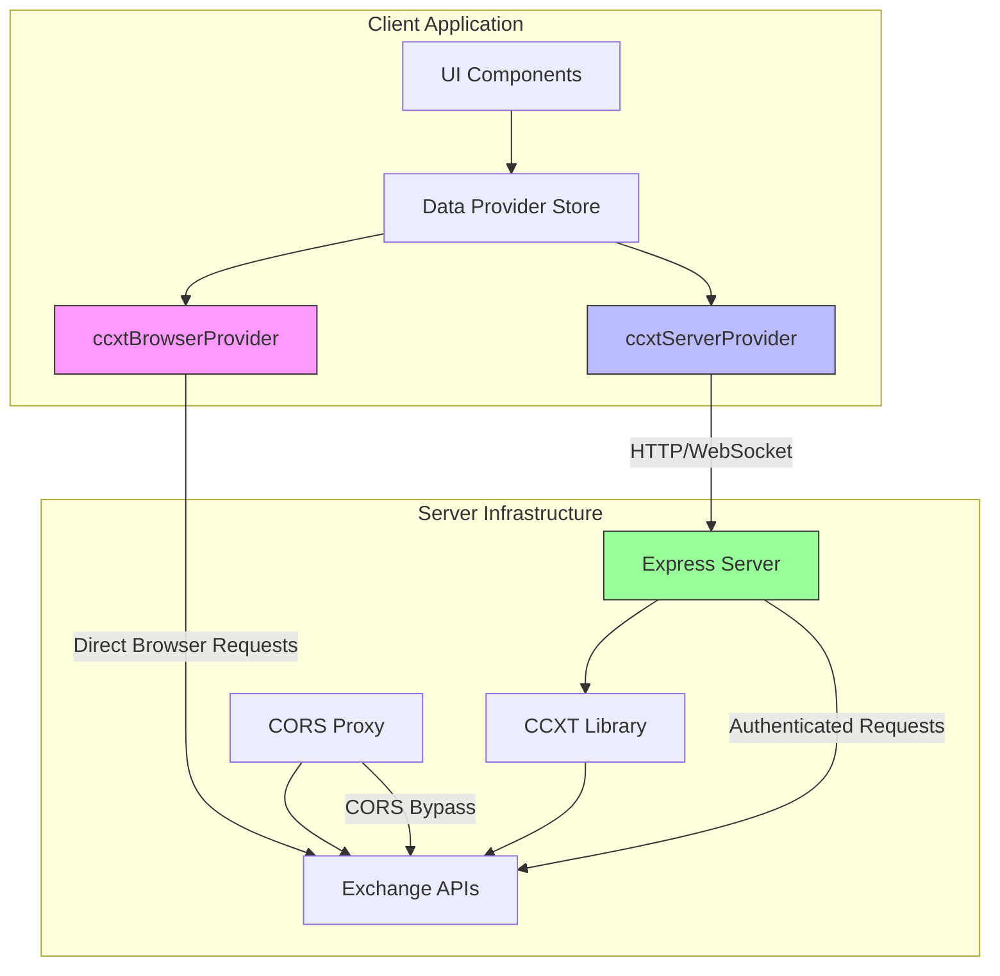
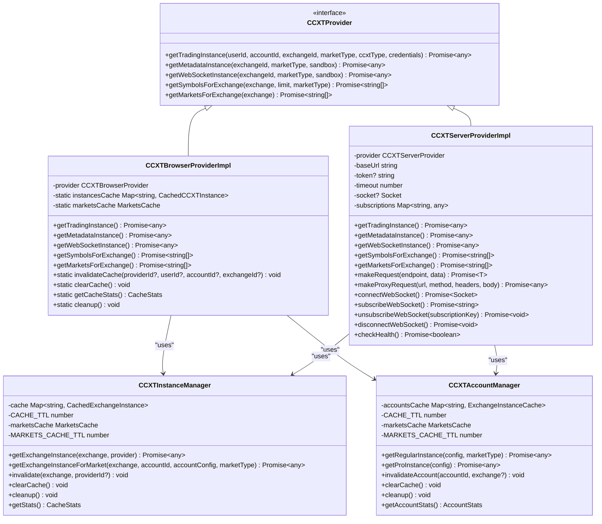
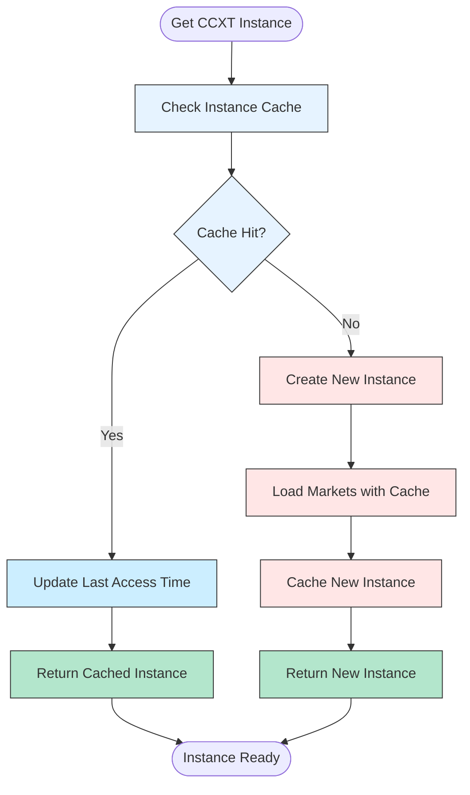
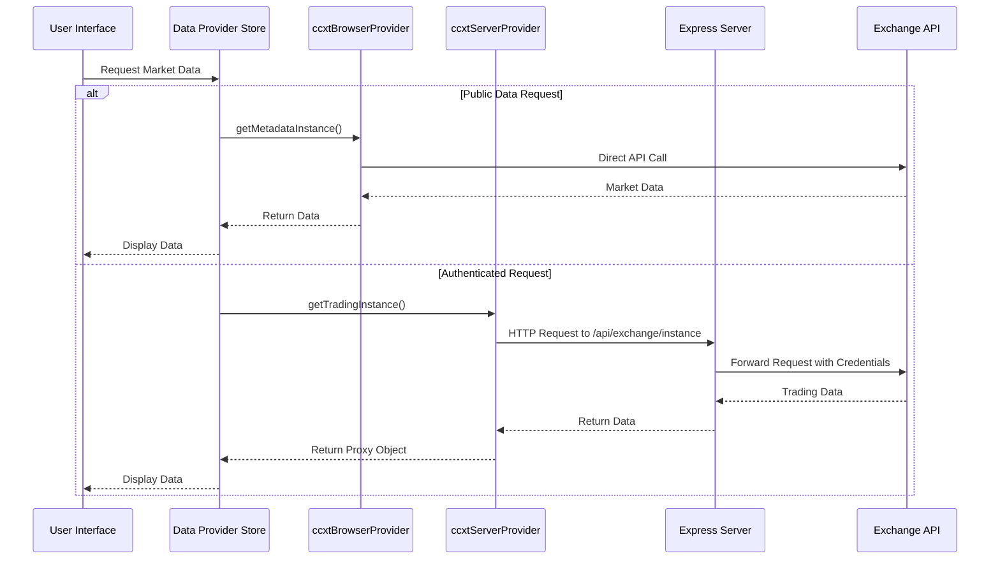
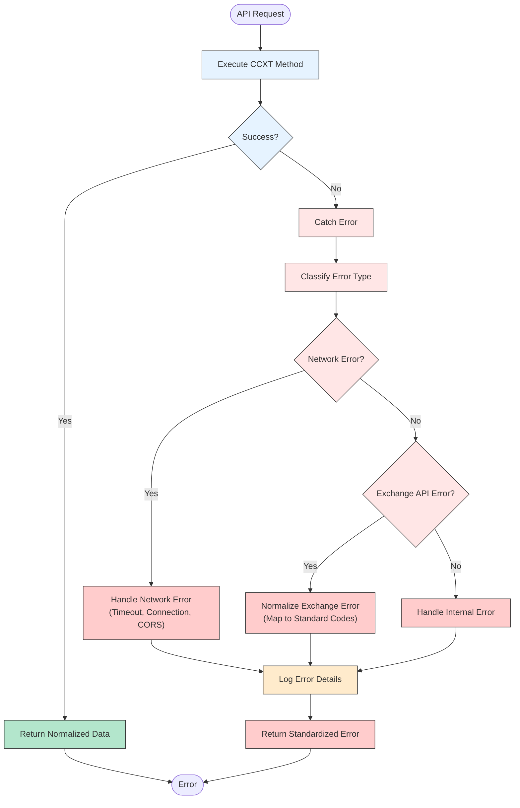
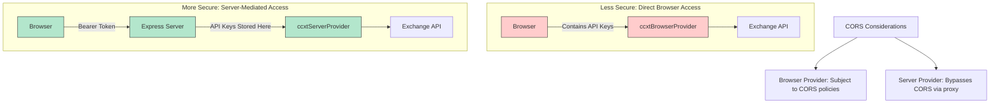
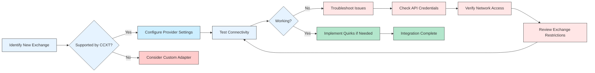
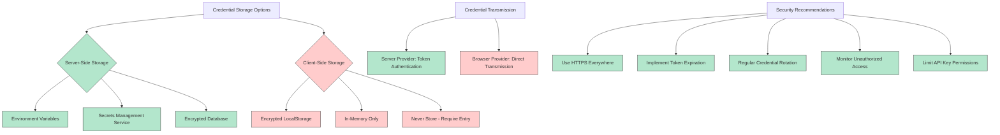

# CCXT Integration

<cite>
**Referenced Files in This Document **   
- [ccxtBrowserProvider.ts](file://src/store/providers/ccxtBrowserProvider.ts)
- [ccxtServerProvider.ts](file://src/store/providers/ccxtServerProvider.ts)
- [ccxtProviderUtils.ts](file://src/store/utils/ccxtProviderUtils.ts)
- [dataProviders.ts](file://src/types/dataProviders.ts)
- [CCXT_EXPRESS_PROVIDER.md](file://CCXT_EXPRESS_PROVIDER.md)
- [CCXT_SERVER_WIDGET_INTEGRATION.md](file://CCXT_SERVER_WIDGET_INTEGRATION.md)
</cite>

## Table of Contents
1. [Introduction](#introduction)
2. [Architecture Overview](#architecture-overview)
3. [Core Components](#core-components)
4. [Exchange Instance Management](#exchange-instance-management)
5. [Request Routing and Response Normalization](#request-routing-and-response-normalization)
6. [Error Mapping Across Exchanges](#error-mapping-across-exchanges)
7. [Security Considerations](#security-considerations)
8. [Implementation Examples](#implementation-examples)
9. [Best Practices](#best-practices)

## Introduction
The profitmaker application implements a robust abstraction layer for cryptocurrency exchange connectivity through the CCXT library, enabling seamless integration with over 100 exchanges. This documentation details the architecture, implementation, and operational aspects of this integration system. The solution provides a unified interface for market data retrieval, trading operations, and account management across heterogeneous exchange APIs while addressing critical concerns such as security, performance, and reliability.

The integration system is built around two primary provider implementations: ccxtBrowserProvider and ccxtServerProvider, each serving different use cases and security requirements. These providers abstract away the complexities of individual exchange APIs, providing a consistent interface for the application while handling exchange-specific quirks, authentication mechanisms, and data normalization.

**Section sources**
- [ccxtBrowserProvider.ts](file://src/store/providers/ccxtBrowserProvider.ts#L32-L515)
- [ccxtServerProvider.ts](file://src/store/providers/ccxtServerProvider.ts#L20-L569)
- [CCXT_EXPRESS_PROVIDER.md](file://CCXT_EXPRESS_PROVIDER.md#L0-L354)

## Architecture Overview
The CCXT integration architecture consists of two complementary provider implementations that work together to provide comprehensive exchange connectivity. The system is designed to handle both public market data retrieval and authenticated trading operations while maintaining separation between sensitive credentials and client-side code.



**Diagram sources **
- [ccxtBrowserProvider.ts](file://src/store/providers/ccxtBrowserProvider.ts#L32-L515)
- [ccxtServerProvider.ts](file://src/store/providers/ccxtServerProvider.ts#L20-L569)
- [CCXT_EXPRESS_PROVIDER.md](file://CCXT_EXPRESS_PROVIDER.md#L0-L354)

The architecture supports multiple deployment scenarios:
- Direct browser-to-exchange communication for public data
- Server-mediated requests for authenticated operations
- WebSocket streaming for real-time market data
- REST API fallback for exchanges without WebSocket support

This hybrid approach maximizes flexibility while maintaining security best practices, allowing the application to adapt to different exchange capabilities and user requirements.

**Section sources**
- [ccxtBrowserProvider.ts](file://src/store/providers/ccxtBrowserProvider.ts#L32-L515)
- [ccxtServerProvider.ts](file://src/store/providers/ccxtServerProvider.ts#L20-L569)
- [CCXT_EXPRESS_PROVIDER.md](file://CCXT_EXPRESS_PROVIDER.md#L0-L354)

## Core Components
The CCXT integration system comprises several core components that work together to provide seamless exchange connectivity. At the heart of the system are the two provider implementations: ccxtBrowserProvider and ccxtServerProvider, each designed for specific use cases and security requirements.

The ccxtBrowserProvider enables direct communication between the browser and exchange APIs using the CCXT library loaded via CDN. This approach is suitable for retrieving public market data but has limitations due to CORS restrictions imposed by many exchanges. The provider manages CCXT instances with sophisticated caching mechanisms to optimize performance and reduce redundant API calls.

In contrast, the ccxtServerProvider routes all exchange requests through a dedicated Express server, effectively bypassing browser CORS limitations. This server acts as a proxy, forwarding requests to exchanges with appropriate headers and handling authentication securely. The server implementation supports both REST API calls and WebSocket connections, providing a comprehensive solution for real-time market data and trading operations.

Both providers implement a consistent interface, allowing the application to switch between them seamlessly based on configuration and requirements. They share common utilities for instance configuration, request logging, and response normalization, ensuring consistent behavior across different integration methods.



**Diagram sources **
- [ccxtBrowserProvider.ts](file://src/store/providers/ccxtBrowserProvider.ts#L32-L515)
- [ccxtServerProvider.ts](file://src/store/providers/ccxtServerProvider.ts#L20-L569)
- [ccxtInstanceManager.ts](file://src/store/utils/ccxtInstanceManager.ts#L25-L322)
- [ccxtAccountManager.ts](file://src/store/utils/ccxtAccountManager.ts#L39-L395)

The system also includes utility components for managing CCXT instances, caching market data, and normalizing responses across different exchanges. These components ensure efficient resource utilization and consistent data handling throughout the application.

**Section sources**
- [ccxtBrowserProvider.ts](file://src/store/providers/ccxtBrowserProvider.ts#L32-L515)
- [ccxtServerProvider.ts](file://src/store/providers/ccxtServerProvider.ts#L20-L569)
- [ccxtInstanceManager.ts](file://src/store/utils/ccxtInstanceManager.ts#L25-L322)
- [ccxtAccountManager.ts](file://src/store/utils/ccxtAccountManager.ts#L39-L395)

## Exchange Instance Management
The CCXT integration system employs sophisticated instance management strategies to optimize performance, reduce API rate limiting, and ensure efficient resource utilization. Both provider implementations feature comprehensive caching mechanisms that store and reuse CCXT instances based on various parameters including exchange, market type, authentication credentials, and sandbox mode.

The ccxtBrowserProvider maintains a flat cache of CCXT instances using a composite key that combines provider ID, user ID, account ID, exchange ID, market type, and CCXT type (regular or Pro). This caching strategy prevents the creation of duplicate instances for the same configuration, significantly reducing memory usage and initialization overhead. The cache has a TTL of 24 hours, after which instances are considered expired and recreated on demand.



**Diagram sources **
- [ccxtBrowserProvider.ts](file://src/store/providers/ccxtBrowserProvider.ts#L32-L515)
- [ccxtServerProvider.ts](file://src/store/providers/ccxtServerProvider.ts#L20-L569)

Market data caching is implemented separately with a shorter TTL of one hour, recognizing that market configurations may change more frequently than instance configurations. This dual-layer caching approach balances freshness of market data with the stability of instance configurations.

Authentication is handled securely by including API keys, secrets, and passwords in the instance configuration when required for trading operations. For metadata retrieval and public data access, instances are created without credentials to minimize security risks. The system supports sandbox mode for testing purposes, creating separate instances for live and sandbox environments to prevent accidental trades.

The ccxtServerProvider extends this caching strategy to the server side, where instances are maintained in server memory and shared across multiple clients. This centralized approach further optimizes resource usage and reduces the overall load on exchange APIs. The server implementation also includes health checks and automatic cleanup of expired instances to maintain system stability.

**Section sources**
- [ccxtBrowserProvider.ts](file://src/store/providers/ccxtBrowserProvider.ts#L32-L515)
- [ccxtServerProvider.ts](file://src/store/providers/ccxtServerProvider.ts#L20-L569)

## Request Routing and Response Normalization
The CCXT integration system implements a sophisticated request routing mechanism that directs API calls through the most appropriate channel based on the operation type, authentication requirements, and exchange capabilities. Public data requests such as market listings and price information can be routed through either the ccxtBrowserProvider or ccxtServerProvider, while authenticated operations like trading and balance inquiries are typically directed through the server provider for enhanced security.



**Diagram sources **
- [ccxtBrowserProvider.ts](file://src/store/providers/ccxtBrowserProvider.ts#L32-L515)
- [ccxtServerProvider.ts](file://src/store/providers/ccxtServerProvider.ts#L20-L569)

Response normalization is a critical aspect of the integration, ensuring consistent data formats across different exchanges despite their varying API responses. The system normalizes various data types including:

- **Candles/OHLCV**: Standardized to include timestamp, open, high, low, close, and volume
- **Order Book**: Unified format with bids and asks arrays containing price and amount
- **Trades**: Consistent structure with id, timestamp, price, amount, and side
- **Balances**: Normalized to include currency, free, used, and total amounts
- **Tickers**: Standardized fields including bid, ask, last, and mid-price

Exchange-specific quirks are handled through conditional logic and mapping functions. For example, the Bybit exchange requires special handling for market type mapping, where 'futures' and 'swap' markets are mapped to 'linear' in the CCXT configuration. Similarly, symbol formatting differences are addressed through normalization functions that convert exchange-specific symbol formats to a standard representation.

The system also implements intelligent WebSocket method selection, choosing the optimal method for real-time data based on exchange capabilities. For order book updates, it prioritizes 'watchOrderBookForSymbols' if available, falls back to 'watchOrderBook', and uses 'fetchOrderBook' as a REST API fallback when WebSocket support is unavailable.

**Section sources**
- [ccxtBrowserProvider.ts](file://src/store/providers/ccxtBrowserProvider.ts#L32-L515)
- [ccxtServerProvider.ts](file://src/store/providers/ccxtServerProvider.ts#L20-L569)
- [ccxtProviderUtils.ts](file://src/store/utils/ccxtProviderUtils.ts#L0-L351)

## Error Mapping Across Exchanges
The CCXT integration system implements comprehensive error handling and mapping to provide consistent error reporting across different exchanges. Given the wide variation in error messages and codes among exchanges, the system normalizes these differences into a standardized error format that the application can handle uniformly.

Each provider implementation includes robust error handling mechanisms that catch and process errors from both the CCXT library and network requests. Network-related errors such as timeouts, connection failures, and CORS issues are distinguished from exchange-specific errors like invalid credentials, insufficient funds, or rate limiting.



**Diagram sources **
- [ccxtBrowserProvider.ts](file://src/store/providers/ccxtBrowserProvider.ts#L32-L515)
- [ccxtServerProvider.ts](file://src/store/providers/ccxtServerProvider.ts#L20-L569)

The error mapping system translates exchange-specific error messages into standardized codes that the application can use for user feedback and automated handling. Common error categories include:

- Authentication errors (invalid API keys, expired credentials)
- Rate limiting errors (exceeded request limits)
- Insufficient funds or margin requirements
- Invalid order parameters (price, amount, symbol)
- Market not available or trading disabled
- Network connectivity issues

For the ccxtServerProvider, additional error handling is implemented for the communication between the client and server. This includes timeout handling for HTTP requests, WebSocket connection errors, and authentication failures for the server API. The server token authentication adds an extra layer of security while also providing a mechanism for rate limiting and monitoring API usage.

The system logs detailed error information for debugging purposes while presenting user-friendly messages in the interface. This dual approach ensures that developers have sufficient information to diagnose issues while users receive clear guidance on how to resolve problems.

**Section sources**
- [ccxtBrowserProvider.ts](file://src/store/providers/ccxtBrowserProvider.ts#L32-L515)
- [ccxtServerProvider.ts](file://src/store/providers/ccxtServerProvider.ts#L20-L569)

## Security Considerations
The CCXT integration system addresses security through a multi-layered approach that protects sensitive credentials, prevents unauthorized access, and mitigates common web vulnerabilities. The architecture distinguishes between two primary security models: direct browser integration and server-mediated access, each with different trade-offs and use cases.

The ccxtBrowserProvider, while convenient for public data access, exposes inherent security limitations due to the nature of client-side execution. When API credentials are used with this provider, they are processed in the browser environment, making them potentially accessible to malicious scripts. This approach should be limited to scenarios where the security risk is acceptable, such as personal use with strong device security.

In contrast, the ccxtServerProvider implements a more secure architecture by keeping API credentials on the server side. The client application communicates with the Express server using a bearer token for authentication, while the server stores and uses the actual exchange credentials. This separation ensures that sensitive information never leaves the secure server environment.



**Diagram sources **
- [ccxtBrowserProvider.ts](file://src/store/providers/ccxtBrowserProvider.ts#L32-L515)
- [ccxtServerProvider.ts](file://src/store/providers/ccxtServerProvider.ts#L20-L569)
- [CCXT_EXPRESS_PROVIDER.md](file://CCXT_EXPRESS_PROVIDER.md#L0-L354)

CORS (Cross-Origin Resource Sharing) considerations are central to the security design. Many exchanges implement strict CORS policies that prevent direct browser access to their APIs. The ccxtBrowserProvider is subject to these restrictions, which can limit its functionality. The ccxtServerProvider, however, bypasses CORS limitations by acting as a proxy server that makes requests from the server environment, where CORS policies do not apply.

Additional security measures include:
- Token-based authentication for server access
- Configurable request timeouts to prevent hanging requests
- Input validation for all API parameters
- Rate limiting considerations in the design
- Secure storage of server tokens in environment variables
- Logging of security-relevant events for monitoring

For production deployments, additional security enhancements are recommended, including HTTPS encryption, JWT authentication with refresh tokens, IP-based access controls, and comprehensive audit logging. The current implementation provides a solid foundation that can be extended with these advanced security features as needed.

**Section sources**
- [ccxtBrowserProvider.ts](file://src/store/providers/ccxtBrowserProvider.ts#L32-L515)
- [ccxtServerProvider.ts](file://src/store/providers/ccxtServerProvider.ts#L20-L569)
- [CCXT_EXPRESS_PROVIDER.md](file://CCXT_EXPRESS_PROVIDER.md#L0-L354)

## Implementation Examples
Integrating a new exchange into the profitmaker application follows a standardized process that leverages the existing CCXT abstraction layer. The system's design ensures that most exchanges require minimal custom code, as CCXT handles the majority of exchange-specific implementation details.

To integrate a new exchange, developers need to:

1. Verify exchange support in CCXT library
2. Configure provider settings in the application
3. Test connectivity and data retrieval
4. Implement any exchange-specific quirks if necessary



**Diagram sources **
- [ccxtBrowserProvider.ts](file://src/store/providers/ccxtBrowserProvider.ts#L32-L515)
- [ccxtServerProvider.ts](file://src/store/providers/ccxtServerProvider.ts#L20-L569)
- [CCXT_EXPRESS_PROVIDER.md](file://CCXT_EXPRESS_PROVIDER.md#L0-L354)

Handling exchange-specific quirks is occasionally necessary despite the abstraction provided by CCXT. For example, the Bybit exchange requires special market type mapping, where 'futures' and 'swap' markets are translated to 'linear' in the CCXT configuration. This is implemented in the provider code with conditional logic:

```typescript
// Example of exchange-specific quirk handling
if (config.exchangeId === 'bybit') {
  const bybitCategoryMap: Record<string, string> = {
    'spot': 'spot',
    'futures': 'linear',
    'swap': 'linear', 
    'margin': 'spot',
    'options': 'option'
  };
  defaultType = bybitCategoryMap[config.marketType] || config.marketType;
}
```

The system also handles differences in symbol formatting, market availability detection, and API capability checking. For instance, some exchanges don't explicitly declare support for certain market types in their capabilities, requiring additional API method checks to determine actual support.

Testing new integrations involves using the provided test components such as TestServerProvider and TestCCXTServerProvider, which allow developers to verify connectivity, data retrieval, and error handling in a controlled environment before deploying to production.

**Section sources**
- [ccxtBrowserProvider.ts](file://src/store/providers/ccxtBrowserProvider.ts#L32-L515)
- [ccxtServerProvider.ts](file://src/store/providers/ccxtServerProvider.ts#L20-L569)
- [CCXT_EXPRESS_PROVIDER.md](file://CCXT_EXPRESS_PROVIDER.md#L0-L354)

## Best Practices
Implementing effective security practices for credential storage and transmission is paramount in the CCXT integration system. The architecture provides multiple layers of protection, but proper configuration and usage are essential to maintain security.

For credential storage, the recommended approach is to use the ccxtServerProvider with credentials stored securely on the server. Exchange API keys, secrets, and passwords should never be hardcoded in client-side code or stored in browser localStorage without encryption. On the server side, credentials should be stored in environment variables or a secure secrets management system, never in version control.



**Diagram sources **
- [ccxtBrowserProvider.ts](file://src/store/providers/ccxtBrowserProvider.ts#L32-L515)
- [ccxtServerProvider.ts](file://src/store/providers/ccxtServerProvider.ts#L20-L569)
- [CCXT_EXPRESS_PROVIDER.md](file://CCXT_EXPRESS_PROVIDER.md#L0-L354)

When using the ccxtServerProvider, implement the following best practices:
- Use strong, randomly generated server tokens
- Rotate server tokens periodically
- Implement rate limiting on the server API
- Monitor API usage patterns for anomalies
- Use short token expiration times with refresh mechanisms
- Restrict server API access by IP address when possible

For the ccxtBrowserProvider, if it must be used with credentials:
- Never store credentials in plain text
- Use browser secure context (HTTPS) only
- Implement session timeouts
- Provide clear user warnings about security implications
- Offer the option to enter credentials each session

Additional best practices include:
- Regularly updating the CCXT library to benefit from security patches
- Monitoring exchange API changes that might affect security
- Implementing comprehensive logging for security auditing
- Conducting regular security reviews of the integration code
- Educating users about secure credential management

The choice between ccxtBrowserProvider and ccxtServerProvider should be guided by the specific security requirements of the deployment scenario, with the server provider being the preferred option for production environments with sensitive trading operations.

**Section sources**
- [ccxtBrowserProvider.ts](file://src/store/providers/ccxtBrowserProvider.ts#L32-L515)
- [ccxtServerProvider.ts](file://src/store/providers/ccxtServerProvider.ts#L20-L569)
- [CCXT_EXPRESS_PROVIDER.md](file://CCXT_EXPRESS_PROVIDER.md#L0-L354)