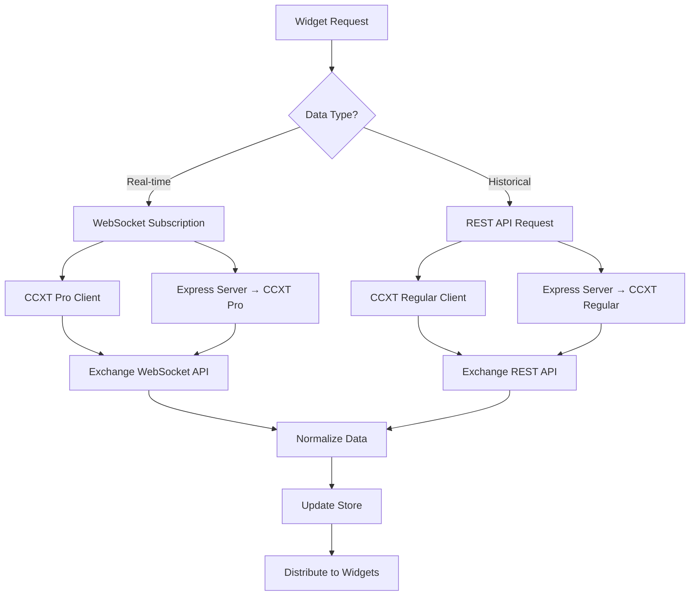
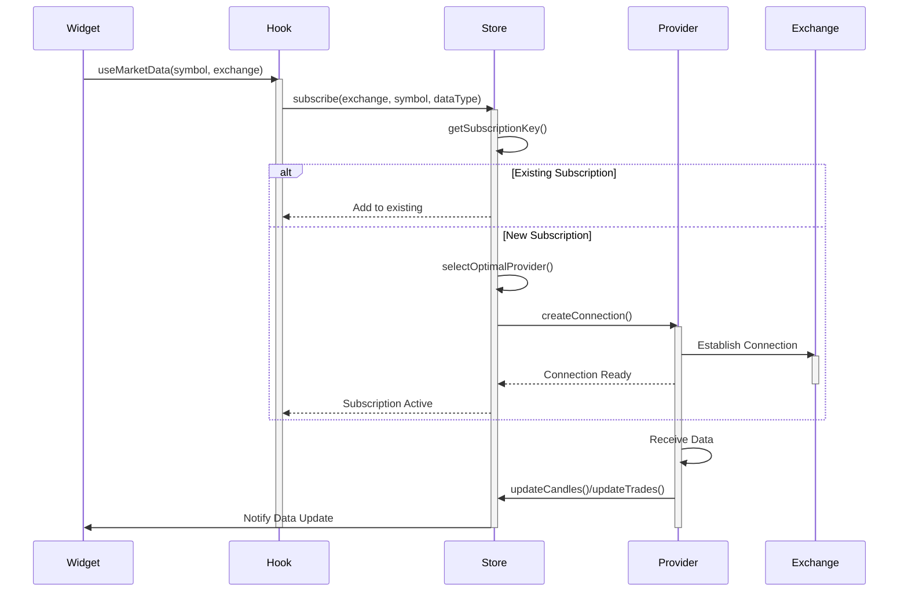
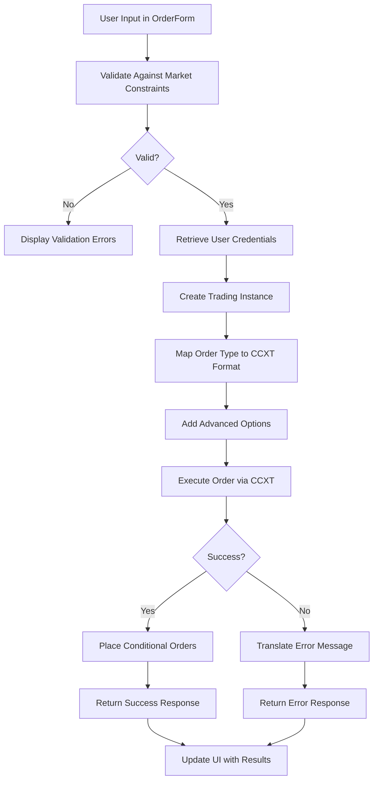

# Data Flow & Integration

<cite>
**Referenced Files in This Document**   
- [ccxtBrowserProvider.ts](file://src/store/providers/ccxtBrowserProvider.ts)
- [ccxtServerProvider.ts](file://src/store/providers/ccxtServerProvider.ts)
- [orderExecutionService.ts](file://src/services/orderExecutionService.ts)
- [useDataProvider.ts](file://src/hooks/useDataProvider.ts)
- [OrderForm.tsx](file://src/components/widgets/OrderForm.tsx)
- [subscriptionActions.ts](file://src/store/actions/subscriptionActions.ts)
- [dataActions.ts](file://src/store/actions/dataActions.ts)
- [providerActions.ts](file://src/store/actions/providerActions.ts)
</cite>

## Table of Contents
1. [Data Provider Architecture](#data-provider-architecture)
2. [Market Data Acquisition](#market-data-acquisition)
3. [Request Lifecycle and Subscription Management](#request-lifecycle-and-subscription-management)
4. [Order Execution Flow](#order-execution-flow)
5. [Error Handling Patterns](#error-handling-patterns)
6. [Security Considerations](#security-considerations)

## Data Provider Architecture

The profitmaker application implements a dual-strategy data provider architecture that supports both browser-based and server-mediated connections to cryptocurrency exchanges through the CCXT library. This design enables flexible deployment options while addressing common web application constraints like CORS restrictions.

The system distinguishes between two primary provider types: `ccxt-browser` for direct client-side communication with exchanges, and `ccxt-server` for proxy-based requests through an Express server backend. The `CCXTBrowserProviderImpl` class manages browser-based connections with sophisticated caching mechanisms for exchange instances and market data, reducing redundant API calls and improving performance. Each instance is uniquely identified by a composite key including provider ID, user ID, account ID, exchange ID, market type, and CCXT type (regular or Pro).

For environments where direct browser-to-exchange communication is problematic due to CORS policies, the `CCXTServerProviderImpl` routes requests through a dedicated server endpoint. This implementation uses Socket.IO for WebSocket subscriptions and HTTP POST requests for REST operations, effectively bypassing browser security restrictions. The server acts as an intermediary, forwarding authenticated requests to exchanges and streaming responses back to clients.

Both provider types implement consistent interfaces despite their different transport mechanisms, allowing the application to switch between them transparently. The provider selection logic considers exchange support, provider priority, and connection status when determining which provider should handle requests for a specific exchange. This abstraction enables users to configure multiple providers with different capabilities and fallback options.

**Section sources**
- [ccxtBrowserProvider.ts](file://src/store/providers/ccxtBrowserProvider.ts#L1-L525)
- [ccxtServerProvider.ts](file://src/store/providers/ccxtServerProvider.ts#L1-L575)
- [providerActions.ts](file://src/store/actions/providerActions.ts#L1-L506)

## Market Data Acquisition

Market data acquisition in profitmaker leverages both WebSocket and REST APIs through the CCXT library, providing real-time updates and historical data for trading analysis. The system supports multiple data types including candles (OHLCV), trades, order books, tickers, and balances, each accessible through standardized interfaces regardless of the underlying provider implementation.

WebSocket connections are established through the `watchTicker`, `watchOrderBook`, `watchTrades`, and `watchOHLCV` methods, which maintain persistent connections to exchange servers for real-time data streaming. For browser-based providers, these connections use CCXT Pro's built-in WebSocket support, while server-based providers establish WebSocket connections from the server side and relay data to clients. The subscription mechanism includes automatic reconnection logic and error handling to maintain data continuity during network interruptions.

REST API endpoints complement WebSocket streams by providing initial data snapshots and historical information. Methods like `fetchOHLCV`, `fetchTrades`, and `fetchOrderBook` retrieve comprehensive datasets that initialize widgets before real-time updates begin. The system intelligently determines optimal request limits based on exchange-specific constraints, preventing rate limiting while ensuring sufficient data depth. Historical candle data can be loaded incrementally through the `loadHistoricalCandles` method, enabling infinite scroll functionality in chart widgets.

Data normalization occurs at the store level, where raw exchange responses are transformed into standardized formats before distribution. This ensures consistency across different exchanges and provider types, allowing widgets to consume data without needing exchange-specific parsing logic. The caching strategy minimizes redundant requests by storing market metadata and maintaining active connections until all subscribers have unsubscribed.

**Diagram sources**
- [ccxtBrowserProvider.ts](file://src/store/providers/ccxtBrowserProvider.ts#L1-L525)
- [ccxtServerProvider.ts](file://src/store/providers/ccxtServerProvider.ts#L1-L575)
- [dataActions.ts](file://src/store/actions/dataActions.ts#L1-L1560)

**Section sources**
- [ccxtBrowserProvider.ts](file://src/store/providers/ccxtBrowserProvider.ts#L1-L525)
- [ccxtServerProvider.ts](file://src/store/providers/ccxtServerProvider.ts#L1-L575)
- [dataActions.ts](file://src/store/actions/dataActions.ts#L1-L1560)

## Request Lifecycle and Subscription Management

The request lifecycle in profitmaker follows a structured flow from subscription initiation to data normalization and distribution, managed through a centralized state store. When a widget requests market data, it triggers a subscription process that coordinates provider selection, connection management, and data delivery.

Subscription begins with the `subscribe` method in the `SubscriptionActions` interface, which creates a unique subscription key based on exchange, symbol, data type, timeframe, and market type. The system checks for existing subscriptions to the same data stream, implementing deduplication to prevent redundant connections. If no active subscription exists, the system selects an appropriate provider using the `getProviderForExchange` method, considering provider priority, exchange support, and connection status.

Once a provider is selected, the system establishes the necessary connection—either directly through the browser or via the server proxy—and begins data retrieval. For WebSocket subscriptions, this involves setting up event listeners for data and error events, while REST requests are executed immediately to obtain initial data snapshots. The `startDataFetching` method orchestrates this process, handling both connection establishment and error recovery.

Incoming data is normalized and stored in the central data provider store, where it becomes available to all subscribed widgets. The `updateCandles`, `updateTrades`, `updateOrderBook`, and related methods ensure data consistency across the application, triggering updates only when new or changed data arrives. Subscriptions are automatically cleaned up when the last subscriber unsubscribes, with connections closed and resources released.

**Diagram sources**
- [subscriptionActions.ts](file://src/store/actions/subscriptionActions.ts#L1-L106)
- [dataActions.ts](file://src/store/actions/dataActions.ts#L1-L1560)
- [useDataProvider.ts](file://src/hooks/useDataProvider.ts#L1-L360)

**Section sources**
- [subscriptionActions.ts](file://src/store/actions/subscriptionActions.ts#L1-L106)
- [dataActions.ts](file://src/store/actions/dataActions.ts#L1-L1560)
- [useDataProvider.ts](file://src/hooks/useDataProvider.ts#L1-L360)

## Order Execution Flow

The order execution flow in profitmaker follows a secure, multi-step process from UI input through validation to exchange submission, ensuring accuracy and safety in trading operations. The process begins in the `OrderForm` widget, where users specify order parameters including symbol, quantity, price, and order type (market, limit, or stop-loss).

When a user submits an order, the `executeOrder` function in the `orderExecutionService` validates the request against market constraints obtained from the exchange's API. These constraints include minimum and maximum order sizes, price precision requirements, and fee structures, which are retrieved using the `getMarketConstraints` function. The validation process prevents invalid orders from reaching the exchange, reducing error rates and improving user experience.

After validation, the system retrieves the user's API credentials from the secure store and creates a trading instance through the appropriate CCXT provider. For security reasons, API keys are never stored in client-side code but are instead retrieved from the user store only when needed for trading operations. The trading instance is configured with rate limiting enabled to prevent accidental API abuse.

The order is then submitted to the exchange using CCXT's `createOrder` method, with additional parameters for advanced features like time-in-force, reduce-only, and post-only. The system supports conditional orders by automatically placing associated stop-loss and take-profit orders when specified in the advanced options. All order operations are wrapped in comprehensive error handling that translates technical exchange errors into user-friendly messages.

**Diagram sources**
- [OrderForm.tsx](file://src/components/widgets/OrderForm.tsx#L1-L536)
- [orderExecutionService.ts](file://src/services/orderExecutionService.ts#L1-L353)

**Section sources**
- [OrderForm.tsx](file://src/components/widgets/OrderForm.tsx#L1-L536)
- [orderExecutionService.ts](file://src/services/orderExecutionService.ts#L1-L353)

## Error Handling Patterns

Profitmaker implements comprehensive error handling patterns to manage network failures, rate limiting, and other common issues in cryptocurrency trading applications. The system employs a layered approach to error detection, recovery, and user communication, ensuring reliability even under adverse conditions.

Network failures are handled through automatic reconnection logic in both WebSocket and REST implementations. The `CCXTServerProviderImpl` includes timeout controls and retry mechanisms for HTTP requests, while WebSocket connections attempt automatic reconnection when interrupted. Error boundaries in React components prevent crashes from propagating to the entire application, maintaining usability even when individual components fail.

Rate limiting is managed through CCXT's built-in rate limiter, which automatically spaces requests according to exchange-specific rate limits. The system also implements request queuing to prevent overwhelming exchanges during periods of high activity. When rate limit errors do occur, the application translates cryptic exchange error messages into clear, actionable feedback for users, such as "Too many requests—please wait 30 seconds before trying again."

The error handling system distinguishes between recoverable and non-recoverable errors, attempting automatic recovery for transient issues like network timeouts while presenting clear guidance for permanent errors like invalid API keys. All errors are logged with contextual information to aid debugging, but sensitive data like API keys is never included in logs. The user interface displays errors through toast notifications and inline form validation, ensuring users are promptly informed of issues without disrupting their workflow.

**Section sources**
- [ccxtBrowserProvider.ts](file://src/store/providers/ccxtBrowserProvider.ts#L1-L525)
- [ccxtServerProvider.ts](file://src/store/providers/ccxtServerProvider.ts#L1-L575)
- [orderExecutionService.ts](file://src/services/orderExecutionService.ts#L1-L353)

## Security Considerations

Security considerations for transmitting sensitive trading data and API credentials in profitmaker follow industry best practices for financial applications. API credentials are stored in memory within the user store rather than in persistent storage like localStorage, reducing the risk of theft through XSS attacks. Credentials are only accessed when needed for trading operations and are not exposed to non-essential components.

All communication with the Express server uses HTTPS with proper certificate validation, encrypting API credentials and trading data in transit. The server requires authentication tokens for access, adding an additional layer of protection beyond IP-based restrictions. WebSocket connections are secured with the same authentication mechanism, ensuring only authorized clients can establish data streams.

The application implements strict input validation for all trading operations, preventing injection attacks and malformed requests from reaching exchanges. Sensitive operations like order placement require explicit user confirmation and are protected against accidental execution through loading states and confirmation dialogs. The system also includes safeguards against common trading mistakes, such as insufficient balance checks and minimum order size validation.

For enhanced security, the application supports sandbox mode for testing with simulated accounts, allowing users to verify strategies without risking real funds. Exchange integrations follow the principle of least privilege, requesting only the permissions necessary for the application's functionality and avoiding unnecessary access to withdrawal capabilities.

**Section sources**
- [ccxtBrowserProvider.ts](file://src/store/providers/ccxtBrowserProvider.ts#L1-L525)
- [ccxtServerProvider.ts](file://src/store/providers/ccxtServerProvider.ts#L1-L575)
- [orderExecutionService.ts](file://src/services/orderExecutionService.ts#L1-L353)
- [OrderForm.tsx](file://src/components/widgets/OrderForm.tsx#L1-L536)