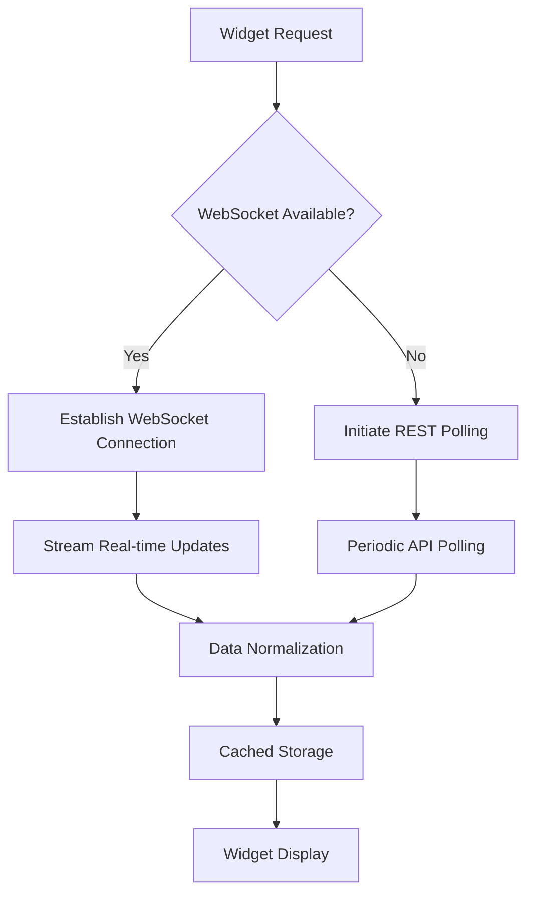
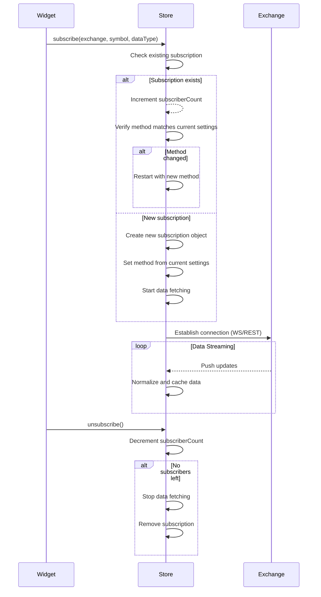
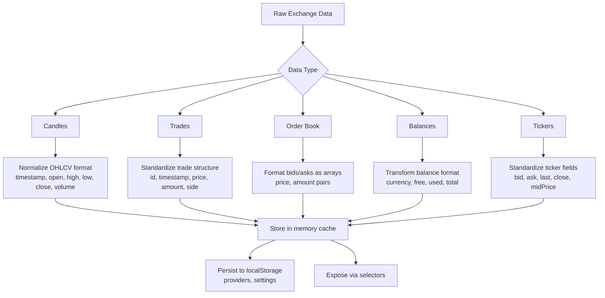
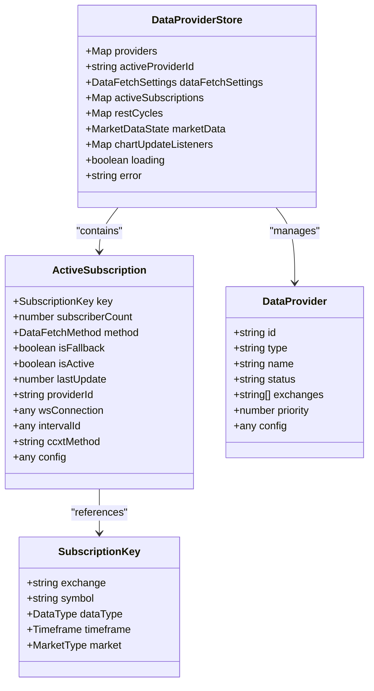
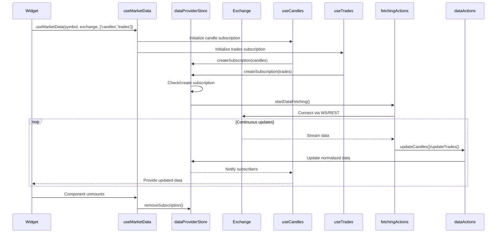
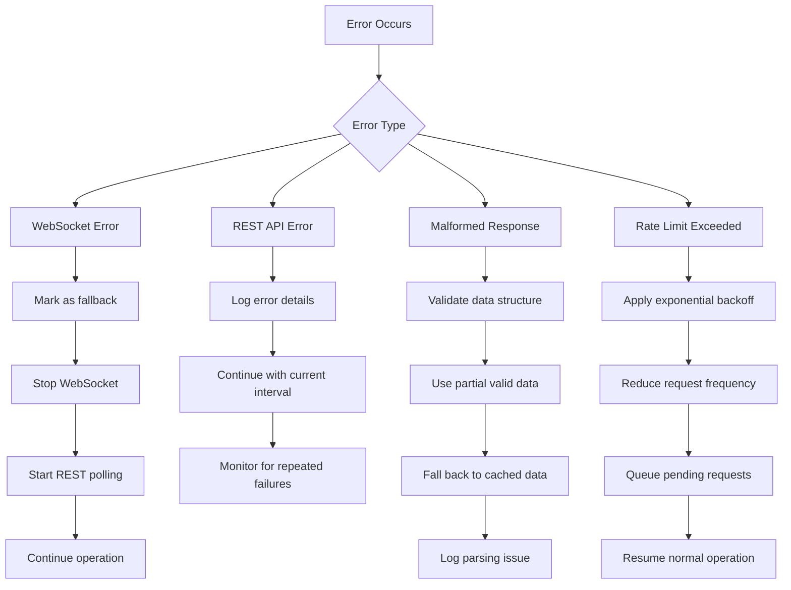

# Market Data Acquisition

<cite>
**Referenced Files in This Document**   
- [dataProviderStore.ts](file://src/store/dataProviderStore.ts)
- [subscriptionActions.ts](file://src/store/actions/subscriptionActions.ts)
- [fetchingActions.ts](file://src/store/actions/fetchingActions.ts)
- [dataActions.ts](file://src/store/actions/dataActions.ts)
- [useDataProvider.ts](file://src/hooks/useDataProvider.ts)
</cite>

## Table of Contents
1. [Dual-Path Architecture Overview](#dual-path-architecture-overview)
2. [Subscription Lifecycle](#subscription-lifecycle)
3. [Data Normalization and Caching](#data-normalization-and-caching)
4. [dataProviderStore and Subscription Management](#dataproviderstore-and-subscription-management)
5. [Widget Integration and Data Requests](#widget-integration-and-data-requests)
6. [Error Handling Strategies](#error-handling-strategies)
7. [Performance Implications and Strategy Selection](#performance-implications-and-strategy-selection)

## Dual-Path Architecture Overview

The market data acquisition system in profitmaker implements a dual-path architecture that supports both WebSocket (real-time) and REST (polling/fallback) data fetching strategies. This design ensures optimal performance while maintaining reliability across different exchange capabilities and network conditions.

By default, the system uses WebSocket connections through CCXT Pro for real-time data streaming when available. The initial state configuration sets the default data fetch method to 'websocket' with predefined REST polling intervals as fallbacks for exchanges that don't support WebSockets or when connection issues occur.

**Diagram sources**
- [dataProviderStore.ts](file://src/store/dataProviderStore.ts#L20-L118)
- [fetchingActions.ts](file://src/store/actions/fetchingActions.ts#L16-L741)

**Section sources**
- [dataProviderStore.ts](file://src/store/dataProviderStore.ts#L20-L118)
- [fetchingActions.ts](file://src/store/actions/fetchingActions.ts#L16-L741)

## Subscription Lifecycle

The subscription lifecycle begins when a widget requests market data and progresses through several stages: creation, activation, data fetching, and termination. The process is managed by the `subscribe` function in the subscription actions, which handles deduplication across multiple subscribers requesting the same data.

When a subscription is created, the system first checks if an identical subscription already exists. If found, it increments the subscriber count rather than creating a duplicate. Each subscription contains metadata including exchange, symbol, data type, timeframe, market type, subscriber count, method (WebSocket or REST), active status, last update timestamp, and configuration parameters.

**Diagram sources**
- [subscriptionActions.ts](file://src/store/actions/subscriptionActions.ts#L10-L105)
- [fetchingActions.ts](file://src/store/actions/fetchingActions.ts#L16-L741)

**Section sources**
- [subscriptionActions.ts](file://src/store/actions/subscriptionActions.ts#L10-L105)

## Data Normalization and Caching

Data normalization ensures consistent formatting across different exchanges and data types. The system transforms raw exchange responses into standardized formats for candles, trades, order books, balances, and tickers before storing them in the centralized data store.

Caching occurs at multiple levels:
1. **In-memory caching**: All market data is stored in the Zustand store with hierarchical organization by exchange, market, symbol, and timeframe
2. **Timestamp tracking**: Each data point includes timestamps for both the data itself and the last update
3. **Expiration policies**: Ticker data has a configurable maximum age (default 10 minutes) after which it's considered stale
4. **Local storage persistence**: Key store elements like providers and settings are persisted to localStorage

The caching strategy varies by data type:
- Candles: Complete historical series with WebSocket incremental updates
- Trades: Rolling window of last 1000 trades
- Order book: Full depth with bid/ask arrays
- Balances: Timestamped snapshots with currency breakdowns
- Tickers: Cached with expiration based on configured maxAge

**Diagram sources**
- [dataActions.ts](file://src/store/actions/dataActions.ts#L75-L941)
- [dataProviderStore.ts](file://src/store/dataProviderStore.ts#L20-L118)

**Section sources**
- [dataActions.ts](file://src/store/actions/dataActions.ts#L75-L941)

## dataProviderStore and Subscription Management

The dataProviderStore serves as the central hub for managing all market data subscriptions and provider configurations. It maintains a registry of active subscriptions with deduplication capabilities, ensuring that multiple widgets requesting the same data source share a single connection rather than creating redundant ones.

Key features of the subscription management system include:
- **Deduplication**: Multiple subscribers to the same data source increment a counter rather than creating separate subscriptions
- **Method synchronization**: When the global data fetch method changes, all active subscriptions are automatically restarted with the new method
- **Provider selection**: Automatic selection of optimal provider for each exchange, with ability to specify provider per subscription
- **Lifecycle tracking**: Monitoring of subscription state, last update times, and activity status

The store also manages fallback mechanisms, automatically switching from WebSocket to REST when WebSocket connections fail or when an exchange doesn't support WebSocket methods for specific data types.

**Diagram sources**
- [dataProviderStore.ts](file://src/store/dataProviderStore.ts#L20-L118)
- [subscriptionActions.ts](file://src/store/actions/subscriptionActions.ts#L10-L105)

**Section sources**
- [dataProviderStore.ts](file://src/store/dataProviderStore.ts#L20-L118)

## Widget Integration and Data Requests

Widgets initiate data requests through custom React hooks that abstract the complexity of the underlying subscription system. The primary integration points are the `useMarketData` hook and specialized hooks like `useCandles`, `useTrades`, and `useOrderBook`.

The `useMarketData` hook provides a unified interface for requesting multiple data types simultaneously:

Each specialized hook (e.g., `useCandles`) generates a unique subscription ID based on the provider, exchange, symbol, data type, dashboard, and widget identifiers, ensuring proper isolation and cleanup when components are destroyed.

**Diagram sources**
- [useDataProvider.ts](file://src/hooks/useDataProvider.ts#L228-L280)
- [fetchingActions.ts](file://src/store/actions/fetchingActions.ts#L16-L741)

**Section sources**
- [useDataProvider.ts](file://src/hooks/useDataProvider.ts#L228-L280)

## Error Handling Strategies

The system implements comprehensive error handling for various failure scenarios including network interruptions, rate limiting, malformed responses, and WebSocket disconnections.

For WebSocket connections, the system employs automatic fallback to REST polling when:
- CCXT Pro is unavailable
- The exchange doesn't support the required WebSocket method
- Connection errors occur during streaming
- Authentication fails

When such conditions are detected, the subscription is marked with `isFallback: true` and seamlessly switches to REST polling without disrupting the user experience.

Rate limiting is managed through:
- Configurable REST polling intervals per data type
- Exchange-specific rate limit awareness
- Adaptive retry mechanisms with exponential backoff
- Request batching where supported by exchanges

Malformed response handling includes:
- Comprehensive validation of incoming data structures
- Graceful degradation when partial data is received
- Detailed logging for debugging purposes
- Fallback to cached data when fresh data cannot be retrieved

Network interruption recovery features:
- Automatic reconnection attempts for WebSocket streams
- Preservation of subscription state during temporary outages
- Resumption of data fetching from last known good state
- Notification of connection status changes to UI components

**Diagram sources**
- [fetchingActions.ts](file://src/store/actions/fetchingActions.ts#L16-L741)
- [dataActions.ts](file://src/store/actions/dataActions.ts#L75-L941)

**Section sources**
- [fetchingActions.ts](file://src/store/actions/fetchingActions.ts#L16-L741)

## Performance Implications and Strategy Selection

The choice between WebSocket and REST strategies involves trade-offs between latency, bandwidth usage, and reliability. Understanding these implications helps guide appropriate method selection based on use case requirements.

**WebSocket Advantages:**
- Near real-time updates (sub-second latency)
- Lower bandwidth consumption for frequent updates
- Server push model reduces client processing overhead
- Better battery efficiency on mobile devices

**WebSocket Disadvantages:**
- Higher memory usage due to persistent connections
- More complex error recovery and reconnection logic
- Limited browser connection limits (typically 6-8 per origin)
- Firewall/proxy compatibility issues in some environments

**REST Advantages:**
- Simpler implementation and debugging
- Better compatibility with restrictive networks
- Predictable resource usage patterns
- Easier rate limit management

**REST Disadvantages:**
- Higher latency due to polling intervals
- Increased bandwidth from repeated full responses
- Server load from frequent polling requests
- Potential for missed updates between polls

The system provides guidance for strategy selection:
- **Real-time trading interfaces**: Use WebSocket for order books and trades
- **Historical analysis tools**: Use REST with larger intervals for candles
- **Background monitoring**: Use longer REST intervals to conserve resources
- **Mobile applications**: Consider hybrid approach with WebSocket only for active views

Configuration options allow tuning of REST polling intervals by data type, with defaults optimized for typical use cases:
- Trades: 1 second
- Candles: 5 seconds  
- Order book: 0.5 seconds
- Balance: 30 seconds
- Ticker: 10 minutes

Users can modify these settings based on their specific needs and network conditions.

**Section sources**
- [dataProviderStore.ts](file://src/store/dataProviderStore.ts#L20-L118)
- [dataActions.ts](file://src/store/actions/dataActions.ts#L75-L941)