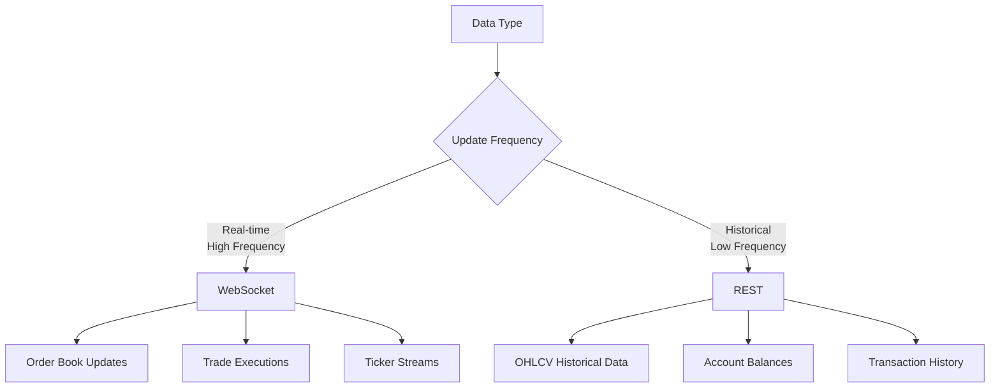
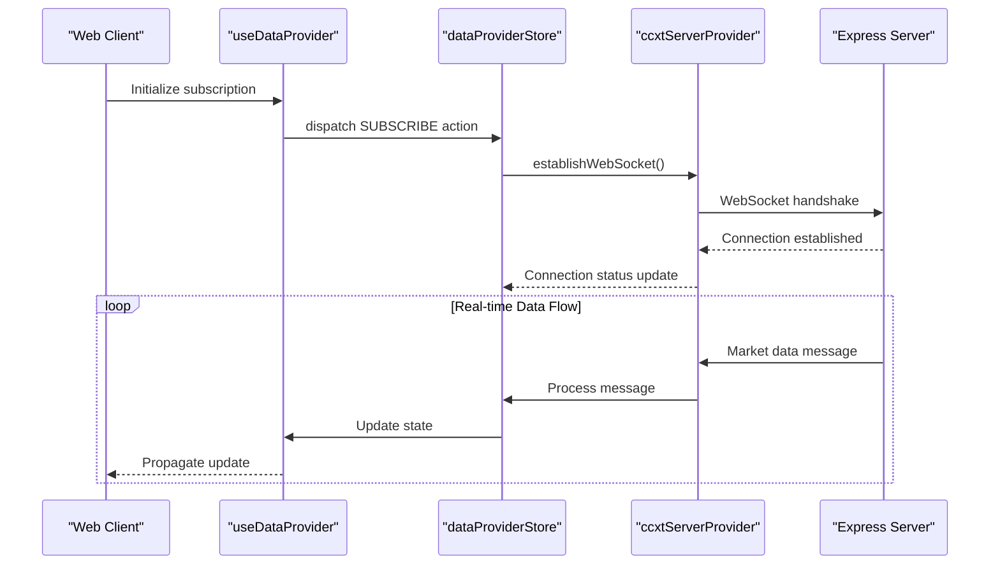
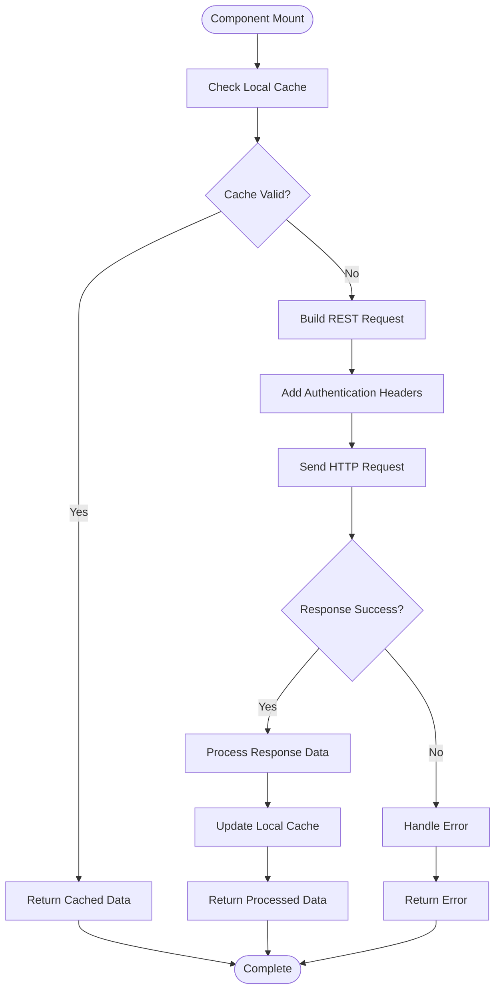
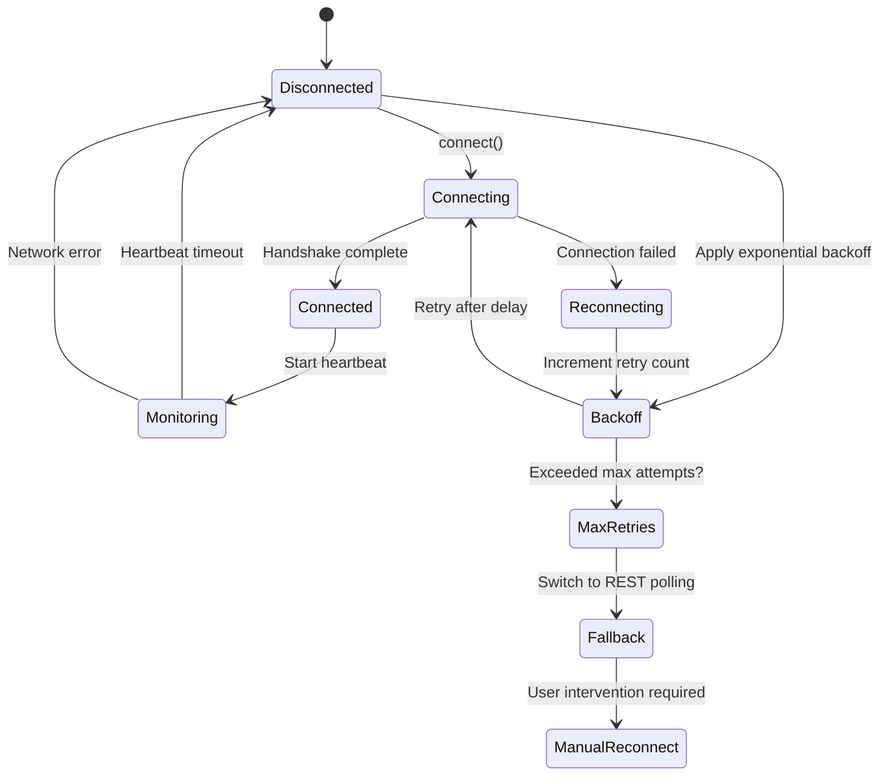
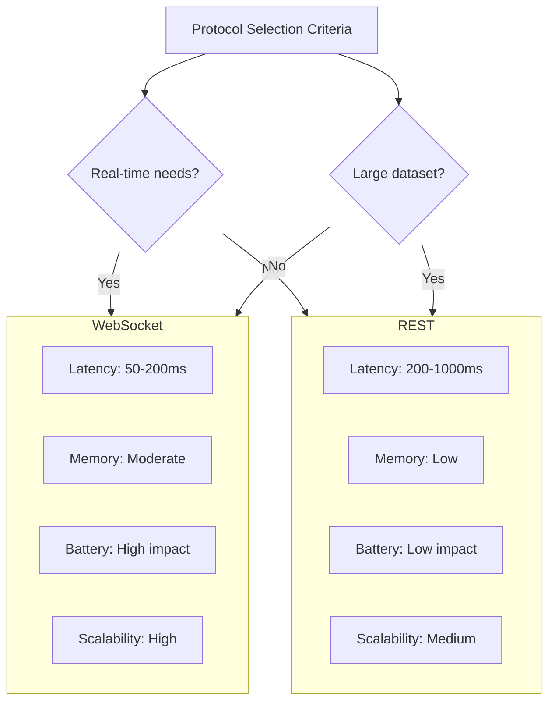
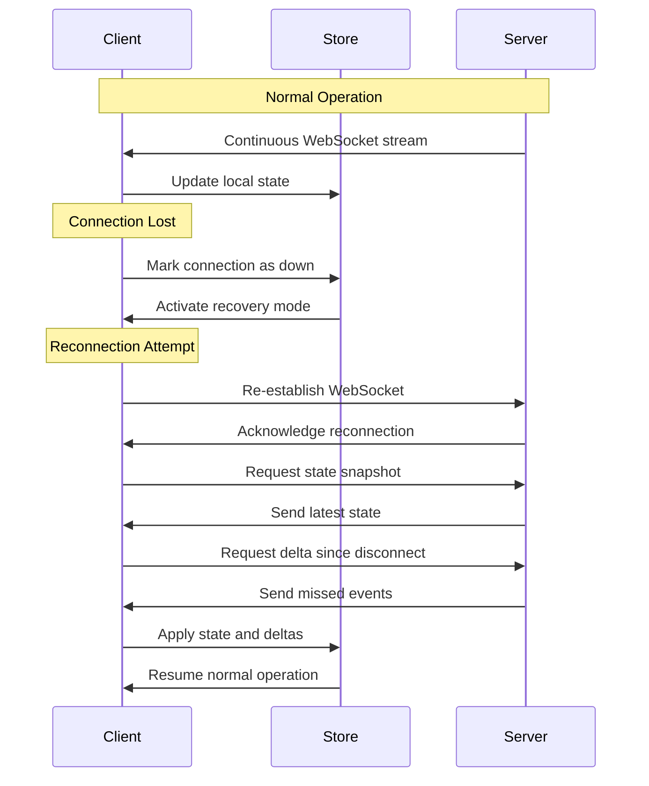

# WebSocket vs REST Strategies

<cite>
**Referenced Files in This Document**   
- [express.ts](file://express.ts)
- [useDataProvider.ts](file://src/hooks/useDataProvider.ts)
- [dataProviderStore.ts](file://src/store/dataProviderStore.ts)
- [ccxtServerProvider.ts](file://src/store/providers/ccxtServerProvider.ts)
- [ccxtBrowserProvider.ts](file://src/store/providers/ccxtBrowserProvider.ts)
- [webSocketUtils.ts](file://src/store/utils/webSocketUtils.ts)
- [subscriptionActions.ts](file://src/store/actions/subscriptionActions.ts)
- [dataActions.ts](file://src/store/actions/dataActions.ts)
- [chartWidgetStore.ts](file://src/store/chartWidgetStore.ts)
- [orderBookWidgetStore.ts](file://src/store/orderBookWidgetStore.ts)
- [tradesWidgetStore.ts](file://src/store/tradesWidgetStore.ts)
</cite>

## Table of Contents
1. [Introduction](#introduction)
2. [Data Strategy Overview](#data-strategy-overview)
3. [WebSocket Implementation](#websocket-implementation)
4. [REST API Usage](#rest-api-usage)
5. [Connection Management System](#connection-management-system)
6. [Message Formats](#message-formats)
7. [Performance and Resource Considerations](#performance-and-resource-considerations)
8. [Configuration Guidelines](#configuration-guidelines)
9. [Disconnection Handling and State Recovery](#disconnection-handling-and-state-recovery)
10. [Conclusion](#conclusion)

## Introduction
The profitmaker application employs a hybrid data strategy combining WebSocket and REST protocols to optimize performance, reliability, and user experience across different data types and use cases. This document details the architecture, implementation, and operational characteristics of both communication strategies within the system.

## Data Strategy Overview
profitmaker implements a dual-protocol approach for data transmission, strategically selecting between WebSocket and REST based on data characteristics, update frequency requirements, and client resource constraints.



**Diagram sources**
- [dataProviderStore.ts](file://src/store/dataProviderStore.ts#L25-L80)
- [useDataProvider.ts](file://src/hooks/useDataProvider.ts#L15-L45)

**Section sources**
- [dataProviderStore.ts](file://src/store/dataProviderStore.ts#L1-L100)
- [useDataProvider.ts](file://src/hooks/useDataProvider.ts#L1-L60)

## WebSocket Implementation
WebSocket connections are used for real-time market data delivery, providing low-latency updates for time-sensitive trading information. The system establishes persistent connections to the server for continuous data streaming.

### Connection Architecture


**Diagram sources**
- [ccxtServerProvider.ts](file://src/store/providers/ccxtServerProvider.ts#L30-L90)
- [webSocketUtils.ts](file://src/store/utils/webSocketUtils.ts#L10-L50)
- [subscriptionActions.ts](file://src/store/actions/subscriptionActions.ts#L20-L40)

**Section sources**
- [ccxtServerProvider.ts](file://src/store/providers/ccxtServerProvider.ts#L1-L120)
- [webSocketUtils.ts](file://src/store/utils/webSocketUtils.ts#L1-L80)

### Message Format for Real-time Updates
WebSocket messages follow a standardized JSON structure with type discrimination:

```json
{
  "type": "orderbook_update",
  "symbol": "BTC/USDT",
  "exchange": "binance",
  "timestamp": 1701234567890,
  "data": {
    "asks": [[35000.00, 1.2], [35001.50, 0.8]],
    "bids": [[34999.00, 0.9], [34998.75, 1.5]]
  }
}
```

**Section sources**
- [dataActions.ts](file://src/store/actions/dataActions.ts#L45-L75)
- [ccxtServerProvider.ts](file://src/store/providers/ccxtServerProvider.ts#L60-L85)

## REST API Usage
REST endpoints handle batched historical data requests and infrequent data fetches, providing efficient retrieval of large datasets without maintaining persistent connections.

### Request Patterns


**Diagram sources**
- [ccxtBrowserProvider.ts](file://src/store/providers/ccxtBrowserProvider.ts#L20-L60)
- [dataProviderStore.ts](file://src/store/dataProviderStore.ts#L45-L75)

**Section sources**
- [ccxtBrowserProvider.ts](file://src/store/providers/ccxtBrowserProvider.ts#L1-L80)
- [dataProviderStore.ts](file://src/store/dataProviderStore.ts#L30-L90)

### Batch Response Structure
Historical OHLCV data is delivered in standardized array format:

```json
{
  "symbol": "ETH/USDT",
  "timeframe": "1h",
  "data": [
    [1701234000000, 2500.00, 2510.50, 2495.25, 2508.75, 1500.2],
    [1701237600000, 2508.75, 2515.00, 2502.10, 2512.30, 1345.8]
  ],
  "columns": ["timestamp", "open", "high", "low", "close", "volume"]
}
```

**Section sources**
- [dataActions.ts](file://src/store/actions/dataActions.ts#L30-L44)
- [chartWidgetStore.ts](file://src/store/chartWidgetStore.ts#L15-L35)

## Connection Management System
The application implements a robust connection management system with automatic reconnection, heartbeat monitoring, and fallback mechanisms.

### Reconnection Logic


**Diagram sources**
- [webSocketUtils.ts](file://src/store/utils/webSocketUtils.ts#L20-L70)
- [ccxtServerProvider.ts](file://src/store/providers/ccxtServerProvider.ts#L45-L65)

**Section sources**
- [webSocketUtils.ts](file://src/store/utils/webSocketUtils.ts#L1-L80)
- [ccxtServerProvider.ts](file://src/store/providers/ccxtServerProvider.ts#L30-L90)

## Message Formats
The system uses distinct message formats optimized for each protocol's characteristics and use case.

### WebSocket Message Types
| Type | Purpose | Frequency | Example Use Case |
|------|-------|-----------|----------------|
| orderbook_update | Order book level changes | High (ms) | OrderBookWidget |
| trade_execution | Trade fill notifications | Medium (ms) | MyTradesWidget |
| ticker_update | Price and volume updates | High (ms) | MarketDataWidget |
| heartbeat | Connection health check | Regular (30s) | Connection monitoring |

**Section sources**
- [dataActions.ts](file://src/store/actions/dataActions.ts#L15-L50)
- [eventActions.ts](file://src/store/actions/eventActions.ts#L10-L30)

### REST Response Characteristics
| Endpoint | Data Type | Response Size | Refresh Interval | Caching Strategy |
|---------|---------|--------------|------------------|------------------|
| /ohlcv | Historical price data | Large (KB-MB) | Configurable (1m-24h) | Time-based invalidation |
| /balances | Account balances | Small (KB) | 30s-5m | Stale-while-revalidate |
| /orders | Open orders | Medium (KB) | 15s-1m | Immediate refresh |
| /history | Transaction history | Variable | On-demand | Persistent storage |

**Section sources**
- [dataProviderStore.ts](file://src/store/dataProviderStore.ts#L50-L85)
- [fetchingActions.ts](file://src/store/actions/fetchingActions.ts#L20-L45)

## Performance and Resource Considerations
The dual-protocol strategy balances performance requirements with client resource constraints.

### Comparative Analysis


**Diagram sources**
- [dataProviderStore.ts](file://src/store/dataProviderStore.ts#L90-L120)
- [useDataProvider.ts](file://src/hooks/useDataProvider.ts#L30-L50)

**Section sources**
- [dataProviderStore.ts](file://src/store/dataProviderStore.ts#L80-L130)
- [useDataProvider.ts](file://src/hooks/useDataProvider.ts#L20-L60)

## Configuration Guidelines
Optimal performance requires careful configuration of refresh intervals and subscription densities.

### Recommended Settings
| Widget Type | Protocol | Refresh Interval | Subscription Density | Notes |
|------------|--------|------------------|---------------------|-------|
| Chart | REST | 1m-15m | 1-3 symbols | Longer intervals for higher timeframes |
| Order Book | WebSocket | Real-time | 1 symbol | High density impacts performance |
| Trades | WebSocket | Real-time | 1-2 symbols | Consider filtering options |
| Portfolio | REST | 30s-5m | All accounts | Balance criticality determines frequency |
| Market Data | WebSocket | Real-time | 5-10 symbols | UI rendering limits apply |

**Section sources**
- [chartWidgetStore.ts](file://src/store/chartWidgetStore.ts#L10-L40)
- [orderBookWidgetStore.ts](file://src/store/orderBookWidgetStore.ts#L15-L35)
- [tradesWidgetStore.ts](file://src/store/tradesWidgetStore.ts#L20-L45)

## Disconnection Handling and State Recovery
The system implements comprehensive disconnection handling with minimal data loss through state synchronization mechanisms.

### State Recovery Process


**Diagram sources**
- [webSocketUtils.ts](file://src/store/utils/webSocketUtils.ts#L50-L90)
- [providerUtils.ts](file://src/store/utils/providerUtils.ts#L25-L55)
- [ccxtServerProvider.ts](file://src/store/providers/ccxtServerProvider.ts#L70-L100)

**Section sources**
- [webSocketUtils.ts](file://src/store/utils/webSocketUtils.ts#L40-L100)
- [ccxtServerProvider.ts](file://src/store/providers/ccxtServerProvider.ts#L60-L110)

## Conclusion
The profitmaker application effectively leverages both WebSocket and REST protocols to deliver optimal performance across different data types and user requirements. WebSocket provides real-time capabilities for order books and trade executions, while REST efficiently handles historical data retrieval and less frequent updates. The sophisticated connection management system ensures reliability through automatic reconnection, heartbeat monitoring, and state recovery mechanisms. Careful configuration of refresh intervals and subscription densities allows users to balance data freshness with resource consumption, making the system adaptable to various trading strategies and device capabilities.