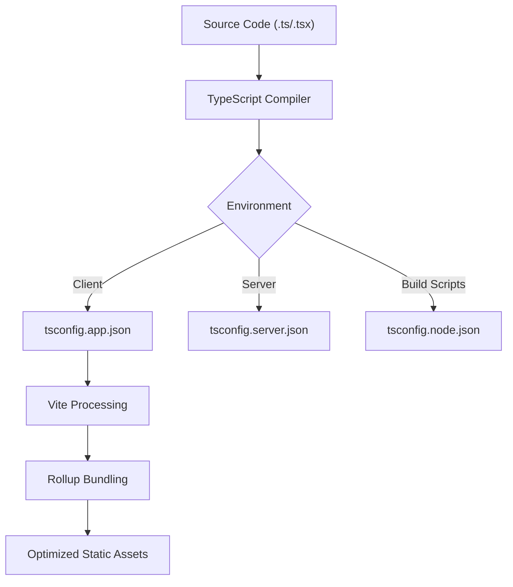
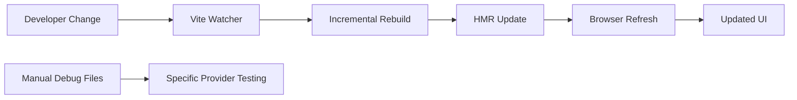

# Development Guide

<cite>
**Referenced Files in This Document**   
- [package.json](file://package.json)
- [vite.config.ts](file://vite.config.ts)
- [eslint.config.js](file://eslint.config.js)
- [tsconfig.json](file://tsconfig.json)
- [tsconfig.app.json](file://tsconfig.app.json)
- [tsconfig.node.json](file://tsconfig.node.json)
- [tsconfig.server.json](file://tsconfig.server.json)
- [CONTRIBUTING.md](file://CONTRIBUTING.md)
</cite>

## Table of Contents
1. [Development Environment Setup](#development-environment-setup)
2. [Build Process and TypeScript Compilation](#build-process-and-typescript-compilation)
3. [Coding Standards and Formatting](#coding-standards-and-formatting)
4. [Testing Strategies](#testing-strategies)
5. [Contribution Workflow](#contribution-workflow)
6. [Debugging Techniques and Developer Tools](#debugging-techniques-and-developer-tools)
7. [Deployment Considerations](#deployment-considerations)

## Development Environment Setup

To contribute effectively to the profitmaker codebase, developers must set up a consistent development environment using modern tooling aligned with the project's architecture.

The project is built on a React + TypeScript stack using Vite as the build tool and ShadCN UI components for the frontend interface. Node.js version 18 or higher is required due to ES2022+ language features used in configuration files.

### Required Tools
- **Node.js** (v18+ recommended)
- **npm** or **yarn** package manager
- **TypeScript** (version defined in `package.json`)
- **Vite** (development server and bundler)
- **ESLint** (code linting)
- **Vitest** (testing framework)
- **tsx** (TypeScript execution for server scripts)

### Installation Steps
1. Clone the repository: `git clone https://github.com/kupi-network/profitmaker.git`
2. Navigate into the project directory: `cd profitmaker`
3. Install dependencies: `npm install`
4. Start the development server: `npm run dev`

The application runs on port 8080 by default, as configured in `vite.config.ts`. The development server supports hot module replacement (HMR) for rapid iteration.

**Section sources**
- [package.json](file://package.json#L5-L15)
- [vite.config.ts](file://vite.config.ts#L10-L15)

## Build Process and TypeScript Compilation

The build process is managed by Vite, which provides fast development server startup and optimized production builds through Rollup under the hood.

### Vite Configuration Overview
The `vite.config.ts` file defines key settings:
- Server listens on IPv6 (`::`) and port 8080
- Uses SWC-based React plugin for faster compilation
- Implements path aliasing (`@/` maps to `/src`)
- Excludes problematic Node.js modules from browser bundle
- Prevents pre-bundling of CCXT library due to its complex dependency tree

Production builds are generated using `npm run build`, while development builds can be created with `npm run build:dev` for testing non-minified output.

### TypeScript Configuration
The project uses a multi-config TypeScript setup:
- `tsconfig.app.json`: Configures compilation for client-side application code
- `tsconfig.node.json`: Used for Vite configuration and build scripts
- `tsconfig.server.json`: For Express backend server (if applicable)
- `tsconfig.json`: Root configuration referencing all sub-configs

Key compiler options include relaxed type checking (`strict: false`) to accommodate legacy patterns, path mapping via `baseUrl` and `paths`, and support for JSX syntax.

**Diagram sources**
- [tsconfig.app.json](file://tsconfig.app.json#L1-L31)
- [tsconfig.node.json](file://tsconfig.node.json#L1-L23)
- [vite.config.ts](file://vite.config.ts#L1-L69)

**Section sources**
- [vite.config.ts](file://vite.config.ts#L1-L69)
- [tsconfig.json](file://tsconfig.json#L1-L20)
- [tsconfig.app.json](file://tsconfig.app.json#L1-L31)
- [tsconfig.node.json](file://tsconfig.node.json#L1-L23)

## Coding Standards and Formatting

Code quality is enforced through ESLint with TypeScript integration and React-specific rules.

### ESLint Configuration
The `eslint.config.js` file sets up:
- Base rules from `@eslint/js` and `typescript-eslint`
- React Hooks best practices enforcement
- React Refresh compatibility warnings
- Browser global environment definitions
- Exemption for unused variables (to reduce noise during development)

Notably, `@typescript-eslint/no-unused-vars` is disabled in favor of more granular control, allowing developers flexibility during active development phases.

### Recommended Editor Setup
For optimal experience, configure your IDE with:
- Automatic ESLint rule application on save
- TypeScript language service integration
- Path alias resolution (`@/*` → `src/*`)
- Prettier formatting (if added later)

While no explicit formatter like Prettier is currently configured, consistent indentation and brace style should follow existing patterns in the codebase.

**Section sources**
- [eslint.config.js](file://eslint.config.js#L1-L30)

## Testing Strategies

The project uses Vitest as the primary testing framework, providing Jest-compatible APIs with faster execution through Vite's native ES module handling.

### Available Test Commands
- `npm test`: Run all tests in CLI mode
- `npm run test:ui`: Launch interactive test browser interface

Test files should be co-located with source files or placed in a parallel `__tests__` structure. The current configuration does not specify test file location conventions.

### Test Environment
- Global test utilities enabled
- Node.js environment by default
- Full access to application code via path aliases
- Integration with React testing libraries implied by dependencies

Currently, there is no explicit documentation of unit, integration, or end-to-end testing strategies beyond the basic setup. Developers are encouraged to follow React best practices for component testing using `@testing-library/react`.

**Section sources**
- [package.json](file://package.json#L12-L14)

## Contribution Workflow

The contribution process follows standard Git-based open-source practices, though formal guidelines are still being developed.

### Current Status
As noted in `CONTRIBUTING.md`, the contribution guidelines are a work in progress. However, standard practices can be inferred from the tooling and structure:

1. Create a feature branch from main
2. Make changes following coding standards
3. Run tests locally (`npm test`)
4. Commit changes with descriptive messages
5. Push branch and create pull request
6. Address review feedback
7. Merge upon approval

Security vulnerabilities should be reported privately via email rather than public issues.

### Branching Strategy
While not explicitly documented, a conventional branching model is assumed:
- `main` branch: stable production code
- Feature branches: `feature/descriptive-name`
- Bugfix branches: `fix/issue-description`
- Release branches: `release/vX.Y.Z`

**Section sources**
- [CONTRIBUTING.md](file://CONTRIBUTING.md#L1-L10)

## Debugging Techniques and Developer Tools

Effective debugging combines browser developer tools with project-specific utilities.

### Development Server Features
- Hot Module Replacement (HMR) for instant UI updates
- Detailed error overlays in browser
- Source map support for TypeScript debugging
- Custom component tagging in development (via `lovable-tagger`)

### Recommended Tools
- **Browser DevTools**: Inspect React component hierarchy, state, and props
- **Vite Dev Server**: Monitor build performance and asset loading
- **Console Logging**: Strategic use of `console.log` throughout components
- **React Query Devtools**: Included in dependencies for API inspection

The presence of debug HTML files (`debug_bingx_balance.html`, etc.) suggests manual testing workflows are used for specific exchange integrations.

**Diagram sources**
- [vite.config.ts](file://vite.config.ts#L1-L69)
- [package.json](file://package.json#L10-L11)

**Section sources**
- [vite.config.ts](file://vite.config.ts#L1-L69)
- [package.json](file://package.json#L10-L11)

## Deployment Considerations

Deployment configurations support both development and production environments with distinct optimization profiles.

### Development Deployment
- Served via Vite dev server on port 8080
- No minification or compression
- Full source maps available
- HMR enabled
- Externalized Node.js modules excluded from bundle

### Production Deployment
- Built using `vite build` command
- Optimized assets with hashing
- Minified JavaScript bundles
- Tree-shaken dependencies
- Preload/prefetch hints for critical resources

The `vercel.json` file indicates deployment likely occurs on Vercel, though its contents were not retrieved. Environment-specific configurations are managed through Vite's mode system (`--mode development` vs default production mode).

External Node.js modules listed in `vite.config.ts` are properly excluded from browser bundles, preventing bundling errors when importing packages that depend on Node core modules.

**Section sources**
- [vite.config.ts](file://vite.config.ts#L50-L65)
- [package.json](file://package.json#L7-L9)