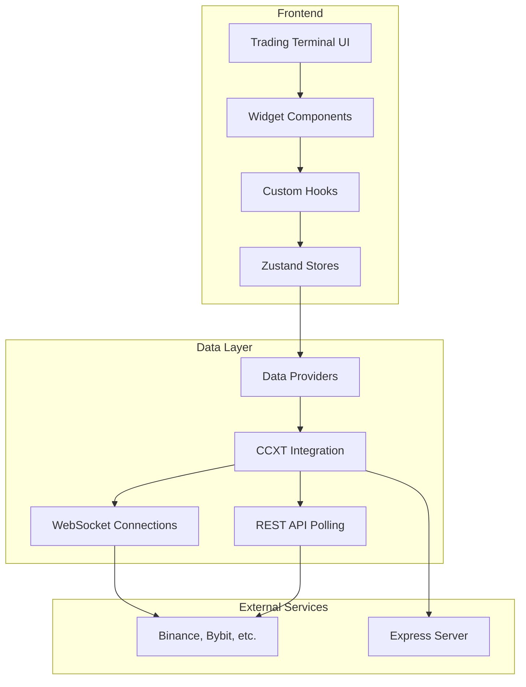
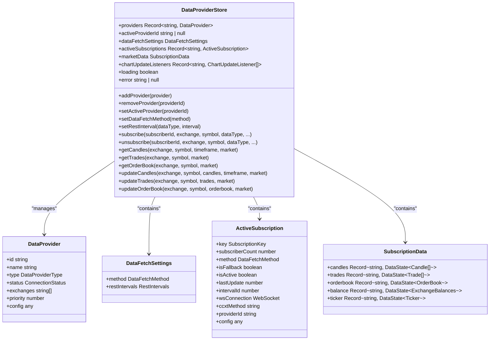
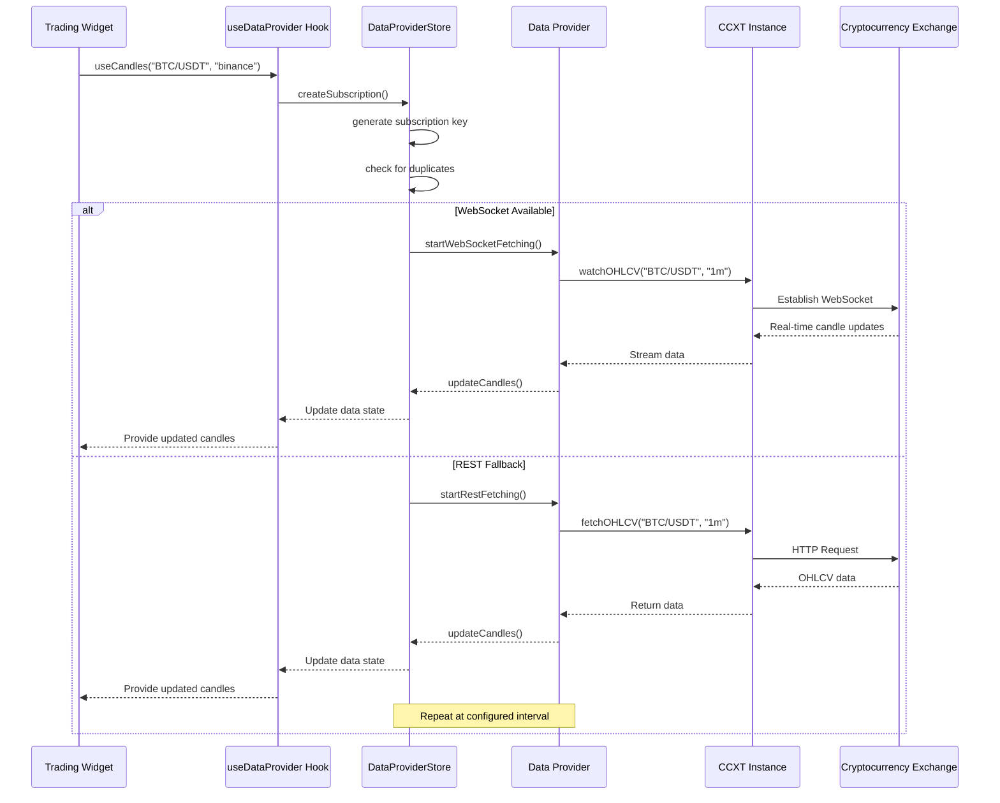

# Project Overview

<cite>
**Referenced Files in This Document**   
- [README.md](file://README.md)
- [src/components/widgets/README.md](file://src/components/widgets/README.md)
- [src/store/README.md](file://src/store/README.md)
- [src/store/dataProviderStore.ts](file://src/store/dataProviderStore.ts)
- [src/store/types.ts](file://src/store/types.ts)
- [src/types/dataProviders.ts](file://src/types/dataProviders.ts)
- [src/hooks/useDataProvider.ts](file://src/hooks/useDataProvider.ts)
- [src/store/actions/fetchingActions.ts](file://src/store/actions/fetchingActions.ts)
- [src/store/actions/dataActions.ts](file://src/store/actions/dataActions.ts)
</cite>

## Table of Contents
1. [Introduction](#introduction)
2. [Core Architecture](#core-architecture)
3. [Data Provider System](#data-provider-system)
4. [State Management with Zustand](#state-management-with-zustand)
5. [Real-Time Data Acquisition](#real-time-data-acquisition)
6. [Key Features](#key-features)
7. [User Workflows](#user-workflows)
8. [System Context and Data Flow](#system-context-and-data-flow)

## Introduction

Profitmaker is an open-source cryptocurrency trading terminal that supports over 100 exchanges through integration with CCXT (CryptoCurrency eXchange Trading). The platform enables users to manage multiple exchange accounts, execute trades, track portfolios, and customize their trading interface through a widget-based dashboard system. A key security feature is that API keys remain on the user's local machine, never transmitted to external servers.

The application provides real-time market data through WebSocket connections while offering REST API fallbacks for exchanges without WebSocket support. It features a modular architecture built with React for the frontend, Zustand for state management, and TypeScript for type safety across the codebase. The system supports both spot and futures markets across various exchanges, allowing traders to monitor and interact with multiple markets simultaneously.

This document provides a comprehensive overview of Profitmaker's architecture, focusing on its widget-based UI system, state management approach, real-time data acquisition mechanisms, and key trading features. The documentation uses terminology consistent with the codebase such as 'widgets', 'data providers', 'dashboard', and 'trading terminal' to ensure alignment between technical implementation and conceptual understanding.

**Section sources**
- [README.md](file://README.md#L0-L149)

## Core Architecture

Profitmaker follows a component-based architecture with clear separation of concerns between UI presentation, state management, and data acquisition layers. The system is organized into several core directories: components, store, hooks, services, and types. The component directory contains reusable UI elements including generic UI components and specialized trading widgets. The store directory implements centralized state management using Zustand, handling everything from market data to user preferences. Custom hooks provide a clean interface between components and the underlying state management system, while service modules handle specific business logic like order execution.

The application's entry point is structured around a main TradingTerminal component that orchestrates the dashboard layout and widget management. Widget positioning and sizing are handled through a context-based system that tracks active widgets, their positions, and z-index values. This allows users to freely arrange their trading interface by dragging and resizing widgets across the workspace. The theme system supports customization of the terminal's appearance, with color schemes and visual styles that can be adjusted through settings.

At the architectural level, Profitmaker implements a modular design pattern where functionality is separated into distinct but interconnected modules. This approach enhances maintainability and extensibility, allowing new features to be added without disrupting existing functionality. The use of TypeScript interfaces ensures type safety throughout the application, reducing runtime errors and improving developer experience. The build process leverages Vite for fast development server startup and optimized production builds.

**Diagram sources **
- [src/components/widgets/README.md](file://src/components/widgets/README.md#L0-L27)
- [src/store/README.md](file://src/store/README.md#L0-L100)

## Data Provider System

The data provider system in Profitmaker serves as the central mechanism for acquiring financial market data from various exchanges. This modular architecture allows the application to support multiple data sources while maintaining a consistent interface for components that consume this data. The system is designed to work with different provider types including CCXT Browser, CCXT Server, and potential future integrations like MarketMaker.cc or custom server adapters.

Each data provider represents a connection to one or more exchanges and manages the configuration required for data retrieval, such as API keys, sandbox mode settings, and server URLs. The provider system supports automatic selection of optimal data fetching methods based on exchange capabilities, choosing between WebSocket streams for real-time updates and REST API polling as a fallback. When multiple providers are configured for the same exchange, the system implements intelligent routing based on provider priority and availability.

The data provider implementation includes sophisticated deduplication logic that prevents redundant subscriptions when multiple widgets request the same market data. For example, if two chart widgets subscribe to BTC/USDT candles from Binance, the system creates only one underlying WebSocket connection and shares the data between both consumers. This optimization reduces network overhead and conserves exchange rate limits. The provider system also handles automatic reconnection when WebSocket connections are interrupted, ensuring continuous data flow with minimal disruption to the user experience.

**Section sources**
- [src/components/widgets/README.md](file://src/components/widgets/README.md#L0-L27)
- [src/types/dataProviders.ts](file://src/types/dataProviders.ts#L0-L337)

## State Management with Zustand

Profitmaker utilizes Zustand as its primary state management solution, providing a lightweight yet powerful approach to managing application state. The state architecture is centered around several specialized stores, with the dataProviderStore serving as the core module for market data management. This store maintains a centralized repository of all market information including candles, trades, order books, balances, and tickers, organized by exchange, market type, symbol, and timeframe.

The Zustand store implementation follows a modular pattern where functionality is separated into distinct action files that are composed together at initialization. This approach improves code organization and maintainability by isolating concerns such as provider management, subscription handling, data operations, and fetching logic. The store uses Immer middleware to enable mutable-style syntax for state updates while maintaining immutable semantics, simplifying complex state transformations. Additionally, the subscribeWithSelector middleware allows components to subscribe to specific slices of state, preventing unnecessary re-renders.

State persistence is implemented using Zustand's persist middleware, which automatically saves and restores critical configuration such as provider settings and data fetch preferences. The store exposes a rich set of actions and selectors that enable components to interact with the state in a type-safe manner. For example, the `subscribe` action handles deduplicated subscription creation, while `getCandles`, `getTrades`, and `getOrderBook` selectors provide access to market data with proper typing. The event system within the store enables communication between components, particularly for chart widgets that need to respond to data updates.

**Diagram sources **
- [src/store/dataProviderStore.ts](file://src/store/dataProviderStore.ts#L0-L118)
- [src/store/types.ts](file://src/store/types.ts#L0-L156)
- [src/types/dataProviders.ts](file://src/types/dataProviders.ts#L0-L337)

## Real-Time Data Acquisition

Profitmaker's real-time data acquisition system implements a sophisticated dual-mode approach that prioritizes WebSocket connections for immediate data delivery while maintaining REST API polling as a reliable fallback. The system automatically selects the optimal data fetching method based on exchange capabilities and network conditions, ensuring continuous market data flow even when WebSocket connections are unavailable. When a WebSocket connection is established, it delivers real-time updates for candles, trades, order books, and balances with minimal latency.

The data acquisition process begins with subscription requests from widgets, which are normalized into unique subscription keys based on exchange, symbol, data type, timeframe, and market parameters. These keys enable the system to detect and eliminate duplicate subscriptions, creating only one physical connection per unique data stream regardless of how many widgets consume that data. For WebSocket connections, the system leverages CCXT Pro's watch methods to establish persistent connections that push updates as they occur on the exchange.

When WebSocket connections are not available or encounter errors, the system seamlessly falls back to REST API polling with configurable intervals. Different data types have appropriate refresh rates: order books update every 500ms, trades every second, candles every 5 seconds, and balances every 30 seconds. The system intelligently manages these polling intervals and can adjust them based on user preferences or exchange rate limits. Historical data is pre-loaded via REST before establishing WebSocket connections, ensuring charts and other visualizations have sufficient context when first displayed.

**Diagram sources **
- [src/store/actions/fetchingActions.ts](file://src/store/actions/fetchingActions.ts#L0-L741)
- [src/hooks/useDataProvider.ts](file://src/hooks/useDataProvider.ts#L0-L359)
- [src/store/actions/dataActions.ts](file://src/store/actions/dataActions.ts#L0-L799)

## Key Features

Profitmaker offers a comprehensive set of features designed to meet the needs of both novice and experienced cryptocurrency traders. The widget-based dashboard system allows users to create personalized trading interfaces by adding, removing, and arranging various specialized widgets. Core trading widgets include Chart, OrderBook, Trades, and UserBalances, each providing specific functionality for market analysis and trade execution. Users can manage multiple dashboards with different widget configurations, switching between layouts optimized for different trading strategies or market conditions.

Multi-exchange account management enables users to connect and monitor accounts across numerous cryptocurrency exchanges from a single interface. The system securely stores API keys locally and uses them to retrieve balance information, open orders, trade history, and position data. Portfolio tracking features aggregate holdings across exchanges and accounts, providing a unified view of total assets, profit/loss calculations, and asset distribution. Theme customization allows users to personalize the terminal's appearance with different color schemes and visual styles to reduce eye strain during extended trading sessions.

Order execution capabilities are integrated directly into trading widgets, allowing users to place market and limit orders without leaving their primary workspace. The OrderForm widget provides a standardized interface for order placement with validation and error handling. Advanced features include support for both spot and futures markets, with appropriate risk management controls and margin calculations. The system also includes debugging and monitoring tools like the DataProviderDebugWidget, which displays connection status, active subscriptions, and WebSocket statistics for troubleshooting connectivity issues.

**Section sources**
- [README.md](file://README.md#L0-L149)
- [src/components/widgets/README.md](file://src/components/widgets/README.md#L0-L317)

## User Workflows

The typical user workflow in Profitmaker begins with setting