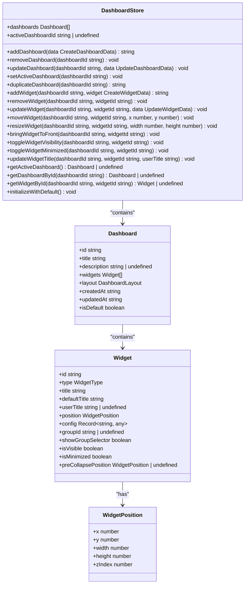
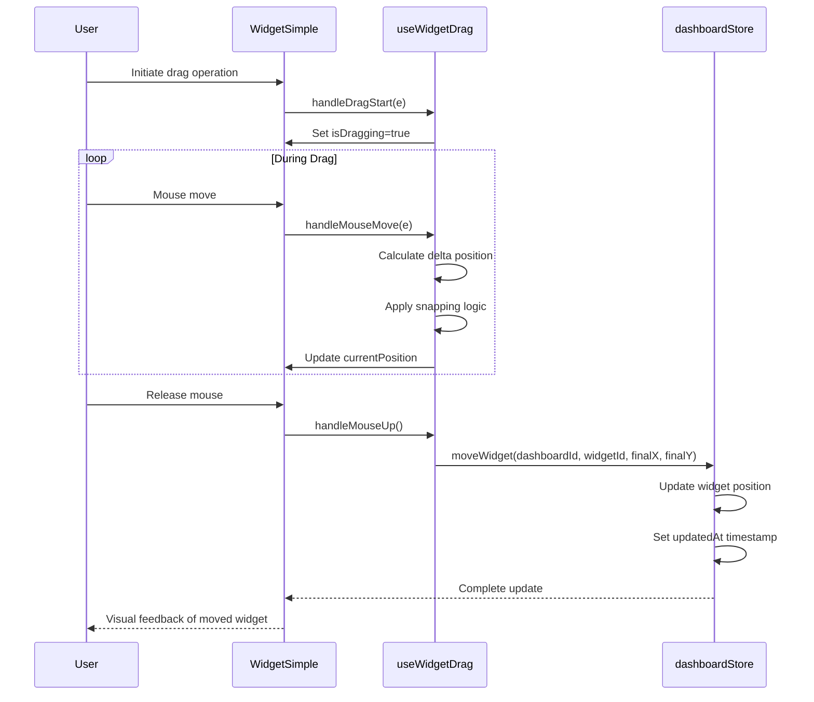
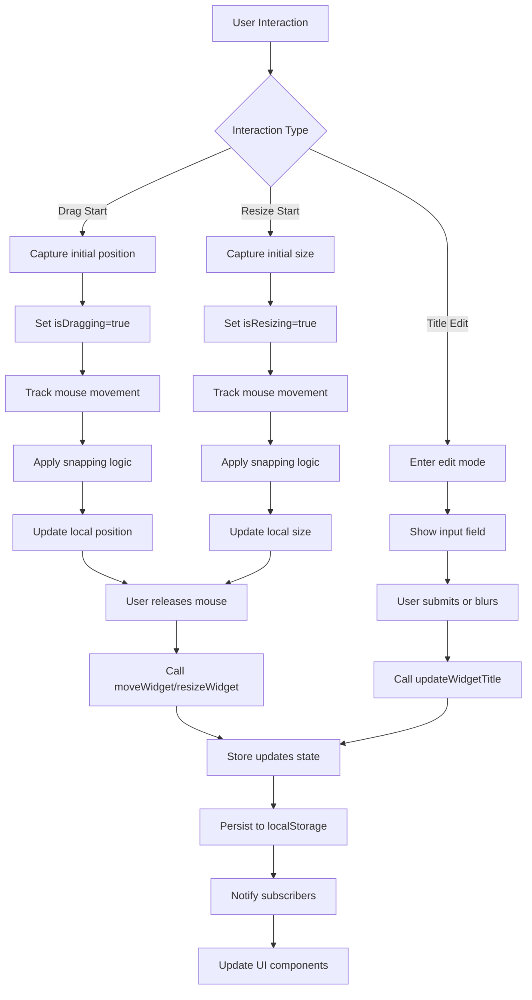

# Dashboard Store

<cite>
**Referenced Files in This Document **   
- [dashboardStore.ts](file://src/store/dashboardStore.ts)
- [WidgetContext.tsx](file://src/context/WidgetContext.tsx)
- [useWidgetDrag.tsx](file://src/hooks/useWidgetDrag.tsx)
- [WidgetSimple.tsx](file://src/components/WidgetSimple.tsx)
- [dashboard.ts](file://src/types/dashboard.ts)
</cite>

## Table of Contents
1. [Introduction](#introduction)  
2. [Core Architecture and State Management](#core-architecture-and-state-management)  
3. [Dashboard Operations](#dashboard-operations)  
4. [Widget Lifecycle Management](#widget-lifecycle-management)  
5. [Position, Resizing, and Z-Index Control](#position-resizing-and-z-index-control)  
6. [Integration with WidgetContext and Drag Functionality](#integration-with-widgetcontext-and-drag-functionality)  
7. [Component Interaction: WidgetSimple Example](#component-interaction-widgetsimple-example)  
8. [Persistence and Initialization Strategy](#persistence-and-initialization-strategy)  
9. [Common Issues and Performance Optimization](#common-issues-and-performance-optimization)  
10. [Extensibility and Customization Guidance](#extensibility-and-customization-guidance)

## Introduction
The `dashboardStore.ts` file in the ProfitMaker application serves as the central state management module for dashboard and widget operations. It leverages Zustand enhanced with Immer middleware to manage complex nested state immutably while maintaining simplicity and performance. The store handles all aspects of dashboard lifecycle including creation, deletion, duplication, and activation, as well as comprehensive widget management such as addition, removal, positioning, resizing, visibility toggling, and minimization. Designed with persistence in mind, it uses localStorage to maintain user layout preferences across sessions. The integration with `WidgetContext` enables cross-component state sharing, while the `useWidgetDrag` hook provides seamless drag-and-drop functionality for interactive UI manipulation.

**Section sources**
- [dashboardStore.ts](file://src/store/dashboardStore.ts#L1-L444)

## Core Architecture and State Management
The dashboard store implements a robust state management pattern using Zustand with Immer middleware, enabling direct mutation syntax while ensuring immutable updates under the hood. This approach simplifies complex state transformations without sacrificing React's reactivity model. The store maintains a collection of dashboards, each containing multiple widgets with their respective configurations, positions, and states. Structured selectors are employed to optimize component re-renders by subscribing only to relevant portions of the state tree. The use of TypeScript interfaces and Zod validation ensures type safety and data integrity throughout the application. The store's design follows a clear separation of concerns, with distinct methods for dashboard operations, widget manipulations, and utility functions, promoting maintainability and testability.

**Diagram sources **
- [dashboardStore.ts](file://src/store/dashboardStore.ts#L117-L444)
- [dashboard.ts](file://src/types/dashboard.ts#L56-L56)

**Section sources**
- [dashboardStore.ts](file://src/store/dashboardStore.ts#L1-L444)
- [dashboard.ts](file://src/types/dashboard.ts#L1-L70)

## Dashboard Operations
The dashboard store provides a comprehensive API for managing dashboard entities through various operations including creation, deletion, updating, activation, and duplication. When creating a new dashboard via `addDashboard`, the system generates a unique identifier and timestamp before persisting the dashboard to the state collection and setting it as active. The `removeDashboard` method safely removes a dashboard from the collection and automatically adjusts the active dashboard if necessary. Dashboard updates are handled through `updateDashboard`, which merges provided data while preserving the entity's identity and updating timestamps. The `setActiveDashboard` method facilitates navigation between different dashboards, logging contextual information for debugging purposes. Additionally, the `duplicateDashboard` function creates a copy of an existing dashboard with a modified title and fresh identifiers for contained widgets, enabling users to experiment with layout variations without affecting their original configurations.

**Section sources**
- [dashboardStore.ts](file://src/store/dashboardStore.ts#L162-L241)

## Widget Lifecycle Management
Widget lifecycle management is a core responsibility of the dashboard store, encompassing creation, modification, and destruction of widget instances within dashboards. The `addWidget` method initializes new widgets with proper z-index ordering, ensuring newly added components appear above existing ones. During widget creation, the system assigns a unique identifier and validates position parameters, defaulting to appropriate z-index values when not explicitly provided. The `removeWidget` operation safely eliminates widgets from the dashboard while performing cleanup tasks for specific widget types like charts, where subscriptions need to be properly terminated. The `updateWidget` method allows partial updates to widget properties through object assignment, triggering timestamp updates to reflect modifications. Additional lifecycle controls include `toggleWidgetVisibility` for showing/hiding widgets and `updateWidgetTitle` for customizing display names, both of which maintain backward compatibility with deprecated title fields while supporting user-defined titles.

**Section sources**
- [dashboardStore.ts](file://src/store/dashboardStore.ts#L241-L273)

## Position, Resizing, and Z-Index Control
The dashboard store implements precise control over widget positioning, sizing, and stacking order through dedicated methods that ensure consistent layout behavior. The `moveWidget` function updates a widget's coordinates within its parent dashboard, immediately reflecting changes in the UI while maintaining other properties unchanged. Similarly, `resizeWidget` modifies the dimensions of a widget, allowing dynamic adjustment of its visual footprint. To manage overlapping elements, the `bringWidgetToFront` method dynamically recalculates z-index values by identifying the current maximum and incrementing it, ensuring the targeted widget appears above all others. These operations are designed to work seamlessly with the persistence layer, automatically updating the dashboard's `updatedAt` timestamp to trigger storage synchronization. The implementation considers viewport boundaries and prevents invalid positions, contributing to a stable user experience during interactive manipulations.

**Diagram sources **
- [dashboardStore.ts](file://src/store/dashboardStore.ts#L275-L301)
- [useWidgetDrag.tsx](file://src/hooks/useWidgetDrag.tsx#L0-L262)
- [WidgetSimple.tsx](file://src/components/WidgetSimple.tsx#L274-L286)

**Section sources**
- [dashboardStore.ts](file://src/store/dashboardStore.ts#L275-L301)

## Integration with WidgetContext and Drag Functionality
The dashboard store integrates closely with `WidgetContext` and the `useWidgetDrag` hook to enable rich interactive capabilities across components. While `WidgetContext` manages global widget state and group associations, the dashboard store focuses on persistent layout data and structural operations. This complementary relationship allows components to access both transient interaction states and durable configuration data. The `useWidgetDrag` hook serves as the bridge between user input and store mutations, capturing mouse events and translating them into position updates that are ultimately committed to the dashboard store. This architecture enables features like alignment guides and snap-to-grid functionality by allowing the drag system to query other widgets' positions through the store. The integration respects React's unidirectional data flow, with UI interactions triggering actions that update centralized state, which then propagates changes back to all interested components.

**Section sources**
- [dashboardStore.ts](file://src/store/dashboardStore.ts#L1-L444)
- [WidgetContext.tsx](file://src/context/WidgetContext.tsx#L0-L447)
- [useWidgetDrag.tsx](file://src/hooks/useWidgetDrag.tsx#L0-L262)

## Component Interaction: WidgetSimple Example
The `WidgetSimple` component demonstrates practical interaction with the dashboard store through structured selectors and event handlers. It subscribes to specific store properties like position, size, and z-index using memoized selectors to minimize unnecessary re-renders. When users interact with the widget through dragging or resizing, the component captures these events and delegates to the appropriate store actions via bound functions obtained from the store. For instance, `moveWidget` and `resizeWidget` are extracted as selector functions and invoked with current parameters upon interaction completion. The component also utilizes `bringWidgetToFront` when clicked, ensuring proper stacking order during user interactions. Title editing functionality connects to `updateWidgetTitle`, while collapse/expand operations leverage `toggleWidgetMinimized`, which handles both visual state changes and position preservation. This pattern exemplifies how components can maintain local state for smooth interactions while synchronizing final results with the global store.

**Diagram sources **
- [WidgetSimple.tsx](file://src/components/WidgetSimple.tsx#L0-L632)
- [dashboardStore.ts](file://src/store/dashboardStore.ts#L275-L301)

**Section sources**
- [WidgetSimple.tsx](file://src/components/WidgetSimple.tsx#L0-L632)

## Persistence and Initialization Strategy
The dashboard store employs a sophisticated persistence strategy using Zustand's persist middleware to maintain user layouts across browser sessions. The `partialize` configuration selectively persists only essential state properties—dashboards and activeDashboardId—while excluding transient values. Upon rehydration, the store validates incoming data against a Zod schema (`DashboardStoreStateSchema`) to ensure structural integrity before merging with current state. Invalid or corrupted data is discarded gracefully, preventing application crashes. The initialization process is triggered via `onRehydrateStorage`, which calls `initializeWithDefault` to create a default dashboard when none exists. This function constructs a predefined layout with common trading widgets positioned strategically, providing immediate value to new users. Timestamps are consistently managed through `getCurrentTimestamp`, ensuring accurate tracking of creation and modification times for audit and synchronization purposes.

**Section sources**
- [dashboardStore.ts](file://src/store/dashboardStore.ts#L406-L444)

## Common Issues and Performance Optimization
Several common issues arise in dashboard management, particularly around layout desynchronization and performance degradation with numerous widgets. Layout desynchronization can occur when multiple components attempt to modify the same widget simultaneously; this is mitigated through the centralized store architecture which ensures single-source-of-truth updates. Performance optimization is achieved through structured selectors that prevent unnecessary re-renders by subscribing components only to specific state slices rather than the entire store. For applications with many widgets, virtualization techniques could be implemented to render only visible components. Memory leaks are prevented by proper cleanup of event listeners in hooks and components. The use of Immer reduces the cognitive load of immutable updates while maintaining performance, and batched updates through Zustand's set function minimize re-renders. Monitoring tools and console logging provide visibility into state changes, aiding in debugging complex interaction sequences.

**Section sources**
- [dashboardStore.ts](file://src/store/dashboardStore.ts#L1-L444)
- [WidgetSimple.tsx](file://src/components/WidgetSimple.tsx#L0-L632)

## Extensibility and Customization Guidance
Extending the dashboard store for custom widget types or advanced layout configurations requires adherence to established patterns while introducing new capabilities. To support custom widget types, developers should extend the `WidgetType` union in type definitions and ensure corresponding components implement the same interface as existing widgets. Advanced layout configurations can be accommodated by enhancing the `layout` property in the Dashboard schema to include additional constraints or grid systems. Custom persistence strategies might involve encrypting sensitive layout data or syncing with remote servers. For specialized behaviors, new store methods can be added following the existing naming conventions and error handling patterns. Integration with external systems should utilize the same action-based approach, dispatching updates through the store rather than direct DOM manipulation. Thorough testing, particularly around edge cases in positioning algorithms and persistence scenarios, ensures reliability in production environments.

**Section sources**
- [dashboardStore.ts](file://src/store/dashboardStore.ts#L1-L444)
- [dashboard.ts](file://src/types/dashboard.ts#L1-L70)