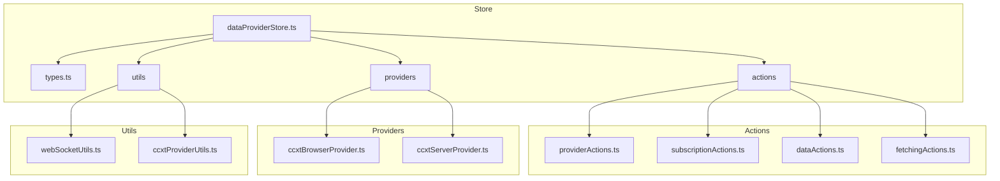
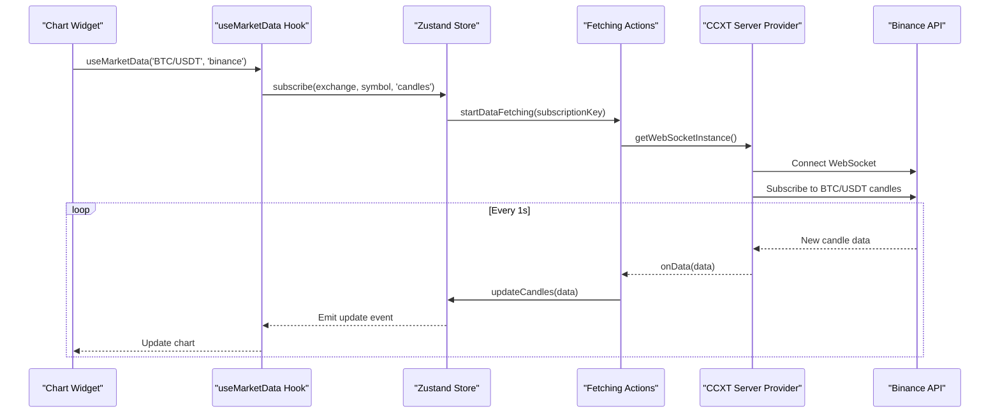
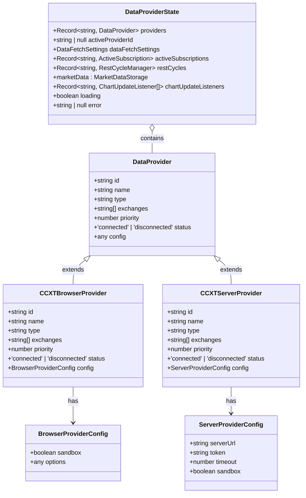
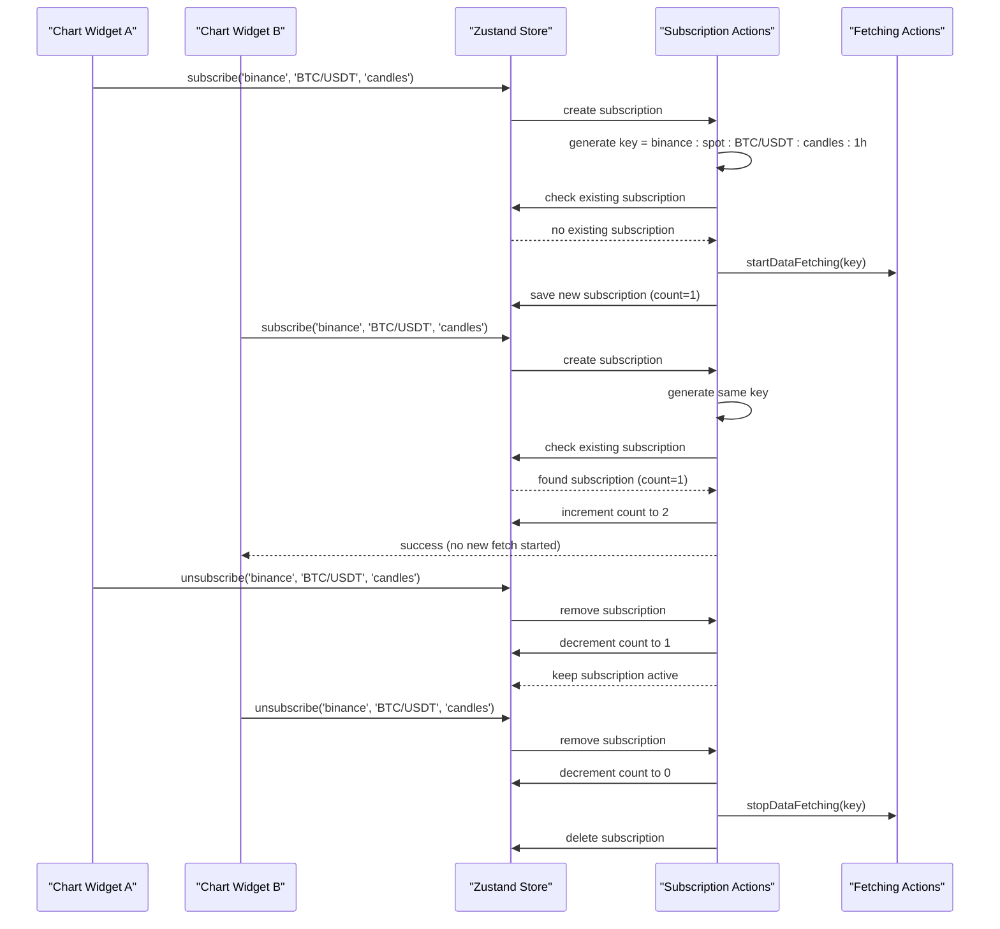
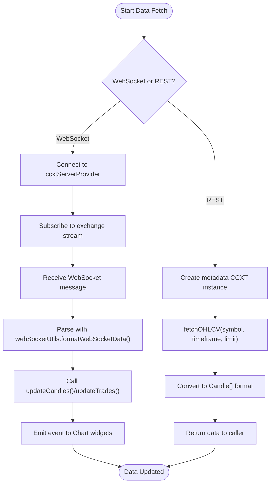
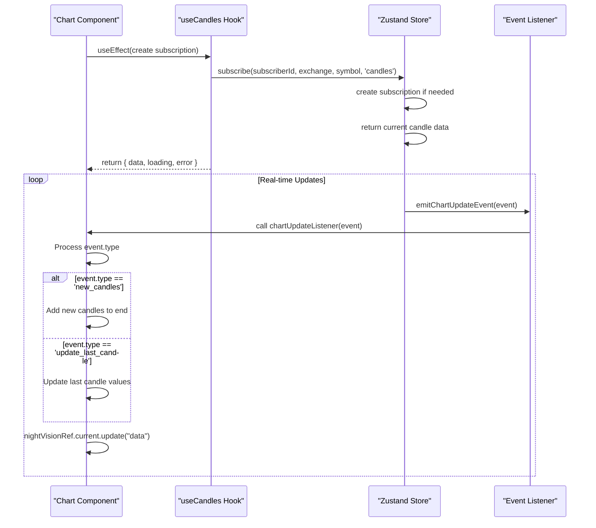
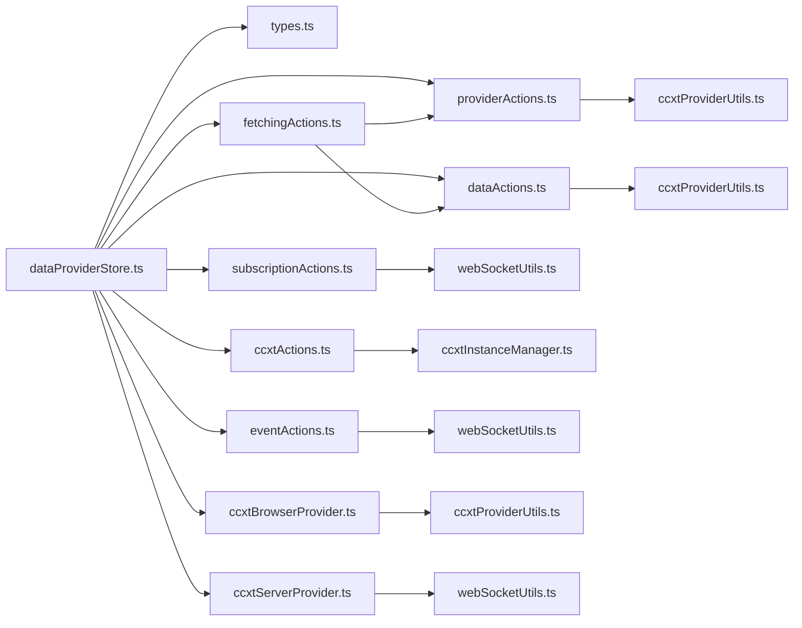

# Data Provider Store

<cite>
**Referenced Files in This Document**   
- [dataProviderStore.ts](file://src/store/dataProviderStore.ts)
- [types.ts](file://src/store/types.ts)
- [providerActions.ts](file://src/store/actions/providerActions.ts)
- [subscriptionActions.ts](file://src/store/actions/subscriptionActions.ts)
- [dataActions.ts](file://src/store/actions/dataActions.ts)
- [fetchingActions.ts](file://src/store/actions/fetchingActions.ts)
- [ccxtBrowserProvider.ts](file://src/store/providers/ccxtBrowserProvider.ts)
- [ccxtServerProvider.ts](file://src/store/providers/ccxtServerProvider.ts)
- [webSocketUtils.ts](file://src/store/utils/webSocketUtils.ts)
- [useDataProvider.ts](file://src/hooks/useDataProvider.ts)
- [Chart.tsx](file://src/components/widgets/Chart.tsx)
- [OrderBookWidget.tsx](file://src/components/widgets/OrderBookWidget.tsx)
</cite>

## Table of Contents
1. [Introduction](#introduction)
2. [Project Structure](#project-structure)
3. [Core Components](#core-components)
4. [Architecture Overview](#architecture-overview)
5. [Detailed Component Analysis](#detailed-component-analysis)
6. [Dependency Analysis](#dependency-analysis)
7. [Performance Considerations](#performance-considerations)
8. [Troubleshooting Guide](#troubleshooting-guide)
9. [Conclusion](#conclusion)

## Introduction
The `dataProviderStore.ts` file is the central hub for managing market data acquisition and distribution within the ProfitMaker application. It leverages the Zustand state management library to create a reactive store that coordinates between user-configured subscriptions, various data providers (such as CCXT-based browser and server implementations), and consuming UI components like charts and order books. The system is designed with modularity in mind, separating concerns into distinct action files (`fetchingActions`, `dataActions`) and provider implementations (`ccxtBrowserProvider`, `ccxtServerProvider`). This documentation provides a comprehensive analysis of its architecture, detailing the flow of data from initial subscription through WebSocket or REST interfaces to final consumption by widgets. It also covers critical aspects such as caching strategies, deduplication mechanisms, subscription lifecycle management, and error recovery, offering insights into how the system handles challenges like rate limiting and connection failover.

## Project Structure
The project follows a modular structure centered around the `src/store` directory, which houses the core logic for data management. The `dataProviderStore.ts` file acts as the main entry point, importing and combining actions and utilities from subdirectories. The `actions` folder contains pure functions that define the store's behavior, including provider management, subscription handling, and data fetching. The `providers` folder encapsulates the implementation details for different data sources, currently supporting both client-side (`ccxtBrowserProvider`) and server-side (`ccxtServerProvider`) CCXT integrations. Utility functions are located in the `utils` folder, providing shared logic for tasks like WebSocket communication and instance configuration. The `types.ts` file defines the TypeScript interfaces that ensure type safety across the entire data layer. This separation of concerns allows for a clean, maintainable codebase where each component has a well-defined responsibility.

**Diagram sources**
- [dataProviderStore.ts](file://src/store/dataProviderStore.ts#L1-L118)
- [types.ts](file://src/store/types.ts#L24-L53)
- [providerActions.ts](file://src/store/actions/providerActions.ts#L42-L429)
- [subscriptionActions.ts](file://src/store/actions/subscriptionActions.ts#L10-L105)
- [dataActions.ts](file://src/store/actions/dataActions.ts#L75-L590)
- [fetchingActions.ts](file://src/store/actions/fetchingActions.ts#L16-L741)
- [ccxtBrowserProvider.ts](file://src/store/providers/ccxtBrowserProvider.ts#L32-L515)
- [ccxtServerProvider.ts](file://src/store/providers/ccxtServerProvider.ts#L20-L535)
- [webSocketUtils.ts](file://src/store/utils/webSocketUtils.ts#L0-L321)

**Section sources**
- [dataProviderStore.ts](file://src/store/dataProviderStore.ts#L1-L118)
- [types.ts](file://src/store/types.ts#L24-L53)

## Core Components
The core functionality of the data provider system is built upon several key components. The `useDataProviderStore` hook, defined in `dataProviderStore.ts`, creates a global Zustand store that holds the application's data state and actions. This store is initialized with a default `universal-browser` provider, ensuring immediate connectivity for basic operations. The state includes a hierarchical structure for storing market data (candles, trades, orderbook, balance, ticker) organized by exchange, market, and symbol. Action creators from the `actions` directory are composed into the store, providing methods for managing providers, subscriptions, and data flow. The `createProviderActions` function enables dynamic addition, removal, and configuration of data providers, while `createSubscriptionActions` handles the creation and destruction of data subscriptions with built-in deduplication. The `createDataActions` module offers utilities for retrieving cached data and updating the store with new information, and `createFetchingActions` orchestrates the actual data retrieval process, choosing between WebSocket and REST based on user settings.

**Section sources**
- [dataProviderStore.ts](file://src/store/dataProviderStore.ts#L20-L118)
- [types.ts](file://src/store/types.ts#L24-L53)
- [providerActions.ts](file://src/store/actions/providerActions.ts#L42-L429)
- [subscriptionActions.ts](file://src/store/actions/subscriptionActions.ts#L10-L105)
- [dataActions.ts](file://src/store/actions/dataActions.ts#L75-L590)
- [fetchingActions.ts](file://src/store/actions/fetchingActions.ts#L16-L741)

## Architecture Overview
The architecture of the data provider system is a layered, event-driven design that facilitates efficient and reliable data flow. At its foundation is the Zustand store, which maintains a centralized state and exposes a set of actions. On top of this, provider implementations (`ccxtBrowserProvider` and `ccxtServerProvider`) act as adapters, translating generic data requests into specific API calls to external exchanges via the CCXT library. These providers manage their own internal state, including cached CCXT instances and WebSocket connections, to optimize performance and reduce redundant network traffic. The action layer sits between the store and the providers, containing business logic for subscription management, data fetching, and error handling. When a widget subscribes to data, the `subscribe` action checks for existing subscriptions to prevent duplication, then triggers `startDataFetching`, which delegates to the appropriate provider based on the current fetch method (WebSocket or REST). Real-time updates from WebSockets are processed by utility functions in `webSocketUtils.ts` and funneled back into the store via `updateCandles`, `updateTrades`, etc., which in turn notify subscribed components through React hooks.

**Diagram sources**
- [dataProviderStore.ts](file://src/store/dataProviderStore.ts#L20-L118)
- [dataActions.ts](file://src/store/actions/dataActions.ts#L75-L590)
- [fetchingActions.ts](file://src/store/actions/fetchingActions.ts#L16-L741)
- [ccxtServerProvider.ts](file://src/store/providers/ccxtServerProvider.ts#L20-L535)
- [webSocketUtils.ts](file://src/store/utils/webSocketUtils.ts#L0-L321)

## Detailed Component Analysis

### Provider Management and Selection
The provider system is designed for flexibility and redundancy. The `createProviderActions` module allows users to add multiple providers of different types (`ccxt-browser`, `ccxt-server`, etc.), each with a configurable priority. The `getProviderForExchange` function selects the optimal enabled provider for a given exchange based on this priority, enabling a failover strategy where a high-priority server provider can be used first, falling back to a lower-priority browser-based provider if necessary. Providers are validated upon creation and update, ensuring their configuration is correct before being added to the store. The `getAllSupportedExchanges` function aggregates the list of supported exchanges from all enabled providers, presenting a unified view to the user interface. This abstraction allows the rest of the application to request data without knowing the underlying source, promoting loose coupling.

#### For Object-Oriented Components:

**Diagram sources**
- [types.ts](file://src/store/types.ts#L24-L53)
- [providerActions.ts](file://src/store/actions/providerActions.ts#L42-L429)

**Section sources**
- [providerActions.ts](file://src/store/actions/providerActions.ts#L42-L429)

### Subscription Lifecycle and Deduplication
The subscription system ensures efficient resource usage by preventing duplicate data requests. When a component calls `subscribe`, the `createSubscriptionActions` module generates a unique `subscriptionKey` based on the exchange, symbol, data type, timeframe, and market. It checks if an active subscription with this key already exists. If so, it increments a `subscriberCount` rather than creating a new one. Only when the last subscriber unsubscribes is the underlying data fetching stopped and the subscription removed. This deduplication is crucial for performance, especially when multiple widgets display the same data. The system also tracks the fetch method (WebSocket or REST) for each subscription, automatically restarting the fetch process if the global `dataFetchSettings.method` changes, ensuring all subscriptions use the preferred method.

#### For API/Service Components:

**Diagram sources**
- [subscriptionActions.ts](file://src/store/actions/subscriptionActions.ts#L10-L105)
- [fetchingActions.ts](file://src/store/actions/fetchingActions.ts#L16-L741)

**Section sources**
- [subscriptionActions.ts](file://src/store/actions/subscriptionActions.ts#L10-L105)

### Data Flow and Caching Strategies
Data flows through a well-defined pipeline from external APIs to the UI. For real-time updates, the `ccxtServerProvider` establishes a WebSocket connection to a backend service, which in turn connects to exchange APIs. Incoming messages are parsed by `webSocketUtils.ts`, formatted into a standard structure, and passed to the appropriate `update*` action in `dataActions.ts`. These actions use Immer to immutably update the store's state, triggering re-renders in subscribed components. For historical data, the system uses REST polling, managed by `RestCycleManager` objects stored in the `restCycles` map. Each cycle runs at an interval defined in `dataFetchSettings.restIntervals`, fetching fresh data and updating the store. The `initializeChartData` function exemplifies this, using a metadata-only CCXT instance to fetch OHLCV data without requiring API keys. Caching is implemented at multiple levels: the `CCXTBrowserProviderImpl` caches CCXT instances and markets to avoid repeated initialization, while the store itself acts as a cache for fetched market data, allowing components to retrieve data synchronously.

#### For Complex Logic Components:

**Diagram sources**
- [dataActions.ts](file://src/store/actions/dataActions.ts#L75-L590)
- [fetchingActions.ts](file://src/store/actions/fetchingActions.ts#L16-L741)
- [ccxtServerProvider.ts](file://src/store/providers/ccxtServerProvider.ts#L20-L535)
- [webSocketUtils.ts](file://src/store/utils/webSocketUtils.ts#L0-L321)

**Section sources**
- [dataActions.ts](file://src/store/actions/dataActions.ts#L75-L590)
- [fetchingActions.ts](file://src/store/actions/fetchingActions.ts#L16-L741)
- [webSocketUtils.ts](file://src/store/utils/webSocketUtils.ts#L0-L321)

### Integration with Widgets
The data provider system integrates seamlessly with UI components through custom React hooks. The `useMarketData` hook combines `useCandles`, `useTrades`, and `useOrderBook` to allow a single subscription to multiple data types. These hooks automatically manage the subscription lifecycle, subscribing when the component mounts and unsubscribing on unmount. The `Chart` component demonstrates this integration, using `useCandles` to receive candle data and listening for `chartUpdateEvents` to handle real-time WebSocket updates efficiently. It distinguishes between `new_candles` (adding to the end) and `update_last_candle` (updating the most recent bar) for optimal rendering performance. Similarly, the `OrderBookWidget` uses `useOrderBook` to receive order book data, processing it to calculate cumulative depth and formatting prices and amounts according to user preferences. This pattern abstracts away the complexity of data fetching, allowing widget developers to focus on presentation.

#### For API/Service Components:

**Diagram sources**
- [useDataProvider.ts](file://src/hooks/useDataProvider.ts#L30-L97)
- [Chart.tsx](file://src/components/widgets/Chart.tsx#L46-L855)
- [OrderBookWidget.tsx](file://src/components/widgets/OrderBookWidget.tsx#L15-L132)

**Section sources**
- [useDataProvider.ts](file://src/hooks/useDataProvider.ts#L30-L97)
- [Chart.tsx](file://src/components/widgets/Chart.tsx#L46-L855)
- [OrderBookWidget.tsx](file://src/components/widgets/OrderBookWidget.tsx#L15-L132)

## Dependency Analysis
The data provider store has a well-defined dependency graph. Its primary dependencies are the Zustand library for state management and the CCXT library for exchange connectivity, which is dynamically imported by the provider implementations. The store depends on several internal modules: `types.ts` for type definitions, `actions` for business logic, `providers` for data source implementations, and `utils` for shared functionality. The action files have dependencies on each other; for example, `fetchingActions` relies on `dataActions` to update the store and on `providerActions` to select the correct provider. The `ccxtBrowserProvider` and `ccxtServerProvider` classes depend heavily on utility functions in `ccxtProviderUtils.ts` for instance configuration and capability detection. There are no circular dependencies, and the use of dependency injection (passing `set`, `get`, and `store` to action creators) keeps the code loosely coupled and testable.

**Diagram sources**
- [dataProviderStore.ts](file://src/store/dataProviderStore.ts#L1-L118)
- [providerActions.ts](file://src/store/actions/providerActions.ts#L42-L429)
- [subscriptionActions.ts](file://src/store/actions/subscriptionActions.ts#L10-L105)
- [dataActions.ts](file://src/store/actions/dataActions.ts#L75-L590)
- [fetchingActions.ts](file://src/store/actions/fetchingActions.ts#L16-L741)
- [ccxtBrowserProvider.ts](file://src/store/providers/ccxtBrowserProvider.ts#L32-L515)
- [ccxtServerProvider.ts](file://src/store/providers/ccxtServerProvider.ts#L20-L535)
- [webSocketUtils.ts](file://src/store/utils/webSocketUtils.ts#L0-L321)
- [ccxtProviderUtils.ts](file://src/store/utils/ccxtProviderUtils.ts#L29-L71)

**Section sources**
- [dataProviderStore.ts](file://src/store/dataProviderStore.ts#L1-L118)
- [providerActions.ts](file://src/store/actions/providerActions.ts#L42-L429)
- [subscriptionActions.ts](file://src/store/actions/subscriptionActions.ts#L10-L105)
- [dataActions.ts](file://src/store/actions/dataActions.ts#L75-L590)
- [fetchingActions.ts](file://src/store/actions/fetchingActions.ts#L16-L741)
- [ccxtBrowserProvider.ts](file://src/store/providers/ccxtBrowserProvider.ts#L32-L515)
- [ccxtServerProvider.ts](file://src/store/providers/ccxtServerProvider.ts#L20-L535)
- [webSocketUtils.ts](file://src/store/utils/webSocketUtils.ts#L0-L321)
- [ccxtProviderUtils.ts](file://src/store/utils/ccxtProviderUtils.ts#L29-L71)

## Performance Considerations
The system incorporates several performance optimizations. The use of Zustand with the `immer` middleware allows for efficient immutable state updates, minimizing unnecessary re-renders. The subscription deduplication mechanism prevents redundant network requests, conserving bandwidth and reducing load on both the client and server. The `CCXTBrowserProviderImpl` employs aggressive caching of CCXT instances and markets, significantly reducing initialization time for subsequent requests to the same exchange. For real-time data, the system prioritizes WebSocket connections over REST polling, providing lower latency and reduced server load. The `updateCandles` action intelligently merges incoming data, distinguishing between new bars and updates to the current bar, which allows charting libraries to perform incremental updates rather than full redraws. Memory usage is controlled by limiting the number of stored trades to the most recent 1000 entries. Configuration options allow users to adjust REST polling intervals, balancing data freshness with performance.

## Troubleshooting Guide
Common issues with the data provider system often stem from misconfiguration or network problems. If a widget fails to load data, first verify that a provider is active and connected by checking the `activeProviderId` and provider `status` in the store. Ensure the selected exchange and symbol are supported by calling `getSymbolsForExchange` and `getMarketsForExchange`. For WebSocket-related errors, inspect the console logs for messages from `handleWebSocketError`, which implements exponential backoff retry logic. Connection timeouts may indicate an issue with the `ccxtServerProvider`'s `serverUrl` or `token`. Rate limiting errors typically require adjusting the provider's configuration or switching to a different provider. If historical data fails to load, confirm that the `initializeChartData` function can create a valid metadata instance. The `DebugUserData` and `DebugCCXTCache` components can be invaluable for diagnosing issues by providing visibility into the current state of the store and the CCXT instance cache.

**Section sources**
- [dataProviderStore.ts](file://src/store/dataProviderStore.ts#L20-L118)
- [providerActions.ts](file://src/store/actions/providerActions.ts#L42-L429)
- [dataActions.ts](file://src/store/actions/dataActions.ts#L75-L590)
- [webSocketUtils.ts](file://src/store/utils/webSocketUtils.ts#L0-L321)

## Conclusion
The `dataProviderStore.ts` system represents a robust and scalable solution for managing market data in a complex trading application. By leveraging Zustand for state management and adhering to a clear separation of concerns, it provides a flexible and maintainable architecture. The combination of multiple provider types, intelligent subscription deduplication, and efficient caching strategies ensures reliable data delivery under various conditions. The integration with UI components through well-designed React hooks abstracts away much of the complexity, allowing developers to build rich, data-driven features with minimal boilerplate. While the system is sophisticated, its modular design makes it approachable for debugging and extension. Future enhancements could include more advanced failover logic, support for additional data sources, and improved metrics for monitoring data quality and performance.