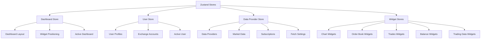
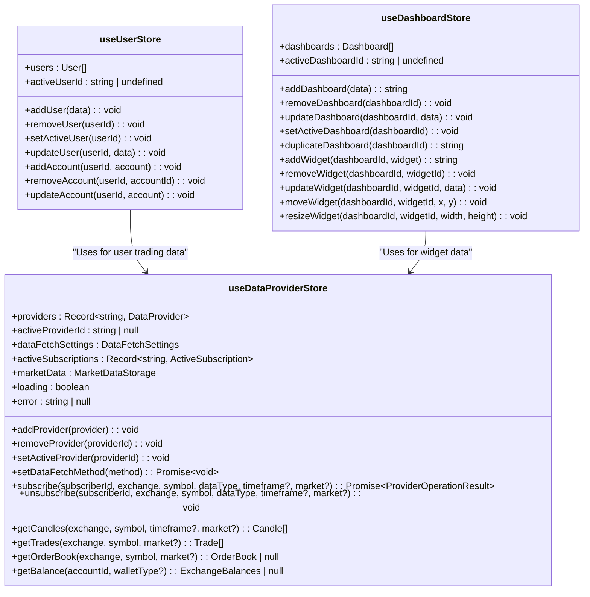
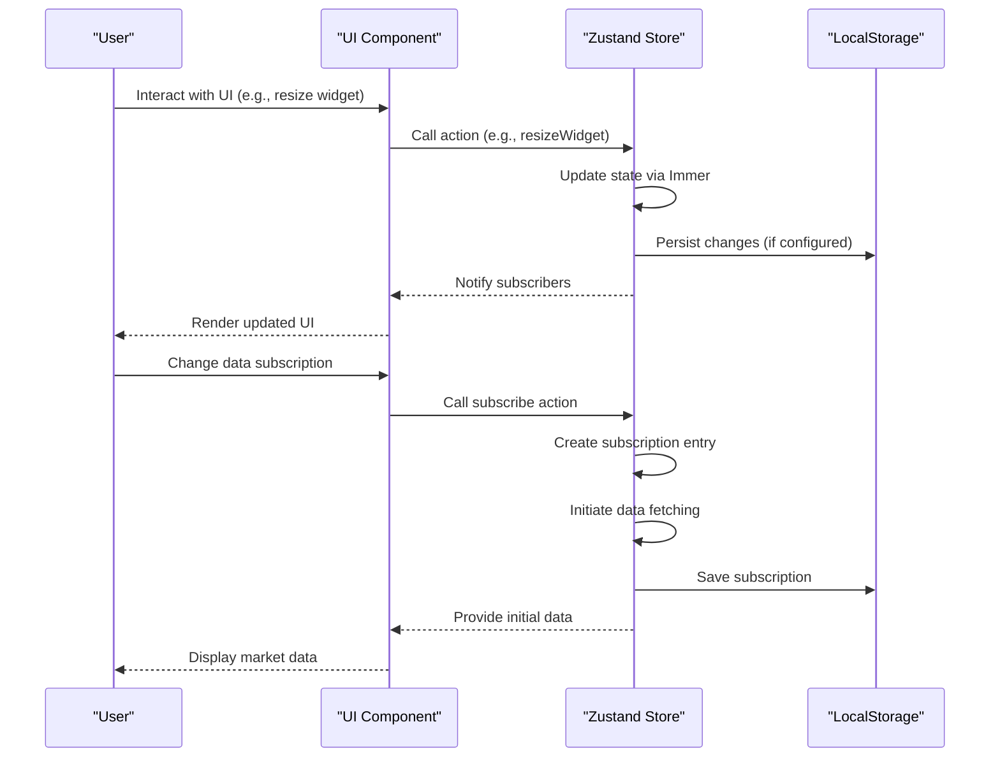

# State Management

<cite>
**Referenced Files in This Document**   
- [userStore.ts](file://src/store/userStore.ts)
- [dashboardStore.ts](file://src/store/dashboardStore.ts)
- [dataProviderStore.ts](file://src/store/dataProviderStore.ts)
- [types.ts](file://src/store/types.ts)
- [userTradingDataWidgetStore.ts](file://src/store/userTradingDataWidgetStore.ts)
- [userBalancesWidgetStore.ts](file://src/store/userBalancesWidgetStore.ts)
- [tradesWidgetStore.ts](file://src/store/tradesWidgetStore.ts)
- [orderBookWidgetStore.ts](file://src/store/orderBookWidgetStore.ts)
- [chartWidgetStore.ts](file://src/store/chartWidgetStore.ts)
</cite>

## Table of Contents
1. [State Management Overview](#state-management-overview)
2. [Zustand Store Architecture](#zustand-store-architecture)
3. [Core Stores and Their Responsibilities](#core-stores-and-their-responsibilities)
4. [Immer Middleware for Immutable Updates](#immer-middleware-for-immutable-updates)
5. [Structured Selectors and Performance Optimization](#structured-selectors-and-performance-optimization)
6. [Data Flow from User Interaction to State Update](#data-flow-from-user-interaction-to-state-update)
7. [Store Usage Patterns with Custom Hooks](#store-usage-patterns-with-custom-hooks)
8. [Cross-Store Synchronization Challenges](#cross-store-synchronization-challenges)
9. [Asynchronous Operations Handling](#asynchronous-operations-handling)

## State Management Overview

The profitmaker application implements a comprehensive state management system using Zustand as the primary solution for managing global state across dashboards, user accounts, market data, and trading functions. The architecture follows a modular approach with dedicated stores for different domains, enabling clear separation of concerns while maintaining efficient cross-component communication. State persistence is achieved through localStorage integration, ensuring user preferences and configurations survive page reloads. The system handles complex trading workflows by coordinating multiple stores that manage dashboard layouts, user profiles, market data subscriptions, and trading widget configurations.

**Section sources**
- [userStore.ts](file://src/store/userStore.ts#L1-L142)
- [dashboardStore.ts](file://src/store/dashboardStore.ts#L1-L444)
- [dataProviderStore.ts](file://src/store/dataProviderStore.ts#L1-L118)

## Zustand Store Architecture

The state management system employs a modular store architecture with separate files for distinct functional areas: dashboard configuration, data provider management, user account information, and widget-specific states. Each store encapsulates its domain logic and state, exposing a clean API of actions for state manipulation. The `useDashboardStore` manages dashboard layouts and widget positioning, while `useUserStore` handles user profiles and exchange account credentials. Data-related functionality is centralized in `useDataProviderStore`, which coordinates market data fetching from various exchanges. Widget-specific stores like `useChartWidgetsStore` and `useOrderBookWidgetsStore` maintain individual widget configurations, allowing users to customize their trading interface experience.

**Diagram sources**
- [dashboardStore.ts](file://src/store/dashboardStore.ts#L1-L444)
- [userStore.ts](file://src/store/userStore.ts#L1-L142)
- [dataProviderStore.ts](file://src/store/dataProviderStore.ts#L1-L118)
- [chartWidgetStore.ts](file://src/store/chartWidgetStore.ts#L1-L50)
- [orderBookWidgetStore.ts](file://src/store/orderBookWidgetStore.ts#L1-L82)

**Section sources**
- [dashboardStore.ts](file://src/store/dashboardStore.ts#L1-L444)
- [userStore.ts](file://src/store/userStore.ts#L1-L142)
- [dataProviderStore.ts](file://src/store/dataProviderStore.ts#L1-L118)

## Core Stores and Their Responsibilities

The application's state management system consists of several core stores, each responsible for a specific domain. The `useUserStore` manages user accounts and exchange credentials, providing actions to add, remove, and update user information and linked exchange accounts. The `useDashboardStore` handles dashboard creation, modification, and widget management, including operations for adding, removing, and positioning widgets on dashboards. The `useDataProviderStore` serves as the central hub for market data, managing data providers, subscriptions, and the storage of fetched market data such as candles, trades, order books, and balances. Various widget-specific stores maintain configuration settings for different widget types, allowing users to customize their appearance and behavior.

**Diagram sources**
- [userStore.ts](file://src/store/userStore.ts#L1-L142)
- [dashboardStore.ts](file://src/store/dashboardStore.ts#L1-L444)
- [dataProviderStore.ts](file://src/store/dataProviderStore.ts#L1-L118)

**Section sources**
- [userStore.ts](file://src/store/userStore.ts#L1-L142)
- [dashboardStore.ts](file://src/store/dashboardStore.ts#L1-L444)
- [dataProviderStore.ts](file://src/store/dataProviderStore.ts#L1-L118)

## Immer Middleware for Immutable Updates

The state management system leverages Immer middleware to enable immutable state updates through mutable syntax, simplifying complex state manipulations while maintaining referential integrity. This approach allows developers to write intuitive, direct mutations of state within action functions, while Immer automatically produces new immutable state objects behind the scenes. The `enableMapSet()` function is called to extend Immer's capabilities to support Map and Set data structures, which are used in certain stores for efficient data organization. This pattern is consistently applied across stores like `useUserStore`, `useDashboardStore`, and `useDataProviderStore`, where nested state updates are common. By using Immer, the application avoids the complexity of manual deep cloning and ensures that React components can efficiently detect state changes through simple reference comparison.

**Section sources**
- [userStore.ts](file://src/store/userStore.ts#L1-L142)
- [dashboardStore.ts](file://src/store/dashboardStore.ts#L1-L444)
- [dataProviderStore.ts](file://src/store/dataProviderStore.ts#L1-L118)

## Structured Selectors and Performance Optimization

The application implements performance optimizations through structured selectors and careful state slicing to minimize unnecessary re-renders. The `subscribeWithSelector` middleware is used in `useDataProviderStore` to enable fine-grained subscription to specific parts of the state, allowing components to react only to relevant changes. State persistence is optimized using the `partialize` option in the `persist` middleware, which specifies exactly which portions of each store should be saved to localStorage, reducing storage overhead and improving hydration performance. For widget-specific stores, the architecture uses Maps or indexed objects to efficiently access widget state by ID, avoiding expensive array searches. The combination of these techniques ensures that the UI remains responsive even with large datasets and complex dashboard configurations.

**Section sources**
- [dataProviderStore.ts](file://src/store/dataProviderStore.ts#L1-L118)
- [userTradingDataWidgetStore.ts](file://src/store/userTradingDataWidgetStore.ts#L1-L88)
- [userBalancesWidgetStore.ts](file://src/store/userBalancesWidgetStore.ts#L1-L86)

## Data Flow from User Interaction to State Update

The data flow in the application follows a consistent pattern from user interaction through store actions to state updates. When a user performs an action, such as modifying a dashboard layout or changing market data settings, a component calls a store action method. These actions use the `set` function provided by Zustand, wrapped with Immer middleware, to mutate the state in a controlled manner. For example, when a user resizes a widget, the `resizeWidget` action in `useDashboardStore` updates the widget's dimensions in the state, triggering a re-render of the affected components. Similarly, when subscribing to market data, the `subscribe` action in `useDataProviderStore` creates a new subscription entry and initiates data fetching through the appropriate provider. The use of persistent storage ensures that these state changes are preserved across sessions, providing continuity in the user experience.

**Diagram sources**
- [dashboardStore.ts](file://src/store/dashboardStore.ts#L1-L444)
- [dataProviderStore.ts](file://src/store/dataProviderStore.ts#L1-L118)

**Section sources**
- [dashboardStore.ts](file://src/store/dashboardStore.ts#L1-L444)
- [dataProviderStore.ts](file://src/store/dataProviderStore.ts#L1-L118)

## Store Usage Patterns with Custom Hooks

The application exposes store functionality through custom hooks following the `useXxxStore` naming convention, providing a consistent API for components to access and modify state. Hooks like `useDashboardStore`, `useUserStore`, and `useDataProviderStore` allow components to subscribe to relevant state slices and dispatch actions. Widget-specific stores follow a similar pattern with hooks such as `useChartWidgetsStore` and `useOrderBookWidgetsStore`, which provide methods to get, update, and remove widget configurations. These hooks abstract the underlying Zustand implementation, allowing components to interact with state in a declarative manner. The store APIs are designed to be composable, enabling higher-level hooks to be built by combining multiple store accesses for complex workflows that span multiple domains.

**Section sources**
- [userStore.ts](file://src/store/userStore.ts#L1-L142)
- [dashboardStore.ts](file://src/store/dashboardStore.ts#L1-L444)
- [dataProviderStore.ts](file://src/store/dataProviderStore.ts#L1-L118)
- [chartWidgetStore.ts](file://src/store/chartWidgetStore.ts#L1-L50)
- [orderBookWidgetStore.ts](file://src/store/orderBookWidgetStore.ts#L1-L82)

## Cross-Store Synchronization Challenges

The application addresses cross-store synchronization challenges through careful design and dependency management between stores. While each store maintains its own domain-specific state, they coordinate through well-defined interfaces and shared data structures. For example, the `useDataProviderStore` provides market data that is consumed by various widget stores, creating a unidirectional data flow that prevents circular dependencies. The system handles the challenge of keeping user interface state synchronized with backend data by using timestamp-based invalidation and refresh mechanisms. Configuration changes in one store, such as updating data fetch settings, trigger appropriate responses in related stores through event-like patterns implemented with Zustand's notification system. This architecture minimizes tight coupling between stores while ensuring consistent state across the application.

**Section sources**
- [dataProviderStore.ts](file://src/store/dataProviderStore.ts#L1-L118)
- [dashboardStore.ts](file://src/store/dashboardStore.ts#L1-L444)
- [types.ts](file://src/store/types.ts#L1-L156)

## Asynchronous Operations Handling

The state management system handles asynchronous operations through promise-based action methods and careful state tracking. Actions that involve network requests or other async operations, such as data fetching or account authentication, return promises to enable proper handling of completion and errors. Stores maintain loading and error states to reflect the status of ongoing operations, allowing the UI to provide appropriate feedback to users. The `useDataProviderStore` demonstrates this pattern with methods like `initializeChartData` and `fetchMyTrades` that return promises while updating internal loading state. Error handling is centralized within the stores, with error messages stored in state for display by components. This approach ensures that asynchronous operations are properly coordinated and that the application state remains consistent even when operations fail or take longer than expected.

**Section sources**
- [dataProviderStore.ts](file://src/store/dataProviderStore.ts#L1-L118)
- [actions/dataActions.ts](file://src/store/actions/dataActions.ts#L75-L115)
- [actions/providerActions.ts](file://src/store/actions/providerActions.ts#L42-L84)