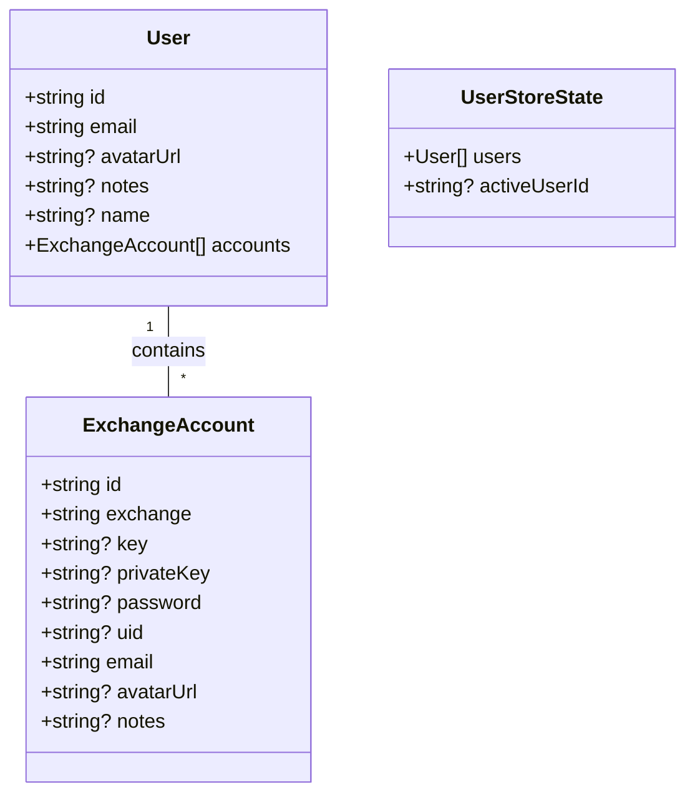
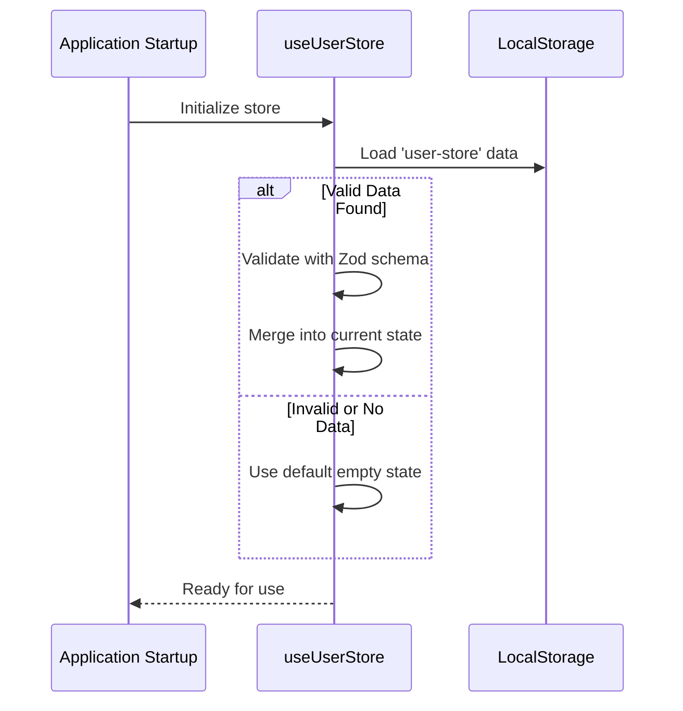
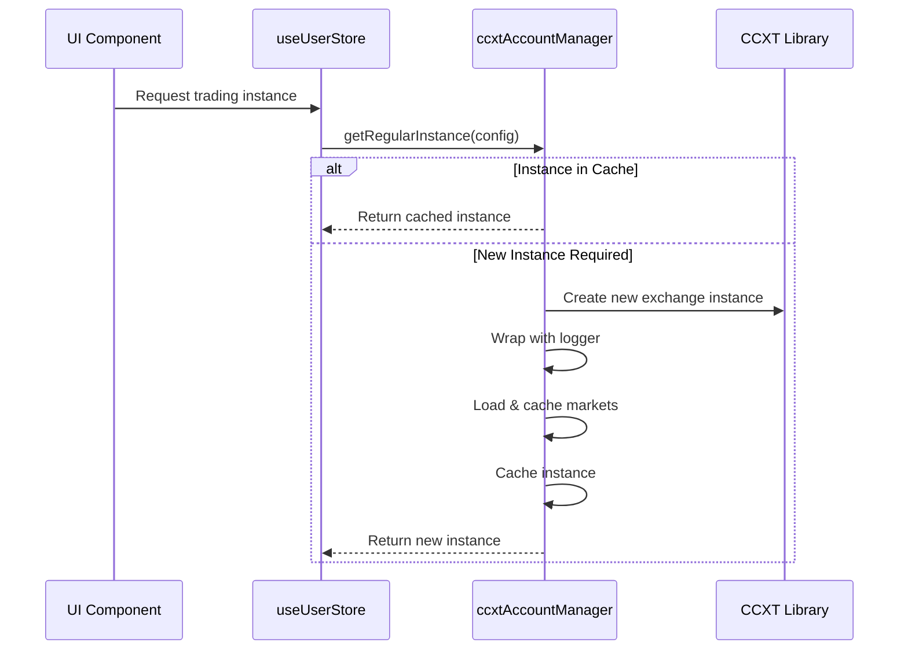
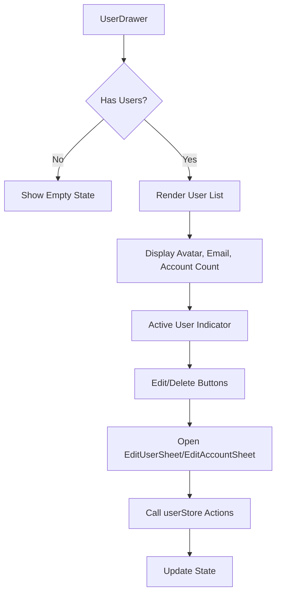
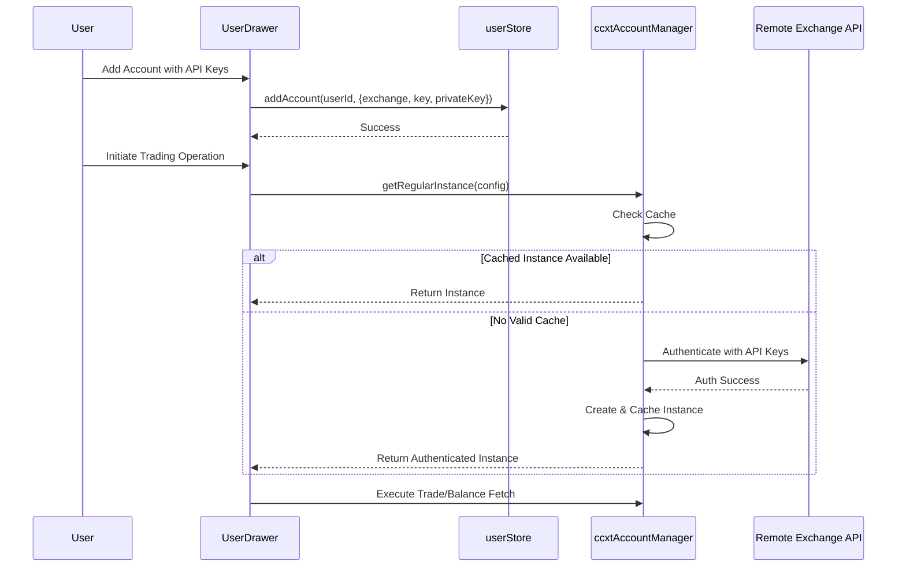

# User Store

<cite>
**Referenced Files in This Document **   
- [userStore.ts](file://src/store/userStore.ts)
- [ccxtAccountManager.ts](file://src/store/utils/ccxtAccountManager.ts)
- [ccxtInstanceManager.ts](file://src/store/utils/ccxtInstanceManager.ts)
- [SettingsDrawer.tsx](file://src/components/SettingsDrawer.tsx)
- [UserDrawer.tsx](file://src/components/UserDrawer.tsx)
- [KEYS.md](file://KEYS.md)
</cite>

## Table of Contents
1. [Introduction](#introduction)
2. [Core Data Structures](#core-data-structures)
3. [State Management and Persistence](#state-management-and-persistence)
4. [User and Account Management](#user-and-account-management)
5. [Integration with CCXT Managers](#integration-with-ccxt-managers)
6. [UI Integration via Drawers](#ui-integration-via-drawers)
7. [Security Considerations](#security-considerations)
8. [Authentication Workflow](#authentication-workflow)
9. [Troubleshooting Guide](#troubleshooting-guide)

## Introduction
The `userStore.ts` module serves as the central state management system for user accounts, API credentials, and authenticated exchange sessions within the ProfitMaker application. It enables secure storage of exchange keys using environment-aware patterns and integrates seamlessly with `ccxtAccountManager` and `ccxtInstanceManager` to instantiate per-exchange clients. This documentation details its architecture, functionality, security practices, and integration points with UI components such as `SettingsDrawer` and `UserDrawer`. The store supports multi-account switching, session persistence, and safe retrieval of authenticated providers for trading operations.

## Core Data Structures
The module defines strict type schemas using Zod for validation and type safety. These structures ensure data integrity across user sessions and persisted storage.

**Diagram sources**
- [userStore.ts](file://src/store/userStore.ts#L10-L50)

**Section sources**
- [userStore.ts](file://src/store/userStore.ts#L10-L50)

## State Management and Persistence
The store leverages Zustand with Immer and Persist middleware to manage immutable state updates and persistent local storage. State changes are performed immutably through setter functions, while the `persist` middleware ensures that user data survives page reloads.

Persistence is configured to save only essential state (`users` and `activeUserId`) under the key `'user-store'`. On initialization, stored data is validated against `UserStoreStateSchema`, ensuring schema compatibility and preventing corruption from invalid or outdated data.

**Diagram sources**
- [userStore.ts](file://src/store/userStore.ts#L120-L142)

**Section sources**
- [userStore.ts](file://src/store/userStore.ts#L120-L142)

## User and Account Management
The store provides a comprehensive set of actions for managing users and their associated exchange accounts. Each action enforces business rules such as email uniqueness and proper state transitions.

### Key Operations:
- **addUser**: Creates a new user with unique email; sets as active
- **removeUser**: Deletes user and shifts active user if necessary
- **setActiveUser**: Switches context between multiple users
- **updateUser**: Modifies user metadata safely
- **addAccount**: Attaches an exchange account to a user
- **removeAccount**: Detaches and deletes an exchange account
- **updateAccount**: Updates existing account credentials

All operations are encapsulated within Zustand's `set` function using Immer, allowing direct mutation syntax while maintaining immutability guarantees.

**Section sources**
- [userStore.ts](file://src/store/userStore.ts#L53-L107)

## Integration with CCXT Managers
The `userStore` works in conjunction with two critical utilities: `ccxtAccountManager` and `ccxtInstanceManager`. These managers handle the creation and caching of authenticated CCXT instances using credentials stored in the user store.

### ccxtAccountManager
Manages long-lived exchange instances tied to specific user accounts. It caches both regular and Pro (WebSocket) instances, automatically loading markets and applying request logging.

**Diagram sources**
- [ccxtAccountManager.ts](file://src/store/utils/ccxtAccountManager.ts#L39-L395)

**Section sources**
- [ccxtAccountManager.ts](file://src/store/utils/ccxtAccountManager.ts#L39-L395)

### ccxtInstanceManager
Handles provider-based exchange instances, supporting deduplication and efficient resource usage. It creates uniquely keyed instances based on exchange, provider ID, sandbox mode, and market type.

Both managers perform automatic cleanup every 10 minutes, removing expired entries based on TTL (24 hours for instances, 1 hour for markets).

**Section sources**
- [ccxtInstanceManager.ts](file://src/store/utils/ccxtInstanceManager.ts#L25-L322)

## UI Integration via Drawers
The `userStore` is directly integrated with two primary UI components: `SettingsDrawer` and `UserDrawer`.

### UserDrawer
Provides full CRUD capabilities for users and accounts. It subscribes to `useUserStore` to access:
- List of all users (`users`)
- Active user identifier (`activeUserId`)
- Actions: `addUser`, `removeUser`, `setActiveUser`, etc.

It renders a list of users with avatars and account counts, allows setting the active user, and supports inline editing through modal sheets.

**Diagram sources**
- [UserDrawer.tsx](file://src/components/UserDrawer.tsx#L24-L161)

**Section sources**
- [UserDrawer.tsx](file://src/components/UserDrawer.tsx#L24-L161)

### SettingsDrawer
A general-purpose drawer component used throughout the app for configuration panels. While not directly manipulating user accounts, it hosts forms where API keys and credentials may be entered, which are then passed to the user store via higher-level actions.

**Section sources**
- [SettingsDrawer.tsx](file://src/components/SettingsDrawer.tsx#L12-L53)

## Security Considerations
While the current implementation stores API keys in plaintext within browser localStorage (via Zustand persist), this presents known security risks:

- Keys can be accessed by any script running on the same origin
- Malicious npm packages or browser extensions could intercept keys
- Viruses or malware on the host machine can read stored data

According to `KEYS.md`, future plans include implementing file encryption for enhanced protection. Best practices currently recommended:
- Use IP-restricted API keys whenever possible
- Create separate keys for different permission levels (safe, notSafe, danger)
- Rotate compromised keys immediately
- Avoid storing withdrawal-enabled keys in the browser

Environment variables and server-side tokens (e.g., `API_TOKEN`) are used for backend authentication but do not protect client-stored exchange credentials.

**Section sources**
- [KEYS.md](file://KEYS.md#L0-L71)

## Authentication Workflow
The login and connection workflow involves several coordinated steps across the frontend and optional backend services.

Session persistence is achieved through Zustand's persistence layer, retaining user accounts and active session across restarts. Token expiration is handled implicitly by CCXT—when an API call fails due to invalid credentials, the next request will trigger re-authentication.

**Section sources**
- [userStore.ts](file://src/store/userStore.ts#L53-L142)
- [ccxtAccountManager.ts](file://src/store/utils/ccxtAccountManager.ts#L39-L395)

## Troubleshooting Guide
Common issues and resolution strategies for authentication failures and connection problems.

### Common Issues:
| Issue | Cause | Solution |
|------|------|----------|
| Connection Timeout | Network instability or high latency | Increase timeout value in provider settings (default: 30,000ms) |
| Failed Authentication | Incorrect API keys or permissions | Verify key correctness and ensure required permissions are enabled on exchange |
| CORS Errors | Browser policy blocking direct API calls | Use `ccxtServerProvider` to route requests through Express proxy |
| WebSocket Disconnection | Unstable network or server issues | Check internet connection; verify server health at `/health` endpoint |
| Missing Data | Subscription not properly established | Confirm provider is enabled and has correct exchange mapping |

### Debugging Tools:
- **DebugUserData**: Inspect current user state and account details
- **DataProviderDebugWidget**: Monitor connection status, subscriptions, and logs
- **TestServerProvider**: Validate server connectivity and WebSocket functionality

Ensure the Express server is running (`npm run server`) when using server-based providers, and confirm the API token matches between client configuration and server environment.

**Section sources**
- [userStore.ts](file://src/store/userStore.ts#L53-L142)
- [ccxtAccountManager.ts](file://src/store/utils/ccxtAccountManager.ts#L39-L395)
- [express.ts](file://express.ts#L718-L749)
- [DataProviderSetupWidget.tsx](file://src/components/widgets/DataProviderSetupWidget.tsx#L399-L436)