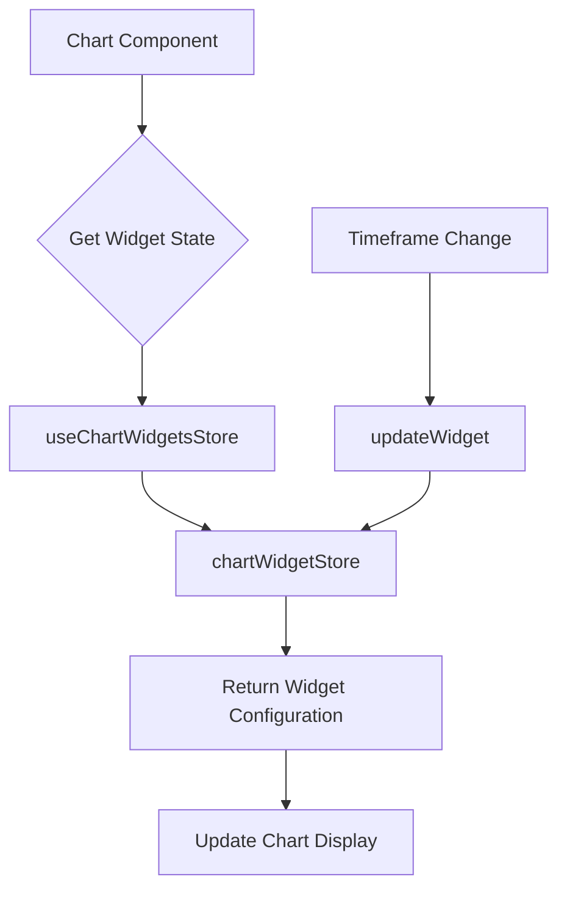
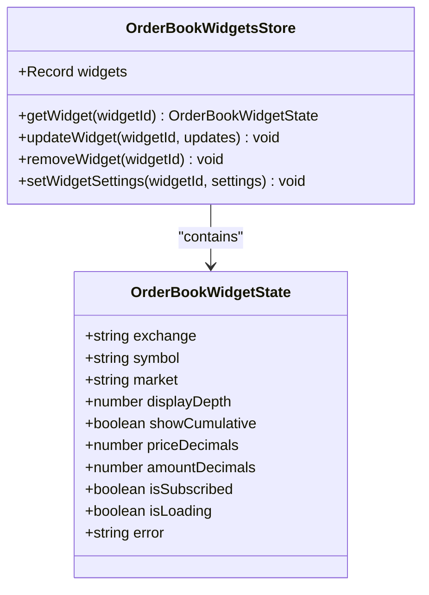
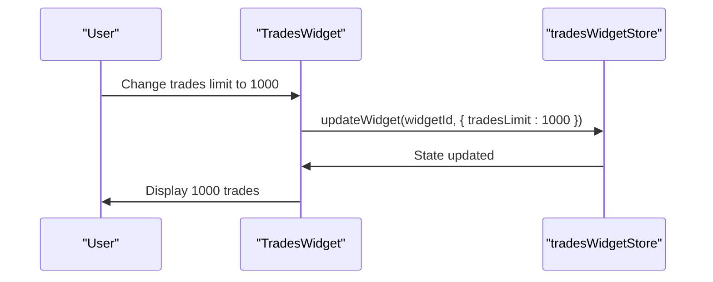
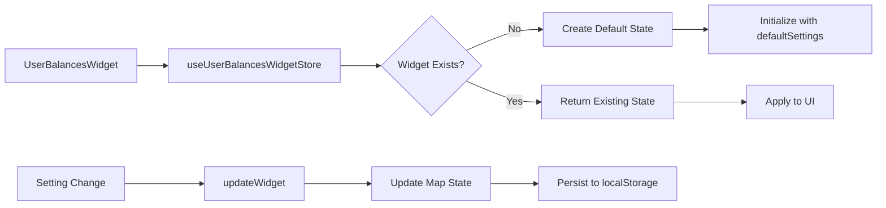
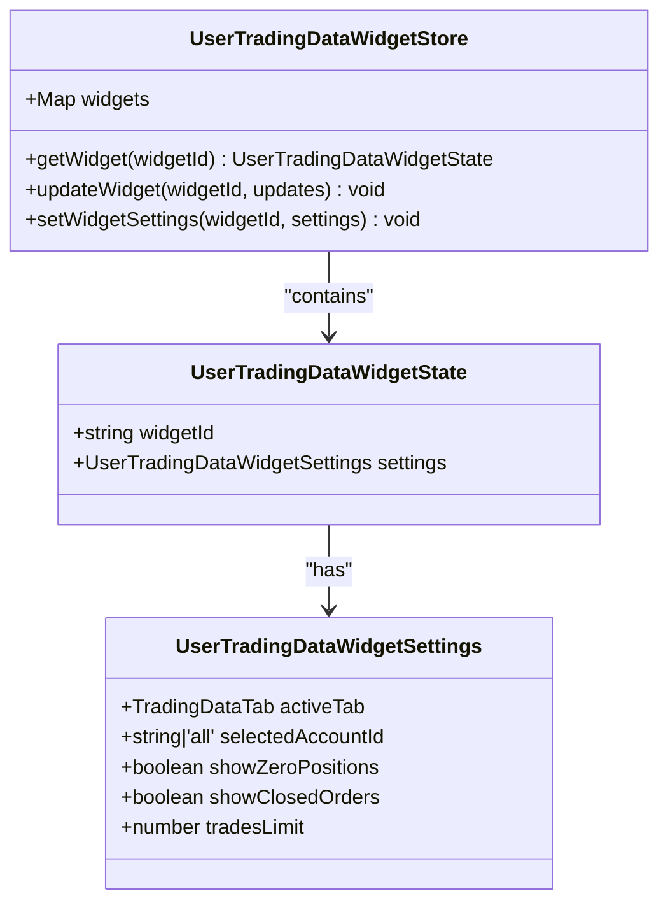
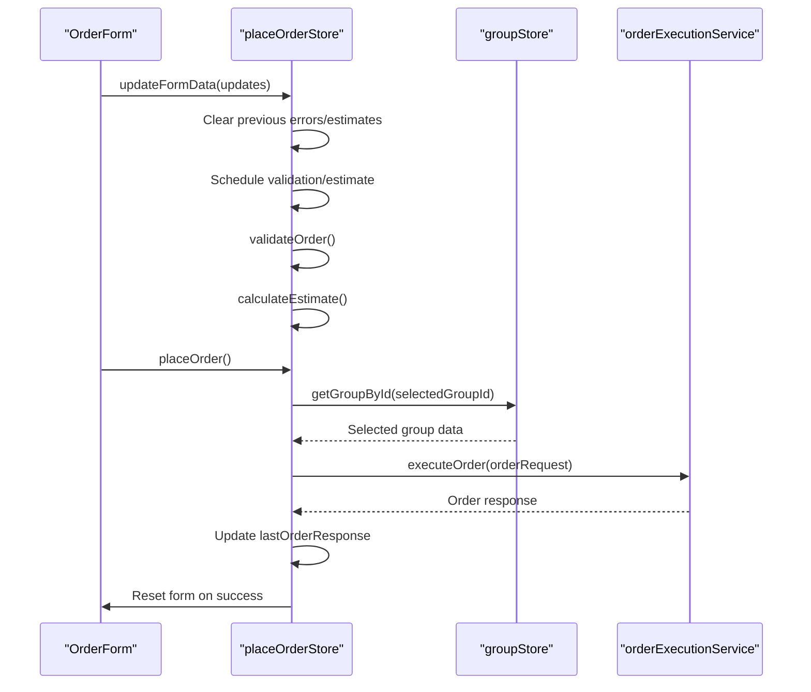
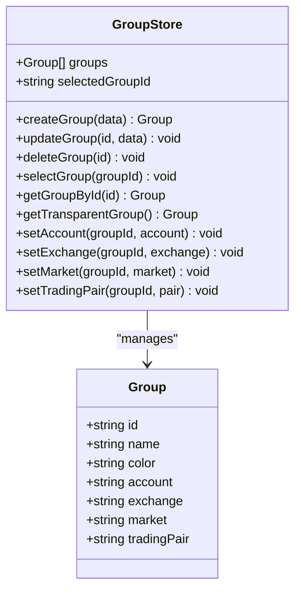
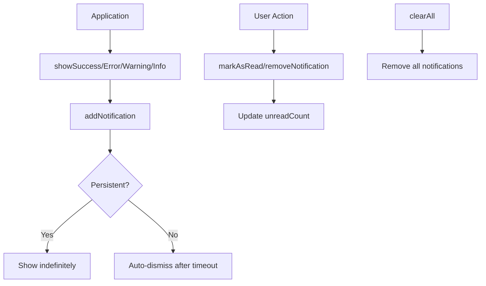
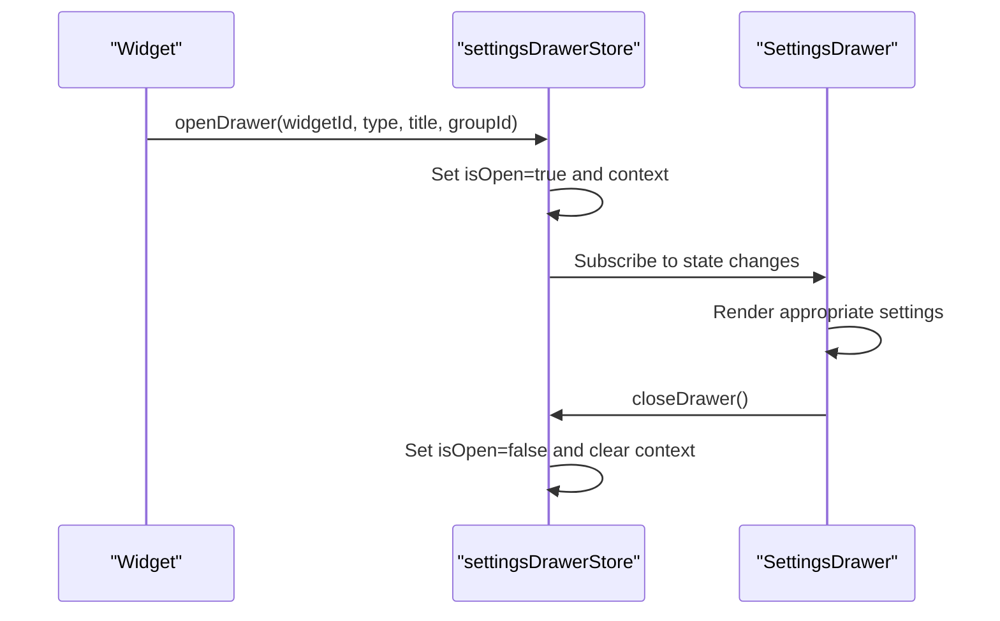

# Widget-Specific Stores

<cite>
**Referenced Files in This Document**   
- [chartWidgetStore.ts](file://src/store/chartWidgetStore.ts)
- [orderBookWidgetStore.ts](file://src/store/orderBookWidgetStore.ts)
- [tradesWidgetStore.ts](file://src/store/tradesWidgetStore.ts)
- [userBalancesWidgetStore.ts](file://src/store/userBalancesWidgetStore.ts)
- [userTradingDataWidgetStore.ts](file://src/store/userTradingDataWidgetStore.ts)
- [placeOrderStore.ts](file://src/store/placeOrderStore.ts)
- [groupStore.ts](file://src/store/groupStore.ts)
- [notificationStore.ts](file://src/store/notificationStore.ts)
- [settingsDrawerStore.ts](file://src/store/settingsDrawerStore.ts)
- [Chart.tsx](file://src/components/widgets/Chart.tsx)
- [OrderBookWidget.tsx](file://src/components/widgets/OrderBookWidget.tsx)
- [TradesWidget.tsx](file://src/components/widgets/TradesWidget.tsx)
- [UserBalancesWidget.tsx](file://src/components/widgets/UserBalancesWidget.tsx)
- [UserTradingDataWidget.tsx](file://src/components/widgets/UserTradingDataWidget.tsx)
- [OrderForm.tsx](file://src/components/widgets/OrderForm.tsx)
- [GroupSelector.tsx](file://src/components/ui/GroupSelector.tsx)
- [SettingsDrawer.tsx](file://src/components/SettingsDrawer.tsx)
</cite>

## Table of Contents
1. [Introduction](#introduction)
2. [Chart Widget Store](#chart-widget-store)
3. [Order Book Widget Store](#order-book-widget-store)
4. [Trades Widget Store](#trades-widget-store)
5. [User Balances Widget Store](#user-balances-widget-store)
6. [User Trading Data Widget Store](#user-trading-data-widget-store)
7. [Place Order Store](#place-order-store)
8. [Group Store](#group-store)
9. [Notification Store](#notification-store)
10. [Settings Drawer Store](#settings-drawer-store)
11. [Performance and Optimization Considerations](#performance-and-optimization-considerations)
12. [Conclusion](#conclusion)

## Introduction
This document provides a comprehensive analysis of the widget-specific Zustand stores in the ProfitMaker application. Each store manages state for a specific widget type, enabling isolated state management while maintaining integration with the global dashboard system. The stores are designed to handle widget configuration, user preferences, and UI state, with careful consideration for performance, reactivity, and data persistence.

**Section sources**
- [chartWidgetStore.ts](file://src/store/chartWidgetStore.ts#L1-L50)
- [orderBookWidgetStore.ts](file://src/store/orderBookWidgetStore.ts#L1-L82)
- [tradesWidgetStore.ts](file://src/store/tradesWidgetStore.ts#L1-L56)

## Chart Widget Store

The `chartWidgetStore` manages state for chart widgets, primarily handling timeframe selection and subscription status. It maintains a collection of widget states indexed by widget ID, allowing multiple chart instances to have independent configurations.

### Key State Properties
- **timeframe**: Current chart timeframe (e.g., '1h', '4h')
- **isSubscribed**: WebSocket subscription status for real-time data
- **isLoading**: Loading state during data initialization
- **error**: Error message if chart data loading fails

### Interaction with Parent Dashboard
The chart store integrates with `dashboardStore` through widget lifecycle events. When a chart widget is added or removed from a dashboard, the corresponding state in `chartWidgetStore` is automatically created or cleaned up.

### Relationship to React Components
The `Chart` component consumes this store via the `useChartWidgetsStore` hook, accessing its specific widget state based on `widgetId`. The component uses the stored timeframe to configure chart rendering and responds to subscription changes.



**Diagram sources**
- [chartWidgetStore.ts](file://src/store/chartWidgetStore.ts#L10-L50)
- [Chart.tsx](file://src/components/widgets/Chart.tsx#L46-L855)

### Usage Example
```typescript
const { getWidget, updateWidget } = useChartWidgetsStore();
const widgetState = getWidget(widgetId);

// Update timeframe
updateWidget(widgetId, { timeframe: '4h' });
```

**Section sources**
- [chartWidgetStore.ts](file://src/store/chartWidgetStore.ts#L3-L50)
- [Chart.tsx](file://src/components/widgets/Chart.tsx#L46-L855)

## Order Book Widget Store

The `orderBookWidgetStore` manages state for order book widgets, handling display settings and market data subscriptions. It extends basic widget functionality with specialized methods for configuring order book parameters.

### Key State Properties
- **exchange**, **symbol**, **market**: Trading instrument identification
- **displayDepth**: Number of price levels to display
- **showCumulative**: Whether to show cumulative volume totals
- **priceDecimals**, **amountDecimals**: Formatting precision
- **isSubscribed**: Subscription status for order book updates

### Specialized Methods
The store includes a dedicated `setWidgetSettings` method that allows bulk updates of order book configuration, ensuring atomic state updates for related settings.

### Integration with Group System
The order book widget inherits its trading instrument from the selected group via `groupStore`, but can override specific settings like depth and formatting through its own store.



**Diagram sources**
- [orderBookWidgetStore.ts](file://src/store/orderBookWidgetStore.ts#L15-L82)
- [OrderBookWidget.tsx](file://src/components/widgets/OrderBookWidget.tsx#L15-L560)

### Usage Example
```typescript
const { getWidget, setWidgetSettings } = useOrderBookWidgetsStore();

// Configure order book for 20-level depth with cumulative view
setWidgetSettings(widgetId, {
  displayDepth: 20,
  showCumulative: true,
  priceDecimals: 2,
  amountDecimals: 4
});
```

**Section sources**
- [orderBookWidgetStore.ts](file://src/store/orderBookWidgetStore.ts#L2-L82)
- [OrderBookWidget.tsx](file://src/components/widgets/OrderBookWidget.tsx#L15-L560)

## Trades Widget Store

The `tradesWidgetStore` manages state for trades history widgets, controlling data aggregation and display options for executed trades.

### Key State Properties
- **isAggregatedTrades**: Whether to display aggregated or individual trades
- **tradesLimit**: Maximum number of trades to display
- **showTableHeader**: Visibility of table column headers
- **showStats**: Whether to display trade statistics summary
- **isSubscribed**: Subscription status for new trade events

### Default Configuration
The store initializes with conservative defaults: 500 trade limit and aggregated view enabled, balancing performance with information density.

### Component Integration
The `TradesWidget` component uses this store to maintain user preferences across sessions, particularly the trades limit and display mode settings.



**Diagram sources**
- [tradesWidgetStore.ts](file://src/store/tradesWidgetStore.ts#L13-L56)
- [TradesWidget.tsx](file://src/components/widgets/TradesWidget.tsx#L16-L434)

### Usage Example
```typescript
const { getWidget, updateWidget } = useTradesWidgetsStore();
const tradesState = getWidget(widgetId);

// Switch to individual trades view with higher limit
updateWidget(widgetId, {
  isAggregatedTrades: false,
  tradesLimit: 1000,
  showStats: true
});
```

**Section sources**
- [tradesWidgetStore.ts](file://src/store/tradesWidgetStore.ts#L3-L56)
- [TradesWidget.tsx](file://src/components/widgets/TradesWidget.tsx#L16-L434)

## User Balances Widget Store

The `userBalancesWidgetStore` manages portfolio visualization settings, with persistent storage of user preferences for balance display.

### Key State Properties
- **showTotal**: Whether to display total portfolio value
- **hideSmallAmounts**: Filter out insignificant balances
- **displayType**: Visualization format ('table', 'pie-chart', etc.)
- **smallAmountThreshold**: USD threshold for hiding small amounts

### Persistent Storage
Unlike other widget stores, this store uses `persist` middleware to save settings to localStorage, ensuring user preferences persist across sessions.

### Map-based State Structure
The store uses a `Map<string, UserBalancesWidgetState>` instead of a plain object for better performance with frequent additions/removals.



**Diagram sources**
- [userBalancesWidgetStore.ts](file://src/store/userBalancesWidgetStore.ts#L17-L86)
- [UserBalancesWidget.tsx](file://src/components/widgets/UserBalancesWidget.tsx#L111-L804)

### Usage Example
```typescript
const { getWidget, updateWidget } = useUserBalancesWidgetStore();
const widgetState = getWidget(widgetId);

// Update display preferences
updateWidget(widgetId, {
  displayType: 'pie-chart',
  hideSmallAmounts: true,
  smallAmountThreshold: 5.0
});
```

**Section sources**
- [userBalancesWidgetStore.ts](file://src/store/userBalancesWidgetStore.ts#L5-L86)
- [UserBalancesWidget.tsx](file://src/components/widgets/UserBalancesWidget.tsx#L111-L804)

## User Trading Data Widget Store

The `userTradingDataWidgetStore` manages state for user trading data widgets, aggregating positions, orders, and trades with configurable filtering.

### Key State Properties
- **activeTab**: Currently active tab ('positions', 'orders', 'trades')
- **selectedAccountId**: Account filter ('all' or specific account ID)
- **showZeroPositions**: Whether to display zero-balance positions
- **showClosedOrders**: Whether to include filled/cancelled orders
- **tradesLimit**: Number of recent trades to display

### Default Configuration
The store initializes with conservative defaults: showing only open positions, all accounts, and limiting trades to 100 entries.

### Tab Synchronization
Multiple instances of user trading data widgets can synchronize their active tab state when configured to do so, providing consistent navigation across the interface.



**Diagram sources**
- [userTradingDataWidgetStore.ts](file://src/store/userTradingDataWidgetStore.ts#L18-L88)
- [UserTradingDataWidget.tsx](file://src/components/widgets/UserTradingDataWidget.tsx#L106-L313)

### Usage Example
```typescript
const { getWidget, setWidgetSettings } = useUserTradingDataWidgetStore();

// Configure widget to show all positions including zero-balance ones
setWidgetSettings(widgetId, {
  activeTab: 'positions',
  showZeroPositions: true,
  selectedAccountId: 'all'
});
```

**Section sources**
- [userTradingDataWidgetStore.ts](file://src/store/userTradingDataWidgetStore.ts#L5-L88)
- [UserTradingDataWidget.tsx](file://src/components/widgets/UserTradingDataWidget.tsx#L106-L313)

## Place Order Store

The `placeOrderStore` manages complex state for order placement forms, handling form data, validation, and execution workflows.

### Key State Properties
- **formData**: Order parameters (symbol, amount, price, type, etc.)
- **selectedGroupId**: Associated trading group for account context
- **isAdvancedMode**: Whether advanced order options are visible
- **validationErrors**: Current validation issues
- **orderEstimate**: Cost and fee calculations
- **validationRules**: Exchange-specific constraints
- **isLoading**, **isSubmitting**: UI state indicators
- **lastOrderResponse**: Result of most recent order attempt

### Comprehensive Workflow
The store implements a complete order placement workflow including:
- Form validation with exchange-specific rules
- Cost estimation with commission calculation
- Order execution with error handling
- Response processing and form reset



**Diagram sources**
- [placeOrderStore.ts](file://src/store/placeOrderStore.ts#L35-L411)
- [OrderForm.tsx](file://src/components/widgets/OrderForm.tsx#L16-L532)

### Usage Example
```typescript
const { 
  updateFormData, 
  validateOrder, 
  calculateEstimate, 
  placeOrder 
} = usePlaceOrderStore();

// Update order parameters
updateFormData(widgetId, {
  symbol: 'ETH/USDT',
  amount: 0.5,
  price: 3500,
  type: 'limit'
});

// Validate and estimate before submission
await validateOrder(widgetId);
await calculateEstimate(widgetId);

// Execute order
const response = await placeOrder(widgetId);
```

**Section sources**
- [placeOrderStore.ts](file://src/store/placeOrderStore.ts#L13-L411)
- [OrderForm.tsx](file://src/components/widgets/OrderForm.tsx#L16-L532)

## Group Store

The `groupStore` manages color groups and trading context, serving as the central source of truth for instrument selection across widgets.

### Key State Properties
- **groups**: Collection of trading groups with color and metadata
- **selectedGroupId**: Currently active group
- Group-specific settings: account, exchange, market, tradingPair

### Central Role in Instrument Selection
Most data-driven widgets inherit their trading instrument from the selected group, creating a unified trading context across the interface.

### Transparent Group Pattern
The store includes a special "transparent" group that serves as the default selection and can be used to represent a neutral or undefined state.



**Diagram sources**
- [groupStore.ts](file://src/store/groupStore.ts#L5-L196)
- [GroupSelector.tsx](file://src/components/ui/GroupSelector.tsx#L14-L274)

### Usage Example
```typescript
const { 
  getGroupById, 
  selectedGroupId, 
  setAccount, 
  setExchange 
} = useGroupStore();

const selectedGroup = getGroupById(selectedGroupId);
if (selectedGroup) {
  // Update group context
  setExchange(selectedGroup.id, 'kraken');
  setAccount(selectedGroup.id, 'personal-account');
}
```

**Section sources**
- [groupStore.ts](file://src/store/groupStore.ts#L5-L196)
- [GroupSelector.tsx](file://src/components/ui/GroupSelector.tsx#L14-L274)

## Notification Store

The `notificationStore` manages toast notifications and alert queueing, providing a centralized system for user feedback.

### Key State Properties
- **notifications**: Queue of active notifications
- **unreadCount**: Number of unread notifications
- **isHistoryOpen**: Visibility state of notification history

### Automatic Persistence
The store persists notifications and unread count to localStorage, ensuring users don't miss important alerts after page refresh.

### Helper Methods
The store provides convenience methods (`showSuccess`, `showError`, etc.) that abstract the underlying notification creation process.



**Diagram sources**
- [notificationStore.ts](file://src/store/notificationStore.ts#L17-L205)
- [SettingsDrawer.tsx](file://src/components/SettingsDrawer.tsx#L12-L53)

### Usage Example
```typescript
const { showSuccess, showError } = useNotificationStore();

// Show success notification
showSuccess('Order placed', 'Your limit order was successfully submitted');

// Show persistent error notification
showError('Connection failed', 'Unable to connect to exchange API', true);
```

**Section sources**
- [notificationStore.ts](file://src/store/notificationStore.ts#L17-L205)
- [SettingsDrawer.tsx](file://src/components/SettingsDrawer.tsx#L12-L53)

## Settings Drawer Store

The `settingsDrawerStore` manages UI state for configuration panels, controlling the visibility and context of settings drawers.

### Key State Properties
- **isOpen**: Whether the settings drawer is visible
- **widgetId**: Target widget being configured
- **widgetType**: Type of the target widget
- **widgetTitle**: Display title for the drawer
- **groupId**: Associated group ID for group-specific settings

### Modal State Management
The store acts as a controller for modal settings interfaces, coordinating which widget's settings are currently being edited.

### Context Preservation
When opening the settings drawer, the store preserves the complete context (widget ID, type, title, group) needed to render the appropriate settings interface.



**Diagram sources**
- [settingsDrawerStore.ts](file://src/store/settingsDrawerStore.ts#L12-L32)
- [SettingsDrawer.tsx](file://src/components/SettingsDrawer.tsx#L12-L53)

### Usage Example
```typescript
const { openDrawer, closeDrawer } = useSettingsDrawerStore();

// Open settings for a specific widget
openDrawer(
  'chart-123', 
  'chart', 
  'BTC/USDT Chart', 
  'group-cyan'
);

// Close the drawer
closeDrawer();
```

**Section sources**
- [settingsDrawerStore.ts](file://src/store/settingsDrawerStore.ts#L12-L32)
- [SettingsDrawer.tsx](file://src/components/SettingsDrawer.tsx#L12-L53)

## Performance and Optimization Considerations

### State Bloat Prevention
Several strategies prevent state bloat:
- **Transient state cleanup**: The `placeOrderStore` clears `orderEstimate` and `validationErrors` when form data changes
- **History limits**: The `notificationStore` caps notifications at 100 entries
- **Lazy initialization**: Widget states are created only when first accessed

### Unnecessary Re-renders
To minimize re-renders:
- **Selective subscriptions**: Components subscribe only to specific widget IDs rather than the entire store
- **Memoization**: Computed values like order estimates are memoized within the store
- **Batched updates**: The `immer` middleware enables efficient nested object updates

### Synchronization Strategies
For synchronization with global state:
- **Group inheritance**: Most data widgets automatically inherit instrument selection from `groupStore`
- **Event-driven updates**: Widgets respond to external events (e.g., new trades) rather than polling
- **Consistent cleanup**: All stores properly unsubscribe from data providers when widgets are removed

### Memory Efficiency
Memory considerations include:
- **Map vs Object**: Using `Map` for dynamic collections (balances, trading data) for better performance
- **Weak references**: Event listeners are properly cleaned up in useEffect cleanup functions
- **Circular dependency avoidance**: Stores maintain loose coupling through well-defined interfaces

**Section sources**
- [chartWidgetStore.ts](file://src/store/chartWidgetStore.ts)
- [orderBookWidgetStore.ts](file://src/store/orderBookWidgetStore.ts)
- [tradesWidgetStore.ts](file://src/store/tradesWidgetStore.ts)
- [userBalancesWidgetStore.ts](file://src/store/userBalancesWidgetStore.ts)
- [userTradingDataWidgetStore.ts](file://src/store/userTradingDataWidgetStore.ts)
- [placeOrderStore.ts](file://src/store/placeOrderStore.ts)

## Conclusion
The widget-specific store architecture in ProfitMaker demonstrates a well-structured approach to state management in a complex trading application. By isolating widget state while maintaining integration points with global systems like `groupStore` and `dashboardStore`, the design achieves both encapsulation and cohesion. The stores effectively manage configuration, user preferences, and UI state, with attention to performance, persistence, and developer experience through consistent patterns and helper methods.