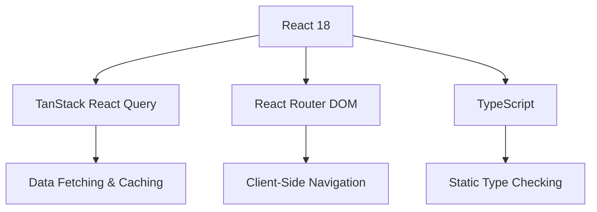
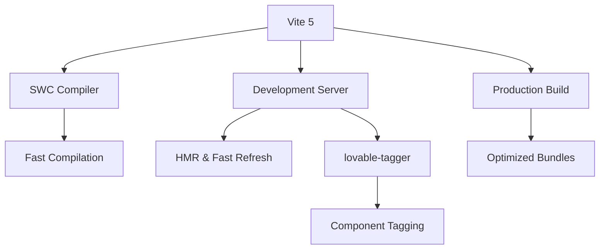
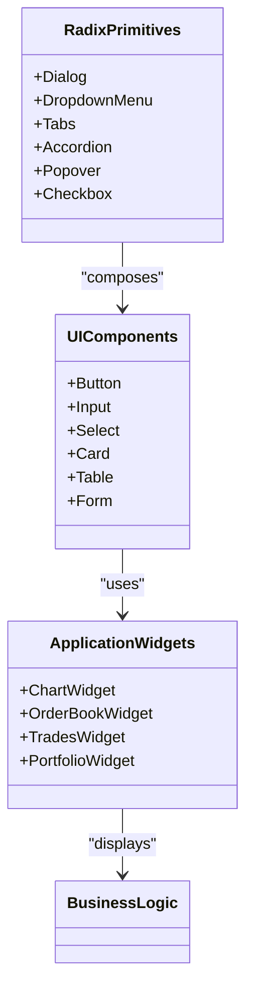
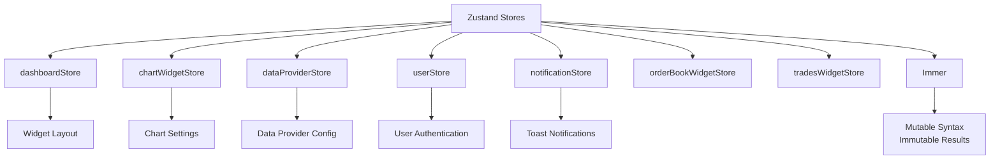
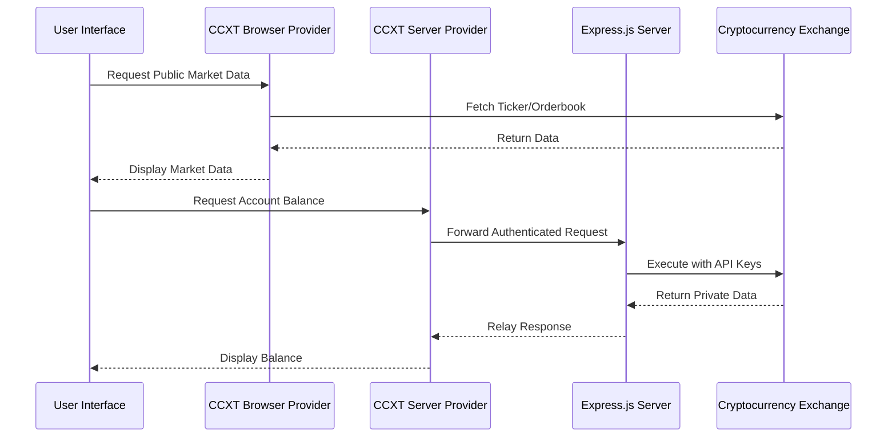
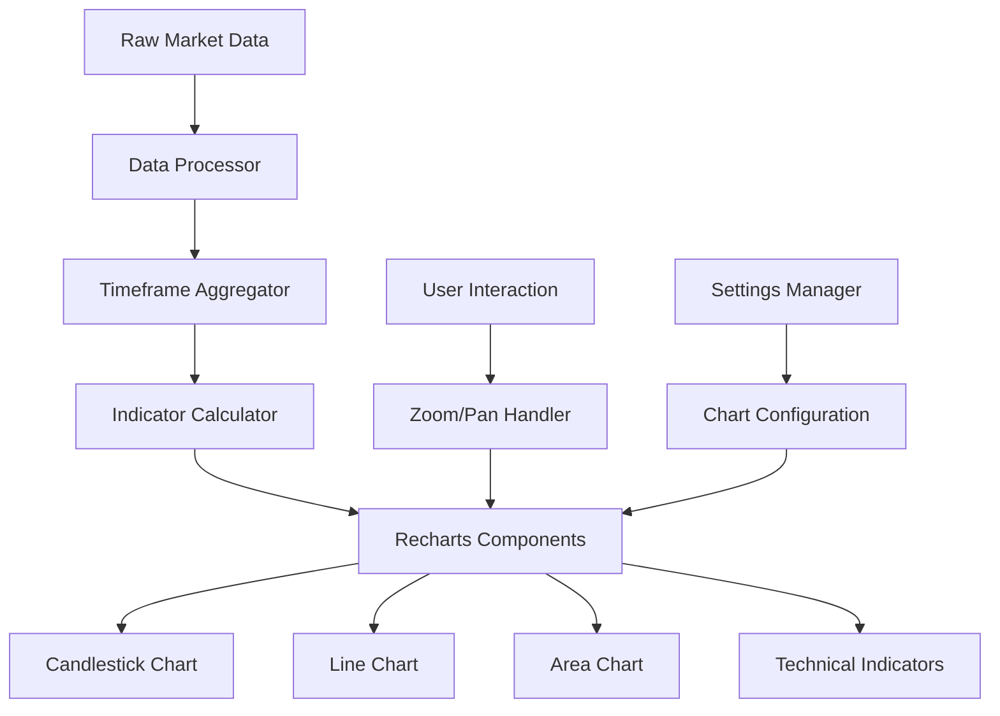
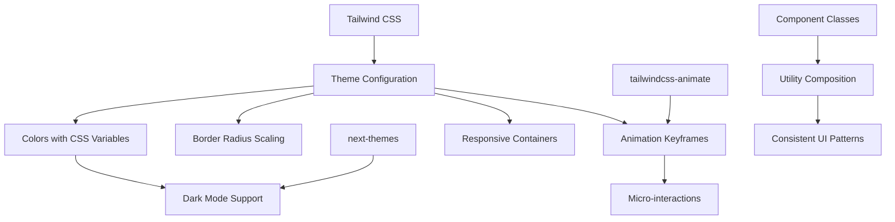
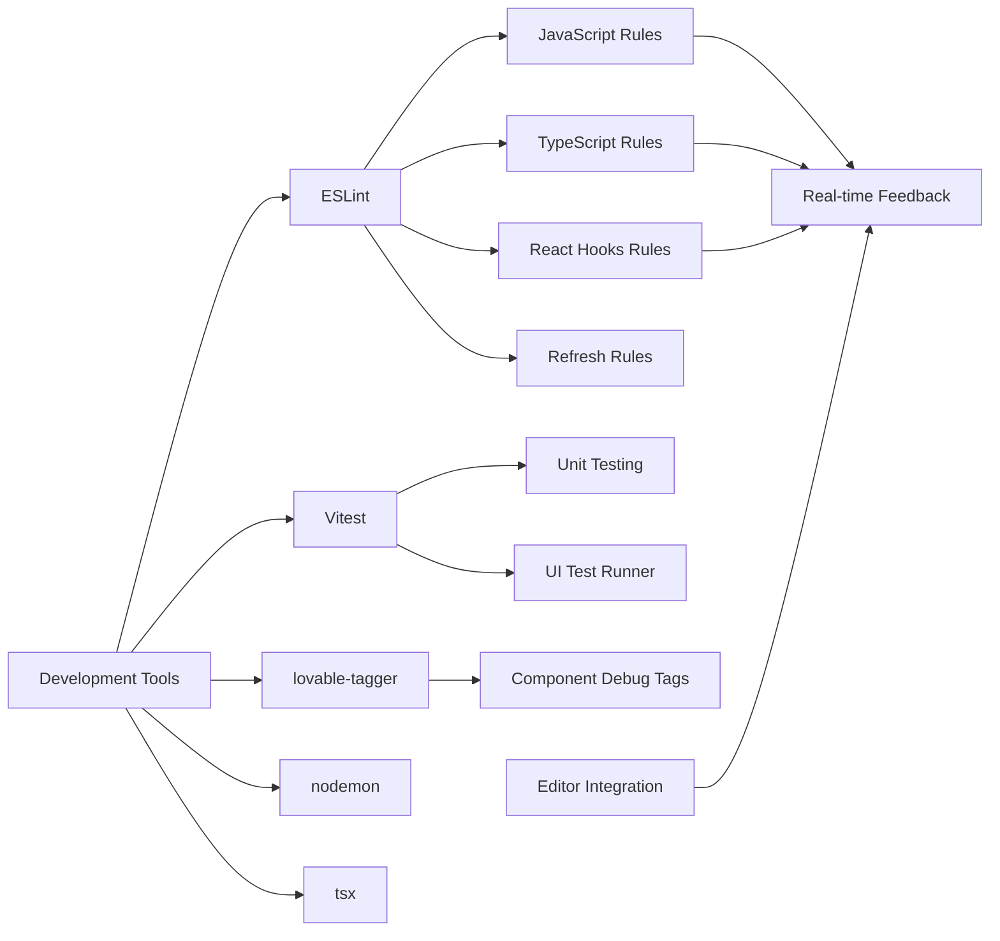

# Technology Stack & Dependencies

<cite>
**Referenced Files in This Document**   
- [package.json](file://package.json)
- [vite.config.ts](file://vite.config.ts)
- [tailwind.config.ts](file://tailwind.config.ts)
- [eslint.config.js](file://eslint.config.js)
- [main.tsx](file://src/main.tsx)
- [App.tsx](file://src/App.tsx)
</cite>

## Table of Contents
1. [Core Frontend Frameworks](#core-frontend-frameworks)  
2. [Build System & Tooling](#build-system--tooling)  
3. [UI Component Architecture](#ui-component-architecture)  
4. [State Management Strategy](#state-management-strategy)  
5. [Cryptocurrency Exchange Integration](#cryptocurrency-exchange-integration)  
6. [Data Visualization Stack](#data-visualization-stack)  
7. [Styling & Design System](#styling--design-system)  
8. [Development & Testing Utilities](#development--testing-utilities)  
9. [Dependency Relationships](#dependency-relationships)  
10. [Technology Rationale](#technology-rationale)

## Core Frontend Frameworks

The application is built on a modern React 18 foundation, leveraging concurrent rendering and server-side rendering capabilities for optimal performance. TypeScript (v5.5.3) provides comprehensive type safety across the entire codebase, enabling robust refactoring, enhanced developer tooling, and reduced runtime errors through static analysis.

React Router DOM (v6.26.2) manages client-side navigation with declarative routing, while TanStack React Query (v5.56.2) handles data fetching, caching, and synchronization with backend services. The combination enables efficient state management for server data, automatic background refetching, and seamless error handling for API interactions.



**Diagram sources**
- [package.json](file://package.json)
- [App.tsx](file://src/App.tsx)

**Section sources**
- [package.json](file://package.json)
- [main.tsx](file://src/main.tsx)

## Build System & Tooling

Vite (v5.4.1) serves as the primary build tool, providing lightning-fast development server startup and hot module replacement (HMR). The configuration leverages SWC for React transformation, delivering superior compilation performance compared to Babel. Development server runs on port 8080 with IPv6 support, optimizing local development experience.

The build configuration strategically excludes Node.js-specific modules (crypto, fs, ws, etc.) from browser bundles while optimizing dependency preloading. CCXT library is explicitly excluded from pre-bundling due to its complex dependency tree, ensuring optimal build performance during development.



**Diagram sources**
- [vite.config.ts](file://vite.config.ts)
- [package.json](file://package.json)

**Section sources**
- [vite.config.ts](file://vite.config.ts)

## UI Component Architecture

The UI system is constructed using Radix UI primitives (v1.x), providing accessible, unstyled components that serve as foundational building blocks. These low-level components include Dialog, Dropdown Menu, Tabs, Accordion, and other interactive elements that follow WAI-ARIA guidelines for accessibility.

A comprehensive component library resides in `src/components/ui/`, exposing over 40 reusable UI primitives including form controls, overlays, navigation elements, and data display components. These are composed from Radix primitives and styled via Tailwind CSS classes, creating a consistent design language across the application.



**Diagram sources**
- [package.json](file://package.json)
- [src/components/ui/](file://src/components/ui/)

## State Management Strategy

Zustand (v5.0.5) implements a lightweight, scalable state management solution across the application. The store architecture is modular, with dedicated stores for different domains:

- `dashboardStore.ts`: Manages dashboard layout and widget configuration
- `chartWidgetStore.ts`: Handles chart-specific state and settings
- `dataProviderStore.ts`: Controls data provider configurations
- `userStore.ts`: Manages user authentication and profile data
- `notificationStore.ts`: Handles application notifications

This decentralized approach avoids the complexity of monolithic state trees while maintaining type safety through TypeScript interfaces defined in `types.ts`. Immer (v10.1.1) enables mutable-style syntax for state updates while preserving immutability guarantees.



**Diagram sources**
- [package.json](file://package.json)
- [src/store/](file://src/store/)

## Cryptocurrency Exchange Integration

The CCXT library (v4.4.93) enables connectivity to over 130 cryptocurrency exchanges, providing a unified API interface for market data retrieval, trading operations, and account management. The MARKETS.md document confirms integration with major exchanges including Binance, Kraken, Bitfinex, KuCoin, OKEX, and others marked as "KUPI enabled."

The application implements both browser and server providers (`ccxtBrowserProvider.ts` and `ccxtServerProvider.ts`) to handle different security requirements. Sensitive operations requiring API keys are routed through the Express.js server backend, while public market data can be fetched directly from the browser.



**Diagram sources**
- [package.json](file://package.json)
- [MARKETS.md](file://MARKETS.md)
- [src/store/providers/ccxtBrowserProvider.ts](file://src/store/providers/ccxtBrowserProvider.ts)
- [src/store/providers/ccxtServerProvider.ts](file://src/store/providers/ccxtServerProvider.ts)

## Data Visualization Stack

Recharts (v2.12.7) powers all charting components within the application, providing a composable, React-friendly interface for financial data visualization. The `Chart.tsx` component in the widgets directory implements candlestick charts, line graphs, and technical indicators essential for trading analysis.

Key features include:
- Responsive SVG-based rendering
- Zoom and pan functionality
- Technical indicator overlays
- Real-time data streaming support
- Customizable tooltip and legend components
- Performance optimization for large datasets

The charting system integrates with the data provider architecture to support multiple data sources and timeframe selections, enabling comparative analysis across different exchanges and instruments.



**Diagram sources**
- [package.json](file://package.json)
- [src/components/widgets/Chart.tsx](file://src/components/widgets/Chart.tsx)

## Styling & Design System

Tailwind CSS (v3.4.11) implements a utility-first styling approach with a custom configuration that extends the default theme. The design system incorporates CSS variables for theming, supporting both light and dark modes through the `next-themes` package.

Key aspects of the styling architecture:
- HSL color model for dynamic theme generation
- Custom border radius values (lg, md, sm)
- Animation keyframes for micro-interactions
- Responsive container with max-width of 1400px
- Custom animations including accordion transitions, fade effects, and pulse variations

The configuration leverages `tailwindcss-animate` plugin for standardized motion design patterns and integrates typography plugin for rich text formatting. Theme variables are defined in CSS custom properties, allowing runtime theme switching without page reloads.



**Diagram sources**
- [tailwind.config.ts](file://tailwind.config.ts)
- [package.json](file://package.json)

## Development & Testing Utilities

The development environment is enhanced with specialized tools to improve productivity and code quality. ESLint configuration extends recommended rules for JavaScript and TypeScript, with plugins for React hooks and refresh functionality. The custom rule `react-refresh/only-export-components` ensures proper component boundaries.

Testing is supported by Vitest (v3.2.4) with a dedicated UI interface, enabling rapid test-driven development. Additional utilities include:
- `lovable-tagger`: Adds debug tags to components during development
- `jsdom`: Provides browser-like environment for testing
- `nodemon`: Monitors server file changes
- `tsx`: Enables TypeScript execution with watch mode

The linting configuration intentionally disables `@typescript-eslint/no-unused-vars` to accommodate common React patterns where variables may be defined but conditionally used.



**Diagram sources**
- [eslint.config.js](file://eslint.config.js)
- [package.json](file://package.json)
- [vite.config.ts](file://vite.config.ts)

## Dependency Relationships

The application's dependency graph reveals a well-structured architecture with clear separation of concerns. Production dependencies focus on core functionality, while development dependencies enhance the developer experience.

Critical runtime dependencies:
- **React ecosystem**: react, react-dom, react-router-dom
- **State management**: zustand, immer
- **Data fetching**: @tanstack/react-query
- **UI components**: @radix-ui/*, lucide-react
- **Styling**: tailwind-merge, class-variance-authority
- **Business logic**: ccxt, recharts, socket.io-client

The dependency tree shows minimal duplication, with most packages at their latest stable versions. Version alignment across related packages (e.g., TanStack libraries) indicates careful maintenance of compatibility.

```mermaid
graph LR
A[Application] --> B[React Core]
A --> C[State Management]
A --> D[UI Components]
A --> E[Styling]
A --> F[Data Integration]
A --> G[Utilities]
B --> H[react@18.3.1]
B --> I[react-dom@18.3.1]
B --> J[react-router-dom@6.26.2]
C --> K[zustand@5.0.5]
C --> L[immer@10.1.1]
D --> M[@radix-ui/react-*]
D --> N[lucide-react@0.462.0]
E --> O[tailwindcss@3.4.11]
E --> P[tailwind-merge@2.5.2]
F --> Q[ccxt@4.4.93]
F --> R[recharts@2.12.7]
F --> S[socket.io-client@4.8.1]
G --> T[date-fns@3.6.0]
G --> U[uuid@11.1.0]
G --> V[sonner@1.5.0]
```

**Diagram sources**
- [package.json](file://package.json)

## Technology Rationale

The technology choices reflect a deliberate balance between developer experience, application performance, and long-term maintainability. React was selected for its mature ecosystem, strong typing support with TypeScript, and widespread developer familiarity.

Vite provides significant advantages over traditional bundlers with its ES module-based approach, delivering sub-second refresh times and eliminating configuration complexity. TypeScript enhances code quality through static analysis, particularly valuable in a financial application where data integrity is paramount.

The combination of Radix UI and Tailwind CSS enables rapid UI development with guaranteed accessibility, while avoiding the bloat of larger component libraries. Zustand offers a simpler alternative to Redux with comparable functionality and better TypeScript integration.

CCXT was chosen as the exchange integration layer due to its extensive coverage of cryptocurrency markets and active maintenance, reducing the need to implement and maintain exchange-specific APIs individually. Recharts provides sufficient charting capabilities without the overhead of more complex alternatives.

These choices collectively create a development environment that emphasizes:
- Rapid iteration cycles
- Code reliability through type safety
- Performance optimization
- Accessibility compliance
- Scalable architecture
- Maintainable codebase structure

The stack supports both immediate development needs and future scalability requirements, positioning the application for sustained growth and feature expansion.

**Section sources**
- [package.json](file://package.json)
- [vite.config.ts](file://vite.config.ts)
- [tailwind.config.ts](file://tailwind.config.ts)
- [eslint.config.js](file://eslint.config.js)