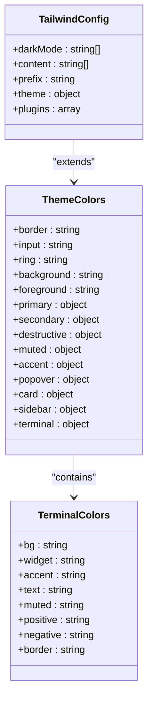
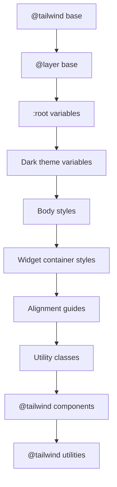
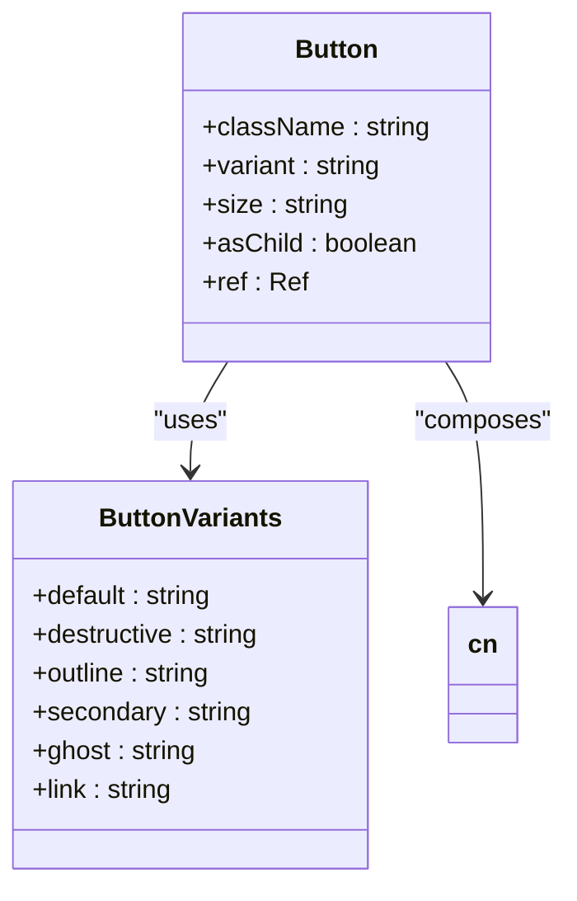
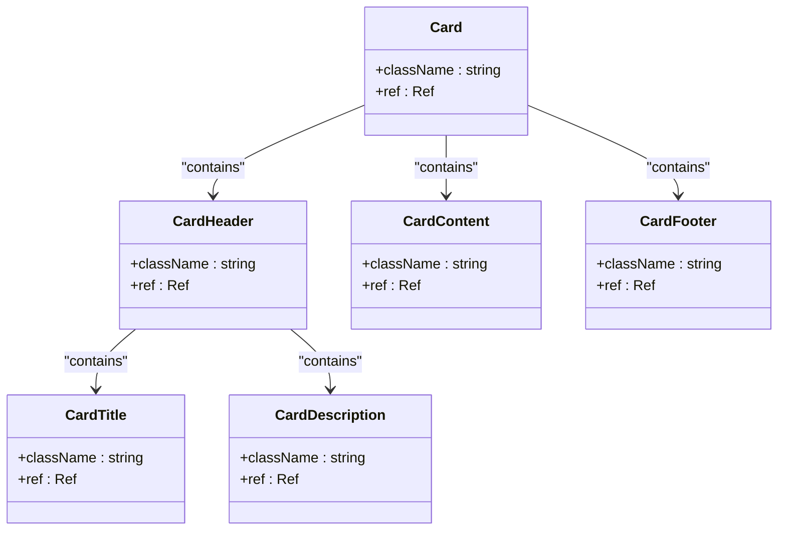
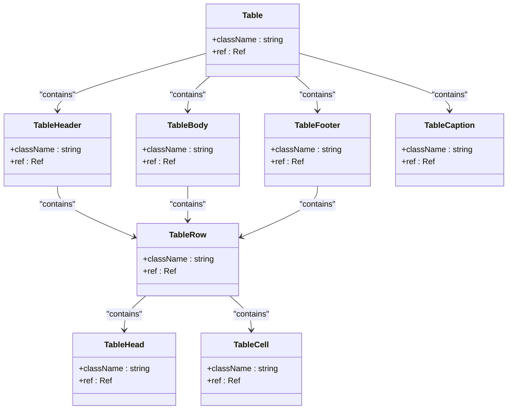

# Styling Implementation

<cite>
**Referenced Files in This Document**   
- [tailwind.config.ts](file://tailwind.config.ts)
- [index.css](file://src/index.css)
- [button.tsx](file://src/components/ui/button.tsx)
- [card.tsx](file://src/components/ui/card.tsx)
- [table.tsx](file://src/components/ui/table.tsx)
- [useTheme.tsx](file://src/hooks/useTheme.tsx)
</cite>

## Table of Contents
1. [Introduction](#introduction)
2. [Tailwind CSS Configuration](#tailwind-css-configuration)
3. [Global Styles and Theme Management](#global-styles-and-theme-management)
4. [UI Component Styling Patterns](#ui-component-styling-patterns)
5. [Performance Optimization](#performance-optimization)
6. [Accessibility Considerations](#accessibility-considerations)
7. [Conclusion](#conclusion)

## Introduction
The styling implementation in profitmaker follows a utility-first approach using Tailwind CSS, optimized for trading terminal readability and performance. The system integrates custom color palettes, typography settings, and spacing scales through comprehensive configuration in tailwind.config.ts. Global styles are managed in index.css with careful interaction between Tailwind's reset and layer system. UI components in the ui directory consume Tailwind classes consistently while maintaining flexibility for theme adaptation. This document details the complete styling architecture, including performance optimizations and accessibility features.

## Tailwind CSS Configuration

The Tailwind CSS configuration in tailwind.config.ts implements a comprehensive design system tailored for financial trading applications. The configuration leverages HSL (Hue, Saturation, Lightness) color values for precise control over the visual hierarchy and contrast ratios essential for trading terminals.

**Diagram sources**
- [tailwind.config.ts](file://tailwind.config.ts#L0-L141)

**Section sources**
- [tailwind.config.ts](file://tailwind.config.ts#L0-L141)

### Custom Color Palette
The configuration defines a custom color palette optimized for trading terminal readability, with special attention to positive (buy) and negative (sell) indicators. The terminal color scheme includes:

- **Positive**: `hsl(var(--terminal-positive))` - 152° 77% 43% (#16C784) for buy signals
- **Negative**: `hsl(var(--terminal-negative))` - 356° 77% 57% (#EA3943) for sell signals
- **Text**: High-contrast text colors that adapt to light/dark themes
- **Backgrounds**: Carefully calibrated background gradients for optimal focus

The color system uses CSS variables that can be dynamically updated, allowing for runtime theme switching without page reloads.

### Typography and Spacing
Typography settings follow a systematic scale with appropriate font weights and line heights for financial data display. The container configuration centers content with responsive padding, while border radius values create a consistent rounded corner aesthetic across components.

Animation utilities provide subtle transitions for component states, including accordion effects, fade transitions, and gentle pulsing animations for active elements. These animations enhance user experience without distracting from critical trading information.

## Global Styles and Theme Management

Global styles are managed in src/index.css, which serves as the foundation for the application's visual presentation. The file imports Tailwind's base, components, and utilities layers in the correct order, ensuring proper cascade behavior.

**Diagram sources**
- [index.css](file://src/index.css#L0-L293)

**Section sources**
- [index.css](file://src/index.css#L0-L293)

### Theme Variables
The CSS custom properties defined in the :root selector establish the application's design tokens. These include:

- **Base colors**: Background, foreground, border, and ring colors
- **Component-specific colors**: Primary, secondary, destructive, muted, accent
- **Terminal-specific colors**: Optimized for trading interface readability
- **Spacing and radius**: Consistent border radius and layout spacing

The dark theme overrides these variables with appropriately adjusted values, creating a cohesive dark mode experience that reduces eye strain during extended trading sessions.

### Widget Container Styling
Widget containers implement a glass-morphism effect with backdrop blur and semi-transparent backgrounds. The styling includes:

- Smooth transitions for transform, shadow, and opacity properties
- Hover effects that increase shadow depth for visual feedback
- Responsive box shadows that adapt to light/dark themes
- Resize handles with subtle visual indicators

These containers serve as the primary building blocks for the trading terminal's modular interface, providing a consistent visual language across all widgets.

## UI Component Styling Patterns

The UI components in the src/components/ui directory follow consistent styling patterns that leverage Tailwind's utility classes while maintaining component encapsulation. Key components demonstrate the implementation of the design system.

### Button Component Analysis

**Diagram sources**
- [button.tsx](file://src/components/ui/button.tsx#L0-L56)

**Section sources**
- [button.tsx](file://src/components/ui/button.tsx#L0-L56)

The button component uses class-variance-authority (cva) to define variant styles, combining utility classes into semantic variants. Variants include default, destructive, outline, secondary, ghost, and link styles, each with appropriate hover states and disabled appearances. Size variants (default, sm, lg, icon) ensure consistent sizing across the application.

### Card Component Analysis

**Diagram sources**
- [card.tsx](file://src/components/ui/card.tsx#L0-L79)

**Section sources**
- [card.tsx](file://src/components/ui/card.tsx#L0-L79)

The card component implements a flexible container pattern with header, title, description, content, and footer subcomponents. Each part applies consistent spacing, typography, and color utilities from the design system. The card uses the terminal's widget background and border colors, ensuring visual harmony with the overall theme.

### Table Component Analysis

**Diagram sources**
- [table.tsx](file://src/components/ui/table.tsx#L0-L117)

**Section sources**
- [table.tsx](file://src/components/ui/table.tsx#L0-L117)

The table component is designed for displaying financial data with optimal readability. It includes hover states for rows, proper spacing for cells, and appropriate typography for headers and data cells. The implementation ensures smooth scrolling for large datasets and maintains alignment across columns.

## Performance Optimization

The styling implementation incorporates several performance optimizations to ensure fast rendering and minimal bundle size.

### PurgeCSS Configuration
The content configuration in tailwind.config.ts specifies the files to scan for class usage, enabling efficient tree-shaking of unused styles. The glob patterns cover all relevant source directories:

- `./pages/**/*.{ts,tsx}`
- `./components/**/*.{ts,tsx}`
- `./app/**/*.{ts,tsx}`
- `./src/**/*.{ts,tsx}`

This comprehensive scanning ensures that all used classes are preserved while unused ones are removed during production builds.

### Class Name Optimization
The implementation leverages several techniques to optimize class names:

- **Compound variants**: Using cva to reduce repetitive utility class combinations
- **Reusable utilities**: Creating consistent patterns across components
- **Conditional class composition**: Using the cn utility to safely merge class names
- **Semantic naming**: Using meaningful variant names rather than raw utility classes

These practices reduce CSS bloat and improve maintainability while preserving the benefits of utility-first styling.

## Accessibility Considerations

The styling system incorporates multiple accessibility features to ensure the trading terminal is usable by all traders.

### Focus States
Interactive elements include visible focus indicators through Tailwind's focus-visible utility. Buttons, inputs, and other controls have clear focus rings that meet WCAG contrast requirements, helping keyboard users navigate the interface effectively.

### Motion Preferences
The animation system respects user preferences for reduced motion. While subtle animations enhance the user experience for most users, they can be disabled for those who prefer minimal motion, preventing potential discomfort or distraction.

### High Contrast Modes
The color palette is designed with sufficient contrast ratios between text and background colors, meeting AA and AAA standards where appropriate. The terminal-specific colors are carefully chosen to ensure readability in various lighting conditions and for users with visual impairments.

### Dynamic Theme Switching
The theme system allows users to switch between light and dark modes based on their preferences and environmental conditions. The useTheme hook provides programmatic access to theme state, enabling components to adapt their appearance dynamically.

## Conclusion
The styling implementation in profitmaker demonstrates a sophisticated integration of Tailwind CSS with a utility-first approach, optimized for the demanding requirements of a trading terminal. The system balances visual appeal with functional readability, performance efficiency, and accessibility compliance. Through careful configuration of Tailwind, thoughtful global style management, and consistent component patterns, the implementation creates a cohesive and professional user interface that supports effective trading activities.