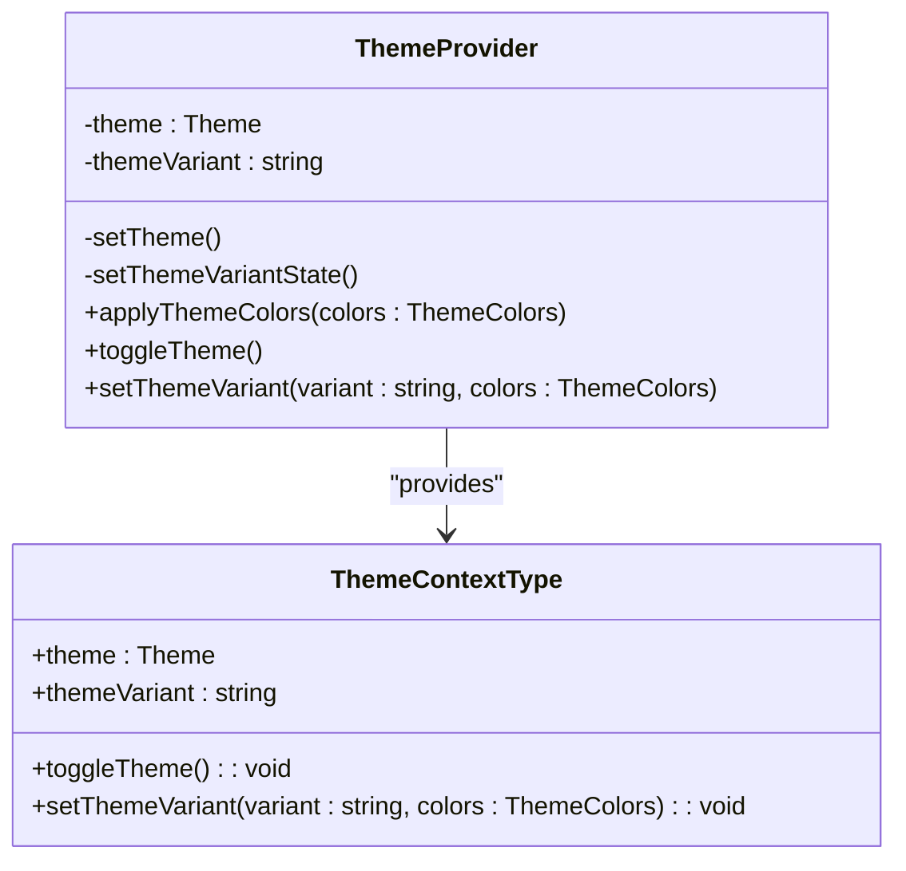
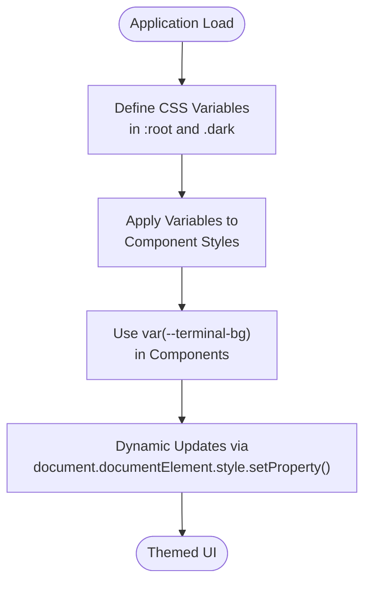
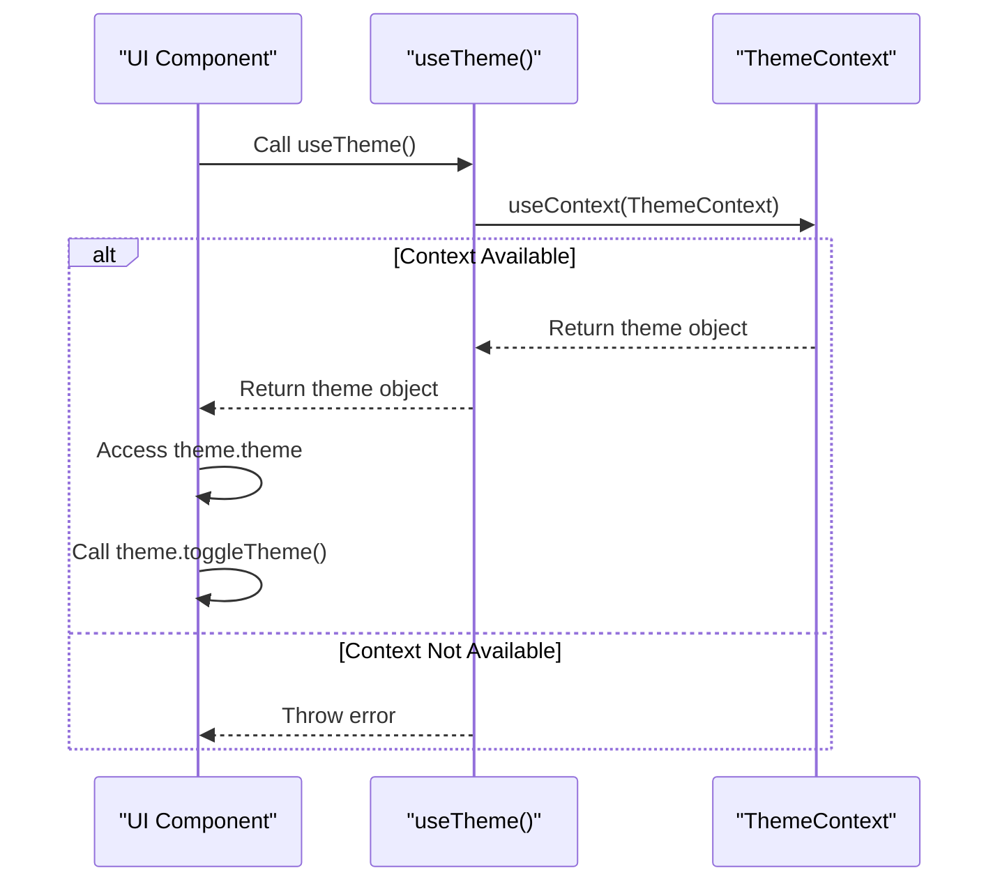
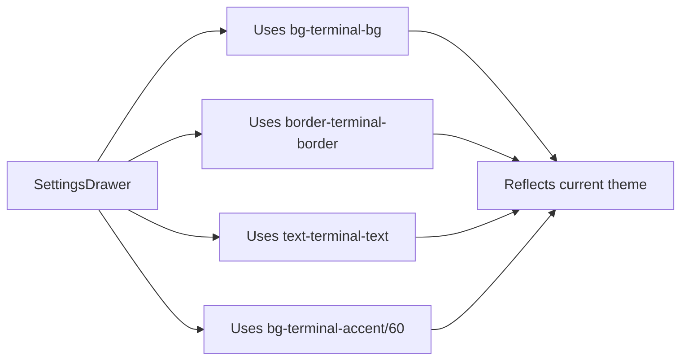
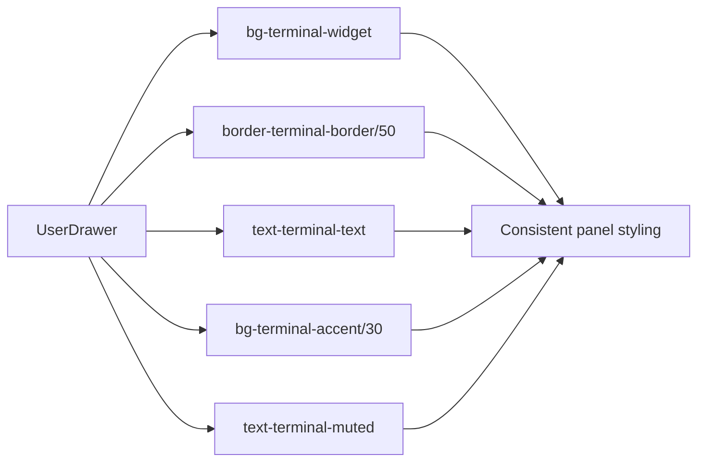
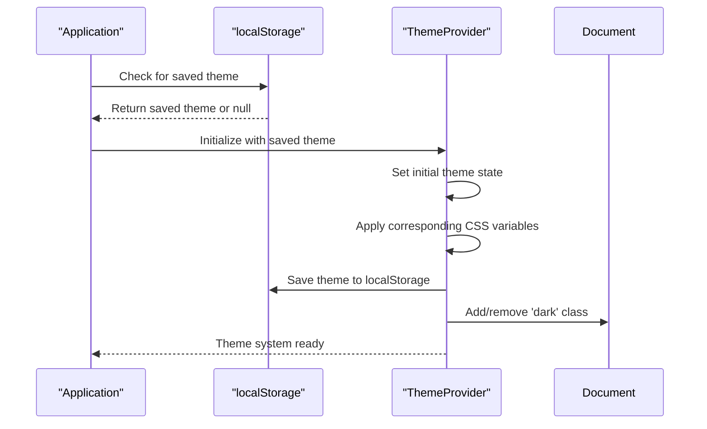

# Theme Customization

<cite>
**Referenced Files in This Document**   
- [useTheme.tsx](file://src/hooks/useTheme.tsx)
- [index.css](file://src/index.css)
- [SettingsDrawer.tsx](file://src/components/SettingsDrawer.tsx)
- [UserDrawer.tsx](file://src/components/UserDrawer.tsx)
</cite>

## Table of Contents
1. [Introduction](#introduction)
2. [Theme Context Implementation](#theme-context-implementation)
3. [CSS Variables and Styling](#css-variables-and-styling)
4. [useTheme Hook Usage](#usetheme-hook-usage)
5. [UI Component Integration](#ui-component-integration)
6. [Extending the Theme System](#extending-the-theme-system)
7. [Theme Persistence and Initialization](#theme-persistence-and-initialization)
8. [Preventing Flash of Incorrect Theme](#preventing-flash-of-incorrect-theme)

## Introduction

The theme customization system in ProfitMaker provides a robust mechanism for managing dark and light mode states across the application. Built on React's Context API, this system enables seamless theme switching while maintaining state consistency throughout the component tree. The implementation combines runtime state management with CSS variables to achieve dynamic theming that affects both component appearance and overall application aesthetics.

This documentation details the architecture of the theme system, covering its core components, styling approach, integration patterns, and best practices for extension and maintenance.

## Theme Context Implementation

The foundation of the theme system is built using React Context API, which provides a centralized state management solution for theme-related data. The `ThemeProvider` component wraps the application and makes theme state available to all descendants through context.



**Diagram sources**
- [useTheme.tsx](file://src/hooks/useTheme.tsx#L22-L139)

**Section sources**
- [useTheme.tsx](file://src/hooks/useTheme.tsx#L22-L139)

The `ThemeProvider` initializes theme state by checking localStorage for previously saved preferences, defaulting to 'dark' mode if no preference exists. It manages two key pieces of state:

- **theme**: The primary mode ('dark' or 'light')
- **themeVariant**: A string identifier for the current theme variant

When the theme changes, the provider updates localStorage and triggers re-renders for all consuming components. The context value includes both the current state and methods to modify it, enabling controlled theme transitions.

## CSS Variables and Styling

The visual representation of themes is achieved through CSS custom properties (variables) defined in `index.css`. These variables follow a naming convention prefixed with `--terminal-` to ensure specificity within the application.



**Diagram sources**
- [index.css](file://src/index.css#L1-L294)

**Section sources**
- [index.css](file://src/index.css#L1-L294)

The base theme definitions include:

- `--terminal-bg`: Background color for the application
- `--terminal-widget`: Panel and widget background color
- `--terminal-accent`: Accent color for interactive elements
- `--terminal-text`: Primary text color
- `--terminal-muted`: Secondary/muted text color
- `--terminal-positive`: Positive/green color (e.g., buy orders)
- `--terminal-negative`: Negative/red color (e.g., sell orders)
- `--terminal-border`: Border color for components

These variables are defined in both light and dark variants using HSL color format, which allows for easier programmatic manipulation and ensures consistent color relationships across themes.

## useTheme Hook Usage

The `useTheme` hook provides a convenient interface for components to access and modify the current theme state. This custom hook abstracts the underlying context usage, ensuring type safety and proper error handling.



**Diagram sources**
- [useTheme.tsx](file://src/hooks/useTheme.tsx#L141-L147)

**Section sources**
- [useTheme.tsx](file://src/hooks/useTheme.tsx#L141-L147)

To use the hook, components simply import and call `useTheme()`:

```typescript
const { theme, toggleTheme } = useTheme();
```

The hook returns an object containing:
- Current `theme` value ('dark' or 'light')
- Current `themeVariant` identifier
- `toggleTheme()` function to switch between dark and light modes
- `setThemeVariant()` function to apply custom theme variants with specific color schemes

If the hook is used outside of a `ThemeProvider`, it throws a descriptive error to prevent undefined behavior.

## UI Component Integration

The theme system is integrated into key UI components such as `SettingsDrawer` and `UserDrawer`, which demonstrate practical usage patterns for theme-aware interfaces.

### SettingsDrawer Integration

The `SettingsDrawer` component uses theme variables directly in its Tailwind CSS classes, leveraging the `bg-terminal-bg` and `border-terminal-border` variables to maintain visual consistency with the current theme.



**Diagram sources**
- [SettingsDrawer.tsx](file://src/components/SettingsDrawer.tsx#L12-L53)

**Section sources**
- [SettingsDrawer.tsx](file://src/components/SettingsDrawer.tsx#L12-L53)

### UserDrawer Integration

The `UserDrawer` component demonstrates more complex theme integration, using multiple theme variables for different visual elements including backgrounds, borders, text colors, and accent indicators for active states.



**Diagram sources**
- [UserDrawer.tsx](file://src/components/UserDrawer.tsx#L24-L161)

**Section sources**
- [UserDrawer.tsx](file://src/components/UserDrawer.tsx#L24-L161)

Both components automatically respond to theme changes without requiring explicit state management, thanks to the CSS variable approach that propagates changes globally when updated.

## Extending the Theme System

The theme system supports extension through custom theme variants and additional color definitions. Developers can create new themes by defining color objects that match the `ThemeColors` interface and registering them using the `setThemeVariant` method.

To add a new theme variant:

1. Define a `ThemeColors` object with the required color properties
2. Call `setThemeVariant('variant-name', colors)` from any component with access to the theme context
3. The system will apply the new colors and persist the variant name to localStorage

The color system uses HSL (Hue, Saturation, Lightness) values rather than hex codes, which provides several advantages:
- Easier programmatic color manipulation
- Consistent color relationships across variants
- Better accessibility through lightness adjustments
- Simplified dark/light mode conversions

When extending the color palette, developers should maintain sufficient contrast ratios between text and background colors to ensure readability, particularly for financial data displays where accuracy is critical.

## Theme Persistence and Initialization

Theme preferences are persisted using localStorage to maintain user settings across sessions. The system implements a robust initialization sequence that ensures consistent theme application on application load.



**Diagram sources**
- [useTheme.tsx](file://src/hooks/useTheme.tsx#L22-L139)

**Section sources**
- [useTheme.tsx](file://src/hooks/useTheme.tsx#L22-L139)

During initialization, the `ThemeProvider` checks for saved theme preferences in the following order:
1. Look for 'theme' item in localStorage
2. Default to 'dark' if no preference exists
3. Synchronize `themeVariant` with the initial theme value

The system also saves theme variant colors to localStorage using keys like `themeColors_variant-name`, allowing complete theme recreation even after browser restarts.

## Preventing Flash of Incorrect Theme

A common issue in theme systems is the "flash of incorrect theme" (FOIT) that occurs when the default theme briefly appears before JavaScript loads and applies the user's preferred theme. ProfitMaker addresses this issue through several strategies:

### Initial HTML Class Application

The most effective approach would be to add the appropriate theme class (`dark` or `light`) to the HTML element during server-side rendering or via a small inline script. While not explicitly implemented in the current code, this pattern is recommended:

```html
<html class="dark">
```

### Synchronous Theme Application

The current implementation minimizes FOIT by:
- Reading localStorage synchronously during component initialization
- Applying CSS variables immediately when the provider mounts
- Using efficient CSS custom properties that trigger minimal reflows

### Optimization Recommendations

To further improve theme loading performance:

1. **Implement early theme detection**: Add an inline script in the HTML head that reads localStorage and applies the theme class before CSS loads
2. **Use prefers-color-scheme**: Fall back to the browser's native dark/light preference if no user preference is stored
3. **Optimize CSS delivery**: Ensure theme-related CSS is loaded as early as possible
4. **Minimize re-renders**: Structure components to avoid unnecessary re-renders during theme changes

By combining persistent storage with immediate application of theme variables, the system provides a smooth user experience with minimal visual disruption during theme transitions.