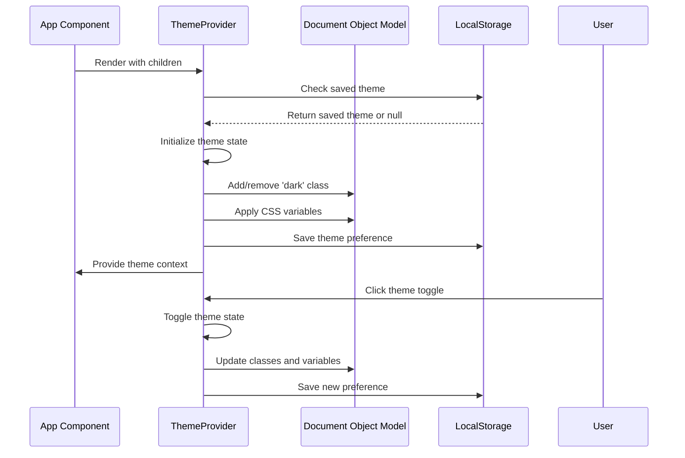
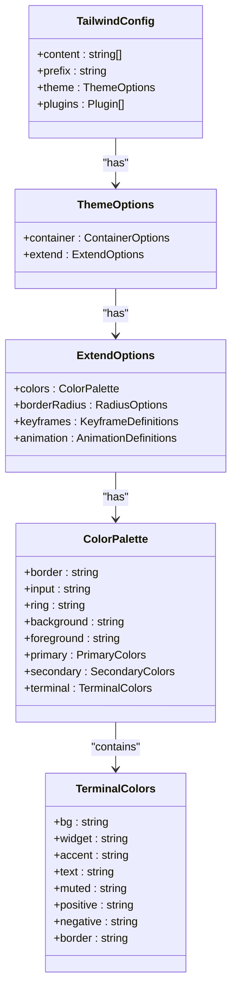
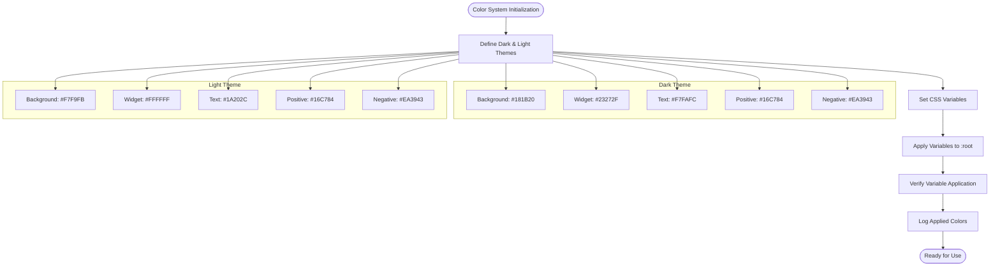

# Theming & Styling

<cite>
**Referenced Files in This Document**   
- [useTheme.tsx](file://src/hooks/useTheme.tsx)
- [tailwind.config.ts](file://tailwind.config.ts)
- [index.css](file://src/index.css)
- [App.tsx](file://src/App.tsx)
</cite>

## Table of Contents
1. [Theming System Overview](#theming-system-overview)
2. [Dark/Light Theme Implementation](#darklight-theme-implementation)
3. [Tailwind CSS Configuration](#tailwind-css-configuration)
4. [Color Palette for Terminal Applications](#color-palette-for-terminal-applications)
5. [Accessibility Features](#accessibility-features)
6. [Customizing Themes and Extending Design System](#customizing-themes-and-extending-design-system)
7. [Performance Considerations](#performance-considerations)

## Theming System Overview

The profitmaker application implements a comprehensive theming system designed specifically for financial trading terminals, prioritizing readability, contrast, and user experience in both light and dark modes. The system combines React Context for state management with CSS variables for styling, enabling seamless theme switching and consistent visual design across all components.

The architecture follows a layered approach where the `ThemeProvider` component manages the theme state and provides it to all child components through React Context. This allows any component in the application to access the current theme and toggle functionality via the `useTheme` hook. The styling system leverages Tailwind CSS with custom configuration that maps utility classes to dynamic CSS variables, creating a powerful combination of utility-first development and runtime theme customization.

**Section sources**
- [useTheme.tsx](file://src/hooks/useTheme.tsx#L1-L148)
- [App.tsx](file://src/App.tsx#L20-L45)

## Dark/Light Theme Implementation

The dark/light theme toggling is implemented using React Context pattern with localStorage persistence. The `ThemeProvider` component initializes the theme state by checking localStorage for previously saved preferences, defaulting to 'dark' mode if no preference is found. When the theme changes, the provider updates the DOM by adding or removing the 'dark' class on the document element and applying corresponding CSS variables.

**Diagram sources**
- [useTheme.tsx](file://src/hooks/useTheme.tsx#L47-L139)

The theme switching mechanism includes comprehensive logging for debugging purposes, with console messages indicating when themes are loaded, applied, and saved. This ensures developers can trace the theme application process and verify that colors are correctly propagated throughout the application.

**Section sources**
- [useTheme.tsx](file://src/hooks/useTheme.tsx#L47-L139)

## Tailwind CSS Configuration

The Tailwind CSS configuration is customized to support the application's theming requirements, particularly the integration with CSS variables for dynamic theming. The configuration sets `darkMode` to "class" strategy, which works in conjunction with the React Context implementation to apply dark theme styles when the 'dark' class is present on the document element.

**Diagram sources**
- [tailwind.config.ts](file://tailwind.config.ts#L1-L141)

The configuration extends Tailwind's default color palette with a dedicated 'terminal' namespace that maps to CSS variables prefixed with `--terminal-`. This creates a clear separation between standard UI components and trading terminal-specific elements, ensuring consistent styling across financial data displays, charts, and trading controls.

The utility-first approach is evident in the extensive use of Tailwind classes throughout the component library, with particular emphasis on responsive design, accessibility, and performance. Custom animations defined in the configuration (such as 'fade-in', 'scale-in', and 'slide-in') are used consistently across components to create a cohesive user experience.

**Section sources**
- [tailwind.config.ts](file://tailwind.config.ts#L1-L141)

## Color Palette for Terminal Applications

The color palette is specifically designed for terminal applications with high contrast and readability requirements. The system uses HSL (Hue, Saturation, Lightness) color values for precise control over color appearance across different lighting conditions. This approach allows for systematic adjustments to brightness and contrast while maintaining color harmony.

For dark mode, the palette features deep graphite backgrounds (`#181B20`) with slightly lighter panel colors (`#23272F`) to create visual hierarchy through subtle contrast. Text is nearly white (`#F7FAFC`) for maximum readability against dark backgrounds, while secondary text uses a light gray (`#A0AEC0`) that remains visible without being distracting. The accent color (`#242D39`) provides hover and selection feedback with sufficient contrast.

Light mode employs a clean, professional aesthetic with a very light background (`#F7F9FB`) and pure white panels (`#FFFFFF`). Text uses a dark gray (`#1A202C`) rather than pure black to reduce eye strain during prolonged use. Secondary text is a medium gray (`#4A5568`) that maintains readability while de-emphasizing less important information.

Both themes share the same vibrant positive (`#16C784`) and negative (`#EA3943`) colors for buy/sell indicators, ensuring consistent interpretation of market signals regardless of the selected theme. These colors were chosen for their high visibility and standard association with financial transactions.

**Diagram sources**
- [index.css](file://src/index.css#L1-L293)
- [useTheme.tsx](file://src/hooks/useTheme.tsx#L1-L148)

**Section sources**
- [index.css](file://src/index.css#L1-L293)
- [useTheme.tsx](file://src/hooks/useTheme.tsx#L1-L148)

## Accessibility Features

The theming system incorporates several accessibility features to ensure the application is usable by traders with various needs. The most critical aspect is proper contrast ratios between text and background colors, which meet or exceed WCAG 2.1 AA standards for both normal and large text.

Keyboard navigation is supported throughout the application, with focus states clearly visible against both dark and light backgrounds. Interactive elements receive appropriate visual feedback when focused, using the accent color to indicate the currently active element. The theme system itself does not interfere with keyboard navigation patterns, preserving standard tab order and focus management.

Screen reader compatibility is maintained by avoiding purely visual indicators for important information. While color is used to convey buy/sell signals, these are always accompanied by textual labels or icons with appropriate ARIA attributes. The dynamic nature of theme switching does not affect the semantic structure of the page, ensuring assistive technologies can reliably interpret content regardless of the selected theme.

The CSS variables system enhances accessibility by allowing users to potentially override theme settings through browser extensions or custom stylesheets. The use of relative units and flexible layouts ensures the interface remains usable at various zoom levels and on different screen sizes.

**Section sources**
- [index.css](file://src/index.css#L1-L293)
- [useTheme.tsx](file://src/hooks/useTheme.tsx#L1-L148)

## Customizing Themes and Extending Design System

The design system is extensible, allowing for custom theme creation and modification through the `setThemeVariant` function provided by the theme context. Developers can define new theme variants with custom color palettes and apply them dynamically at runtime. Each variant's colors are stored in localStorage under a unique key, enabling persistence across sessions.

To create a custom theme, developers can call `setThemeVariant` with a descriptive name and an object containing the eight required color properties: bg, widget, accent, text, muted, positive, negative, and border. The system will automatically apply these colors as CSS variables and update all components that use the corresponding Tailwind classes.

The utility-first approach of Tailwind CSS makes it easy to extend the design system with new components that automatically conform to the current theme. By using the predefined color classes (such as `text-terminal-text`, `bg-terminal-widget`, etc.), new components inherit the current theme's appearance without requiring additional styling.

For advanced customization, developers can modify the Tailwind configuration to add new utility classes or adjust existing ones. The configuration supports animation definitions, border radius options, and other design tokens that can be extended to match specific branding requirements while maintaining consistency with the overall design language.

**Section sources**
- [useTheme.tsx](file://src/hooks/useTheme.tsx#L47-L139)
- [tailwind.config.ts](file://tailwind.config.ts#L1-L141)

## Performance Considerations

The theme system is optimized for performance with several key considerations. Theme state is managed at the top level using React Context, minimizing re-renders through careful state structuring. The theme toggle operation is lightweight, updating only the necessary CSS variables and class names without requiring a full page reload.

CSS variables are applied directly to the document element, allowing browsers to efficiently propagate style changes to all elements that reference them. The system avoids expensive operations like stylesheet regeneration or DOM manipulation beyond what is necessary for theme switching.

The initial theme application occurs during component mount, with colors applied synchronously to prevent flash-of-unstyled-content (FOUC). Theme preferences are persisted to localStorage for quick retrieval on subsequent visits, eliminating the need for server requests to determine user preferences.

Runtime theme switching is designed to be smooth and instantaneous, with all color transitions occurring without animation to provide immediate feedback. This is particularly important in trading applications where users may need to quickly switch between environments (e.g., from office lighting to dimmer home lighting).

The bundle size impact is minimal, as the theming logic is contained in a small module that leverages existing React and CSS features rather than introducing additional dependencies. The use of native CSS variables ensures compatibility with modern browsers while maintaining good performance characteristics.

**Section sources**
- [useTheme.tsx](file://src/hooks/useTheme.tsx#L47-L139)
- [index.css](file://src/index.css#L1-L293)